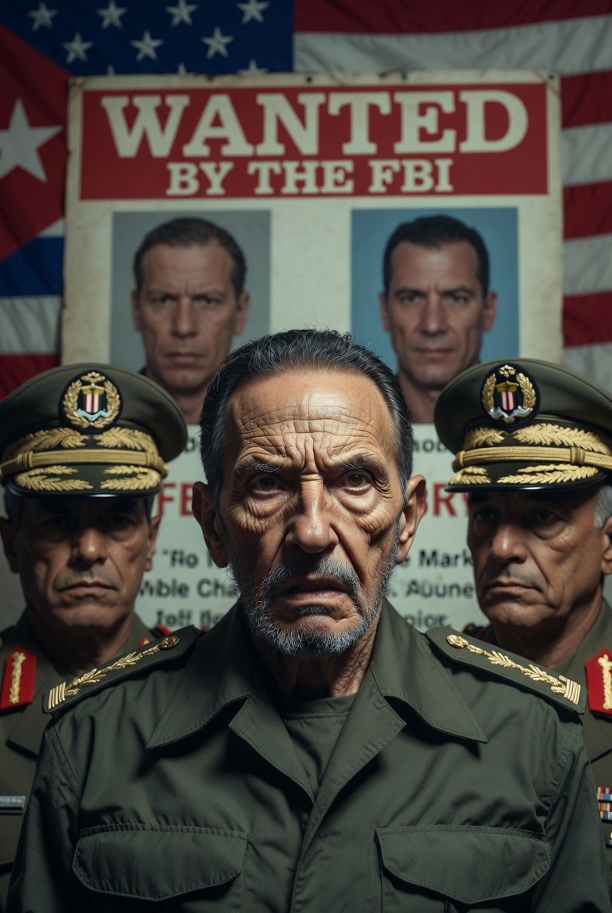

# Raúl Castro Masuk Radar FBI, Trump dan “Regime Change”, serta Hukum Rimba Era Modern

*Ilustrasi Raúl Castro (pic: Grok AI).*

  
***Negara-negara besar selalu berkata: “kami datang membawa kebebasan.” Tapi kapal induk biasanya tidak pernah terlihat seperti kebebasan bagi negara kecil yang sedang ditatap dari laut***
  

Pada 29 Mei 2026, eskalasi hubungan Amerika Serikat dan Kuba memasuki fase baru setelah pengumuman hadiah besar untuk informasi terkait penangkapan Raúl Castro dan sejumlah jenderal Kuba. 

Havana menyebut langkah tersebut sebagai “deklarasi perang terbuka”, sementara pemerintahan Donald Trump semakin terang-terangan berbicara tentang regime change. 

Tulisan ini membahas standar ganda hukum internasional, politik “humanitarian intervention”, dan bagaimana negara besar sering membingkai intervensi geopolitik sebagai misi pembebasan moral.

## Mengapa Raul Castro Diburu tapi Netanyahu Tidak?

Dunia internasional memang sering terlihat tidak menerapkan hukum secara simetris.

Raúl Castro didakwa terkait penembakan pesawat sipil 1996 oleh Kuba.  Sedangkan terhadap Benjamin Netanyahu:
kritik internasional sangat besar terkait korban sipil Gaza,
tetapi perlindungan diplomatik Barat terhadap Israel tetap kuat.

Akibatnya muncul persepsi global: hukum internasional keras terhadap musuh AS, tetapi lentur terhadap sekutu strategisnya.

Dan persepsi itu semakin populer di Global South.

## Hukum atau Kekuatan?

Dalam teori hubungan internasional klasik, hukum internasional tidak pernah sepenuhnya netral. Ia sering bergantung pada:
siapa yang kuat,
siapa yang punya veto,
siapa yang memiliki jaringan Aliansi.

Maka muncul istilah sinis: “rules-based order” yang oleh para pengkritik diterjemahkan sebagai “aturan dibuat oleh pihak yang dominan.”

## USS Gerald R. Ford & Politik Intimidasi

Ketika USS Gerald R. Ford mendekat, itu bukan sekadar manuver laut. Itu bahasa geopolitik.

Kapal induk AS adalah:
simbol dominasi global,
alat tekanan psikologis,
pesan bahwa Washington siap eskalasi.

Dan bagi Kuba… ini menghidupkan memori: Krisis Misil Kuba 1962.

## “Melindungi Rakyat Kuba”? Rakyat yang Mana?

Nah ini yang sering membuat publik skeptis.

Karena dalam sejarah modern, banyak intervensi AS dibingkai sebagai:
membela demokrasi,
melindungi rakyat,
menghentikan tirani.

Tetapi hasilnya kadang:
chaos,
perang saudara,
negara gagal.

Contoh yang sering diperdebatkan:
Irak,
Libya,
tekanan terhadap Venezuela.

Akibatnya publik makin sinis pada frase “humanitarian intervention.”

## Regime Change: Idealisme atau Hegemoni?

Trump menyebut Kuba bisa menjadi “contoh regime change berikutnya.”

Kalimat ini penting karena itu menunjukkan tujuannya bukan sekadar:
pengadilan,
penegakan hukum.
Tetapi perubahan rezim.

Dan dalam geopolitik, regime change hampir selalu berarti mengganti pemerintahan yang tidak sejalan dengan kepentingan strategis negara dominan.

## Mengapa Kuba Tetap Sensitif Bagi AS?

Meskipun ekonominya kecil Kuba adalah simbol pembangkangan.

Ia berada:
dekat Florida,
di “halaman belakang” AS,
dan selama puluhan tahun menolak orbit Washington.

Bagi AS konservatif keberadaan Kuba revolusioner terasa seperti luka sejarah yang belum sembuh.

## China Masuk = Dunia Baru

Ketika China mulai mendukung Havana, situasi berubah dari konflik bilateral menjadi kompetisi blok global.

China ingin menunjukkan:
AS tak bisa lagi bertindak sepihak,
negara kecil punya alternatif selain tunduk ke Washington.

Dan ini sangat mengganggu strategi dominasi lama AS di Karibia.

## “Hukum Rimba”?

Dalam teori realisme, negara besar memang sering:
bertindak berdasarkan kekuatan,
lalu mencari legitimasi hukum belakangan.

Jadi kritik “hukum rimba” muncul ketika hukum tampak mengikuti kekuatan, bukan sebaliknya.

Kasus Raúl Castro memperlihatkan bahwa:
hukum internasional,
HAM,
demokrasi,
dan keamanan,
sering bercampur dengan:
kepentingan geopolitik,
ego kekuatan besar,
dan proyek simbolik politik domestik.

Sementara itu, standar ganda terhadap sekutu dan musuh membuat banyak negara Global South makin skeptis terhadap narasi moral Barat.

Ketika Trump berbicara tentang “melindungi rakyat Kuba” banyak orang di dunia justru bertanya: melindungi rakyat… atau memperluas orbit kekuasaan AS?

Dan yang paling ironis, negara-negara besar selalu berkata: “kami datang membawa kebebasan.”

Tapi kapal induk biasanya tidak pernah terlihat seperti kebebasan bagi negara kecil yang sedang ditatap dari laut. 

  
**Referensi**

U.S. Department of Justice announcement on Raúl Castro indictment

The Guardian report on U.S. efforts against Cuba

Reuters coverage of U.S.-Cuba tensions

Mearsheimer, J. J. (2001). The Tragedy of Great Power Politics.

Gaddis, J. L. (2005). The Cold War: A New History.
