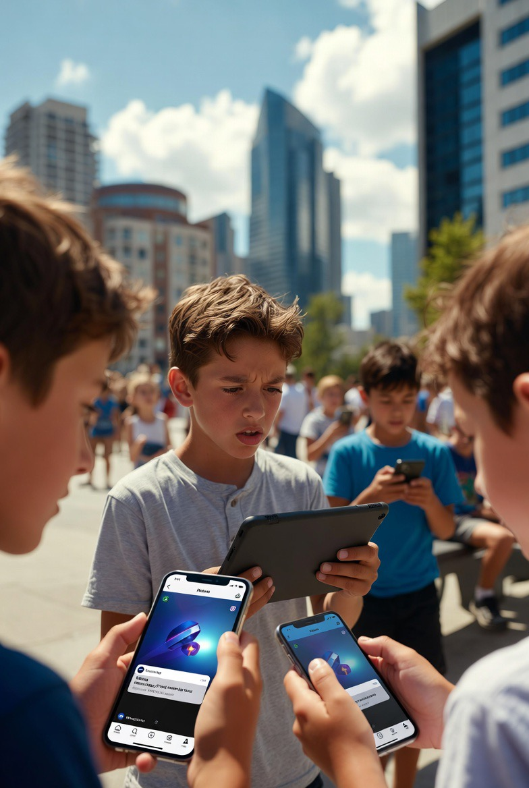

# Regulasi Media Sosial untuk Anak: Analisis Kebijakan Digital Indonesia dalam Perspektif Global

*Ilustrasi media sosial dan anak (pic: Grok AI).*

  
***Mencerminkan upaya negara untuk menyeimbangkan antara perlindungan anak dan kebebasan digital dalam era kapitalisme platform***
  

Transformasi digital telah memperluas akses anak terhadap media sosial, tetapi juga meningkatkan risiko paparan terhadap konten berbahaya, manipulasi algoritmik, dan kecanduan digital. 

Indonesia berencana menerapkan pembatasan penggunaan media sosial bagi pengguna di bawah usia 16 tahun mulai 28 Maret 2026 melalui kebijakan perlindungan anak di ruang digital. 

Artikel ini menganalisis rasionalitas kebijakan tersebut dengan menggunakan pendekatan regulasi platform, psikologi perkembangan, dan politik tata kelola internet global.

## Latar Belakang: Anak dalam Ekosistem Kapitalisme Platform

Media sosial modern bukan sekadar sarana komunikasi, melainkan bagian dari ekonomi perhatian (attention economy).

Perusahaan seperti:

•	Meta Platforms

•	ByteDance

•	Google

mengoperasikan platform yang menggunakan algoritma untuk memaksimalkan:

•	durasi penggunaan

•	interaksi pengguna

•	monetisasi data

Dalam konteks ini, anak menjadi kelompok rentan karena:

1.	kemampuan regulasi diri belum matang

2.	kontrol impuls masih berkembang

3.	sensitivitas terhadap reward digital sangat tinggi

Penelitian psikologi perkembangan menunjukkan bahwa sistem dopamin pada remaja merespons notifikasi, like, dan konten viral dengan intensitas lebih tinggi dibanding orang dewasa.

## Rasionalitas Regulasi: Perlindungan Anak di Ruang Digital

Pemerintah Indonesia berencana menerapkan pembatasan akses media sosial bagi pengguna di bawah 16 tahun mulai 28 Maret 2026.

Tujuan utama kebijakan:

1. Proteksi psikologis

Mengurangi risiko:

•	kecanduan media sosial

•	cyberbullying

•	gangguan citra tubuh

•	depresi remaja

2. Proteksi konten

Membatasi akses terhadap:

•	pornografi

•	kekerasan ekstrem

•	propaganda radikal

•	perjudian digital

3. Proteksi ekonomi data

Anak sering tidak memahami bahwa aktivitas digital mereka menghasilkan data komersial yang dieksploitasi oleh platform.

## Mekanisme Implementasi yang Dipertimbangkan

Regulasi kemungkinan menggunakan kombinasi beberapa sistem:

a. Verifikasi usia digital

Teknologi yang mungkin digunakan:

•	identifikasi wajah berbasis AI

•	integrasi identitas nasional

•	sistem verifikasi usia platform

b. Parental control

Orang tua diberi wewenang untuk:

•	membatasi waktu penggunaan

•	mengawasi aktivitas akun

c. Tanggung jawab platform

Perusahaan teknologi diwajibkan menyediakan:

•	fitur keamanan anak

•	algoritma yang lebih aman

•	moderasi konten lebih ketat

## Tren Global Regulasi Media Sosial

Kebijakan Indonesia tidak muncul dalam ruang kosong.

Beberapa negara juga menerapkan regulasi serupa:

| Negara | Kebijakan |
|------|-------|
| Australia | larangan media sosial untuk anak di bawah 16 tahun |
| Prancis | persetujuan orang tua untuk pengguna di bawah 15 |
| Inggris | regulasi keamanan anak dalam Online Safety Act |

Tren global menunjukkan perubahan paradigma dari internet bebas tanpa regulasi menuju governance internet berbasis perlindungan pengguna.

## Tantangan Implementasi

Meskipun tujuan kebijakan terlihat rasional, terdapat beberapa masalah struktural.

1. Verifikasi usia yang tidak akurat

Anak dapat memalsukan usia atau menggunakan akun orang tua.

2. Privasi data

Sistem verifikasi identitas berpotensi meningkatkan pengumpulan data oleh negara atau platform.

3. Migrasi platform

Jika regulasi terlalu ketat, pengguna muda bisa berpindah ke:

•	platform tidak terkontrol

•	aplikasi luar negeri yang tidak tunduk pada regulasi

## Perspektif Teoretis: Negara vs Kapitalisme Platform

Kebijakan ini mencerminkan konflik struktural antara dua kekuatan:

Negara

Ingin melindungi warga dan menjaga stabilitas sosial.

Platform teknologi

Beroperasi dalam logika:

•	monetisasi perhatian

•	ekspansi pengguna global

Konflik ini sering disebut dalam literatur sebagai platform governance dilemma.

## Implikasi Sosial

Jika berhasil, regulasi ini dapat menghasilkan:

dampak positif

•	peningkatan kesehatan mental anak

•	penurunan kecanduan digital

•	perlindungan dari eksploitasi data

dampak negatif potensial

•	pengawasan digital meningkat

•	pembatasan kebebasan internet

•	risiko penyalahgunaan data identitas

Pembatasan media sosial bagi anak di Indonesia merupakan bagian dari pergeseran global menuju regulasi platform digital. 

Kebijakan ini mencerminkan upaya negara untuk menyeimbangkan antara perlindungan anak dan kebebasan digital dalam era kapitalisme platform.

Keberhasilan kebijakan tersebut akan sangat bergantung pada tiga faktor utama:

1.	desain teknologi verifikasi usia

2.	transparansi penggunaan data

3.	kolaborasi antara pemerintah, platform, dan masyarakat.

  
**Referensi:**

•	Shashana Zubaff (2019)The Age of Surveillance Capitalism

•	Nick Srnicek(2017) Platform Capitalism

•	Tim Wu (2016) The Attention Merchants

•	Laura DeNardis (2014) The Global War for Internet Governance

•	Tarleton Gillespie (2018) Custodians of the Internet

•	Jean M. Twenge (2018)

•	Jonathan Hoidt & Greg Lukianof (2019) The Coddling of the American Mind

•	OECD (2021) Children in the Digital Environment

•	UNICEF (2020) Policy Guidance on AI for Children
