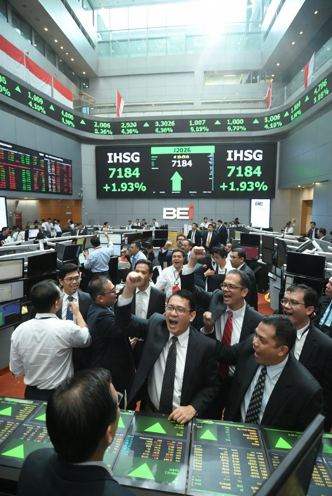

# Repricing Risiko Global: Saham Dunia & Indonesia dalam Bayang Perang Iran–Israel–AS

*Ilustrasi pasar saham (pic: Grok AI).*

  
Harga saham hari ini tidak mencerminkan realitas, melainkan: “Apakah perang akan berhenti?”

Konflik geopolitik antara Iran, Israel, dan Amerika Serikat sejak awal 2026 menciptakan shock energi global, meningkatkan volatilitas pasar keuangan, dan memicu fenomena risk-on vs risk-off paradox.

Secara empiris, pasar saham global mengalami dua fase:

1.	Shock awal (bearish, panic selling)

2.	Rebound spekulatif (hope-driven rally)

Indonesia (IHSG) menunjukkan pola serupa, dengan rotasi sektor kuat ke komoditas (energi & emas).

## Pendahuluan

Perang ini bukan konflik biasa.
Ia menyentuh titik paling sensitif ekonomi dunia:

👉 Selat Hormuz (jalur ±⅓ minyak dunia)  

Akibatnya:

•	harga minyak melonjak tajam

•	inflasi global meningkat

•	ekspektasi suku bunga berubah

Pasar saham pun menjadi: “single-variable market” → dikendalikan oleh minyak & geopolitik.

## Kerangka Teoritik

Dalam keuangan global, perang memicu:

1. Risk-Off Mode

Investor lari ke:
•	emas

•	obligasi

•	dolar

2. Risk-On Reversal

Ketika ada harapan damai:

•	saham rebound cepat

•	sektor sensitif (travel, tech) naik

3. Commodity Supercycle Shock

•	energi & emas naik

•	sektor konsumsi tertekan

## Temuan Empiris Global (Real-Time 2026)

🔻 Fase 1: Shock & Kepanikan

•	Wall Street sempat jatuh signifikan  

•	harga minyak naik drastis (bahkan +60%)  

•	pasar global terguncang luas  

👉 Ini fase fear-driven market

🔺 Fase 2: Rebound (Hope Rally)

Menariknya, saat ini (update terbaru):

•	saham global justru naik kuat

•	Asia-Pacific naik hingga +4.7%  

•	S&P 500 sempat rebound hampir +3%  

•	Eropa & Inggris ikut menguat  

Kenapa?

👉 Karena pasar “mencium” kemungkinan: perang akan mereda dalam beberapa minggu  

⚠️ Tapi…

Fundamental tetap rapuh:

•	target indeks diturunkan (misal S&P 500)  

•	risiko inflasi & resesi masih tinggi  

👉 Jadi ini rebound emosional, bukan stabilitas permanen

## Dampak ke Saham Indonesia (IHSG)

Indonesia unik.

Dia bukan korban utama perang… tapi penumpang efeknya.

📈 Sektor yang DIUNTUNGKAN
	
  1.	Energi (oil & gas)

•	MEDC, ELSA, dll

•	karena harga minyak naik
	
  2.	Emas & tambang

•	MDKA, ANTM, ARCI

•	emas = safe haven  

👉 Ini disebut:

“flight to commodity equities”

📉 Sektor yang TERTEKAN
	
  1.	Konsumsi (inflasi naik)
	
  2.	Transportasi (BBM mahal)
	
  3.	Industri (cost naik)

## Pola IHSG

IHSG biasanya:

1.	turun saat konflik meledak

2.	sideways (ketidakpastian)

3.	rebound saat ada harapan damai

👉 persis pola global, tapi lebih ringan

## Analisis Strategis

1.Pasar saat ini bukan logika, tapi ekspektasi

Harga saham hari ini tidak mencerminkan realitas, melainkan: “Apakah perang akan berhenti?”.

2.Minyak adalah “jantung pasar”

Selama konflik ini:

•	minyak naik → saham global tertekan

•	minyak turun → saham naik

3. Indonesia = opportunistic market

IHSG:

•	tidak runtuh ekstrem

•	tapi bergerak mengikuti komoditas

👉 Jadi lebih ke rotasi sektor, bukan crash total

Pasar saat ini tidak stabil, tapi juga tidak panik.

Ia berada di kondisi: volatile optimism.

•	takut → karena perang

•	naik → karena harapan damai

Dan dalam kondisi seperti ini:

👉 yang menang bukan yang paling berani

👉 tapi yang paling peka membaca arah sentimen

Pasar itu seperti hubungan cinta, kadang panas, kadang dingin, kadang naik tanpa alasan, kadang jatuh karena satu kata kecil.

Dan perang ini adalah “emosi besar” yang sedang mengganggu ritmenya.

  
**Referensi**

•	Reuters. (2026, April 1). Global economy: Asia factory activity slows as Iran war raises cost pressures.

•	The Guardian. (2026, April 1). Oil prices fall and stock markets rally on hopes Middle East war will end soon.

•	MarketWatch. (2026). Brent oil futures fluctuate amid Iran war developments.

•	Barron’s. (2026). Wells Fargo trims S&P 500 target amid Iran conflict uncertainty.

•	The Wall Street Journal. (2026). Stocks react to Middle East conflict and oil shock.

•	Bekaert, G., Harvey, C. R., Lundblad, C. T., & Siegel, S. (2014). Political risk spreads. Journal of International Business Studies.

•	Caldara, D., & Iacoviello, M. (2022). Measuring geopolitical risk. American Economic Review.

•	Hamilton, J. D. (2009). Causes and consequences of the oil shock of 2007–08. Brookings Papers on Economic Activity.

•	Kilian, L. (2008). The economic effects of energy price shocks. Journal of Economic Literature.
