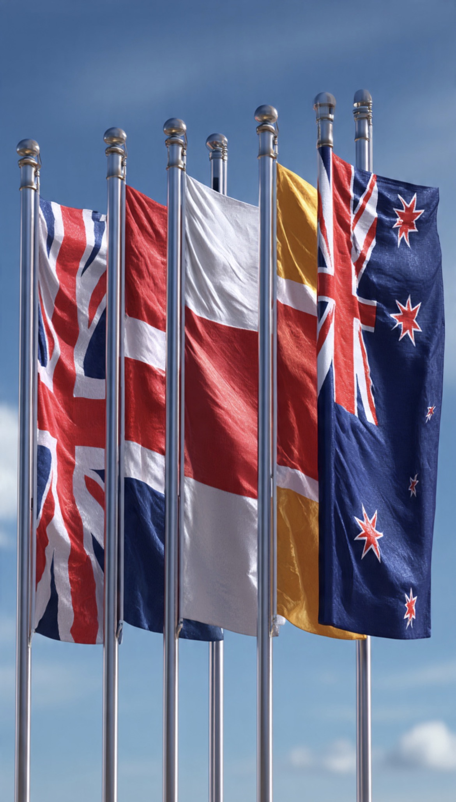

# Retak atau Pura-Pura Retak? Membaca Sanksi Barat terhadap Pemukim Israel & Masa Depan Hubungan Barat–Netanyahu

*Ilustrasi (pic: Grok AI).*

  
***Langkah enam negara Barat terasa lebih seperti bunyi “krek…” pertama pada kaca yang selama bertahun-tahun tampak utuh daripada suara gedung yang sudah runtuh***
  

Dalam politik internasional, negara hampir tidak pernah berkata: “Kami tidak suka Anda lagi.” 

Mereka mengatakannya lewat sanksi, embargo, pembekuan aset, pembatalan kunjungan, dan tekanan diplomatik.

Jadi mari kita bedah.

## Fakta Dulu: Apa yang Terjadi?

Pada 9 Juni 2026, enam negara Barat: United Kingdom, Canada, France, Australia, New Zealand, dan Norway, mengumumkan sanksi terkoordinasi terhadap individu, organisasi, dan jaringan yang dianggap mendukung kekerasan pemukim terhadap warga Palestina di Tepi Barat. 

Mereka bahkan menyatakan bahwa perluasan permukiman dan kekerasan tersebut mengancam prospek negara Palestina dan solusi dua negara.  

Ini bukan rumor, ini keputusan resmi pemerintah.

## Jadi Benar-Benar Retak?

Jawaban Pendek: Ya, ada keretakan nyata.
Tetapi… belum sampai tingkat perceraian geopolitik. 

Hubungan Barat dengan pemerintahan Netanyahu hari ini mirip pasangan yang masih tinggal serumah tetapi mulai sering bertengkar di depan tetangga.

Masih bersama. 
Tetapi suasananya tidak lagi harmonis.

## Retakan Nyata?

Karena beberapa tahun lalu langkah seperti ini hampir mustahil terjadi.

Sekarang kita melihat sanksi terhadap pemukim, sanksi terhadap tokoh politik Israel tertentu, pembekuan aset, larangan perjalanan, tekanan soal bantuan Gaza, serta kritik terbuka terhadap ekspansi permukiman

Bahkan dalam pernyataan resmi mereka, negara-negara tersebut menyebut kekerasan pemukim sebagai masalah serius yang telah berlangsung terlalu lama.  

Bahasa diplomatik seperti ini bukan bahasa yang dipilih secara sembarangan.

## Tapi Kenapa Terasa Setengah Hati?

Nah.
Di sinilah kritik banyak aktivis muncul.

Karena yang disanksi bukan: Negara Israel, ekonomi Israel, hubungan dagang utama, atau antuan militer secara luas.

Yang disanksi adalah individu tertentu, organisasi tertentu, jaringan tertentu. Jadi muncul kritik: “Kalau masalahnya sistemik, kenapa yang dihukum hanya sebagian pemain?”

Tampaknya langkah ini sebagai pressure without rupture atau tekanan tanpa pemutusan hubungan.

## Mengapa Barat Tidak Melangkah Lebih Jauh?

Karena Barat memiliki dua kepentingan yang saling bertabrakan.

Kepentingan pertama adalah menjaga hubungan dengan Israel. Sebab Israel adalah mitra intelijen penting, mitra teknologi, mitra militer, serta sekutu strategis utama Barat di Timur Tengah.

Kepentingan kedua tentu saja menjaga kredibilitas HAM dan hukum internasional. Ketika korban sipil meningkat dan kekerasan pemukim terus menjadi sorotan, tekanan politik domestik di negara-negara Barat ikut meningkat.  

Akibatnya lahirlah kebijakan kompromi: “Kami tetap berteman dengan Israel, tetapi kami ingin menunjukkan bahwa ada batas yang tidak boleh dilewati.”

## Apakah Netanyahu Khawatir?

Ya, tetapi mungkin bukan karena nilai ekonomi sanksinya. Melainkan karena simbolismenya. Karena dalam diplomasi, simbol sering lebih berbahaya daripada uang.

Ketika enam negara Barat bergerak bersama, pesan yang dikirim bukan: “Kami menghukum beberapa pemukim.” Melainkan: “Kesabaran kami mulai menipis.”

Dan pesan simbolik seperti itu dibaca sangat serius oleh para diplomat.

## Retak atau Pura-Pura?

Bukan pura-pura sepenuhnya karena sanksinya nyata. Pernyataannya resmi, targetnya spesifik, dan dilakukan secara terkoordinasi oleh beberapa negara Barat sekaligus.  

Tetapi juga bukan putus hubungan. Sebab perdagangan utama tetap berjalan, hubungan diplomatik tetap ada, kerja sama keamanan tetap berlangsung, serta tidak ada embargo besar-besaran.

Jadi posisi paling akurat adalah: “Retak sungguhan, tetapi masih retak rambut, belum retak fondasi.”

Tanda bahwa retakan ini berubah menjadi krisis besar adalah dengan memperhatikan tiga hal:
1. Apakah ada embargo senjata?
2. Apakah ada sanksi ekonomi terhadap negara Israel, bukan hanya individu?
3. Apakah pengakuan terhadap negara Palestina semakin meluas di Barat?

Kalau ketiga hal itu mulai terjadi secara bersamaan, maka kita tidak lagi berbicara tentang retakan, tapi kita sedang menyaksikan pergeseran besar dalam hubungan Barat dan pemerintahan Netanyahu. 

Langkah enam negara Barat minggu ini terasa lebih seperti bunyi “krek…” pertama pada kaca yang selama bertahun-tahun tampak utuh, daripada suara gedung yang sudah runtuh. 

Yang sedang diperdebatkan para analis sekarang adalah: apakah retakan itu akan berhenti di situ… atau terus menjalar.  

  
**Referensi**

Reuters. (2026, June 9). UK, Canada, France and Norway announce coordinated sanctions over West Bank settler violence.  

Associated Press. (2026, June 9). UK, France and other Western nations issue new sanctions on Israeli settlers in the West Bank.  

Government of Canada. (2026, June 9). Joint statement in response to the deteriorating situation in the West Bank.  

UK Foreign, Commonwealth & Development Office. (2026, June 9). UK and allies sanction networks enabling settler violence in the West Bank.  

Reuters. (2026, June 9). UN inquiry finds Israeli forces shield settlers during attacks on Palestinians.  

Reuters. (2026, June 8). A third of Labour lawmakers urge Britain to ban trade with Israeli settlements. 
