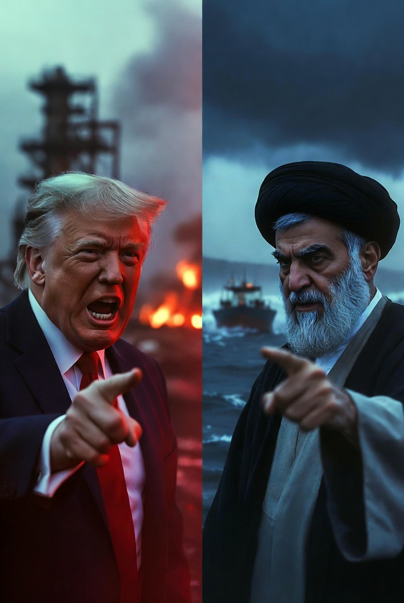

# Retorika Eskalasi dan Ambiguitas Strategi: Analisis Ancaman “All Hell” AS dan Respons “Gates of Hell” Iran dalam Konflik Timur Tengah 2026

*Ilustrasi ancaman (pic: Grok AI).*

  
***Ancaman “neraka” dari kedua pihak bukan sekadar retorika emosional. Ia adalah: bahasa kekuasaan dalam kondisi mendekati konflik terbuka***
  

Artikel ini menganalisis eskalasi retorika antara Amerika Serikat dan Iran pada April 2026, ditandai dengan ultimatum 48 jam dari Presiden AS dan respons balasan Iran yang simetris secara simbolik. 

Dengan menggunakan kerangka deterrence theory, escalation ladder, dan strategic signaling, analisis ini menunjukkan bahwa bahasa ekstrem bukan sekadar ekspresi emosi, tetapi instrumen politik untuk mengatur persepsi, tekanan, dan legitimasi dalam konflik bersenjata.

## Pendahuluan

Pada 4 April 2026, Donald Trump mengeluarkan ultimatum: “all hell will reign down” jika Iran tidak memenuhi tuntutan dalam 48 jam.

Sebagai respons, pejabat militer Iran menyatakan: “pintu neraka akan terbuka” bagi AS dan Israel jika serangan berlanjut.

Fenomena ini menciptakan simetri retorika destruktif yang jarang terjadi secara eksplisit.

## Metodologi

Pendekatan:

1.	Analisis retorika politik

2.	Teori deterrence dan signaling

3.	Kajian konflik internasional kontemporer

## Deterrence Theory

Ancaman keras digunakan untuk:

•	mencegah tindakan lawan

•	menunjukkan kesiapan eskalasi

Namun: ancaman terlalu ekstrem bisa kehilangan kredibilitas atau justru memicu eskalasi balik.

## Escalation Ladder (Herman Kahn)

Konflik bergerak dalam tangga eskalasi:

•	diplomasi

•	ancaman

•	serangan terbatas

•	perang terbuka

Bahasa “hell” menandakan: konflik sudah mendekati level eskalasi tinggi.

## Strategic Signaling

Pernyataan publik bukan hanya komunikasi…
tapi sinyal kepada banyak audiens sekaligus:
	
  •	lawan
	
  •	sekutu
	
  •	publik domestik

##?Analisis

A. Simetri Retorika: “Hell vs Gates of Hell”

Menariknya, kedua pihak menggunakan simbol yang sama:

•	AS → “all hell”

•	Iran → “gates of hell”

Ini menunjukkan: konflik telah masuk fase psikologis dan simbolik, bukan hanya militer.

B. Ultimatum 48 Jam: Tekanan Waktu sebagai Senjata

Ultimatum waktu pendek berfungsi untuk:

•	memaksa keputusan cepat

•	mengurangi ruang diplomasi

•	meningkatkan tekanan global

Namun risiko: jika tidak dipenuhi → kredibilitas ancaman dipertaruhkan.

C. Ambiguitas Strategi AS

Ancaman Trump muncul di tengah:

•	negosiasi yang belum sepenuhnya gagal  

•	pernyataan campuran antara diplomasi dan serangan.

Ini menciptakan strategic ambiguity yang bisa:

•	memberi fleksibilitas

•	tapi juga membingungkan sekutu dan militer sendiri.

D. Respons Iran: Deterrence Simetris

Iran tidak meredam, tapi mencerminkan ancaman dengan intensitas yang sama.

Ini strategi:
	
  •	menunjukkan tidak tunduk
	
  •	menjaga kredibilitas domestik
	
  •	menghindari kesan lemah.

E. Risiko Eskalasi Nyata

Kombinasi ini berbahaya:

•	ancaman maksimal

•	waktu singkat

•	ego politik tinggi

👉 menghasilkan: high-risk escalation environment.

## Diskusi

Fenomena ini mencerminkan tiga dinamika utama:

1. Perang sebagai Teater Bahasa

Bahasa menjadi senjata.

2. Krisis Kejelasan Tujuan

Ancaman besar tidak selalu diikuti strategi yang jelas.

3. Politik Domestik sebagai Driver

Pernyataan keras sering ditujukan juga untuk:
	
  •	publik dalam negeri
	
  •	legitimasi kekuasaan

Ancaman “neraka” dari kedua pihak bukan sekadar retorika emosional.

Ia adalah: bahasa kekuasaan dalam kondisi mendekati konflik terbuka.

Namun paradoksnya: semakin keras bahasa yang digunakan, semakin besar risiko bahwa kata-kata itu berubah menjadi kenyataan.

  
**Referensi**

Kahn, H. (1965). On escalation.

Schelling, T. (1966). Arms and influence.

Reuters. (2026). Trump ultimatum to Iran.
Axios. (2026). Iran war escalation updates.
