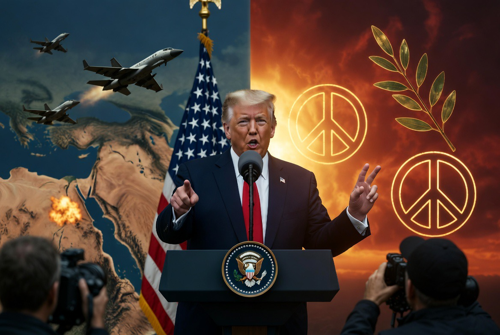

# Retorika Perdamaian, Praktik Eskalasi: Dilema Diplomasi Trump dalam Krisis Iran–Israel

*Ilustrasi (pic: Grok AI).*

  
***Apakah lawan melihat tekanan tersebut sebagai jalan menuju perdamaian atau sebagai bukti bahwa perdamaian itu sendiri tidak dapat dipercaya?***
  

Jika benar ingin damai, kenapa masih menembak? 

Dan jawabannya sering membuat orang awam frustrasi, karena dalam politik internasional, perdamaian dan kekerasan sering berjalan bersamaan.

## Trump Sedang Bermain Dua Lagu Sekaligus

Di satu sisi Trump berkata: “Israel dan Iran harus segera berhenti menembak.” Bahkan ia mengklaim kedua pihak sedang menuju gencatan senjata dan penyelesaian konflik.  

Namun di sisi lain, AS tetap melakukan operasi militer terbatas terhadap target Iran setelah insiden-insiden terbaru di Hormuz.  

Dari luar, ini tampak kontradiktif. Tetapi dari sudut pandang strategi kekuatan besar, belum tentu.

## Ini Bukan Kontradiksi, Ini “Coercive Diplomacy”

Dalam ilmu hubungan internasional ada konsep Coercive Diplomacy. 

Sederhananya: “Saya mengajakmu berunding sambil menunjukkan bahwa saya masih punya palu.”

Tujuannya bukan memenangkan perang, tapi membuat lawan percaya bahwa biaya menolak perundingan akan lebih mahal daripada menerima kompromi.

Trump tampaknya mencoba kombinasi tekanan militer terbatas, tekanan ekonomi, dan negosiasi diplomatik.

Pendekatan seperti ini bukan hal baru. Pemerintahan AS dari berbagai partai telah menggunakannya berkali-kali.  

## Masalahnya: Iran Tidak Bodoh

Di sinilah mulai pedas.

Dari perspektif Teheran, situasinya bisa terlihat seperti: “Washington meminta kami percaya pada perdamaian sambil tetap mempertahankan sanksi, blokade, dan serangan terbatas.”

Akibatnya muncul krisis kepercayaan, karena bagi Iran, pertanyaannya sederhana: Kalau niatnya damai, kenapa tekanan militer masih berlangsung?

Dan pertanyaan itu bukan tanpa dasar.

Banyak kebuntuan negosiasi saat ini memang terkait isu sanksi dan aset Iran yang dibekukan.  

## Trump Sebenarnya Tak Ingin Perang Besar

Ini bagian yang menarik.

Meskipun retorikanya sering keras, beberapa laporan menunjukkan Trump berusaha menghindari perang skala penuh dengan Iran. Ia bahkan menjelaskan bahwa perang besar akan sangat mahal dan berpotensi menyeret AS ke konflik berkepanjangan.  

Kenapa?

Karena perang penuh berarti biaya raksasa, risiko korban militer, guncangan ekonomi, lonjakan harga energi, serta kekacauan regional.

Dengan kata lain, Trump tampaknya ingin mendapatkan hasil perang tanpa benar-benar menjalani perang penuh.

## Netanyahu dan Trump Mulai Bernada Berbeda?

Ini yang membuat analis ramai.

Beberapa laporan menunjukkan adanya ketegangan terbuka mengenai bagaimana menghadapi Iran. Trump berulang kali meminta penghentian eskalasi, sementara pemerintah Israel beberapa kali tetap melanjutkan operasi yang menurut Washington berisiko merusak proses diplomasi.  

Maka muncul pertanyaan: Apakah Washington dan Tel Aviv masih memiliki tujuan yang sama?

Jawabannya mungkin: Sebagian sama, namun di sebagian lain mulai berbeda.

AS ingin stabilitas regional dan kesepakatan, sedangkan Israel lebih fokus pada ancaman keamanan langsung yang dirasakannya. Dua tujuan itu kadang bertemu kadang bertabrakan.

## Mengapa Banyak Analis Sinis?

Karena mereka melihat pola berikut:

Hari Senin: “Kami hampir mencapai perdamaian.”

Hari Selasa: rudal terbang.

Hari Rabu:  “Kemajuan diplomatik sangat baik.”

Hari Kamis: serangan balasan.

Hari Jumat: “Kesepakatan semakin dekat.”

Akibatnya sebagian analis mulai melihat proses ini sebagai negosiasi di bawah bayang-bayang perang, bukan proses perdamaian yang stabil.

## Jadi Trump Sedang Damai atau Sedang Perang?

Jawaban akademik yang paling jujur: Keduanya.

Trump tampaknya sedang berusaha mempertahankan tekanan militer yang cukup besar untuk memengaruhi Iran tetapi tidak cukup besar untuk memicu perang total.  

Masalahnya, strategi seperti ini ibarat berjalan di atas tali. Terlalu lembut, Iran tidak tertekan. Terlalu keras, perang besar meledak.

Dan sejarah menunjukkan banyak krisis justru pecah ketika para pemimpin yakin mereka masih bisa mengendalikan eskalasi.

Kalau kita tinggalkan retorika kampanye dan melihat pola perilaku kekuatan besar sepanjang sejarah, situasinya terlihat seperti ini:

| Pernyataan | Tindakan |
|------|-------|
| “Kami ingin damai.” | Menempatkan kapal perang |
| “Kami mendukung diplomasi.” | Menjatuhkan sanksi |
| “Kami ingin de-eskalasi.” | Menyiagakan pesawat tempur |
| “Kami membuka ruang negosiasi.” | Menjaga opsi serangan |

Apakah ini unik Trump?
Tidak. 
Bahkan sejak era Theodore Roosevelt ada prinsip terkenal: “Speak softly and carry a big stick.” (Berbicaralah lembut sambil membawa tongkat besar.)

Trump hanya melakukannya dengan gaya abad ke-21: “Tweet peacefully and carry cruise missiles.” 

Apakah Trump benar-benar ingin damai? Kemungkinan besar ia memang tidak menginginkan perang besar yang menguras biaya dan merusak ekonomi.

Apakah Trump tetap ingin mempertahankan tekanan militer? Juga iya.

Jadi paradoksnya bukan damai atau perang, melainkan perdamaian melalui ancaman perang.

Dan di situlah banyak analis berbeda pendapat. Sebagian menyebutnya strategi realistis, sedangkan sebagian lagi menyebutnya kontradiksi moral.

Apakah Trump munafik karena berbicara soal damai sambil tetap menggunakan kekuatan militer?

Secara akademik, istilah yang lebih tepat bukan “munafik”. Melainkan menggunakan diplomasi koersif (coercive diplomacy).

Namun efektivitas strategi itu sangat bergantung pada satu hal: Apakah lawan melihat tekanan tersebut sebagai jalan menuju perdamaian atau sebagai bukti bahwa perdamaian itu sendiri tidak dapat dipercaya?

Trump tampaknya ingin menjadi merpati perdamaian yang membawa ranting zaitun di paruhnya, sambil tetap menggenggam tombol peluncur rudal di sayapnya.

  
**Referensi**

Reuters. (2026, June 8). Trump says Israel and Iran looking to do an immediate ceasefire.

The Guardian. (2026, June 10). Iran war updates: US retaliation and Middle East crisis developments.

The Washington Institute. (2026). Trump’s best options on Iran: Limited strikes and continued military-economic pressure.

The Washington Post. (2026, June 7). Trump signals openness to easing sanctions and unfreezing Iranian funds under conditions.

New York Post. (2026, June 9). Trump explains why he is avoiding a return to war with Iran.

Al Jazeera. (2026, June 9). Did Netanyahu really defy Trump in bombing Iran?

