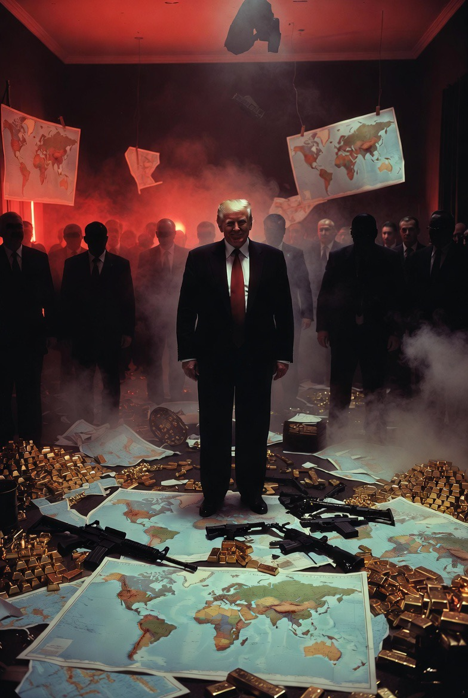

# Perampokan sebagai Kebijakan: Hegemoni Amerika dan Degenerasi Tatanan Dunia

*Ilustrasi "den of robbers" (pic: Grok).*

  
***Risiko geopolitik global saat ini tidak hanya berasal dari konflik regional, tetapi juga dari erosinya norma dan legitimasi tatanan internasional***
  

Kritik tajam Presiden Jerman Frank-Walter Steinmeier terhadap kebijakan luar negeri Amerika Serikat di bawah Presiden Donald Trump, yang menggambarkan risiko disintegrasi tatanan global menjadi semacam “den of robbers”, mencerminkan kekhawatiran mendalam akan erosi norma dasar hukum internasional, kedaulatan negara, dan kerjasama multilateral. 

Analisis ini menempatkan pernyataan tersebut dalam konteks teori hubungan internasional, pergeseran kekuasaan global, dan konsekuensi praktis dari tindakan unilateral yang dapat menciptakan legitimacy gapdalam sistem yang selama ini disebut rules-based international order.

## Latar Belakang dan Konteks

Pada 8 Januari 2026, Presiden Jerman Frank-Walter Steinmeier memperingatkan bahwa tatanan dunia pasca Perang Dunia II berisiko berubah menjadi “den of robbers” — suatu kondisi di mana negara kuat mengambil apa pun yang mereka kehendaki, meremehkan hukum dan norma internasional. 

Pernyataan itu datang setelah tindakan kontroversial AS terkait penangkapan Presiden Venezuela Nicolás Maduro dan dinamika geopolitik lain yang dipandang beberapa pemimpin dunia sebagai pelanggaran norma hukum internasional.  

## Hukum Internasional vs Unilateralism

1.Norma Hukum Internasional

Aturan yang mengatur hubungan antarnegara, terutama kedaulatan dan non-intervensi, tertuang dalam Piagam PBB dan prinsip Westphalian. 

Hukum ini mendukung penyelesaian sengketa melalui mekanisme kolektif (PBB, ICC) dan melarang pengambilalihan wilayah serta tindakan sepihak terhadap kepala negara tanpa mandat internasional.

2. Realisme dan Politik Kekuasaan

Dalam realisme klasik, negara kuat cenderung memaksimalkan kepentingan nasional tanpa memperdulikan aturan jika itu dianggap menghambat kekuasaan strategisnya. 

Ketika norma internasional dipandang mengikat “hanya jika sesuai kepentingan”, muncul praktik unilateralism yang merongrong legitimasi sistem global.

## Kritik Steinmeier dan Risiko Ketidakstabilan Global

1. Erosi Nilai dan Norma

Steinmeier menyatakan bahwa perilaku Amerika Serikat menunjukkan “breakdown of values” yang sebelumnya menjadi fondasi tatanan global, yakni kepatuhan terhadap hukum internasional, penghormatan atas kedaulatan negara lain, dan penghindaran tindakan sepihak yang merugikan negara lain.  

2.Risiko “Den of Robbers”

Konsep ini menggambarkan kekhawatiran bahwa, jika negara kuat terus bertindak tanpa memperhatikan norma kolektif, dunia bisa mengalami:

• Legitimasi melemah: norma hukum dianggap tidak berkekuatan saat negara kuat melanggarnya.

• Fragmentasi sistem internasional: negara-negara lain bereaksi dengan balancing, membentuk blok alternatif atau mengambil tindakan pragmatis tanpa merujuk pada hukum.

• Marginalisasi negara lemah: ketika hukum internasional tidak efektif, negara kecil menjadi rentan terhadap intervensi strategis.  

Steinmeier bahkan mengimbau negara seperti Brazil dan India untuk terlibat dalam upaya mempertahankan tatanan global yang adil.  

## Perbandingan Terhadap Isu Lainnya

Kritik terhadap AS bukan isolatif. Pemimpin Perancis Emmanuel Macron juga mengungkapkan keprihatinan serupa, menandai perubahan signifikan dalam dinamika transatlantik, terutama terkait kerja sama dan komitmen terhadap institusi multilateral.  

Implikasi Geopolitik

1. Kedaulatan Negara

Tindakan sepihak terhadap pemimpin negara lain atau intervensi tanpa mandat dapat bertentangan dengan prinsip dasar hukum internasional dan menimbulkan preseden berbahaya.

2. Keseimbangan Kekuasaan Global

Ketika kekuatan besar mengutamakan kepentingan strategis mereka sendiri, negara menengah dan kecil menghadapi pilihan sulit antara bergabung dengan blok kekuatan atau mempertahankan kedaulatan dalam kondisi risiko tinggi.

3.Tatanan Multilateral

Institusi kolektif seperti PBB, WTO, dan mekanisme hukum internasional lainnya bisa kehilangan relevansi jika norma bersama diabaikan tanpa konsekuensi efektif.

Kritik Steinmeier terhadap kemungkinan dunia berubah menjadi “den of robbers” bukan hanya retorika diplomatik. Itu mencerminkan ketegangan fundamental antara hukum internasional sebagai norma kolektif dan praktik kekuasaan unilateral yang sering diambil oleh negara dengan posisi strategis unggul. 

Risiko geopolitik global saat ini tidak hanya berasal dari konflik regional, tetapi juga dari erosinya norma dan legitimasi tatanan internasional.
  
**Referensi**

Daily Sun. (2026, January 9). German president says US destroying world order. Daily Sun. Retrieved from https://www.daily-sun.com/world/850565/german-president-says-us-destroying-world-order  

The Straits Times. (2026, January 9). ‘Den of robbers’: German president warns US is destroying world order. The Straits Times. Retrieved from https://www.straitstimes.com/world/europe/german-president-says-us-is-destroying-world-order  

GMA News Online. (2026, January 9). German president says US is destroying world order. GMA News Online. Retrieved from https://www.gmanetwork.com/news/topstories/world/972210/german-president-says-us-is-destroying-world-order/story/  

Reuters. (2026, January 8). German president says US is destroying world order. Reuters. Retrieved via multiple outlets.
