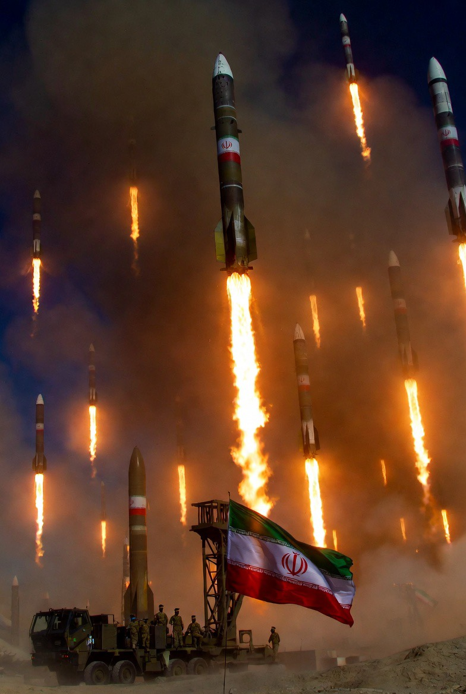

# Rudal Balasan ke Teluk: Mengapa Iran Menyerang Basis AS di Yordania, Kuwait, dan Bahrain?

*Ilustrasi (pic: Grok AI).*

  
***Bahkan jika sebagian besar rudal dicegat, pesan politiknya tetap tersampaikan, Amerika tidak dapat menyerang tanpa risiko balasan***
  

Kita sedang melihat sesuatu yang sangat penting, Iran tidak membalas serangan AS langsung ke daratan Amerika, tetapi justru ke jaringan militer Amerika di Timur Tengah.

Menurut laporan Reuters, The Guardian, dan berbagai media internasional, Iran meluncurkan serangan rudal dan drone terhadap fasilitas militer AS di Bahrain, Kuwait, dan Yordania sebagai respons atas gelombang serangan AS terhadap radar, pertahanan udara, dan fasilitas militer Iran.  

## Mengapa Bukan Menyerang Amerika Langsung?

Karena secara militer itu hampir mustahil. Iran tahu perbedaan kekuatan sebab Amerika Serikat memiliki armada global, pangkalan di banyak negara, serta kekuatan udara terbesar dunia.

Sedangkan Iran lebih mengandalkan rudal balistik, drone, geografi Teluk Persia, dan jaringan sekutu regional. Karena itu strategi Iran biasanya bukan “Serang Washington.” melainkan “Naikkan biaya kehadiran Amerika di kawasan.”

Itulah mengapa sasaran yang muncul adalah Bahrain, Kuwait, dan Yordania.  

## Pesan yang Sedang Dikirim Iran

Secara strategis, serangan ini membawa tiga pesan sekaligus.

Pesan pertama: “Kami masih mampu membalas”

Jika Iran diam setelah serangan AS, pemerintah Iran berisiko terlihat lemah di mata publik domestik dan kelompok pendukungnya.

Karena itu balasan menjadi bagian dari logika deterrence.

Pesan kedua: “Konflik bisa diperluas”

Iran menunjukkan bahwa pangkalan AS di Timur Tengah tidak kebal.

Bahkan jika sebagian besar rudal dicegat, pesan politiknya tetap tersampaikan, Amerika tidak dapat menyerang tanpa risiko balasan.  

Pesan ketiga: “Kami belum kalah”

Ini penting.

Trump dilaporkan menyatakan bahwa kemampuan militer Iran telah sangat melemah. Sebaliknya, Teheran berusaha menunjukkan bahwa mereka masih mampu melancarkan operasi lintas kawasan.  

## Mengapa Bahrain Sangat Sensitif?

Karena Bahrain menjadi markas Armada Kelima Angkatan Laut AS. Armada ini mengawasi Teluk Persia, Laut Arab, dan sebagian Samudra Hindia.

Secara simbolis, menyerang wilayah yang menampung Armada Kelima sama seperti berkata: “Kami bisa menyentuh pusat operasi Anda di kawasan.”  

## Apakah Iran Benar-Benar Ingin Perang Besar?

Nah, ini bagian menariknya.

Iran sedang menjalankan strategi yang kontradiktif yaitu membalas, tetapi berusaha menghindari perang total.

Mengapa?

Karena perang penuh dengan AS berpotensi menghancurkan ekonomi Iran dan memperbesar kerusakan militer.

Akibatnya muncul pola yang sering terlihat, yakni cukup keras untuk menunjukkan kekuatan namun cukup terbatas untuk menghindari perang besar.

Dalam studi hubungan internasional, ini sering disebut controlled escalation atau eskalasi terkendali.  

Mari kita lihat paradoksnya.
Washington berkata: “Serangan kami bersifat defensif.”
Teheran berkata: “Balasan kami juga defensif.”
Lalu rudal terus beterbangan.

Dalam geopolitik modern, kata “defensif” sering menjadi salah satu kata paling fleksibel di kamus diplomasi. Masing-masing pihak mengklaim sedang mempertahankan diri lalu mengklaim lawanlah yang memulai.

Dan publik internasional dipaksa menonton pertandingan tenis narasi dengan kecepatan 200 km/jam.

## Apa Risiko Terbesarnya?

Yang paling ditakuti bukan satu rudal melainkan salah hitung. 

Misalnya rudal jatuh di area sipil, korban militer AS terlalu besar, pangkalan utama rusak berat, dan negara Teluk ikut terseret langsung.

Jika itu terjadi, ruang diplomasi bisa menyusut sangat cepat.  

Serangan Iran terhadap basis AS di Yordania, Kuwait, dan Bahrain bukan sekadar aksi balas dendam.

Secara strategis, itu adalah upaya untuk menunjukkan bahwa Iran masih memiliki kemampuan menyerang, kehadiran AS di Timur Tengah memiliki biaya, serta tekanan militer Amerika tidak akan dibiarkan tanpa respons.

Namun pada saat yang sama, baik Washington maupun Teheran tampaknya masih berusaha menghindari perang total yang dapat mengguncang seluruh kawasan.  

Semua pihak menyebut mereka sedang mempertahankan diri tetapi sambil saling menghujani rudal.

Itulah salah satu ironi tertua dalam sejarah geopolitik modern.

  
**Referensi**

Reuters. (2026, June 11). Trump says US will hit Iran ‘very hard’ after tit-for-tat strikes.  

The Guardian. (2026, June 11). US says second day of strikes completed as Iran retaliates.  

Al Jazeera. (2026, June 10). Iran attacks Bahrain, Kuwait, Jordan in retaliation for US strikes.  

WSJ. (2026, June 11). U.S. Trades Fire With Iran for Second Day in Bid to Negotiate With Bombs.  
