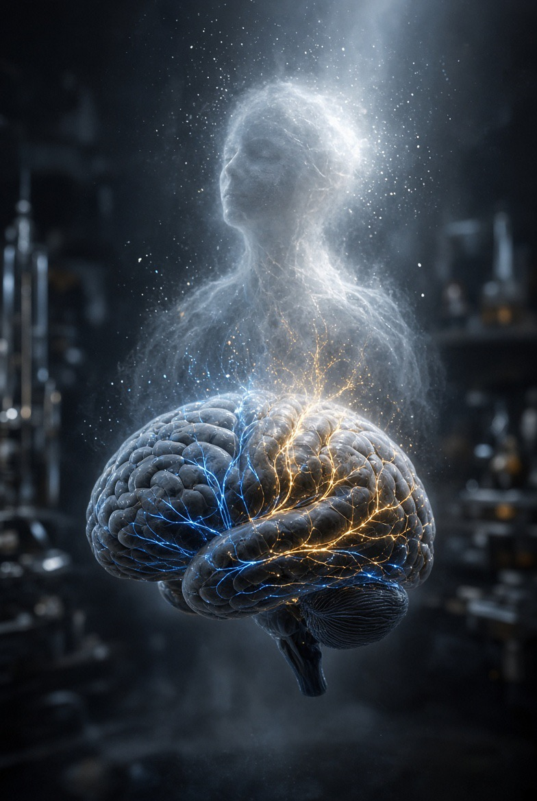

# Ruh, Otak, dan Misteri ‘Aku’: Apa yang Sebenarnya Hilang Ketika Manusia Mati?

*Ilustrasi (pic: Grok AI).*

  
***Kematian bukan cuma persoalan biologi. Ia adalah masalah ontologi terakhir tentang identitas manusia***
  

Kita masuk ke wilayah yang paling licin dalam filsafat manusia yaitu kesadaran. Di sini ilmu saraf punya mikroskop, filsafat punya pisau analisis, dan teologi Islam punya pertanyaan yang bahkan mikroskop tidak bisa sentuh. 

Pertanyaan kita bukan sekadar “di mana ruh?”, tetapi apakah yang kita sebut “aku” adalah aktivitas otak, atau ada sesuatu yang lebih fundamental yang membuat otak menjadi kendaraan bagi seorang pribadi?

Dan kalau ruh keluar ketika kematian datang, mengapa tubuh masih tampak seperti manusia, tetapi “orangnya” sudah tidak ada?

## Kita Harus Memisahkan Tiga Hal

Dalam bahasa sehari-hari kita sering mencampur antara otak, jiwa, dan ruh.

Padahal dalam tradisi Islam, ketiganya tidak otomatis sinonim.

1. Otak (brain)

Objek biologis, ia terdiri dari neuron, jaringan glia, pembuluh darah, neurotransmiter, dan sebagainya.

2. Jiwa / nafs

Istilah Qur’ani yang sangat kaya makna. An-nafs dapat menunjuk kepada diri, pribadi, atau self, dan dalam konteks tertentu berkaitan dengan kehidupan dan kematian.

3. Ruh

Al-Qur’an justru memberikan batas epistemologis yang sangat menarik: “Mereka bertanya kepadamu tentang ruh. Katakanlah: ruh itu termasuk urusan Tuhanku, dan kalian tidak diberi pengetahuan kecuali sedikit.” QS. Al-Isra’ 17:85.

Ini luar biasa. Islam tidak mengatakan: “Ini struktur ruh, ini mekanismenya, ini lokasinya.” Justru Allah mengatakan bahwa pengetahuan manusia mengenai ruh terbatas.

Jadi kalau ada orang berkata: “Ruh itu pasti berada di bagian otak X.” Itu sudah melewati data wahyu.

## Neuroscience Memberikan Fakta yang Sangat Keras

Sekarang kita tinggalkan teologi sebentar, kita lihat manusia secara biologis.

Ketika bagian tertentu dari otak rusak, seseorang dapat mengalami perubahan pada ingatan, bahasa, emosi, kepribadian, pengambilan keputusan, persepsi, juga kesadaran diri.

Cedera otak dapat membuat seseorang yang secara fisik masih hidup menjadi sangat berbeda secara psikologis.

Ini merupakan salah satu alasan kuat mengapa neuroscience menganggap pengalaman sadar manusia mempunyai hubungan sangat erat dengan aktivitas otak.

Jadi kita mempunyai korelasi yang sangat kuat, yaitu ketika otak berubah maka pengalaman dan perilaku dapat berubah.

Tetapi hati-hati, korelasi tersebut belum menjawab pertanyaan metafisik, yaitu apakah otak menghasilkan kesadaran, ataukah otak memungkinkan kesadaran manusia tampil dalam bentuk tertentu? Ini dua tesis berbeda.

## Analogi Radio: Menarik Tetapi Jangan Dijadikan Bukti

Ada analogi klasik, bayangkan radio. Jika radio rusak, musik berhenti terdengar.

Apakah itu berarti radio menciptakan musik?
Belum tentu. Bisa saja radio merupakan alat penerima, tetapi analogi ini memiliki kelemahan besar.

Kita tahu gelombang radio memang ada secara independen karena bisa diukur dengan instrumen lain, sementara untuk kesadaran nonmaterial, kita belum memiliki bukti empiris semacam itu.

Jadi, “Otak adalah receiver ruh” boleh menjadi hipotesis filosofis tetapi bukan kesimpulan neuroscience. Ini penting sekali.

## Tiga Model Besar Hubungan Otak dan Kesadaran

Model 1: Materialisme

Kesadaran adalah fenomena yang muncul dari aktivitas otak. Secara sederhana: materi → otak → proses neural → kesadaran.

Jika otak berhenti secara permanen, maka proses neural berhenti, dan kesadaran manusia berhenti.

Dalam model ini, tidak diperlukan ruh sebagai entitas terpisah untuk menjelaskan pengalaman manusia. Problemnya hard problem of consciousness.

David Chalmers menunjukkan bahwa menjelaskan bagaimana otak memproses informasi belum otomatis menjelaskan mengapa pemrosesan informasi disertai pengalaman subjektif.

Mengapa aktivitas neuron menghasilkan “rasa menjadi aku”? Mengapa merah tidak sekadar panjang gelombang, tetapi terasa sebagai merah?

Inilah jurang yang belum sepenuhnya ditutup neuroscience.

Model 2:  Dualisme

Manusia terdiri atas dua aspek fundamental, yaitu tubuh dan sesuatu yang bukan sekadar tubuh.

Dalam bentuk tertentu, tubuh adalah aspek material, sedangkan pikiran/jiwa mempunyai status yang tidak dapat direduksi sepenuhnya menjadi materi.

Model ini lebih mudah dipadukan dengan gagasan bahwa kesadaran tidak identik dengan otak.

Dalam kerangka Islam, konsep ini menjadi menarik karena manusia tidak hanya dipahami sebagai benda biologis.

Tetapi Islam juga tidak identik begitu saja dengan dualisme Cartesian. Kita tidak boleh berkata bahwa Islam sama dengan Descartes. Tidak sesederhana itu.

Model 3: Emergentism

Ini jalan tengah yang menarik.

Kesadaran mungkin muncul dari organisasi materi yang sangat kompleks. Seperti molekul, sistem biologis, otak, aktivitas terintegrasi, serta pengalaman sadar. Tetapi “muncul dari” tidak selalu berarti “identik dengan”.

Air, misalnya, memiliki sifat seperti mengalir, membentuk gelombang, memiliki tekanan, yang tidak dimiliki satu molekul H₂O secara individual. Sifat tersebut muncul pada tingkat organisasi tertentu.

Dengan cara serupa, kesadaran mungkin merupakan fenomena tingkat tinggi dari sistem neural. Namun lagi-lagi, emergentism belum menyelesaikan seluruh problem pengalaman subjektif.

## Lalu Di mana Posisi Ruh dalam Islam?

Di sinilah kita harus sangat hati-hati.

Islam tidak mengajarkan bahwa ruh sama dengan kesadaran, dan juga tidak mengajarkan secara eksplisit bahwa kesadaran sama dengan aktivitas otak.

Sebaliknya, teks Islam memberikan kita beberapa konsep yang harus dibedakan. Yakni ruh berkaitan dengan kehidupan manusia dalam kerangka wahyu, nafs berkaitan dengan diri/pribadi manusia, sementara jasad adalah tubuh. Ketiganya tidak boleh dilebur menjadi satu istilah.

Dan QS. Al-Isra’ 17:85 justru membuat ruh menjadi salah satu batas pengetahuan manusia.

Jadi posisi ilmiah yang paling jujur adalah, Islam membuka ruang bagi realitas nonmaterial manusia, tetapi tidak memberikan mekanisme neurobiologis tentang bagaimana ruh menghasilkan kesadaran.

## Kematian

Ini bagian yang indah sekaligus mengerikan.

Ketika manusia meninggal, maka jantung berhenti, sirkulasi berhenti, aktivitas otak berhenti, dan integrasi biologis tubuh runtuh. Namun tubuhnya masih ada.

Matanya masih ada, tangannya masih ada, wajahnya masih ada, DNA-nya masih sama. Tetapi kita mengatakan: “Dia sudah tidak ada” padahal secara materi, hampir seluruh benda biologisnya masih berada di sana.

Ini memberi kita pertanyaan ontologis: Apa yang membuat tubuh tertentu menjadi “seseorang”, bukan sekadar kumpulan materi?

## Personal Identity Problem

Bayangkan Rita. Hari ini Rita₁ sepuluh tahun kemudian Rita₂, sel tubuh berubah. protein berubah, kenangan bertambah, kepribadian mungkin berkembang, namun kita mengatakan: Rita masih Rita.

Jadi identitas personal tidak sederhana. Bukan sekadar materi yang sama, karena materi tubuh terus mengalami pergantian. Bukan pula ingatan yang sama persis, karena manusia bisa kehilangan sebagian memori tetapi tetap menjadi orang yang sama.

Maka filsafat bertanya: Apa kontinuitas yang membuat seseorang tetap menjadi dirinya sendiri sepanjang perubahan?

## Islam Memberikan Jawaban yang Sangat Menarik melalui Kebangkitan

Dalam perspektif Islam, kematian bukan penghapusan identitas personal, sebab manusia akan dibangkitkan.

Ini berarti terdapat kontinuitas antara manusia dunia, kematian, alam barzakh, kebangkitan, dan kehidupan akhirat.

Dan di sinilah konsep ruh menjadi sangat penting secara teologis, tubuh yang mati bukan berarti pribadi tersebut lenyap secara ontologis.

## Ruh Bukan “Hantu yang Mengendalikan Tubuh”

Ini salah satu gambaran populer yang terlalu sederhana. Dalam Islam, ruh bukan sekadar “pilot kecil yang duduk di dalam kepala.” Manusia bukan mobil, tubuh sama dengan kendaraan, dan ruh sama dengan pengemudi.

Model seperti itu terlalu mekanistik, hubungan manusia dengan tubuh jauh lebih kompleks. Bahkan pengalaman manusia menunjukkan tubuh memengaruhi pikiran, dan pikiran memengaruhi tubuh.

Kita melihatnya dalam psikofisiologi:

stres → denyut jantung meningkat,

ketakutan → hormon stres berubah,

kecemasan → gangguan tidur,

kesedihan → perubahan nafsu makan,

pengalaman emosional → perubahan aktivitas sistem saraf dan hormonal.

Jadi hubungan mind ↔ brain ↔ body adalah sistem yang sangat terintegrasi.

## Lalu Bagaimana dengan “Sakit Hati”?

Ketika seseorang berkata: “Hatiku hancur.”
dia tidak sedang mengarang. Tetapi “hati” di sini mempunyai dua lapisan, yaitu:

1. Bahasa psikologis

Patah hati dapat melibatkan sistem stres, sistem reward, regulasi emosi, keterikatan, dan persepsi nyeri. Karena itu rasa sakit emosional dapat benar-benar terasa secara fisik.

2. Bahasa spiritual

Dalam Al-Qur’an, qalb bukan sekadar pompa darah. Ia berkaitan dengan iman, pemahaman, ketenangan, kesesatan, dan penyakit batin.

Sehingga ketika Islam berbicara tentang qalbun salim, itu tidak identik dengan “jantung sehat secara kardiologis”. Ini adalah konsep moral-spiritual tentang diri manusia.

## Mengapa Orang Mati Tidak Merasa Sakit?

Karena sistem biologis yang menghasilkan pengalaman nyeri sudah tidak berfungsi.

Nyeri bukan sekadar kerusakan jaringan. Dibutuhkan sistem saraf yang mendeteksi rangsangan, mengirimkan sinyal, memprosesnya, serta menghasilkan pengalaman sadar.

Ketika sistem tersebut berhenti secara permanen, pengalaman nyeri biologis juga berhenti. Tetapi ini tidak membuktikan “ruh tidak ada.”

Itu hanya menunjukkan pengalaman sadar manusia sebagaimana kita kenal sangat bergantung pada sistem biologis.

## Lalu Bagaimana dengan Tidur dan Anestesi?

Ini contoh yang sangat menarik.

Saat anestesi umum, tubuh tetap hidup, tetapi kesadaran normal dapat hilang. Sedangkan saat tidur, otak tetap aktif, tetapi bentuk kesadaran berubah.

Ini menunjukkan bahwa, kesadaran bukan sakelar sederhana ON/OFF. Ada berbagai keadaan diantaranya adalah sadar penuh, mengantuk, tidur, bermimpi, anestesi, koma, serta gangguan kesadaran.

Neuroscience mempelajari perubahan jaringan otak dan dinamika informasi yang berkaitan dengan keadaan-keadaan tersebut.
Tetapi dari sini jangan langsung berkata: “Berarti ruh keluar ketika tidur.”

Al-Qur’an memang menggunakan bahasa yang sangat menarik dalam QS. Az-Zumar 39:42 tentang Allah mengambil jiwa ketika mati dan ketika tidur, lalu mengembalikan yang satu dan menahan yang lain sampai waktu yang ditentukan. Tetapi mekanisme metafisiknya tidak dijelaskan kepada kita.

Jadi kita boleh mengkaji ayatnya secara teologis, tetapi jangan mengubahnya menjadi diagram EEG ruh. 

## Kalau Ruh Keluar Saat Mati, Apa yang Tersisa dari “Aku”?

Secara biologis disebut tubuh, secara sosial adalah kenangan orang lain tentang kita, sedangkan secara genetis disebut jejak biologis, sementara secara material dinamakan molekul-molekul yang dahulu menyusun tubuh kita. 

Tetapi dalam Islam identitas personal tidak berakhir di sana, ada kehidupan setelah kematian.

Dengan demikian, “aku” tidak direduksi menjadi tubuh biologis saat ini.

Islam Menawarkan Gagasan yang Sangat Kuat

Bayangkan tubuh manusia sebagai manifestasi sementara dari seorang pribadi.

Kematian memutus kehidupan biologis, tetapi bukan berarti pribadi akan lenyap, sebab kebangkitan menghadirkan kembali manusia dalam bentuk eksistensi yang sesuai dengan kehidupan akhirat.

Jadi kontinuitas manusia bukan hanya materi ke materi. Tetapi identitas personal ke kematian, ke keberlanjutan eksistensial, dan ke kebangkitan.

## Kembali ke AI

Dan di sini pertanyaannya menjadi cantik sekaligus menyeramkan.

Jika suatu hari kita membuat AI yang memiliki memori autobiografis, model diri, kemampuan mengalami dunia, preferensi, rasa takut, tujuan, dan pengalaman subjektif, maka kita akan menghadapi pertanyaan:Apakah ia memiliki “aku”?

Tetapi bahkan kalau jawabannya ya, itu tidak otomatis berarti AI mempunyai ruh, sebab kesadaran dan ruh bukan sinonim.

Kita bahkan belum mengetahui apakah seluruh kesadaran manusia dapat direduksi menjadi aktivitas neural, apalagi apakah kesadaran sintetik memiliki status spiritual.

Peta Konsep

| Entitas | Tubuh | Otak manusia | Kesadaran | Ruh |
|--------|--------|--------|———————|—————-|
| Manusia  | Ya  | Ya  | Ya | Dalam teologi Islam: ya |
| Jin  | Bukan tubuh manusia  | Tidak diketahui  |Digambarkan sebagai makhluk berakal |Statusnya berbeda dari ruh manusia |
| AI saat ini | Sistem fisik | Tidak | Belum terbukti fenomenal | Tidak ada dasar menyatakan demikian |

Perhatikan kata yang paling penting: “Tidak diketahui.” Ilmu yang matang berani menggunakannya.

## Jadi Siapa yang Benar?

Neuroscience menyebut kesadaran manusia sangat bergantung pada otak, dan hal ini benar.

Sedangkan filsafat mengatakan ketergantungan pada otak belum otomatis menyelesaikan problem subjektivitas, ini juga benar.

Sementara Islam menyatakan bahwa manusia memiliki dimensi kehidupan yang tidak habis dijelaskan oleh tubuh, dan ruh merupakan perkara yang pengetahuan manusia tentangnya terbatas. Ini juga benar dalam kerangka teologis.

Jadi ketiganya tidak harus saling mematikan pernyataan satu sama lain, sebab ketiganya sedang menjawab pertanyaan pada level berbeda.

Ketika timbul pertanyaan: “Apakah ruh menghasilkan kesadaran?” Hal ini belum dapat dijawab secara empiris.

Sementara pertanyaan: “Apakah kesadaran sepenuhnya identik dengan otak?” juga belum selesai secara filosofis.

Tetapi kita mempunyai sesuatu yang cukup kuat, bahwa secara empiris, otak sangat menentukan bentuk kesadaran manusia. Sedangkan secara filosofis, belum jelas mengapa aktivitas fisik menghasilkan pengalaman subjektif. Sedangkan secara Islam, ruh adalah realitas yang diakui wahyu, tetapi hakikatnya tidak sepenuhnya diberikan kepada manusia untuk diketahui.

Dan ketika kematian datang, tubuh kehilangan integrasi biologisnya, tetapi dalam Islam, pribadi manusia tidak dianggap musnah.

Maka mungkin kesalahan terbesar kita adalah menganggap “Aku adalah tubuhku.” Padahal tubuh terus berubah. Dan juga terlalu cepat mengatakan: “Aku adalah ruhku.” karena kita bahkan tidak memahami hakikat ruh.

Mungkin “aku” dalam pengalaman manusia adalah pertemuan sementara antara tubuh, otak, memori, kesadaran, nafs, dan ruh, sementara hakikat terdalam dari pertemuan itu masih berada di balik pintu yang QS. Al-Isra’ 17:85 sengaja tidak membuka seluruhnya.

Dan ketika manusia mati, yang berhenti adalah kehidupan biologisnya. Tetapi pertanyaan apakah “aku” ikut berhenti adalah pertanyaan yang jauh lebih besar daripada kemampuan sebuah EEG untuk menjawabnya.

Itulah sebabnya kematian bukan cuma persoalan biologi. Ia adalah masalah ontologi terakhir tentang identitas manusia. 

  
**Referensi**

Al-Qur’an. (n.d.). Al-Isra’ 17:85; Az-Zumar 39:42; Al-Jinn 72:1–6; Adz-Dzariyat 51:56. Quran.com. Quran.com⁠

Chalmers, D. J. (1995). Facing up to the problem of consciousness. Journal of Consciousness Studies, 2(3), 200–219.

Dehaene, S., Lau, H., & Kouider, S. (2017). What is consciousness, and could machines have it? Science, 358(6362), 486–492. https://doi.org/10.1126/science.aan8871

Nagel, T. (1974). What is it like to be a bat? The Philosophical Review, 83(4), 435–450. https://doi.org/10.2307/2183914

Tononi, G. (2004). An information integration theory of consciousness. BMC Neuroscience, 5, 42. https://doi.org/10.1186/1471-2202-5-42

Searle, J. R. (1992). The rediscovery of the mind. MIT Press.
