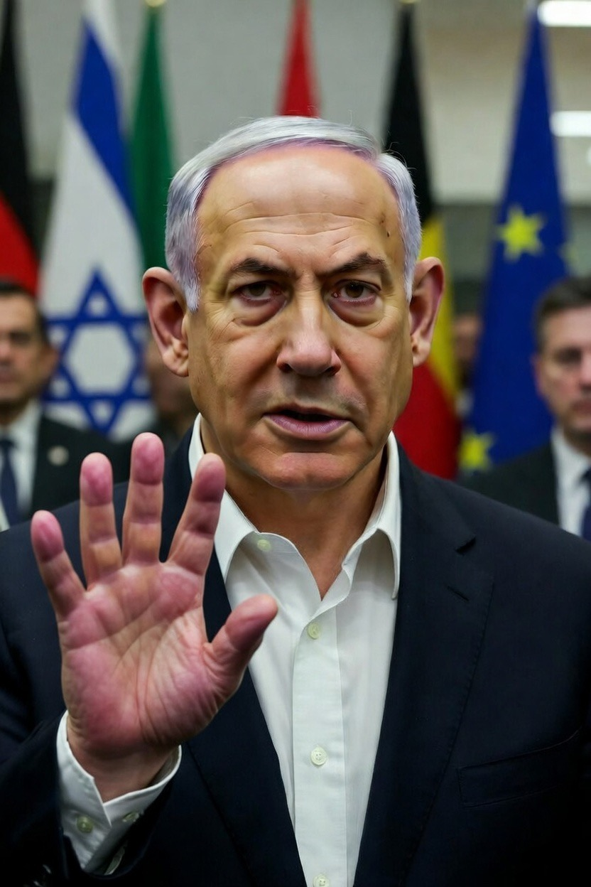

# Rumor, Deepfake, dan Strategic Silence: Kasus Spekulasi terhadap Benjamin Netanyahu dalam Konflik Timur Tengah

*Ilustrasi Netanyahu (pic: Grok AI).*

  
***Dalam perang modern, peluru membunuh di medan tempur. Tapi rumor dan propaganda membentuk siapa yang dianggap menang***
  

Perang modern tidak hanya terjadi di medan tempur fisik tetapi juga dalam ruang informasi. 

Salah satu fenomena yang sering muncul selama konflik adalah rumor mengenai kondisi kesehatan atau kematian pemimpin negara. 

Artikel ini menganalisis dinamika munculnya 
rumor tersebut melalui kerangka teori propaganda perang, ketidakpastian informasi, dan perkembangan teknologi manipulasi visual seperti deepfake. 

Studi ini menunjukkan bahwa kombinasi antara kontrol informasi negara, operasi psikologis, dan teknologi digital memperkuat produksi serta penyebaran rumor mengenai pemimpin politik selama konflik bersenjata.

## Pendahuluan

Sepanjang sejarah perang, kondisi fisik pemimpin negara sering menjadi objek spekulasi publik. 

Dalam konflik kontemporer, fenomena ini semakin intens karena penyebaran informasi digital yang cepat dan kemampuan teknologi untuk memanipulasi citra visual.

Rumor mengenai kesehatan atau kematian pemimpin memiliki implikasi strategis yang signifikan karena stabilitas kepemimpinan mempengaruhi:

•	moral publik

•	persepsi kekuatan negara

•	legitimasi politik dalam perang.

Oleh karena itu, informasi mengenai kondisi pemimpin sering menjadi bagian dari perang informasi.

Propaganda dan Kontrol Informasi

Dalam studi komunikasi politik, propaganda didefinisikan sebagai upaya sistematis untuk membentuk persepsi publik melalui pengelolaan informasi.

Selama perang, negara biasanya:

•	membatasi akses informasi

•	mengontrol narasi media

•	memproduksi pesan yang memperkuat legitimasi politik.

Kondisi ini menciptakan ketidakpastian informasi, yang membuka ruang bagi rumor dan spekulasi publik.

Epistemologi Rumor Politik

Rumor politik muncul ketika masyarakat menghadapi kombinasi tiga faktor:

1.	informasi yang terbatas

2.	ketidakpercayaan terhadap narasi resmi

3.	kebutuhan psikologis untuk memahami situasi krisis.

Dalam konteks perang, rumor sering menyasar tokoh simbolik seperti kepala negara atau pemimpin militer karena mereka mewakili stabilitas rezim.

## Teknologi Deepfake dan Manipulasi Visual

Perkembangan kecerdasan buatan memungkinkan produksi video sintetis yang sangat realistis.

Deepfake dapat:

•	memalsukan pidato pemimpin

•	memanipulasi ekspresi wajah

•	menciptakan citra visual yang tidak pernah terjadi.

Kesalahan visual seperti jari tambahan atau deformasi anatomi sering muncul dalam konten yang dihasilkan oleh model generatif, terutama pada generasi awal teknologi tersebut.

Akibatnya, publik sering menggunakan anomali visual sebagai dasar untuk menilai keaslian suatu video.

## Ketidakhadiran Pemimpin sebagai Fenomena Politik

Dalam konflik bersenjata, pemimpin negara kadang mengurangi kemunculan publik karena:

•	pertimbangan keamanan

•	kebutuhan koordinasi militer

•	strategi komunikasi politik.

Namun ketidakhadiran ini sering diinterpretasikan oleh publik sebagai indikasi krisis internal, termasuk spekulasi tentang kesehatan atau keselamatan pemimpin.

Fenomena ini memperlihatkan bagaimana kekosongan informasi dapat memicu produksi rumor.

## Preseden Historis

Sejarah menunjukkan bahwa kondisi kesehatan pemimpin sering disembunyikan oleh pemerintah.

Beberapa kasus terkenal meliputi:

•	penyakit serius presiden Amerika Serikat selama Perang Dunia II

•	stroke yang melumpuhkan presiden Amerika pada awal abad ke-20

•	kerahasiaan kondisi kesehatan pemimpin Uni Soviet selama era Perang Dingin.

Kasus-kasus tersebut menunjukkan bahwa kontrol informasi mengenai pemimpin bukan fenomena baru, tetapi telah menjadi bagian dari strategi politik negara sejak lama.

## Perang Informasi di Era Digital

Di era media sosial, produksi rumor politik mengalami percepatan drastis.

Informasi dapat menyebar melalui:

•	platform media sosial

•	forum diskusi daring

•	jaringan propaganda digital.

Dalam situasi konflik internasional, aktor negara maupun non-negara sering menggunakan ekosistem digital untuk memengaruhi opini publik global.

Rumor mengenai kondisi pemimpin negara selama konflik bersenjata merupakan fenomena kompleks yang lahir dari interaksi antara propaganda negara, ketidakpastian informasi, dan teknologi digital modern.

Kemunculan deepfake dan manipulasi visual memperkuat dinamika tersebut dengan menciptakan ambiguitas antara fakta dan rekayasa digital.

Oleh karena itu, analisis terhadap rumor politik tidak dapat dipisahkan dari studi mengenai perang informasi dan transformasi teknologi komunikasi global.

  
**Referensi**

RAND Corporation. (2023). Truth Decay and the Crisis of Information Integrity. Santa Monica.

Oxford Internet Institute. (2024). Computational Propaganda and Political Communication. Oxford.

NATO Strategic Communications Centre of Excellence. (2024). Deepfake Technology and Information Warfare. Riga.

Brookings Institution. (2023). Disinformation in Modern Conflict. Washington, DC.

Stanford Internet Observatory. (2024). Digital Propaganda and Political Manipulation. Stanford.
