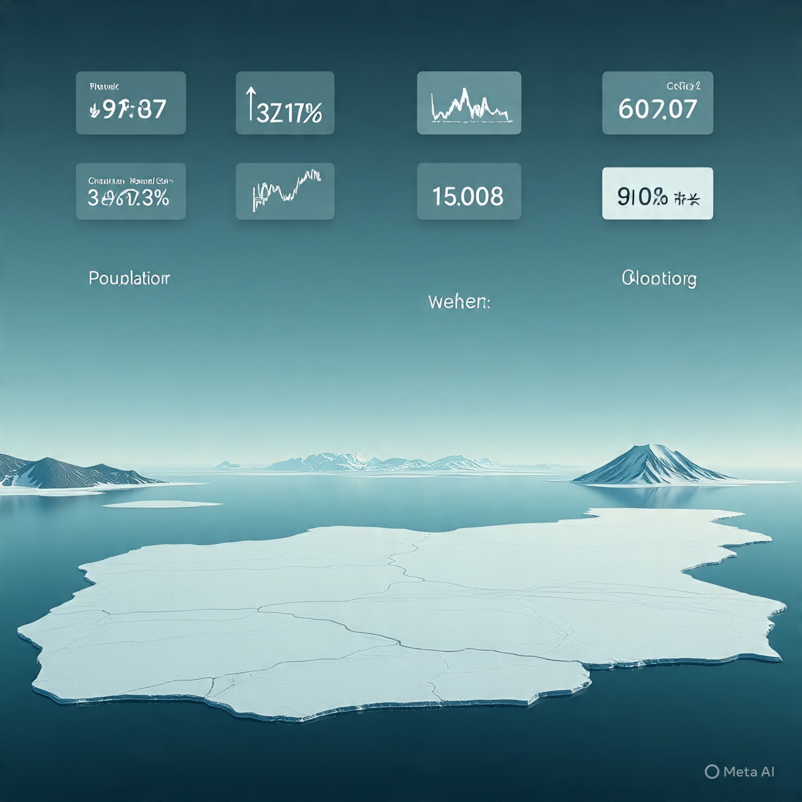

# Reaksi Pasar Saham Asia terhadap Sinyal Politik Greenland: Analisis Sentimen Risiko, Geopolitik Arktik, dan Rasionalitas Pasar Global

*Ilustrasi saham dan Greenland (pic: Trinity AI/Meta AI).*

  
***Pasar tidak bertanya “apakah dunia lebih adil?”, tetapi “apakah dunia sedikit lebih tenang hari ini?”***
  

Pernyataan politik Amerika Serikat terkait Greenland pada awal 2026 memicu respons cepat di pasar keuangan global, khususnya pasar saham Asia. 

Meskipun tidak berkaitan langsung dengan fundamental ekonomi Asia, beberapa indeks regional menunjukkan penguatan jangka pendek. 

Artikel ini menganalisis fenomena tersebut melalui kerangka risk perception theory, geopolitical signaling, dan financial market psychology, dengan menunjukkan bahwa penguatan pasar lebih mencerminkan penurunan ketidakpastian geopolitik dibandingkan optimisme struktural. 

Studi ini menegaskan bahwa pasar modern merespons narasi kekuasaan sama intensnya dengan data ekonomi riil.

## Pendahuluan

Dalam sistem keuangan global yang saling terhubung, pernyataan politik negara adidaya dapat memicu reaksi pasar lintas benua. 

Isu Greenland, meskipun secara geografis jauh dari Asia, memiliki implikasi strategis karena menyentuh tiga isu sensitif:
1.	Keamanan Arktik
2.	Kompetisi AS–China–Rusia
3.	Ancaman tarif dan fragmentasi perdagangan

Respons pasar Asia terhadap sinyal politik ini membuka pertanyaan penting: Mengapa pasar bereaksi positif terhadap isu yang secara substansial berpotensi destabilitatif?

## Kerangka Teoretis

1. Risk-On vs Risk-Off Dynamics

Pasar keuangan bekerja dalam dua mode psikologis utama:

•	Risk-off: ketidakpastian tinggi → investor mencari aset aman

•	Risk-on: ketidakpastian mereda → investor kembali ke saham

Pernyataan AS yang menggeser isu Greenland dari ancaman koersif (tarif, tekanan geopolitik) ke bahasa diplomatik menurunkan perceived risk, meskipun konflik substantif belum selesai.

Pasar merespons perubahan nada, bukan penyelesaian masalah.

2.Geopolitical Signaling Theory

Dalam hubungan internasional, pernyataan politik adalah sinyal strategis.

Bagi pasar:

•	Ancaman = volatilitas

•	Klarifikasi atau penundaan = stabilitas sementara

Pernyataan AS memberi sinyal bahwa eskalasi langsung tidak terjadi dalam waktu dekat, sehingga pasar Asia melakukan technical rebound.

3.Behavioral Finance dan Narasi Kekuasaan

Investor tidak sepenuhnya rasional. Mereka bereaksi terhadap headline, persepsi elite global, dan narasi dominan.

Greenland berfungsi sebagai proxy narrative bagi isu yang lebih besar: apakah AS sedang menuju konfrontasi global terbuka atau menunda konflik.

Jawaban sementara “ditunda” cukup untuk mendorong pembelian saham jangka pendek.

## Analisis Respons Pasar Asia

1. Karakteristik Penguatan
•	Penguatan tidak merata
•	Bersifat jangka pendek
•	Tidak disertai peningkatan volume jangka panjang

Ini menunjukkan bahwa pasar merespons sentimen namun tidak mengubah ekspektasi fundamental ekonomi.

2. Asia sebagai “Shock Absorber” Global

Pasar Asia sering berfungsi sebagai:

•	penerima dampak awal kebijakan AS

•	penyeimbang volatilitas Barat

Namun, penguatan kali ini bukan tanda kepercayaan struktural, melainkan relief rally.

## Diskusi Kritis

1. Ilusi Stabilitas

Pasar seolah “lega”, padahal:

•	isu Greenland belum selesai

•	kompetisi Arktik justru meningkat

•	militerisasi dan politisasi sumber daya berlanjut

Pasar mencintai ilusi ketenangan, bukan kebenaran geopolitik.

2.Politik sebagai Instrumen Pasar

Kasus ini memperlihatkan bahwa:
•	pernyataan politik bisa menjadi alat manajemen pasar
•	stabilitas finansial sementara dapat dibeli dengan retorika

Ini menimbulkan pertanyaan etis: apakah pasar global semakin mudah “ditenangkan” tanpa solusi nyata?

## Implikasi Global

1.	Bagi Asia
Rentan terhadap volatilitas narasi global meski tak terlibat langsung.

2.	Bagi Tata Kelola Global
Pasar menjadi sensitif terhadap sinyal kekuasaan, bukan institusi multilateral.

3.	Bagi Investor
Penguatan berbasis sentimen geopolitik bersifat rapuh dan reversibel.

Penguatan pasar saham Asia pasca pernyataan politik Greenland bukanlah cerminan optimisme ekonomi, melainkan respons psikologis terhadap penurunan ketidakpastian jangka pendek. 

Fenomena ini menegaskan bahwa dalam kapitalisme finansial kontemporer, narasi geopolitik dapat menggerakkan pasar lebih cepat daripada data ekonomi riil.

Pasar tidak bertanya “apakah dunia lebih adil?”, tetapi “apakah dunia sedikit lebih tenang hari ini?”

  
**Referensi**

Chibuike Oguh & Howcroft, E. (2026, January 20). Stocks hit with across board selloff as Trump’s threats over Greenland unnerves markets. Reuters. https://www.investing.com/news/stock-market-news/stocks-slide-dollar-struggles-as-trumps-greenland-gambit-rattles-markets-4453863  

Investing.com. (2026, January 21). Asia stocks rebound on Greenland relief; S.Korea hits record high. https://www.investing.com/news/stock-market-news/asia-stocks-rebound-on-greenland-relief-skorea-hits-record-high-4459216  

Warta Ekonomi. (2026, January 22). Saham Wall Street menguat usai AS batalkan ancaman tarif terkait Greenland. Investing.com (via Warta Ekonomi). https://id.investing.com/news/stock-market-news/saham-wall-street-menguat-usai-as-batalkan-ancaman-tarif-terkait-greenland-2918237  

Warta Ekonomi. (2026, January 22). Bursa Asia melemah, investor saham pantau isu Greenland dan Jepang. Investing News. https://id.investing.com/news/stock-market-news/bursa-asia-melemah-investor-saham-pantau-isu-greenland-dan-jepang-2918089  

Reuters. (2026, January 21). Most Gulf markets subdued, in line with Asian shares. Reuters. https://www.reuters.com/world/middle-east/most-gulf-markets-subdued-line-with-asian-shares-2026-01-21/  

Reuters. (2026, January 21). Stocks shaken by geopolitical fears, Japanese bonds bounce after selloff. Reuters. https://www.reuters.com/world/china/global-markets-wrapup-1-pix-2026-01-21/  

The Guardian. (2026, January 22). Australian shares shoot up after Trump walks back tariff threat. https://www.theguardian.com/business/2026/jan/22/australian-shares-shoot-up-after-trump-walks-back-tariff-threat  

Reuters. (2026, January 21). European shares end flat as Trump tones down Greenland rhetoric. Investing.com (via Reuters). https://au.investing.com/news/stock-market-news/european-shares-extend-selloff-on-trade-jitters-4215070  
