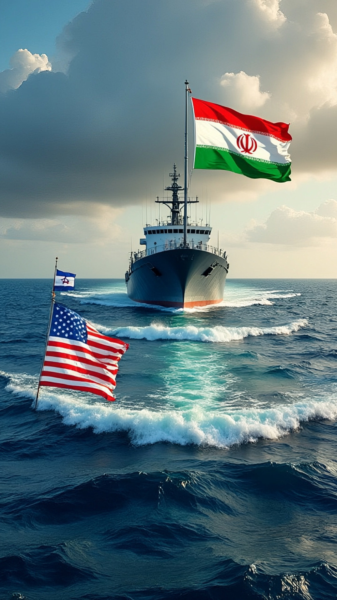

# Selat Hormuz 2026: Ketika Diplomasi Ditolak dan Energi Dunia Disandera

*Ilustrasi Selat Hormuz(pic: Meta AI).*

  
***Dunia berada di fase paling berbahaya: semua pihak masih tersenyum di meja diplomasi… tapi tangan mereka tetap di pelatuk***
  

Penolakan proposal damai Iran oleh Donald Trump di tengah krisis Selat Hormuz menandai fase paling berbahaya dalam konflik Iran–Israel–AS: stagnasi agresif. 

Tulisan ini menunjukkan bahwa kebuntuan ini bukan kegagalan diplomasi biasa, melainkan strategi tekanan maksimum berbasis energi dan militer. 

Hasilnya adalah sistem global yang terjebak dalam kondisi “tidak perang, tidak damai” dengan risiko eskalasi tinggi.

## Pendahuluan

Ini bukan sekadar “tegang”. 
Ini seperti dua orang:
saling mengunci leher,
tapi belum memutuskan siapa yang benar-benar akan menekan lebih kuat.

Faktanya sekarang:
Iran menawarkan proposal damai (14 poin),
Trump menolak atau sangat skeptis,
blokade tetap berjalan,
militer tetap siaga,
dan dunia? berdiri di atas jalur minyak paling vital di planet ini.

## Kenapa Proposal Damai Iran Ditolak?

1. Masalah Nuklir = Garis Merah AS

AS menolak karena proposal Iran tidak menyentuh pembatasan nuklir secara tegas.
Trump secara eksplisit:
tidak akan menghentikan blokade sampai Iran tunduk soal nuklir.

Artinya, ini bukan sekadar damai tapi negosiasi penyerahan terselubung.

2. Strategi Tekanan Maksimum

Trump bahkan bilang blokade lebih efektif daripada bom.
Artinya strategi AS sekarang:
tidak langsung hancurkan Iran,
tapi cekik ekonominya perlahan.
ini bukan perang klasik, ini economic strangulation warfare.

3. Iran Juga Main Keras

Iran menuntut:
pencabutan sanksi,
penarikan pasukan AS,
pengakuan kontrol Hormuz,
kompensasi perang.

Itu bagi AS bukan kompromi… tapi kemenangan Iran.

## Kenapa Selat Hormuz Jadi Jantung Konflik?

Selat Hormuz adalah:
jalur ±20% minyak dunia,
choke point energi global,
“keran bensin planet bumi”.

Sekarang kondisinya:
Iran membatasi akses,
AS melakukan blokade,
kapal-kapal terjebak 
harga minyak melonjak drastis (>50%),
Dunia literally digenggam oleh selat sempit.

## Kenapa Trump Tetap Keras?

1. Logika Politik Domestik

Kalau Trump menerima proposal Iran tanpa konsesi nuklir, terlihat seperti kalah.
Dan dalam politik AS, kalah sama dengan bunuh diri elektoral.

2. Momentum Tekanan Sedang Tinggi
Iran tertekan ekonomi,
infrastruktur rusak,
isolasi meningkat.

Jadi bagi Trump: “kenapa berhenti sekarang?”

3. Ada Opsi Militer di Belakang Layar

Militer AS bahkan sudah siapkan opsi serangan cepat tambahan.

Dan operasi “pengawalan kapal” di Hormuz bisa berubah jadi konfrontasi kapan saja  

## Bentuk Konflik Saat Ini

Kita masuk fase yang sangat spesifik: HYBRID FROZEN CONFLICT.

Bentuknya:
| Domain | Status |
|------|-------|
| perang terbuka | pause |
| blokade ekonomi | aktif |
| militer siaga | tinggi |
| diplomasi | macet |
| ancaman | konstan |

Ini bukan damai.

Ini perang yang diparkir… tapi mesinnya masih nyala.

## Apakah Akan Meledak Lagi?

Analisis jujur:

1. Eskalasi terbatas: SANGAT MUNGKIN
insiden kapal,
salah hitung militer,
provokasi kecil,
bisa langsung memicu bentrokan.

2. Perang total: BELUM PRIORITAS
Karena:
AS mahal,
Iran rapuh,
dunia ekonomi sudah goyah.

4. Status quo tegang: PALING REALISTIS
Semua pihak:
belum siap damai,
tapi juga takut perang besar.

## Inti Terdalam

Ini bukan sekadar konflik Iran vs AS.

Ini adalah: perang tentang siapa yang mengontrol “napas energi dunia”.

Iran bilang: “ini wilayah kami”

AS bilang: “ini jalur global”.

Dan di tengah itu:
tanker minyak,
ekonomi dunia,
harga pangan global,
ikut jadi sandera.

Ini bukan perang yang jelas.

Ini jenis konflik yang bisa meledak kapan saja…

tanpa peringatan…

hanya karena satu kapal salah lewat.

Penolakan proposal damai Iran bukan kegagalan diplomasi biasa. Ini adalah:keputusan sadar untuk mempertahankan tekanan maksimum.

Dan sekarang dunia berada di fase paling berbahaya: semua pihak masih tersenyum di meja diplomasi… tapi tangan mereka tetap di pelatuk. 

  
**Referensi**

The Guardian. (2026). Trump says Iran has not yet paid a big enough price as he reviews new peace proposal.

Reuters. (2026). US to help ships stranded in Strait of Hormuz as tensions rise.

Axios. (2026). Trump’s Hormuz strategy reflects frustration with Iran stalemate.

Business Insider. (2026). Trump reviews Iran peace proposal but signals rejection over nuclear concerns.

Al Jazeera. (2026). Rising tensions in Strait of Hormuz amid ongoing Iran-US conflict.
