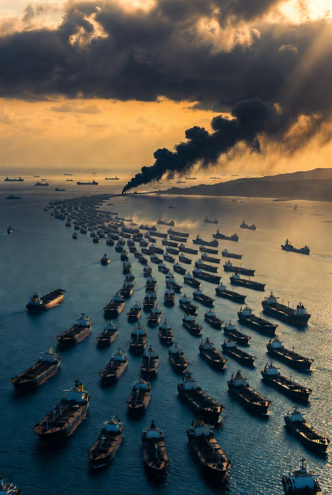

# Selat Hormuz 25 April 2026: Dibuka tapi Tidak Benar-Benar Bebas? Analisis Geopolitik Klaim Iran, Blokade AS, dan Fluktuasi Energi Global

*Ilustrasi Selat Hormuz (pic: Grok 

  
***Pembukaan bersifat terbatas, rapuh, dan tetap berada dalam bayang-bayang konflik AS–Iran–Israel***
  

Per 25 April 2026, muncul laporan bahwa Iran mengklaim Selat Hormuz telah “dibuka kembali” untuk pelayaran komersial internasional. 

Namun di lapangan, lalu lintas kapal tetap terganggu, premi asuransi maritim melonjak, dan harga minyak global masih sangat fluktuatif. 

Tulisan ini menganalisis kontradiksi tersebut melalui perspektif maritime chokepoint politics, economic warfare, dan strategic signaling. 

Temuan menunjukkan bahwa “dibuka” dalam konteks ini bukan berarti normal, melainkan pembukaan terbatas yang tetap berada di bawah kontrol militer dan tekanan geopolitik.

## Pendahuluan

Selat Hormuz adalah salah satu jalur energi paling penting di dunia:

👉 sekitar 20% minyak global melewati jalur ini

👉 gangguan kecil saja bisa mengguncang ekonomi dunia.

Pada April 2026:

Iran beberapa kali mengumumkan pembukaan kembali selat
tetapi lalu lintas tetap minim
dan pasar minyak tetap liar

Ini memunculkan pertanyaan:

“Kalau AS masih memblokade Iran, kenapa Iran mau buka Hormuz?”

Pertanyaan itu sebenarnya inti masalahnya.

Apakah Selat Hormuz Benar-Benar Dibuka?

Secara resmi: ya, sempat dibuka

Menteri Luar Negeri Iran, Abbas Araghchi, menyatakan bahwa Selat Hormuz dibuka untuk kapal komersial selama masa gencatan senjata.  

Dampaknya langsung terasa:

harga minyak sempat turun hampir 10%
pasar menganggap risiko perang menurun  

Tapi secara praktis: belum normal

Beberapa hari kemudian:

Iran kembali memperketat jalur
kapal tanker dilaporkan ditembaki IRGC
lalu lintas pelayaran hampir berhenti total  

Reuters bahkan menyebut:

hanya sedikit kapal yang benar-benar melintas, dan situasinya disebut “double blockade”.

## Jadi “Dibuka” itu Maksudnya Apa?

Ini poin terpenting

Dalam geopolitik:

“dibuka” ≠ “bebas”

Iran tidak sedang berkata:

👉 “silakan semua lewat tanpa masalah”

Iran sebenarnya berkata:

“kami mengizinkan lalu lintas terbatas di bawah syarat kami”

## Kenapa Iran Mau Membuka Sebagian?

1. Tekanan ekonomi internal

Iran juga butuh:

ekspor minyak

pemasukan devisa

stabilitas ekonomi domestik

Kalau Hormuz ditutup total terlalu lama:

👉 Iran sendiri ikut sesak

2. Menghindari kehilangan dukungan global

Jika Iran menutup penuh Hormuz terlalu lama:

China terganggu

India terganggu

ekonomi dunia terpukul

Iran sadar:

mereka ingin menekan AS, bukan memusuhi seluruh dunia sekaligus.

3. Strategic signaling

Pembukaan sebagian adalah pesan politik:

👉 Iran ingin terlihat “rasional”

👉 sambil tetap menunjukkan bahwa mereka bisa menutup kapan saja.

Dengan kata lain:

Hormuz dijadikan tuas tawar geopolitik.

## Kenapa Harga Minyak Tetap Fluktuatif?

Karena pasar tidak percaya situasi sudah aman.

Masalahnya bukan sekadar:

“jalur buka atau tutup”

Tapi:

apakah kapal aman?

apakah asuransi mau menanggung?

apakah perang akan pecah lagi besok pagi?

Maka lahirlah kondisi absurd:

👉 selat “dibuka”

👉 tapi kapal takut lewat

👉 minyak tetap mahal

Kapitalisme global memang lucu. Satu selat sempit bikin seluruh planet deg-degan seperti mahasiswa lihat dosen pembimbing online jam 2 pagi.

## Analisis Geopolitik

1. Hormuz sebagai senjata

Iran memahami bahwa mereka kalah dalam:

kekuatan udara

teknologi militer

armada global

Tapi Iran unggul di:

👉 posisi geografis

Dan Hormuz adalah “pisau kecil” yang bisa menusuk ekonomi dunia.

2. AS juga bermain ambigu

AS ingin:

menjaga jalur energi

menekan Iran

tapi menghindari perang total

Maka lahir situasi setengah perang:

👉 blokade ada

👉 tapi tidak penuh

👉 ancaman ada

👉 tapi diplomasi tetap jalan

Per 25 April 2026, klaim bahwa Selat Hormuz “dibuka kembali” memang memiliki dasar faktual. Namun pembukaan tersebut bersifat terbatas, rapuh, dan tetap berada dalam bayang-bayang konflik AS–Iran–Israel.

Karena itu:

secara teknis → ada pembukaan

secara geopolitik → krisis belum selesai

secara ekonomi → pasar tetap panik

Dengan demikian, Hormuz pada April 2026 bukan jalur perdagangan normal, melainkan: koridor energi yang dijaga oleh ketakutan bersama.

  
**Referensi**

Reuters. (2026). Oil prices rise on fears of ceasefire collapse.  

The Guardian. (2026). Iran closes Strait of Hormuz again until US lifts blockade.  

Narasi TV. (2026). Iran umumkan Selat Hormuz dibuka.  

Infonasional. (2026). Pembukaan Hormuz dan dampak harga minyak.  

Gate News. (2026). US blockade and Hormuz disruption.  
