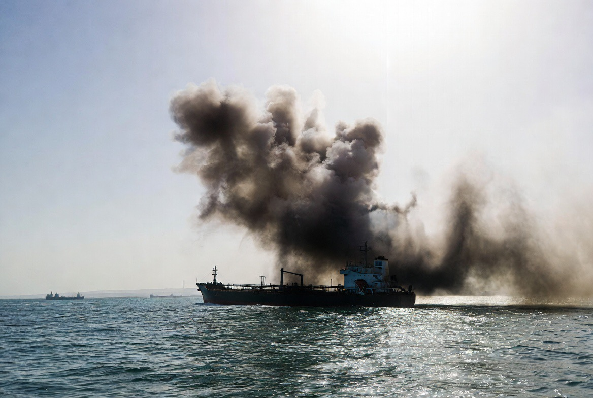

# Selat Hormuz Kembali Bergolak: Mengapa Satu Proyektil Dapat Mengguncang Pasar Energi Dunia?

*Ilustrasi (pic: Grok AI).*

  
***“Dalam geopolitik, kadang sebuah kapal dagang yang terkena serangan dapat mengguncang pasar lebih besar daripada puluhan pidato para pemimpin dunia.”***
  

Pada 4 Agustus 2026, sebuah kapal kargo dilaporkan terkena proyektil yang belum diketahui asalnya di dekat Selat Hormuz, sekitar 20 mil laut di timur laut Al Khasab, Oman. 

Otoritas maritim Inggris (UKMTO) mengklasifikasikan insiden tersebut sebagai serangan dan mengeluarkan peringatan kepada kapal-kapal yang melintas agar meningkatkan kewaspadaan. Hingga laporan awal diterbitkan, belum ada pihak yang mengaku bertanggung jawab. 

Peristiwa ini bukan berdiri sendiri, sebab dalam beberapa hari sebelumnya telah terjadi beberapa ledakan dan insiden serupa terhadap kapal-kapal niaga di kawasan yang sama. 

## Mengapa Selat Hormuz Sangat Penting?

Selat Hormuz adalah salah satu maritime chokepoint terpenting di dunia.

Sebagian besar ekspor minyak dari negara-negara Teluk harus melewati jalur sempit ini sebelum mencapai pasar internasional.

Artinya, setiap gangguan keamanan di Hormuz tidak hanya berdampak pada negara-negara kawasan, tetapi juga pada harga minyak, biaya asuransi kapal, ongkos pengiriman, dan inflasi global.

Karena itu, satu insiden kecil pun dapat memicu reaksi pasar yang besar. 

## Mengapa Serangan Ini Terjadi Sekarang?

Waktunya sangat menarik.

Insiden terjadi ketika muncul sinyal diplomasi baru antara Amerika Serikat dan Iran melalui mediasi negara-negara Teluk. Namun kedua pihak justru memberikan narasi yang berbeda mengenai status pembicaraan tersebut. 

Dalam situasi seperti ini, setiap serangan terhadap pelayaran memiliki efek politik yang jauh lebih besar daripada nilai kerusakan fisiknya.

Ia mengirim sinyal bahwa keamanan kawasan masih rapuh.

## Analisis

Dalam teori strategi terdapat konsep strategic chokepoint. Bahwa negara tidak selalu harus menguasai seluruh lautan, cukup menguasai titik sempit yang menjadi jalur vital perdagangan.

Mengapa?

Karena tekanan pada satu titik sempit dapat menghasilkan dampak global. Selat Hormuz adalah contoh klasiknya.

## Siapa yang Paling Dirugikan?

Jawabannya lebih luas daripada yang sering dibayangkan.

Yang langsung terdampak adalah perusahaan pelayaran, eksportir minyak, importir energi, serta perusahaan asuransi maritim.

Namun efek berikutnya dapat dirasakan oleh masyarakat biasa melalui kenaikan harga bahan bakar, biaya transportasi, harga pangan, dan inflasi.

Karena energi adalah fondasi hampir seluruh aktivitas ekonomi.

## Apakah Ini Hanya Persoalan Iran?

Belum tentu.

Pada tahap ini belum ada bukti publik yang memastikan pelaku serangan.

Dalam situasi konflik, ada banyak kemungkinan: aktor negara, kelompok bersenjata, pihak ketiga yang ingin menggagalkan diplomasi, atau kombinasi dari berbagai faktor.

Karena itu, menyimpulkan pelaku tanpa bukti akan melampaui informasi yang tersedia saat ini.

## Pelajaran Geopolitik

Ada ironi besar.

Semua negara menginginkan perdagangan global tetap berjalan. Namun ketika kepercayaan keamanan runtuh, kapal dagang berubah menjadi bagian dari arena geopolitik.

Akibatnya, biaya ekonomi dibayar oleh dunia, bukan hanya oleh pihak-pihak yang sedang berseteru.

Serangan terbaru di dekat Selat Hormuz menunjukkan bahwa keamanan maritim tetap menjadi salah satu titik paling rentan dalam sistem ekonomi global. 

Bahkan ketika diplomasi sedang diupayakan, insiden terhadap kapal dagang dapat dengan cepat mengubah persepsi pasar, meningkatkan risiko pelayaran, dan mengganggu kepercayaan terhadap stabilitas kawasan.

Selama belum ada penyelesaian politik yang lebih kokoh, setiap proyektil yang jatuh di sekitar Hormuz akan dipandang bukan sekadar serangan terhadap sebuah kapal, melainkan sebagai ancaman terhadap salah satu urat nadi perdagangan dunia.

Selat Hormuz mengingatkan dunia bahwa dalam geopolitik modern, kekuatan tidak selalu diukur dari banyaknya wilayah yang dikuasai, tetapi juga dari kemampuan memengaruhi titik-titik sempit yang menjadi urat nadi perdagangan global. 

Ketika sebuah kapal dagang berubah menjadi sasaran, yang terguncang bukan hanya lambung kapal itu, melainkan juga kepercayaan terhadap stabilitas ekonomi dunia.

  
**Referensi**

United Kingdom Maritime Trade Operations. Maritime Security Advisories, Agustus 2026.

International Energy Agency. Oil Market Report.

The Revenge of Geography. Kaplan, R. D. (2012). The Revenge of Geography. Random House.

Stockholm International Peace Research Institute. SIPRI Yearbook.
