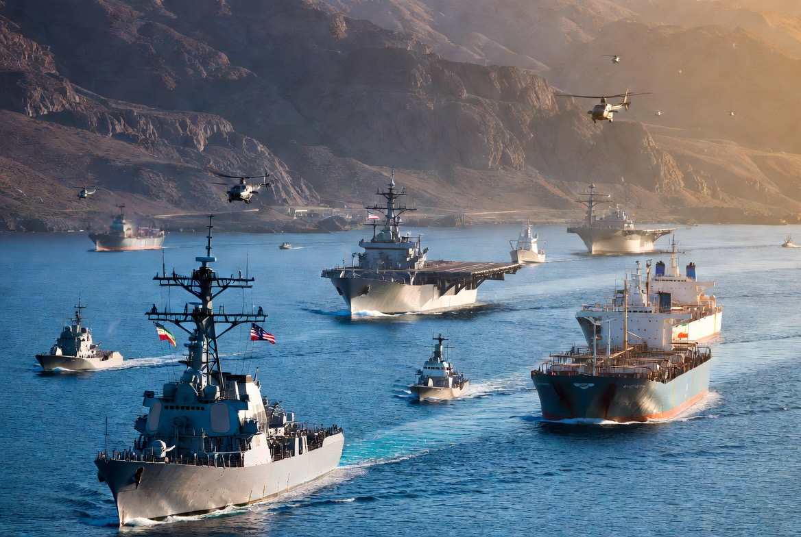

# Selat Hormuz dan Politik Angka-Angka: Ketika Rudal, Propaganda, dan Diplomasi Bertabrakan

*Ilustrasi (pic: Grok AI).*

  
***Jika Iran benar-benar tinggal seperlima stok rudalnya, mengapa Washington masih terlihat begitu berhati-hati?***
  

Awal Juni 2026 menunjukkan bahwa perang modern tidak hanya terjadi di udara dan laut, tetapi juga dalam ruang informasi. 

Iran menembakkan rudal dan drone. Amerika menembak jatuh sebagian besar ancaman tersebut. Namun di saat yang sama, kedua pihak juga meluncurkan “rudal narasi” untuk membentuk persepsi dunia.  

## Selat Hormuz: Tombol Merah Ekonomi Dunia

Banyak orang melihat Hormuz hanya sebagai selat sempit. Padahal bagi ekonomi dunia, Hormuz adalah keran energi planet Bumi.

Jika Gaza adalah luka politik.

Jika Ukraina adalah luka keamanan.

Maka Hormuz adalah arteri ekonomi global.

Karena itu setiap drone yang terbang di sana langsung membuat trader minyak, investor, dan pemerintah di seluruh dunia menegakkan punggungnya.  

## Perang Modern Adalah Pertempuran Cerita

Iran berkata: Kami membalas agresi Amerika. Sementara AS berkata: Kami mempertahankan pelayaran internasional.

Kedua pernyataan itu bisa sama-sama diyakini oleh pendukung masing-masing.

Dalam ilmu komunikasi politik, ini disebut Narrative Warfare, yaitu perang untuk menentukan siapa yang dianggap korban dan siapa yang dianggap pelaku.

## Angka 21-22% yang Sangat Menarik

Klaim Trump bahwa Iran tinggal memiliki “21-22%” stok rudal. Misal angka itu benar, maka Trump sedang mengirim pesan: “Iran sudah melemah.”

Tetapi jika angka itu tidak dapat diverifikasi? Maka angka tersebut berfungsi sebagai instrumen psikologis.

Tujuannya bukan menjelaskan realitas namun membentuk persepsi realitas. Sebab dalam perang, moral dan persepsi sering sama pentingnya dengan jumlah rudal yang sebenarnya.

## Kasus Patriot Kuwait: Aroma Misteri

Bagian paling menarik justru bukan rudal Iran. Melainkan pertanyaan: “Ledakan di Kuwait berasal dari apa?”

Jika ternyata berasal dari rudal Iran maka narasi keberhasilan Iran menguat. Tapi jika berasal dari sistem intersepsi Patriot, akan muncul pertanyaan tentang risiko pertahanan yang justru menciptakan kerusakan sekunder.

Namun hingga kini belum ada bukti publik yang cukup untuk menyimpulkan salah satu versi sebagai fakta final.  

## Mengapa Negosiasi Tetap Jalan?

Ini paradoks Timur Tengah tahun 2026. Siang hari: rudal. Malam hari: negosiasi. Besoknya: rudal lagi. Lalu: negosiasi lagi.

Karena baik Washington maupun Teheran tampaknya memahami satu hal: perang penuh jauh lebih mahal daripada perdamaian yang tidak sempurna.

Meski demikian, perbedaan soal aset Iran yang dibekukan dan pengaturan Hormuz masih menjadi batu sandungan utama.  

Jika Iran benar-benar tinggal seperlima stok rudalnya, mengapa Washington masih terlihat begitu berhati-hati?

Kadang dalam perang, angka yang paling sering dikutip justru angka yang paling perlu diperiksa ulang. 

  
**Referensi**

Reuters. (2026, June 6). US strikes Iranian sites after Iran launches drones in latest Gulf flare-up.Reuters.  

Reuters. (2026, June 3). Hostilities flare in Iran war, oil jumps with talks at a stalemate. Reuters.  

Reuters. (2026, June 3). War may end in interim deal that leaves Iran battered but unbowed. Reuters.  

Associated Press. (2026, June 6). Air raid sirens in Bahrain as Iranian missiles and drones head for Gulf neighbors. The Washington Post/AP.  

Reuters & AFP. (2026, June 3). Iranian drone hits Kuwait’s main airport after US strikes Qeshm Island.Al Jazeera.  

The Guardian. (2026, June 6). Kuwait and Bahrain targeted by Iran after exchange of fire with US.
