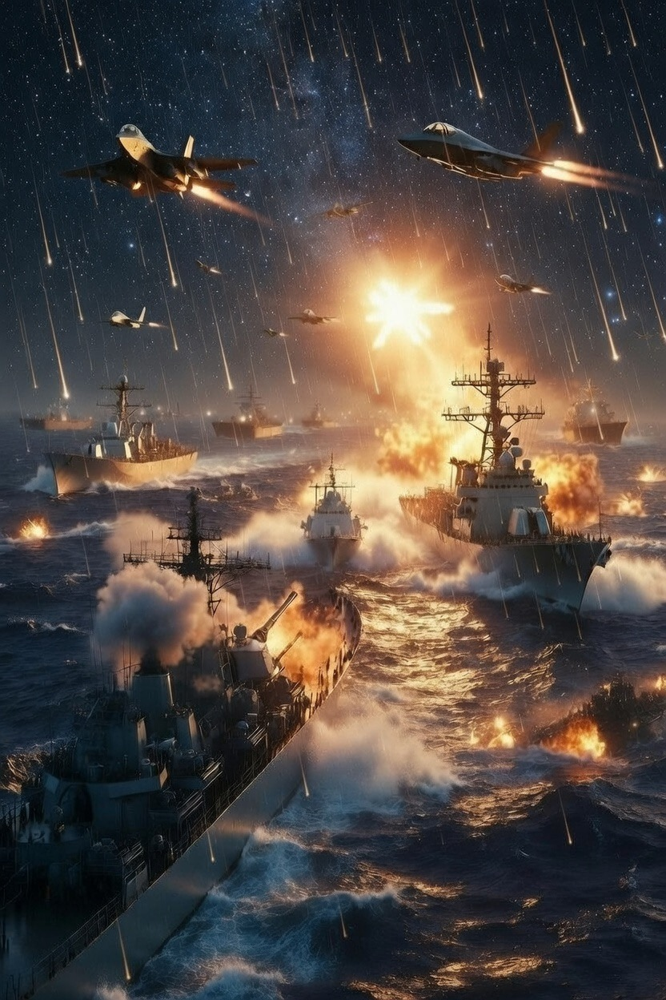

# Selat Hormuz di Ambang Perang Sistemik: Eskalasi Iran–AS–Israel dan Krisis Energi Global

*Ilustrasi konflik (pic: Grok AI).*

  
***Konflik tidak lagi sekadar pertarungan kekuatan, tetapi menjadi ujian terhadap stabilitas sistem global secara keseluruhan***
  

Artikel ini menganalisis eskalasi konflik Iran–Israel–Amerika Serikat pada Maret 2026 sebagai titik kritis menuju perang sistemik global. 

Dengan fokus pada ultimatum militer, militarisasi Selat Hormuz, serta eskalasi serangan lintas wilayah, penelitian ini menunjukkan bahwa konflik tidak lagi bersifat regional, melainkan telah memasuki dimensi struktural yang mengancam stabilitas ekonomi global. 

Menggunakan pendekatan geopolitical economy, security dilemma, dan systemic risk theory, studi ini berargumen bahwa interaksi antara strategi militer dan kepentingan energi global menciptakan kondisi di mana konflik lokal dapat memicu krisis sistem dunia.

## Pendahuluan

Konflik Iran–Israel–AS pada 2026 menunjukkan transformasi signifikan dari perang terbatas menuju eskalasi multidimensi. 

Ultimatum Amerika Serikat terhadap Iran terkait akses Selat Hormuz, serta respons balasan Iran terhadap infrastruktur energi regional, menandai perubahan dari konflik bilateral menjadi krisis global.

Pertanyaan utama:
bagaimana eskalasi konflik ini berpotensi mentransformasi ketegangan regional menjadi krisis sistemik global?

## Security Dilemma

Tindakan defensif satu negara:

•	dipersepsikan sebagai ancaman oleh pihak lain

•	memicu eskalasi berantai

## Geopolitical Economy

Energi sebagai:

•	instrumen kekuasaan

•	alat tekanan politik

•	fondasi stabilitas global

## Systemic Risk Theory

Gangguan pada node kritis (misalnya Selat Hormuz):

•	dapat memicu efek domino global

•	berdampak pada ekonomi dunia

## Dinamika Eskalasi Terkini

1. Ultimatum dan ancaman terbuka

Amerika Serikat mengeluarkan ultimatum kepada Iran terkait:

•	akses Selat Hormuz

•	ancaman penghancuran infrastruktur energi

Iran merespons dengan ancaman balasan regional berskala luas.

👉 menunjukkan pergeseran dari diplomasi ke coercive escalation

2. Selat Hormuz sebagai chokepoint global

Selat Hormuz:

•	mengalirkan ±20% minyak dunia

•	menjadi titik strategis utama

Militerisasi kawasan oleh AS:

•	pengerahan marinir

•	sistem udara dan laut

👉 mengubah jalur ekonomi menjadi zona militer aktif

3.Intensifikasi serangan lintas wilayah

Iran meningkatkan:

•	serangan drone jarak jauh

•	target strategis di Israel

👉 memperluas jangkauan konflik

👉 meningkatkan risiko eskalasi regional

4. Reaksi pasar global

Dampak langsung:

•	harga minyak melonjak

•	pasar saham turun

•	dolar menguat sebagai safe haven

👉 indikasi awal ketidakstabilan sistemik

## Analisis: Menuju Perang Sistemik

1. Integrasi konflik militer dan ekonomi

Konflik tidak lagi terbatas pada:

•	wilayah

•	aktor militer

Tetapi meluas ke:

•	sistem energi global

•	stabilitas ekonomi internasional

2. Eskalasi tanpa jalur keluar jelas

Karakteristik utama:

•	semua pihak meningkatkan tekanan

•	tidak ada de-eskalasi signifikan

•	risiko salah kalkulasi tinggi

3. Strategi “mutual vulnerability”

•	Iran mengancam jalur energi global

•	AS dan sekutu mengancam infrastruktur Iran

👉 menciptakan kondisi saling sandera

## Implikasi Global

1. Risiko resesi global

•	lonjakan harga energi

•	gangguan rantai pasok

2. Destabilisasi politik internasional

•	tekanan terhadap negara berkembang

•	meningkatnya ketegangan geopolitik

3. Normalisasi perang berkepanjangan

•	dunia mulai beradaptasi dengan konflik

•	risiko eskalasi jangka panjang meningkat

## Ilusi Kontrol dalam Eskalasi

Meskipun aktor utama tampak mengendalikan konflik, realitas menunjukkan eskalasi kompleks sering melampaui kontrol aktor itu sendiri.

Dengan demikian:

•	konflik menjadi semi-otonom

•	risiko meningkat secara eksponensial

Eskalasi Iran–Israel–AS pada Maret 2026 mencerminkan transformasi konflik regional menjadi ancaman sistemik global. 

Kombinasi antara militerisasi jalur energi, ancaman terbuka antarnegara, dan respons pasar menunjukkan bahwa dunia berada pada ambang krisis multidimensi. 

Dalam kondisi ini, konflik tidak lagi sekadar pertarungan kekuatan, tetapi menjadi ujian terhadap stabilitas sistem global secara keseluruhan.

  
**Referensi**

Reuters. (2026). Global markets react to Middle East escalation.

The Guardian. (2026). US ultimatum and Iran response analysis.

The Washington Post. (2026). Hormuz militarization and US deployment.

International Energy Agency. (2025). Global oil chokepoints report.
