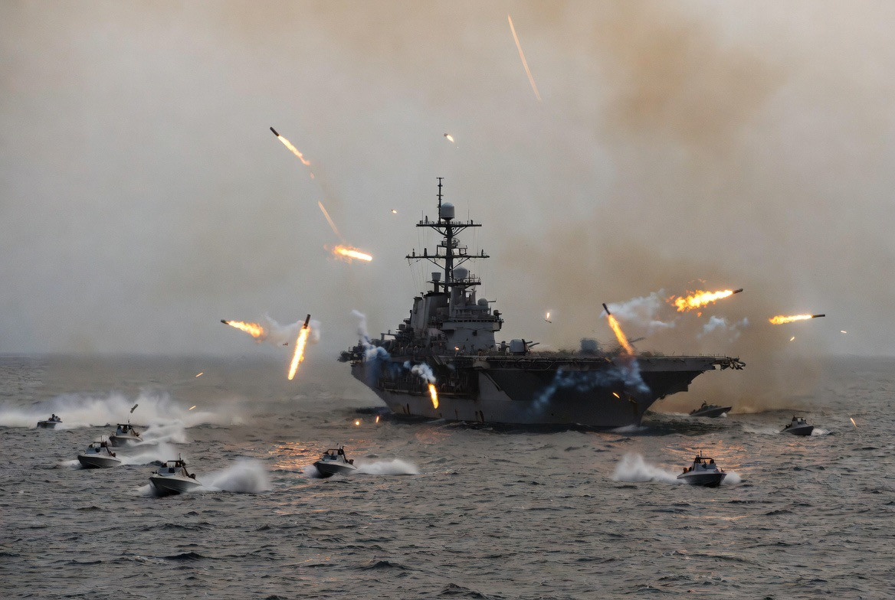

# Selat Hormuz, Sanksi Iran & Paradoks Barat: Ketika Dunia Menuntut Minyak Murah Sambil Mencekik Produsennya

*Ilustrasi  baku tembak AS-Iran di Selat Hormuz (pic: Grok AI).*

  
***Pencabutan sanksi lebih efektif daripada eskalasi militer, namun Barat takut pencabutan sanksi tanpa konsesi akan dianggap kemenangan strategi tekanan Iran***
  

Konflik terbaru antara Amerika Serikat dan Iran di Selat Hormuz pada Mei 2026 memperlihatkan paradoks geopolitik global: dunia membutuhkan stabilitas minyak Iran, namun pada saat yang sama tetap mempertahankan sanksi ekonomi yang menekan Iran secara struktural. 

Tulisan ini menganalisis hubungan antara blokade ekonomi, ancaman penutupan Selat Hormuz, volatilitas harga minyak, dan kontradiksi kebijakan Barat terhadap Iran.

## Pendahuluan

Pada 8 Mei 2026, ketegangan AS-Iran kembali memanas setelah terjadi baku tembak di sekitar Selat Hormuz, meskipun Presiden Donald Trump mengklaim gencatan senjata masih berlaku.  

Iran menuduh AS melanggar ceasefire melalui serangan terhadap kapal dan wilayah sipil, sementara AS menyatakan tindakannya defensif setelah kapal perang AS diserang drone dan misil Iran.  

Akibatnya:
harga minyak melonjak tajam,
pasar global berfluktuasi,
dan dunia kembali sadar:
satu selat sempit bisa mengguncang ekonomi planet.

## Mengapa Selat Hormuz Sangat Penting?

“Leher botol energi dunia”

Selat Hormuz adalah jalur utama ekspor minyak:
Iran,
Arab Saudi,
Irak,
Kuwait,
UAE,
Qatar.

Sekitar seperlima perdagangan minyak dunia melewati kawasan ini.

Karena itu, ancaman kecil di Hormuz sama dengan kepanikan global.

## Analisis Utama: Apakah akar masalahnya memang sanksi?

Jawaban singkatnya: sebagian besar… ya.

A. Perspektif Iran: “Kami Dicekik, Lalu Diminta Diam”

Iran selama puluhan tahun menghadapi:
embargo ekonomi,
pembatasan ekspor minyak,
pembekuan aset,
isolasi perbankan internasional.

Akibatnya:
inflasi tinggi,
mata uang melemah,
pengangguran meningkat,
kualitas hidup memburuk.

CIA bahkan menilai Iran masih bisa bertahan beberapa bulan meski diblokade berat, tapi dengan kerusakan ekonomi besar.  

Dari perspektif Iran, Hormuz adalah leverage terakhir mereka.

Logikanya sederhana:
Kalau Iran tidak boleh jual minyak dengan normal,
kenapa negara lain boleh bebas lewat jalur yang berada di dekat wilayah Iran?

B. Paradoks Barat

Di sinilah muncul kontradiksi besar. Barat ingin:
harga minyak stabil,
jalur perdagangan aman,
Iran tidak agresif.

Tapi pada saat yang sama:
Iran tetap disanksi,
ekspor dibatasi,
akses ekonomi dipersempit.

iIni seperti memaksa seseorang tetap tenang sambil leher ekonominya ditekan terus-menerus.

C. Perancis & Barat: Sanksi Iran Tetap Berlaku selama Hormuz Diblokade

Perspektif Perancis dan Barat yang percaya:
jika sanksi dicabut saat Iran memblokade Hormuz,
itu dianggap “reward for coercion”.
Artinya, dunia takut Iran belajar bahwa ancaman militer efektif menghasilkan konsesi ekonomi.

Karena itu Perancis dan sekutu Barat memilih:
tekanan ekonomi,
sambil berharap Iran menyerah secara diplomatik.

Tapi dari perspektif Iran melihatnya terbalik:

“Kami diblokade duluan, lalu saat melawan kami disebut agresif.”

Inilah spiral klasik:
satu pihak merasa menekan demi keamanan, 
pihak lain merasa bertahan demi kelangsungan hidup.

D. Apakah pengawalan kapal AS cuma pencitraan?

Sebagian memang punya dimensi:
geopolitik,
simbol kekuatan,
dan pesan domestik politik.

Namun secara strategis, AS memang ingin menunjukkan:
jalur energi global tidak boleh dikendalikan Iran,
AS tetap hegemon maritim dunia.

Operasi seperti “Project Freedom” dirancang untuk menjaga kapal tetap lewat Hormuz.  

Tetapi kritik muncul karena pengawalan militer justru bisa memperbesar risiko eskalasi.

E. Ceasefire yang “tetap berlaku sambil saling tembak”

Ini terdengar absurd… tapi cukup umum dalam geopolitik modern.

Fenomena ini disebut controlled escalation.
Artinya:
konflik tetap terjadi terbatas,
tapi kedua pihak berusaha menghindari perang total.

Makanya:
masih ada baku tembak,
tapi secara diplomatik tetap disebut “ceasefire”.

Reddit bahkan mengejek ini sebaga “ceasefire firefight”.  

## Perspektif Filosofis

Dunia ingin minyak murah… tanpa memberi ruang hidup bagi produsennya. Ini inti tragedinya.

Banyak negara:
bergantung pada minyak Timur Tengah,
tapi juga ingin mengontrol perilaku politik negara produsen.

Akibatnya, ekonomi global menjadi sistem ketergantungan yang penuh saling sandera.

Iran menyandera jalur minyak.

Barat menyandera ekonomi Iran.

Keduanya saling menekan sambil sama-sama berkata: “Kami hanya bertahan.”

Ketegangan Hormuz bukan sekadar soal kapal perang atau misil.

Ia adalah:
konflik antara keamanan dan kelangsungan ekonomi,
benturan antara hegemoni global dan kedaulatan regional,
serta bukti bahwa sanksi ekonomi sering gagal menyelesaikan akar konflik.

Analisis bahwa pencabutan sanksi mungkin lebih efektif daripada eskalasi militer bukan argumen bodoh. Bahkan banyak akademisi hubungan internasional juga memperdebatkan hal serupa.

Namun Barat takut, pencabutan sanksi tanpa konsesi Iran akan dianggap kemenangan strategi tekanan Iran.

Dan di antara semua itu…

harga minyak, rakyat sipil, dan stabilitas dunia ikut dipertaruhkan.

  
**Referensi**

Reuters. (2026). Trump says ceasefire still holds after Hormuz fighting.

The Guardian. (2026). US-Iran ceasefire under threat after exchange of strikes.

Council on Foreign Relations. (2026). Hormuz Standoff and Trump Ceasefire.

Washington Post. (2026). CIA assessment on Iran blockade resilience.

International Energy Agency Reports on Strait of Hormuz.
