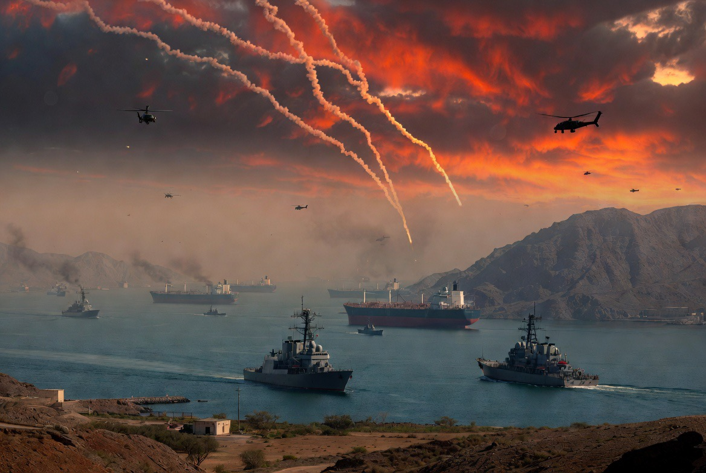

# Selat Hormuz: Kedaulatan Iran atau Jalur Dunia? Mengapa Amerika Serikat Ikut Campur?

*Ilustrasi (pic: Grok AI).*

  
***Perselisihan antara Iran dan AS bukan hanya soal kekuatan militer, tetapi juga perbedaan tafsir terhadap hukum laut internasional***
  

Tulisan ini bermula dari pertanyaan: Apakah Selat Hormuz milik Iran? Maka jawabannya: sebagian, bukan seluruhnya.

Selat Hormuz berada di antara Iran (utara) dan Oman (selatan). Pada titik tersempitnya (sekitar 21 mil laut), seluruh selat memang berada dalam laut teritorial Iran dan Oman, sehingga tidak ada “laut lepas” di tengahnya.  

Jadi kalau ada yang berkata “Hormuz sepenuhnya milik Iran.” Itu tidak tepat secara geografis maupun hukum.

Tetapi pertanyaannya: “Kenapa justru AS yang turut campur, bukankah Oman yang lebih  berhak ngamuk?”

Secara hukum, Oman memang aktor yang sangat relevan, namun secara geopolitik, jawabannya lebih rumit. Karena bagi AS, yang dipertaruhkan bukan hanya wilayah Oman, melainkan jalur energi, keamanan sekutu, dan keseimbangan kekuatan di kawasan. 

Itulah sebabnya, dalam politik global, siapa yang paling keras bersuara tidak selalu sama dengan siapa yang paling dekat dengan lokasi kejadian.

## Mengapa Iran Tidak Bebas Menutup atau Memajaki?

Nah… di sinilah hukum laut internasional menjadi rumit. Walaupun Iran memiliki kedaulatan atas laut teritorialnya, Selat Hormuz juga dikategorikan sebagai selat yang digunakan untuk pelayaran internasional (international strait).

Dalam rezim hukum laut modern, kapal-kapal berbagai negara memiliki hak transit passage, yaitu hak melintas secara terus-menerus tanpa dihambat. 

Banyak negara, termasuk AS dan negara-negara Eropa, menganggap prinsip ini telah menjadi bagian dari hukum kebiasaan internasional.  

Iran sendiri memiliki pandangan hukum yang berbeda dan berpendapat bahwa kewenangan negara pantai lebih besar daripada yang diakui oleh AS. Perbedaan tafsir inilah yang terus memicu sengketa.  

## Mengapa Amerika Serikat Begitu Repot?

Di sinilah geopolitik berbicara, sebab sekitar seperlima perdagangan minyak dunia melewati Selat Hormuz.

Kalau jalur ini terganggu, maka harga minyak melonjak, biaya transportasi naik, inflasi global terdorong, serta ekonomi banyak negara ikut terdampak.

Jadi, dari sudut pandang Washington, ini bukan hanya soal Iran. Ini juga soal stabilitas perdagangan global dan kepentingan ekonomi sekutu-sekutunya.  

Tentu saja, banyak pihak mengkritik bahwa AS juga memiliki kepentingan strategisnya sendiri di kawasan, sehingga kebijakannya tidak dapat dipandang semata-mata sebagai tindakan altruistik.

## Kalau Iran Menyerang Kapal Dagang, Apakah AS Boleh Membalas?

Secara hukum internasional, jawabannya tidak otomatis.

Kalau sebuah kapal dagang diserang, respons yang sah bergantung pada banyak faktor, diantaranya adalah siapa pelakunya, apakah serangan itu dapat diatribusikan kepada suatu negara, apakah merupakan serangan bersenjata menurut hukum internasional, dan apakah responsnya memenuhi prinsip necessity(keharusan) dan proportionality (proporsionalitas).

Karena itu, legalitas serangan balasan selalu menjadi bahan perdebatan di kalangan ahli hukum internasional.

## Analisis

Konflik Hormuz bukan sekadar perebutan laut, ia adalah benturan dua cara memandang dunia.

Pandangan Iran: “Ini laut kami. Kedaulatan kami harus dihormati.”

Pandangan AS dan banyak negara maritim: “Ini jalur perdagangan internasional. Tidak boleh ada satu negara yang bisa menghambat lalu lintas dunia.”

Dua logika itu sama-sama memiliki dasar argumen hukum dan politik. Masalahnya, ketika keduanya bertemu di laut yang sama, maka yang berbicara bukan hanya pasal-pasal hukum, tetapi juga kapal perang.

## Mental Penjajah dan Pemenang Perang Dunia?

Kalimat ini mencerminkan kritik yang memang sering muncul dalam kajian hubungan internasional, khususnya dari perspektif postcolonial studies dan sebagian pemikir Global South.

Mereka berargumen bahwa negara-negara besar kadang menggunakan istilah seperti kebebasan navigasi, keamanan internasional, dan stabilitas global, untuk membenarkan kehadiran militernya jauh dari wilayahnya sendiri.

Sebaliknya, para pendukung kebijakan tersebut berargumen bahwa tanpa perlindungan terhadap jalur pelayaran internasional, perdagangan dunia akan lebih rentan terhadap tekanan dari negara mana pun yang menguasai titik-titik strategis.

Perdebatan ini belum memiliki jawaban tunggal yang diterima semua pihak.

Iran memang memiliki kedaulatan atas bagian laut teritorialnya di Selat Hormuz, demikian juga Oman memiliki kedaulatan atas bagian lainnya. Namun Selat Hormuz memiliki status khusus sebagai jalur pelayaran internasional, sehingga hak negara pantai dibatasi oleh aturan mengenai lintas transit menurut banyak penafsiran hukum internasional.

Perselisihan antara Iran dan AS bukan hanya soal kekuatan militer, tetapi juga perbedaan tafsir terhadap hukum laut internasional, ditambah kepentingan ekonomi, energi, dan keamanan global.

Itulah sebabnya Hormuz bukan sekadar selat sempit di peta. Ia adalah tempat di mana kedaulatan nasional dan kepentingan internasional bertabrakan setiap hari. 

  
**Referensi**

Chatham House. (2026). The Strait of Hormuz, Shipping, and Law.  

Council of the European Union. (2026). Freedom of Navigation in the Strait of Hormuz.  

Leiden University. (2026). No Ordinary Sea: Who Governs the Strait of Hormuz?  

United Nations. (1982). United Nations Convention on the Law of the Sea.
