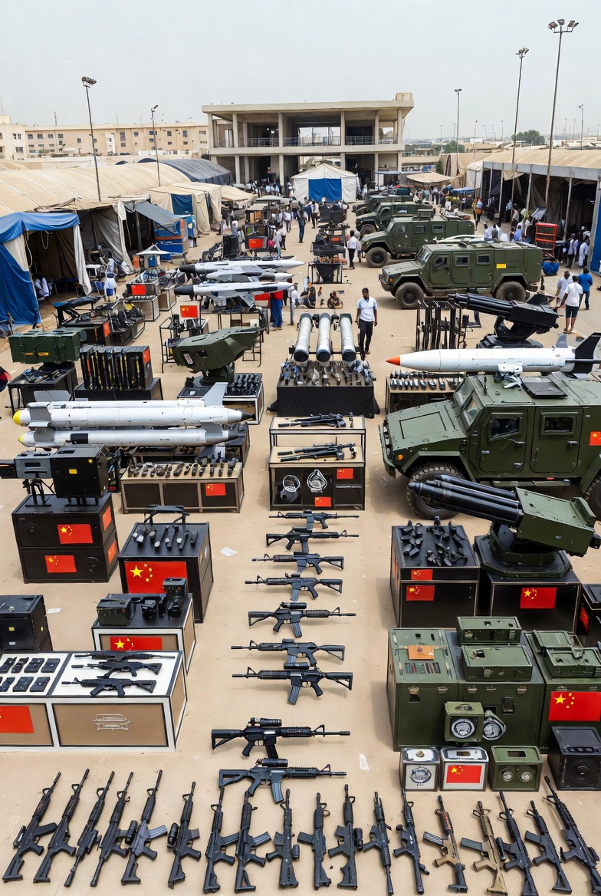

# China dan Re-Konfigurasi Pasar Senjata Afrika Barat: Kekosongan Kekuasaan Pasca-Perancis dan Kompetisi Hegemoni Abad ke-21

*Ilustrasi transaksi penjualan senjata (pic: Grok AI).*

  
***Geopolitik jarang bergerak dengan suara keras. Kadang ia hanya terdengar seperti bunyi pena yang menandatangani kontrak. Dan kontrak senjata sering lebih menentukan masa depan daripada pidato perdamaian***
  

Mundurnya pengaruh militer Perancis di Afrika Barat, disertai distraksi strategis Rusia membuka ruang bagi China untuk memperluas ekspor senjata dan pengaruh keamanan. 

Artikel ini menganalisis fenomena tersebut dalam kerangka realisme struktural, ekonomi politik persenjataan, dan strategi great power competition.

## Pendahuluan

Afrika Barat selama beberapa dekade merupakan zona pengaruh tradisional Perancis, terutama di wilayah Sahel. 

Namun dalam beberapa tahun terakhir:

•	kudeta militer meningkat

•	sentimen anti-Perancis menguat

•	operasi militer Perancis ditarik atau dipaksa mundur

Sementara Rusia, yang sempat masuk melalui jaringan keamanan dan kontraktor militer, kini terfokus pada konflik di Eropa Timur dan tekanan domestik.

Di ruang kosong itu, China masuk. Bukan dengan pasukan. Dengan kontrak.

## Realisme Struktural: Kekosongan Tidak Pernah Kosong

Dalam teori Kenneth Waltz, sistem internasional bersifat anarkis. Ketika satu kekuatan melemah, yang lain mengisi.

Mundurnya Perancis berarti:

•	berkurangnya dukungan militer langsung

•	berkurangnya pelatihan dan logistik

•	terbukanya kebutuhan persenjataan alternatif

China menawarkan:

•	harga lebih murah

•	tanpa syarat politik eksplisit soal HAM

•	pembiayaan fleksibel

Di dunia yang lelah dengan kuliah moral Barat, tawaran itu terdengar praktis.

## Ekonomi Politik Senjata: Senjata sebagai Diplomasi

Ekspor senjata bukan sekadar transaksi.

Ia menciptakan:

•	ketergantungan suku cadang

•	ketergantungan pelatihan

•	ketergantungan teknologi

Ketika negara membeli sistem radar atau kendaraan tempur dari China, ia tidak hanya membeli barang. Ia membeli ekosistem teknis dan hubungan jangka panjang.

Ini disebut security dependency chain.

Senjata adalah duta besar yang tidak pernah tidur.

## Mengapa Perancis Mundur?

Penarikan Perancis dari beberapa negara Sahel dipicu oleh:

•	resistensi publik terhadap warisan kolonial

•	kegagalan mengendalikan kelompok militan

•	perubahan dinamika politik domestik Afrika

Dalam politik internasional, legitimasi sering lebih penting daripada kekuatan militer.

Jika kehadiran dianggap neo-kolonial, maka bahkan operasi kontraterorisme bisa kehilangan dukungan lokal.

## Rusia Sibuk, China Sistematis

Rusia sebelumnya memperluas pengaruh lewat:

•	kontraktor militer swasta

•	perjanjian keamanan bilateral

Namun fokus konflik besar mengurangi bandwidth geopolitiknya.

China berbeda pendekatan:

•	tidak mengirim tentara

•	fokus pada perdagangan dan infrastruktur

•	lalu menambahkan kerja sama keamanan

Pendekatannya lebih lambat, tapi lebih terintegrasi.

## Implikasi Global

Dominasi China di pasar senjata Afrika Barat berpotensi:

•	mengurangi pengaruh NATO di kawasan

•	memperkuat posisi China di PBB melalui dukungan diplomatik

•	memperluas jalur logistik Belt and Road

•	menciptakan poros keamanan alternatif

Afrika Barat menjadi papan catur multipolar.

## Risiko bagi Afrika Barat

Ketergantungan pada satu pemasok senjata bisa:

•	mengurangi otonomi kebijakan

•	menciptakan risiko embargo masa depan

•	memperkuat rezim militer tanpa reformasi politik

Dalam sejarah, pasar senjata jarang netral terhadap dinamika demokrasi.

Perancis mundur bukan akhir cerita. Itu jeda.

Rusia sibuk bukan berarti hilang. Itu penyesuaian.

China tidak sekadar menjual senjata.
China sedang menanam pengaruh jangka panjang.

Di politik global, kekosongan kekuasaan itu seperti lubang di tanah basah. Jika tidak diisi oleh satu pihak, pihak lain akan menancapkan bendera.

Geopolitik jarang bergerak dengan suara keras. Kadang ia hanya terdengar seperti bunyi pena yang menandatangani kontrak. Dan kontrak senjata sering lebih menentukan masa depan daripada pidato perdamaian.

Dan Afrika Barat kini menjadi salah satu laboratorium utama kompetisi kekuatan abad ke-21.

  
**Referensi**

Buzan, B., & Wæver, O. (2003). Regions and Powers. Cambridge University Press.

SIPRI. (2023). Trends in International Arms Transfers. Stockholm International Peace Research Institute.

Waltz, K. N. (1979). Theory of International Politics. McGraw-Hill.

Brautigam, D. (2009). The Dragon’s Gift: The Real Story of China in Africa. Oxford University Press.

Tickner, A. B., & Waever, O. (2009). International Relations Scholarship Around the World. Routledge.
