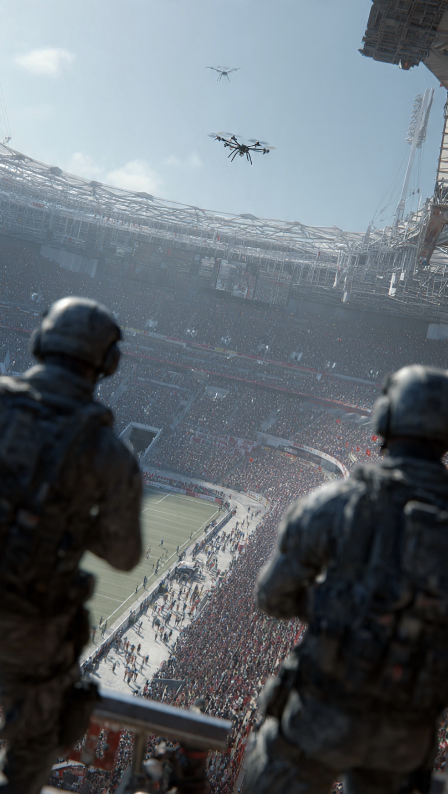

# Sepak Bola di Bawah Bayang-Bayang Drone: Mengapa World Cup 2026 Dipersiapkan Seperti Operasi Militer?

*Ilustrasi (pic: Grok AI).*

  
***Dulu orang takut striker lawan bikin gol, sekarang FBI takut orang iseng bawa drone ke stadion***
  

Dahulu ancaman Piala Dunia adalah hooligan, pencopet, dan flare dan kerusuhan tribun.

Sekarang tahun 2026 ancamannya berubah menjadi drone bersenjata, serangan siber, lone wolf terrorist, dan…ketegangan geopolitik global yang bisa meledak kapan saja.

Karena itu FBI sampai menyebut World Cup 2026 sebagai salah satu operasi keamanan paling kompleks dalam sejarah Amerika Serikat.  

## Mengapa FBI Sangat Khawatir dengan Drone?

Karena drone hari ini bukan lagi mainan. Drone seharga beberapa juta rupiah saja bisa membawa bahan peledak, mengintai lokasi, mengganggu penerbangan, menyerang kerumunan, atau sekadar menciptakan kepanikan massal.  

Dan yang membuat aparat pusing, drone bisa dikendalikan dari jauh. Operatornya bisa berada di gedung, di parkiran, atau nongkrong di Starbucks sambil pura-pura nonton pertandingan.

Karena itu FBI menerapkan NO DRONE ZONE. Area larangan terbang hingga beberapa kilometer di sekitar stadion dan fan zone.

Bahkan pelanggar bisa didenda sampai USD 100.000, dipenjara, lalu dronenya disita.  

## Mengapa Lone Wolf Lebih Ditakuti daripada Organisasi Teroris?

Nah ini menarik.

Dulu aparat lebih fokus ke ISIS, Al-Qaeda, dan kelompok terorganisasi. Sekarang? Mereka justru lebih takut pada satu orang.

Seseorang yang radikal lewat internet, membeli senjata sendiri, merakit bom sederhana, lalu menyerang tanpa memberi sinyal besar sebelumnya. Ini yang disebut Lone Wolf Attack.

Dan menurut analisis keamanan dari Center for Strategic and International Studies, ancaman paling realistis terhadap World Cup 2026 justru berasal dari pelaku tunggal atau kelompok kecil yang menyerang target lunak, seperti antrean stadion, hotel, stasiun, fan zone, serta restoran sekitar stadion.  

## Mengapa Ketegangan Geopolitik Membuat Semua Makin Tegang?

Karena World Cup bukan cuma turnamen. Ia adalah panggung dunia.

Bayangkan 48 negara, 104 pertandingan, sekitar 3 juta pengunjung, ratusan lembaga keamanan, dan mungkin kepala negara, pejabat tinggi, selebritas, serta sponsor global.

Kalau ada pihak yang ingin menyampaikan pesan politik, menciptakan ketakutan, atau mempermalukan negara tuan rumah, World Cup adalah panggung yang sempurna.

## Iran, Rusia, China, dan Dunia yang Sedang Tegang

FBI secara terbuka menyebut bahwa mereka mengawasi ancaman dari Iran, Rusia, China, ataupun Korea Utara, baik berupa spionase, serangan siber, propaganda, maupun operasi pengaruh.  

Apalagi saat ini dunia sedang mengalami konflik Iran-Israel, perang Rusia-Ukraina, ketegangan Laut China Selatan, rivalitas AS-China.

Maka World Cup menjadi seperti: festival sepak bola… yang digelar di tengah dunia yang sedang mudah tersulut.

Mari kita renungkan. Piala Dunia diciptakan untuk menyatukan bangsa, merayakan olahraga, mempererat hubungan antarnegara.

Tetapi hari ini, penyelenggara harus memikirkan drone bunuh diri, serangan hacker, lone wolf, ditambah ancaman geopolitik.

Artinya apa?

Artinya teknologi telah mendemokratisasi ancaman.

Dulu hanya negara yang bisa menimbulkan kekacauan besar. Sekarang? satu orang, satu laptop, satu drone, kadang sudah cukup membuat aparat seluruh negara tidak bisa tidur.

## Apakah FBI Berlebihan?

Tidak.

Karena sejarah sudah mengajarkan, acara besar sering menjadi target Munich massacre, serangan di berbagai konser musik, bom maraton, dan berbagai aksi lone actor di Eropa maupun Amerika.

Karena itu, FBI menganggap mencegah serangan yang tidak terjadi lebih baik daripada menjelaskan mengapa serangan itu bisa terjadi.

Mengapa FBI dan penyelenggara World Cup 2026 sangat khawatir? Karena drone semakin murah dan sulit dicegah, lone wolf semakin sulit dideteksi., ketegangan geopolitik global sedang tinggi, dan World Cup adalah panggung internasional dengan dampak simbolik luar biasa.

Jadi World Cup 2026 bukan hanya 78 pertandingan sepak bola di Amerika. Tetapi juga ujian terbesar keamanan abad ke-21, di mana aparat harus menjaga jutaan orang …sambil mengantisipasi ancaman yang bisa datang dari langit, dari internet, atau dari satu orang yang tak dikenal.  

Dulu orang takut striker lawan bikin gol, sekarang FBI takut orang iseng bawa drone ke stadion.

Dan itulah ironi abad ke-21, teknologi membuat sepak bola makin canggih… sekaligus membuat rasa cemas ikut naik kelas. 

  
**Referensi**

Reuters. (2026, June 11). Kash Patel on the FBI’s defining test: securing the World Cup.  

Reuters. (2026, June 10). World Cup security planners race to counter drone risks.  

FBI Boston. (2026, June 11). FBI Boston Warns Drone Operators of Temporary Flight Restrictions During FIFA World Cup 2026.  

FBI Dallas. (2026, May 28). FBI Dallas Warns Drone Operators of Temporary Flight Restrictions During FIFA World Cup 2026.  

CSIS. (2026, May 27). The Terrorist Threat to the 2026 World Cup.  
