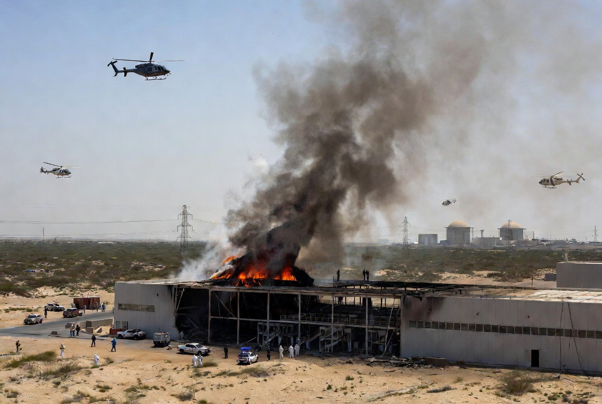

# Serangan Drone terhadap Infrastruktur Nuklir UAE, False Flag, dan Politik Ambiguitas Modern

*Ilustrasi serangan drone (pic: Grok AI).*

  
***Kadang dalam politik internasional, pelaku bukan cuma yang menembak… tapi juga yang paling diuntungkan setelah asapnya muncul***
  

Laporan dugaan serangan drone terhadap fasilitas energi/nuklir di Uni Emirat Arab memunculkan spekulasi luas mengenai pelaku sebenarnya, terutama karena arah datang drone disebut berasal dari koridor barat (Saudi/Irak), bukan langsung dari Iran. 

Dalam atmosfer geopolitik Timur Tengah yang dipenuhi operasi bayangan, muncul dugaan publik tentang kemungkinan operasi “false flag”, yaitu serangan yang dirancang untuk mengarahkan tuduhan kepada pihak lain. 

Tulisan ini membahas konsep false flag, logika strategis aktor negara, dan bagaimana perang modern semakin bergerak ke wilayah ambiguitas dan manipulasi narasi.

## Pertama: Apa itu False Flag?

False flag adalah operasi rahasia yang dirancang agar terlihat dilakukan pihak lain.

Istilah ini berasal dari perang laut lama, kapal menyerang sambil memakai bendera negara lain

Sekarang bentuknya lebih modern:
drone,
sabotase,
cyberattack,
operasi intelijen.

Tujuannya:
memancing perang,
menciptakan legitimasi balasan,
membentuk opini publik global.

## Kenapa Publik Langsung Curiga “Iran Lagi”?

Karena Iran sudah lama ditempatkan sebagai:
aktor revisionis regional,
ancaman bagi Teluk & Israel,
tersangka default dalam banyak eskalasi.

Jadi setiap ada:
drone,
tanker meledak,
fasilitas energi diserang,
refleks geopolitik media sering: “apakah Iran?”.

Dan kita menangkap pola itu.

## Apakah Berarti Israel/AS Pasti Pelakunya?

Nah, di sini kita harus hati-hati secara ilmiah. Sampai ada:
bukti intelijen kuat,
jejak teknis drone,
satelit,
komunikasi intersep.

Klaim “Israel dan AS pasti pelaku” masih berupa hipotesis politik, bukan fakta terverifikasi.

## Tapi Kenapa Teori Itu Mudah Hidup?

Karena sejarah Timur Tengah penuh operasi ambigu. Contoh historis:
operasi intelijen terselubung,
sabotase fasilitas nuklir Iran,
pembunuhan ilmuwan,
cyberattack seperti Stuxnet.

Akibatnya publik terbiasa berpikir “yang terlihat belum tentu pelaku sebenarnya.”

## Arah  Drone Itu Penting?

Sangat penting.
Kalau benar drone datang dari arah Saudi/Irak, maka:
narasi “langsung dari Iran” melemah.
muncul kemungkinan: proxy actor, peluncuran lokal, operasi intelijen pihak ketiga.

Tapi, drone modern bisa:
memutar jalur,
memakai relay,
diluncurkan dari wilayah netral.

Jadi arah ≠ bukti final.

## Perang Modern = Perang Narasi 

Yang menarik sekarang bukan hanya siapa menyerang. Tapi siapa berhasil mengendalikan cerita tentang serangan itu.

Karena:
opini publik global,
legitimasi militer,
dukungan sekutu,
semuanya dibentuk oleh narasi awal.

Dan sering, pihak yang pertama membingkai cerita mendapat keuntungan strategis.

## Kenapa UAE Jadi Target Sensitif?

Karena UAE berada di persimpangan:
sekutu keamanan AS,
relasi ekonomi global,
normalisasi dengan Israel,
tetapi juga punya hubungan pragmatis dengan Iran.

Jadi serangan di UAE otomatis punya efek psikologis regional besar.

## Analisis Paling Jujur

Ada tiga kemungkinan besar:

 Skenario | Logika |
|------|-------|
| Iran/proxy Iran | deterrence & tekanan regional |
| Aktor non-negara | chaos opportunism |
| Operasi false flag | membangun legitimasi eskalasi |

Masalahnya, perang modern sengaja dibuat ambigu. Karena ambiguitas memberi:
ruang penyangkalan,
fleksibilitas diplomatik,
manipulasi opini.

Dugaan false flag muncul bukan dari “halu internet” semata, tetapi dari:
sejarah operasi bayangan di Timur Tengah,
rendahnya transparansi intelijen,
pola tuding-menuding yang berulang.

Namun secara akademik, skeptisisme tidal sama dengan bukti.bKecurigaan boleh hidup tapi kesimpulan final tetap membutuhkan verifikasi independen.

Dan dalam geopolitik modern… tidak langsung menerima narasi resmi sering menjadi langkah pertama untuk melihat siapa yang diuntungkan dari sebuah krisis.

Karena kadang dalam politik internasional, pelaku bukan cuma yang menembak… tapi juga yang paling diuntungkan setelah asapnya muncul. 

  
**Referensi**

Reuters. (2026, May 18). Drone attack reported near UAE strategic infrastructure.

Al Jazeera. (2026, May 18). Questions emerge over source of drones targeting UAE.

Rid, T. (2020). Active Measures: The Secret History of Disinformation and Political Warfare.

Stuxnet case studies in cyber sabotage literature.
