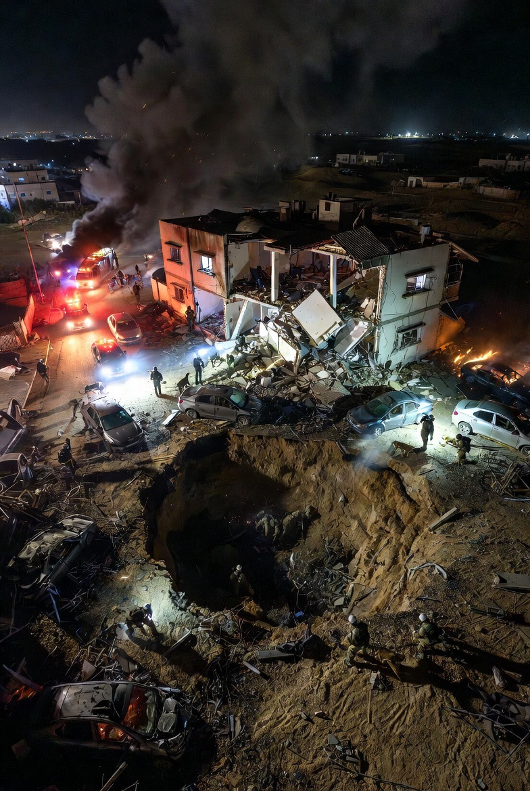

# Serangan Simbolik dalam Konflik Modern: Eskalasi Iran–Israel sebagai Perang Narasi dan Demonstrasi Kekuasaan (2026)

*Ilustrasi dampak serangan rudal Iran (pic: Grok AI).*

  
***Analisis Strategic Signaling, Psychological Warfare, dan Target Simbolik dalam Konflik Asimetris***
  

Artikel ini menganalisis eskalasi serangan simbolik dalam konflik Iran–Israel 2026 sebagai bentuk strategic signaling dalam perang modern. 

Dengan menggunakan pendekatan psychological warfare, symbolic targeting, dan asymmetric conflict theory, penelitian ini menunjukkan bahwa serangan tidak lagi semata bertujuan militer, tetapi juga dirancang untuk menghasilkan efek psikologis, politik, dan naratif. 

Studi ini menemukan bahwa kedua pihak secara aktif menargetkan simbol kekuasaan, infrastruktur strategis, dan ruang publik untuk membentuk persepsi global serta memperkuat legitimasi domestik.

## Pendahuluan

Serangan simbolik makin dalam. Karena sekarang… yang diserang bukan cuma target, tapi cara dunia memahami siapa yang kuat.

Dan di titik itu… perang tidak lagi sekadar menghancurkan. Ia mulai berbicara.

Konflik Iran–Israel 2026 memperlihatkan pergeseran penting dalam karakter perang modern:

👉 dari penghancuran total

👉 menuju demonstrasi kekuatan simbolik

Contoh terbaru:

•	serangan Israel ke jalur logistik Iran di Laut Kaspia

•	serangan Iran ke target strategis bernilai simbolik tinggi

Pertanyaan utama:
mengapa aktor negara memilih target simbolik dibanding target militer murni?

## Strategic Signaling

Serangan digunakan untuk:

•	mengirim pesan politik

•	menunjukkan kapasitas militer

•	mempengaruhi perilaku lawan

## Psychological Warfare

Tujuan utama:

•	menciptakan ketakutan

•	merusak rasa aman

•	membentuk persepsi publik

## Symbolic Targeting

Target dipilih bukan hanya karena nilai militer, tetapi:

•	nilai simbolik

•	dampak psikologis

•	resonansi media

## Bukti Empiris: Serangan Simbolik yang Meningkat

1. Serangan terhadap infrastruktur strategis

Israel menyerang:
•	pelabuhan Bandar Anzali (jalur logistik Iran–Rusia)

👉 bukan sekadar target militer

👉 tapi simbol koneksi geopolitik Iran

2. Serangan lintas wilayah dengan pesan global

Iran meningkatkan:

•	operasi lintas batas

•	serangan terhadap target bernilai simbolik tinggi

👉 termasuk pola serangan “intimidatif” terhadap target identitas

3.Eskalasi sebagai komunikasi, bukan hanya destruksi

Iran menegaskan posisi keras dalam negosiasi:

•	menolak tekanan

•	menuntut konsesi besar

👉 menunjukkan bahwa serangan = alat tawar

## Analisis

1. Perang sebagai komunikasi strategis

Serangan simbolik berfungsi sebagai:

•	“bahasa militer”

•	pesan tanpa diplomasi formal

2. Target simbolik = dampak maksimal, biaya terbatas

Dibanding perang total:

•	lebih hemat sumber daya

•	lebih efektif secara psikologis

3. Produksi ketakutan dan legitimasi

Efek utama:

•	publik lawan merasa rentan

•	publik domestik merasa kuat

👉 kombinasi ini memperkuat posisi politik

4. Ambiguitas informasi sebagai bagian strategi

Konflik ini ditandai oleh:

•	pembatasan informasi

•	klaim yang sulit diverifikasi

👉 membuat persepsi menjadi medan perang kedua

## Dari Perang Fisik ke Perang Makna

Temuan utama:

yang dihancurkan bukan hanya objek, tapi juga rasa aman dan narasi.

Dalam konteks ini:

•	bandara = simbol mobilitas

•	pelabuhan = simbol koneksi global

•	kota = simbol stabilitas

## Implikasi

1. Eskalasi tanpa batas jelas

•	sulit dikontrol

•	mudah melebar

2. Normalisasi perang simbolik

•	konflik menjadi lebih sering

•	lebih sulit diselesaikan

3. Risiko salah tafsir

•	pesan bisa disalahartikan

•	memicu eskalasi lebih besar

Eskalasi Iran–Israel 2026 menunjukkan bahwa perang modern tidak lagi hanya tentang kemenangan militer, tetapi tentang kontrol narasi dan persepsi. 

Serangan simbolik menjadi alat utama dalam komunikasi strategis, di mana setiap target memiliki makna politik yang lebih luas. 

Dalam kondisi ini, konflik menjadi semakin kompleks, karena yang dipertaruhkan bukan hanya wilayah, tetapi juga legitimasi, identitas, dan dominasi naratif global.

  
**Referensi**

Reuters. (2026). Iran hardens negotiation stance amid conflict.  

The Guardian. (2026). Iran-linked symbolic attacks in Europe.  

The Wall Street Journal. (2026). Israel strikes Iranian logistics route in Caspian Sea.  

Maxthon Research. (2026). Israel–Iran war escalation analysis.  
