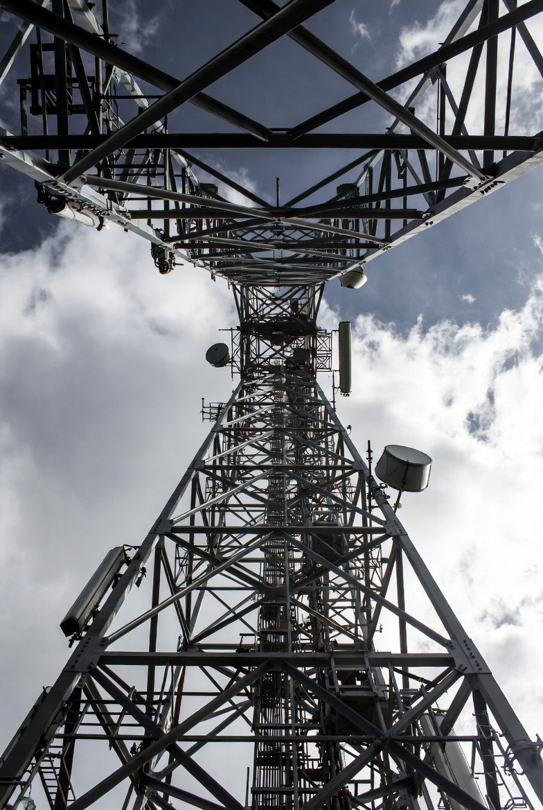

# Sinyal Melemah Saat Listrik Padam? Di Balik Kekuatan Jaringan Telkomsel & Batas Teknologi BTS

*Ilustrasi (pic: Grok AI).*

  
***Ibarat oksigen, listrik bagi operator seluler sangat vital. Jika listrik sering padam, maka operator seluler seperti Telkomsel menjadi megap-megap***
  

Telkomsel dikenal sebagai operator seluler dengan cakupan jaringan terluas di Indonesia. Namun dalam beberapa kejadian pemadaman listrik, pengguna tetap mengalami sinyal melemah, internet melambat, bahkan layanan terputus. 

Fenomena ini menimbulkan pertanyaan: mengapa operator dengan infrastruktur terbesar tetap terdampak? 

Jawabannya terletak pada hubungan antara kelistrikan, kapasitas baterai BTS, sistem transmisi (backhaul), kepadatan trafik, dan ketahanan infrastruktur telekomunikasi.

# BTS Tidak Memproduksi Listrik

Banyak orang mengira menara BTS adalah “pemancar mandiri.” Padahal BTS hanyalah perangkat elektronik yang membutuhkan pasokan listrik terus-menerus.

Di dalam satu BTS terdapat radio pemancar, antena, komputer pengendali, pendingin, router, serta perangkat transmisi. Semuanya memerlukan daya listrik.

Kalau PLN padam, BTS tidak otomatis mati karena masih ada…

# Baterai Cadangan

Sebagian besar BTS memiliki baterai cadangan (backup battery), yang berfungsi memberi tenaga ketika listrik PLN terputus.

Masalahnya, kapasitas baterai tidak tanpa batas. Umumnya dirancang untuk mempertahankan operasi selama beberapa jam, tergantung desain lokasi, konsumsi daya, dan konfigurasi jaringan. 

Untuk lokasi yang sangat penting, operator dapat menambahkan genset atau sistem daya yang lebih besar. Artinya kalau pemadaman berlangsung lama, baterai mulai habis. Akibatnya BTS berhenti bekerja.

# Mengapa Sinyal Lemah Padahal Menara Lain Masih Hidup?

Inilah yang paling sering terjadi.

Misalnya, biasanya ada 10 BTS. Ketika listrik padam, 4 BTS mati. Maka 6 BTS yang tersisa harus melayani pelanggan dari seluruh wilayah.

Akibatnya, antrean data meningkat, kecepatan internet turun, panggilan lebih sulit tersambung, dan sinyal terlihat penuh tetapi koneksi lambat.

Jadi masalahnya bukan selalu “tidak ada sinyal”. Melainkan kapasitas jaringan menjadi kewalahan.

# Backhaul Juga Bisa Terganggu

BTS bukan bekerja sendirian. Ia harus terhubung ke jaringan utama melalui serat optik, radio microwave, atau media transmisi lainnya.

Kalau perangkat transmisi ini ikut kehilangan daya, maka BTS masih bisa menyala tetapi kehilangan “jalan keluar” menuju jaringan inti.

Ibarat telepon rumah yang masih hidup, tetapi kabel ke sentral putus.

# Mengapa Telkomsel Tetap Terdampak?

Operator terbesar justru sering memikul beban terbesar. Saat operator lain kehilangan BTS, banyak ponsel otomatis mencari sinyal yang masih tersedia.

Sering kali yang tersisa adalah Telkomsel. Akibatnya, jutaan pelanggan terkonsentrasi pada BTS yang masih aktif.

Beban jaringan melonjak. Ini dapat menyebabkan penurunan kualitas layanan meskipun infrastrukturnya masih beroperasi.

# Mengapa Tidak Semua BTS Dipasang Genset?

Ini menyangkut ekonomi dan logistik. Indonesia memiliki puluhan ribu BTS yang tersebar dari kota besar hingga pulau-pulau terpencil.

Memasang genset permanen di setiap lokasi berarti: biaya investasi tinggi, perawatan rutin, pasokan bahan bakar, keamanan peralatan, dan kebutuhan teknisi.

Karena itu, operator biasanya memprioritaskan lokasi-lokasi strategis seperti pusat kota, rumah sakit, jalur transportasi utama, atau BTS yang melayani wilayah dengan trafik sangat tinggi.

Ada satu ironi teknologi. Orang berkata: “Telkomsel paling kuat. Kalimat itu benar, tetapi hanya selama ekosistem pendukungnya ikut bekerja.

Kekuatan operator bukan hanya soal jumlah menara. Melainkan juga listrik, baterai, serat optik, pusat data, perangkat transmisi, hingga teknisi yang siap bergerak saat terjadi gangguan.

Bayangkan jaringan seluler seperti sistem peredaran darah, maka menara BTS adalah kapiler, serat optik adalah pembuluh darah, pusat data adalah jantung, dan listrik adalah oksigen.

Kalau oksigen berhenti mengalir, maka jantung yang paling kuat sekalipun tidak bisa memompa darah tanpa batas.

Itulah sebabnya dalam ilmu rekayasa jaringan, tidak ada istilah 100% tahan gangguan. Yang ada adalah seberapa cepat sistem mampu bertahan, beradaptasi, dan pulih setelah gangguan terjadi.

Telkomsel tetap bisa melemah saat listrik padam bukan karena jaringannya lemah, melainkan karena jaringan telekomunikasi modern adalah sistem yang bergantung pada banyak komponen yang saling terkait. 

Semakin luas jaringannya, semakin besar pula tantangan untuk menjaga seluruh komponennya tetap berfungsi ketika infrastruktur dasar, terutama pasokan listrik, mengalami gangguan.

Ibarat oksigen, listrik bagi operator seluler sangat vital. Jika listrik sering padam, maka operator seluler seperti Telkomsel menjadi megap-megap.

Semakin banyak pelanggan yang mempercayai sebuah jaringan, semakin berat pula beban jaringan itu ketika keadaan darurat datang. 

Kadang, justru “yang paling kuat” terlihat paling kewalahan karena ia sedang menopang paling banyak orang pada saat yang sama.

Secara teknis memang wajar BTS membutuhkan listrik. Yang menjadi pertanyaan publik adalah: apakah investasi pada ketahanan daya cadangan sudah sebanding dengan posisi Telkomsel sebagai operator terbesar di Indonesia?.

  
**Referensi**

Telkomsel. (2024). Network Infrastructure Overview.

3rd Generation Partnership Project. (2023). Technical Specifications for LTE and 5G Networks.

International Telecommunication Union. (2023). ICT Infrastructure Resilience Guidelines.

GSM Association. (2024). Mobile Network Resilience Report.

Institute of Electrical and Electronics Engineers. (2022). Wireless Communications and Network Reliability.
