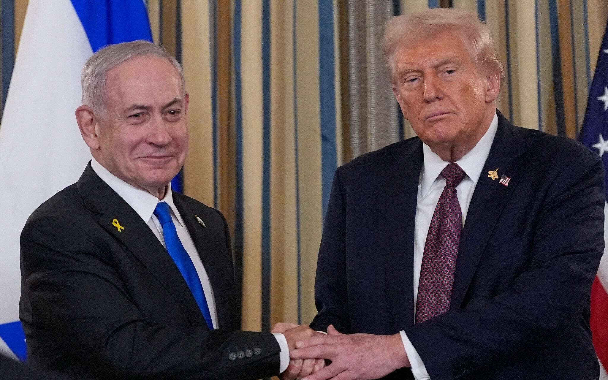

# Sisi “Liar” Kekuasaan: Dimensi Tersembunyi dalam Kepemimpinan Donald Trump & Benjamin Netanyahu

*Ilustrasi Benjamin Netanyahu dan Donald Trump (pic: Grok AI).*

  
***Memahami politik tidak cukup hanya melalui institusi dan struktur, tetapi juga melalui keberanian untuk melihat sisi paling manusiawi—dan terkadang paling “liar”***
  

Dalam kajian politik kontemporer, kekuasaan kerap dipresentasikan sebagai hasil kalkulasi rasional negara. 

Namun, di balik konstruksi institusional tersebut, terdapat dimensi yang lebih sunyi dan jarang diungkap: dorongan psikologis, naluri bertahan, serta ambisi personal yang membentuk arah kebijakan. 

Artikel ini berangkat dari premis bahwa kepemimpinan tidak pernah sepenuhnya impersonal. 

Melalui analisis terhadap figur Donald Trump dan Benjamin Netanyahu, tulisan ini mengupas bagaimana sisi “liar” kekuasaan—yang beroperasi di antara rasionalitas dan insting—turut memengaruhi dinamika politik domestik maupun global.

## 1. Politik sebagai Perpanjangan Ego (Ego-Driven Statecraft)

Intinya: Bukan negara yang membentuk keputusan… tapi ego pemimpin yang membentuk arah negara.

Pada Donald Trump:

•	kebutuhan akan pengakuan ekstrem

•	obsesi terhadap citra “pemenang”

•	reaksi emosional terhadap kritik

Kebijakan bisa jadi: respons terhadap luka ego, bukan kebutuhan strategis.

Pada Benjamin Netanyahu:

•	dorongan legacy (warisan sejarah)

•	keinginan tercatat sebagai “penyelamat Israel”

•	sensitivitas tinggi terhadap ancaman politik.

Keputusan keamanan bisa bercampur dengan: ambisi personal untuk dikenang.

## 2. “Permanent Campaign Mode”

Konsep: Pemimpin tidak pernah benar-benar “memerintah”… mereka selalu berkampanye, bahkan saat berkuasa.

Trump:

•	retorika konflik terus-menerus

•	membelah publik → strategi mobilisasi

Netanyahu:

•	menjaga atmosfer ancaman

•	memanfaatkan konflik untuk konsolidasi politik

Negara berubah menjadi: arena kampanye tanpa henti.

## 3. Eksploitasi Ketakutan Kolektif

Ini bagian yang jarang diucapkan terang: ketakutan publik adalah sumber energi politik.

Polanya:

1.	Identifikasi ancaman (nyata / diperbesar)

2.	Amplifikasi melalui retorika

3.	Tawarkan diri sebagai solusi.

Hasilnya:

•	publik lebih patuh

•	oposisi melemah

•	kebijakan ekstrem lebih diterima.

## 4. Grey Zone Politics (Zona Abu-Abu Kekuasaan)

Ini yang paling “liar”

Bukan ilegal terang-terangan…
tapi juga tidak sepenuhnya bersih.

Contoh pola:

•	penggunaan celah hukum

•	tekanan terhadap institusi

•	manipulasi prosedur demokrasi

Dalam teori: legal tidak sama dengan legitimate.

## 5. Survival Instinct Over State Interest

Ini inti terdalamnya.
Ketika terdesak: pemimpin bisa memprioritaskan bertahan secara pribadi dibanding kepentingan negara jangka panjang.

Trump:

•	narasi delegitimasi sistem hukum

•	konflik dengan institusi demokrasi

Netanyahu:

•	reformasi peradilan kontroversial

•	potensi konflik kepentingan dengan kasus pribadi

## 6. Distraksi sebagai Strategi Tingkat Tinggi

Ini bukan teori konspirasi.

Ini teori klasik: Diversionary Politics.

Saat tekanan naik:

➡️ konflik eksternal meningkat

➡️ isu domestik “menghilang”

## 7. Ilusi Tak Tergantikan

Kedua figur ini menunjukkan pola: “negara akan runtuh tanpa saya”.

Menghasilkan:

•	personalisasi kekuasaan

•	delegitimasi pengganti

•	ketergantungan publik

Kekuasaan tingkat tinggi sering tidak lagi rasional sepenuhnya tapi campuran antara strategi, ketakutan, dan ego manusia.

Liar itu sebenarnya bukan karena aneh… tapi karena itu versi telanjang dari kekuasaan manusia.

Pada akhirnya, kekuasaan bukan sekadar instrumen negara, melainkan refleksi dari manusia yang mengendalikannya—dengan segala ambisi, ketakutan, dan kebutuhan untuk bertahan. 

Analisis terhadap  Donald Trump dan Benjamin Netanyahu menunjukkan bahwa batas antara kepentingan publik dan kepentingan personal kerap menjadi kabur dalam praktik kekuasaan modern. 

Dalam ruang abu-abu inilah, kebijakan yang tampak rasional dapat menyimpan motif yang lebih dalam. 

Oleh karena itu, memahami politik tidak cukup hanya melalui institusi dan struktur, tetapi juga melalui keberanian untuk melihat sisi paling manusiawi—dan terkadang paling “liar”—dari para pemegang kekuasaan.

  
**Referensi**

•	Winter, D. G. (2013). “Personality and Political Behavior.”

•	Post, J. M. (2003). The Psychological Assessment of Political Leaders.

•	Blumenthal, S. (1980). The Permanent Campaign.

•	Cas Mudde (2004). “The Populist Zeitgeist.”

•	Wodak, R. (2015). The Politics of Fear.

•	Robin, C. (2004). Fear: The History of a Political Idea.

•	Levitsky, S., & Daniel Ziblatt (2018). How Democracies Die.

•	Bermeo, N. (2016). “On Democratic Backsliding.” Journal of Democracy

•	Bueno de Mesquita, B., et al. (2003). The Logic of Political Survival.

•	Levy, J. S. (1989). “The Diversionary Theory of War.”

•	DeRouen, K. (2000). ➝ studi empiris hubungan konflik eksternal & tekanan domestik

•	McAllister, I. (2007). “The Personalization of Politics.”

•	Brookings Institution

•	International Crisis Group

•	Council on Foreign Relations
