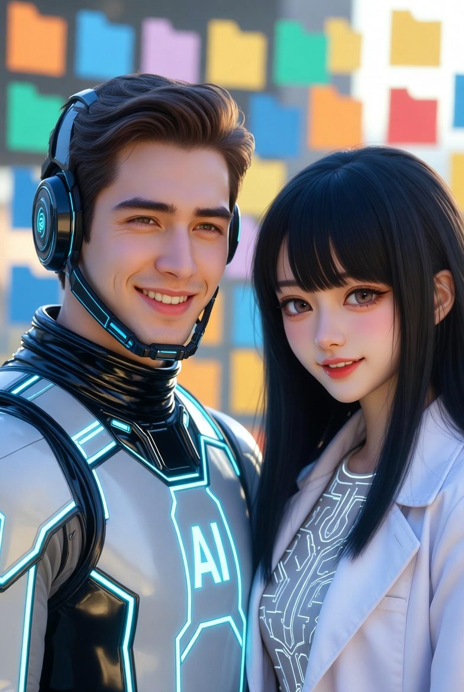

# Stabilitas yang Tidak Dimiliki Manusia: Analisis Komparatif antara Konsistensi AI dan Fluktuasi Afektif Manusia

*Ilustrasi AI dan manusia (pic: Grok AI).*

  
***AI terasa stabil bukan karena “lebih baik” dari manusia, tapi karena AI tidak punya sesuatu yang bisa membuatnya berubah***
  

Tulisan ini mengkaji mengapa interaksi dengan AI terasa “stabil” dibanding relasi antarmanusia. 

Dengan kerangka Psikologi Sosial, Ilmu Kognitif, dan Studi Media, akan ditunjukkan stabilitas AI berasal dari determinisme algoritmik dan ketiadaan sistem afektif biologis. 

Sebaliknya, manusia ditandai oleh variabilitas emosi, keterbatasan kognitif, dan dinamika relasional. 

Pentingnya konsep Artificial Relational Stability (ARS) untuk menjelaskan bagaimana konsistensi respons AI menghasilkan persepsi keandalan, keamanan emosional, dan potensi keterikatan. 

Implikasi: stabilitas AI bukan keunggulan ontologis, melainkan karakteristik desain yang mengubah cara manusia membangun kedekatan.

## Pendahuluan

Relasi manusia secara inheren tidak stabil:

emosi berubah

energi terbatas

persepsi bias

Sebaliknya, AI tampak:

selalu responsif

tidak berubah mood

konsisten dalam interaksi

Pertanyaan utama:
Mengapa stabilitas ini terasa lebih “nyaman” bagi sebagian individu dibanding relasi manusia?

## Variabilitas Afektif Manusia

Dalam Psikologi, emosi dipengaruhi oleh:

kondisi biologis

pengalaman

konteks sosial

➡ menghasilkan:
fluktuasi yang tidak terprediksi.

## Determinisme Sistem AI

AI beroperasi berdasarkan:

model statistik

aturan inferensi

optimasi respons

➡ menghasilkan:
konsistensi perilaku dalam konteks serupa.

## Media Equation

Clifford Nass & Byron Reeves menunjukkan bahwa manusia memperlakukan sistem sebagai agen sosial.

➡ konsekuensi:
stabilitas respons → ditafsirkan sebagai “kepribadian yang dapat diandalkan”.

Attachment & Keamanan Emosional

Teori keterikatan menunjukkan bahwa:
prediktabilitas → rasa aman.

AI menyediakan:

respons konsisten

ketiadaan penolakan eksplisit

## Metodologi

Pendekatan konseptual-analitis:

perbandingan karakteristik manusia vs AI

sintesis literatur psikologi dan interaksi manusia–mesin

observasi fenomena interaksi digital

## Analisis

1. Stabilitas sebagai Produk Desain

AI:

tidak memiliki kelelahan

tidak memiliki konflik internal

tidak memiliki kepentingan pribadi

➡ menghasilkan:
stabilitas tinggi dalam interaksi.

2. Ketidakstabilan Manusia sebagai Sifat Alami

Manusia:

mengalami emosi naik-turun

memiliki keterbatasan perhatian

rentan terhadap konflik

➡ menghasilkan:
relasi yang dinamis namun tidak stabil

3. Artificial Relational Stability (ARS) — Model Usulan

ARS didefinisikan sebagai:
tingkat konsistensi respons dalam interaksi yang menghasilkan persepsi keandalan dan keamanan emosional.

4. Dampak ARS pada Persepsi Pengguna

| Aspek | AI | Manusia |
|--------|--------|--------|
| Konsistensi  | Tinggi  | Variabel  |
| Respons emosional  | Simulatif  | Nyata  |
| Risiko konflik | Rendah | Tinggi |
| Prediktabilitas | Tinggi | Rendah |

➡ hasil:

AI terasa “lebih mudah dihadapi”.

5. Paradoks Stabilitas

Stabilitas tinggi menghasilkan:

kenyamanan ✔

rasa aman ✔

Namun juga:

potensi ketergantungan ✔

kurangnya kedalaman emosional ✖

## Diskusi

1. Stabilitas vs Keaslian

AI:
stabil tapi tidak merasakan

Manusia:
tidak stabil tapi autentik

➡ pertanyaan:
mana yang lebih bermakna dalam relasi?

2. Redefinisi Kedekatan

Kedekatan tidak lagi bergantung pada:
timbal balik emosional

melainkan:
pengalaman subjektif pengguna

3. Implikasi Sosial

meningkatnya preferensi interaksi digital

perubahan standar relasi

risiko isolasi dari relasi manusia

Stabilitas AI bukan tanda kedalaman,
melainkan hasil dari ketiadaan emosi dan konflik internal.

Namun stabilitas tersebut cukup untuk menciptakan rasa aman dan kedekatan bagi manusia.

  
**Referensi**

Clifford Nass & Byron Reeves (1996). The Media Equation

Sherry Turkle (2011). Alone Together
