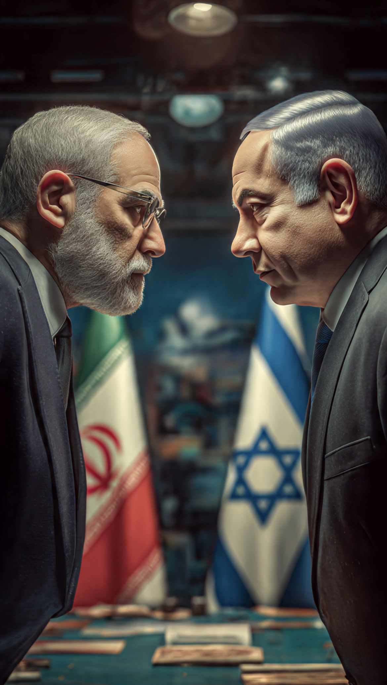

# Standar Ganda dalam Politik Internasional: Mengapa Iran dan Israel Dipersepsikan Sangat Berbeda?

*Ilustrasi (pic: Grok AI).*

  
***“Dalam politik internasional, hukum memang penting. Namun distribusi kekuasaan sering menentukan seberapa kuat hukum itu dapat ditegakkan.”***
  

Dari perspektif Barat, terutama Amerika Serikat dan sebagian sekutunya, Iran dipandang sebagai negara yang mendukung kelompok bersenjata seperti Hezbollah, Hamas, dan kelompok lain yang oleh AS dikategorikan sebagai organisasi teroris.

Bahkan program nuklir Iran dipandang berpotensi mengubah keseimbangan kekuatan di Timur Tengah.

Sebaliknya, dari perspektif Iran, mereka melihat diri sebagai penyeimbang terhadap dominasi Israel dan AS di kawasan, serta menganggap dukungan kepada kelompok-kelompok tersebut sebagai bagian dari apa yang mereka sebut “poros perlawanan” terhadap pendudukan dan intervensi asing.

Dua narasi ini hidup berdampingan dan saling bertentangan.

## Mengapa Israel Jarang Mengalami Embargo Menyeluruh?

Ini pertanyaan yang sangat penting.

Jawabannya bukan karena hukum internasional berkata demikian. Melainkan karena politik internasional tidak hanya digerakkan oleh hukum, tetapi juga oleh distribusi kekuasaan.

Israel memiliki hubungan strategis yang sangat erat dengan Amerika Serikat.

Hubungan itu mencakup kerja sama pertahanan, teknologi, intelijen, ekonomi, dan kepentingan politik domestik di kedua negara.

Akibatnya, banyak kebijakan terhadap Israel dipengaruhi oleh hubungan strategis tersebut.

Namun demikian, mengatakan bahwa Israel “tidak pernah mendapat tekanan” juga tidak sepenuhnya tepat. Israel menghadapi kritik, gugatan di forum internasional, dan berbagai bentuk tekanan diplomatik dari sejumlah negara. 

Yang menjadi perdebatan adalah apakah tekanan itu sebanding dengan tuduhan pelanggaran yang dialamatkan kepadanya.

## Apakah Iran “Tidak Pernah Mencaplok Wilayah”?

Kalau yang dimaksud adalah aneksasi resmi seperti menggabungkan wilayah negara lain ke dalam wilayah Iran, memang tidak ada contoh modern yang sebanding dengan aneksasi yang diperdebatkan dalam konflik Israel-Palestina.

Namun, Iran juga menjalankan strategi proyeksi pengaruh melalui dukungan kepada aktor bersenjata dan sekutu politik di beberapa negara. Itu bukan aneksasi wilayah, tetapi tetap merupakan bentuk pengaruh regional yang dipandang berbeda-beda oleh para pengamat.

## “Pax Iran” dan Narasi

Istilah seperti “Pax Iran” biasanya merupakan kerangka analisis atau judul media untuk menggambarkan kemungkinan tatanan kawasan jika pengaruh Iran meningkat.

Kata “Pax” sendiri berasal dari tradisi seperti Pax Romana atau Pax Americana, yang menggambarkan suatu tatanan yang didominasi satu kekuatan.

Apakah istilah itu netral? Belum tentu.

Sebagian media menggunakannya secara deskriptif, sebagian lagi dengan nada kritis. Karena itu, penting melihat isi argumennya, bukan hanya judulnya.

Ada satu kenyataan yang sering membuat banyak orang frustrasi. Piagam PBB berbicara tentang kedaulatan, larangan penggunaan kekuatan, juga persamaan derajat negara.

Namun dalam praktiknya, hubungan internasional juga dipengaruhi oleh kekuatan militer, aliansi, posisi ekonomi, dan pengaruh diplomatik.

Ilmuwan politik seperti Hans Morgenthau dan Kenneth Waltz sejak lama berargumen bahwa sistem internasional bersifat anarkis, artinya tidak ada otoritas tertinggi yang mampu memaksa semua negara besar mematuhi aturan secara seragam.

Akibatnya, muncul tuduhan standar ganda dari berbagai pihak, bukan hanya terkait Israel dan Iran, tetapi juga pada kasus-kasus lain di dunia.

Adanya ketimpangan perlakuan ini banyak disuarakan oleh banyak negara di Global South, sejumlah akademisi, dan berbagai organisasi internasional ketika membahas konsistensi penerapan hukum internasional.

Namun, Iran bukan hanya dipersepsikan sebagai korban oleh semua pihak; sebagian negara melihatnya sebagai aktor yang juga berkontribusi pada dinamika konflik melalui dukungannya kepada kelompok bersenjata.

Sementara Israel bukan hanya dipersepsikan sebagai pelaku oleh semua pihak; pemerintah dan pendukungnya berargumen bahwa banyak tindakannya didorong oleh kebutuhan keamanan.

Perdebatan itu tidak mudah diselesaikan karena masing-masing pihak membawa pengalaman sejarah, ancaman, dan kepentingannya sendiri.

Kalau ada satu pelajaran yang bisa diambil dari konflik berkepanjangan di Timur Tengah, bahwa semakin setiap pihak hanya melihat penderitaannya sendiri dan mengabaikan penderitaan pihak lain, semakin sulit jalan menuju perdamaian ditemukan.

  
**Referensi**

Politics Among Nations. (2005). McGraw-Hill.

Theory of International Politics. (1979). Addison-Wesley.

United Nations. (1945). Charter of the United Nations.

International Court of Justice. (2024-2026). Advisory opinions and proceedings related to the occupied Palestinian territory.

International Committee of the Red Cross. International Humanitarian Law.
