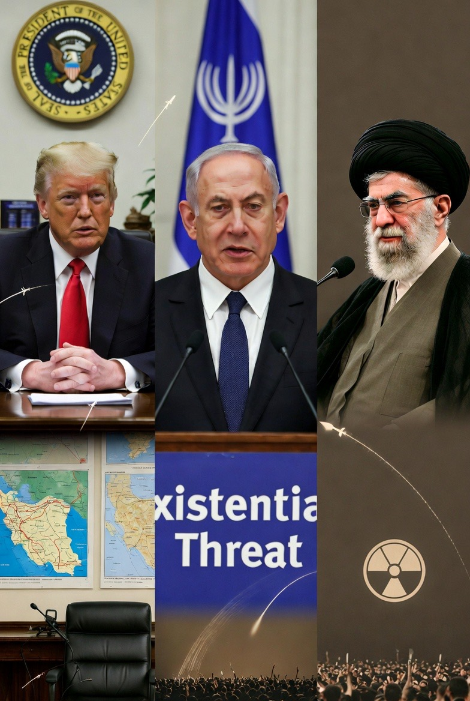

# Strategi Israel dan AS terhadap Iran: Analisis Tujuan Geopolitik dalam Konflik Timur Tengah Kontemporer

*Ilustrasi (pic: Grok AI).*

  
***Kompleksitas geopolitik kawasan menunjukkan bahwa solusi militer semata tidak cukup untuk menyelesaikan konflik jangka panjang***
  

Konflik antara Israel, Amerika Serikat, dan Iran merupakan salah satu dinamika keamanan paling signifikan dalam sistem internasional kontemporer. 

Artikel ini menganalisis tujuan strategis utama di balik operasi militer Israel dan Amerika Serikat terhadap Iran. 

Dengan menggunakan pendekatan studi keamanan internasional dan teori keseimbangan kekuatan, penelitian ini mengidentifikasi empat tujuan strategis utama: pencegahan proliferasi nuklir Iran, pelemahan jaringan proksi regional Iran, pembentukan deterrence militer, dan potensi tekanan terhadap stabilitas rezim Iran. 

Studi ini berargumen bahwa konflik tersebut tidak hanya berkaitan dengan ancaman militer langsung, tetapi juga mencerminkan persaingan geopolitik yang lebih luas mengenai pengaruh regional di Timur Tengah.

## Pendahuluan

Hubungan antara Israel, Amerika Serikat, dan Iran telah lama ditandai oleh ketegangan strategis yang kompleks. 

Sejak Revolusi Iran 1979, Iran dan Amerika Serikat berada dalam kondisi konfrontasi politik yang berkelanjutan, sementara Israel melihat Iran sebagai ancaman keamanan eksistensial.

Dalam beberapa dekade terakhir, konflik ini berkembang dari persaingan diplomatik menjadi bentuk konflik hibrida, yang melibatkan operasi militer terbatas, perang proksi, serta operasi intelijen.

Serangan militer terhadap target Iran dan jaringan proksinya mencerminkan upaya strategis untuk membatasi pengaruh Iran dalam sistem keamanan regional.

## Teori Keseimbangan Kekuatan (Balance of Power)

Teori keseimbangan kekuatan menyatakan bahwa negara akan bertindak untuk mencegah munculnya kekuatan regional dominan yang dapat mengancam stabilitas sistem internasional.

Dalam konteks Timur Tengah, Israel dan Amerika Serikat berusaha mencegah Iran menjadi kekuatan hegemonik melalui pengembangan:

•	kemampuan nuklir

•	jaringan milisi regional

•	pengaruh geopolitik di beberapa negara.

## Teori Deterrence

Teori deterrence menekankan penggunaan kekuatan militer untuk mencegah lawan melakukan tindakan agresif.

Serangan militer terbatas dapat digunakan untuk:

•	menunjukkan kemampuan militer

•	memperkuat kredibilitas ancaman

•	mencegah eskalasi lebih lanjut oleh lawan.

## Tujuan Strategis Operasi Israel dan Amerika Serikat

1. Pencegahan Program Nuklir Iran

Tujuan utama yang sering dinyatakan secara resmi adalah mencegah Iran memperoleh senjata nuklir.

Israel memandang kemungkinan Iran memiliki senjata nuklir sebagai ancaman eksistensial. Amerika Serikat juga menilai proliferasi nuklir di Timur Tengah berpotensi memicu perlombaan senjata regional.

Karena itu, fasilitas yang berkaitan dengan program nuklir dan kemampuan misil Iran menjadi target utama dalam berbagai operasi militer maupun intelijen.

2. Pelemahan Jaringan Proksi Iran

Iran telah membangun jaringan kelompok sekutu di berbagai wilayah Timur Tengah, termasuk:

•	Hezbollah di Lebanon

•	milisi Syiah di Irak

•	kelompok militan di Suriah

•	gerakan Houthi di Yaman

Jaringan ini sering disebut sebagai arsitektur deterrence Iran.

Israel dan Amerika Serikat berupaya melemahkan jaringan tersebut untuk mengurangi kemampuan Iran memproyeksikan kekuatan di kawasan.

3.Pembentukan Deterrence Regional

Serangan militer terhadap target Iran juga bertujuan memperkuat deterrence.

Dalam konteks ini, tindakan militer tidak hanya dimaksudkan untuk menghancurkan kemampuan musuh, tetapi juga untuk mengirimkan pesan strategis kepada aktor lain di kawasan.

Demonstrasi kekuatan militer dapat mencegah kelompok milisi atau negara lain mengambil langkah agresif terhadap Israel atau kepentingan Barat.

4. Tekanan terhadap Stabilitas Rezim Iran

Beberapa analis berpendapat bahwa strategi militer juga dapat bertujuan menciptakan tekanan terhadap pemerintah Iran.

Tekanan tersebut dapat berupa:

•	kerusakan infrastruktur militer

•	peningkatan tekanan ekonomi

•	isolasi internasional

Walaupun demikian, perubahan rezim bukanlah tujuan resmi yang secara eksplisit dinyatakan oleh pemerintah Amerika Serikat dalam kebijakan publiknya.

## Implikasi terhadap Stabilitas Regional

Konflik antara Israel, Amerika Serikat, dan Iran memiliki implikasi signifikan terhadap stabilitas Timur Tengah.

Beberapa dampak potensial meliputi:

•	eskalasi konflik melalui jaringan proks

•	peningkatan risiko perang regional

•	gangguan terhadap jalur energi global

Karena kawasan Timur Tengah memiliki peran penting dalam pasar energi dunia, konflik yang melibatkan Iran dapat mempengaruhi stabilitas ekonomi global.

Konflik antara Israel, Amerika Serikat, dan Iran mencerminkan persaingan strategis yang kompleks dalam sistem keamanan Timur Tengah.

Tujuan utama operasi militer dapat diringkas dalam empat dimensi strategis:

1.	mencegah proliferasi nuklir Iran

2.	melemahkan jaringan proksi regional Iran

3.	memperkuat deterrence militer

4.	meningkatkan tekanan terhadap stabilitas rezim Iran

Namun, kompleksitas geopolitik kawasan menunjukkan bahwa solusi militer semata tidak cukup untuk menyelesaikan konflik jangka panjang.

  
**Referensi**

Walt, S. (1987). The origins of alliances. Cornell University Press.

Mearsheimer, J. (2001). The tragedy of great power politics. W. W. Norton.

Freedman, L. (2013). Strategy: A history. Oxford University Press.

Byman, D. (2018). Iran’s regional strategy. Brookings Institution.

Cordesman, A. (2020). Iran and the changing military balance in the Middle East. CSIS.
