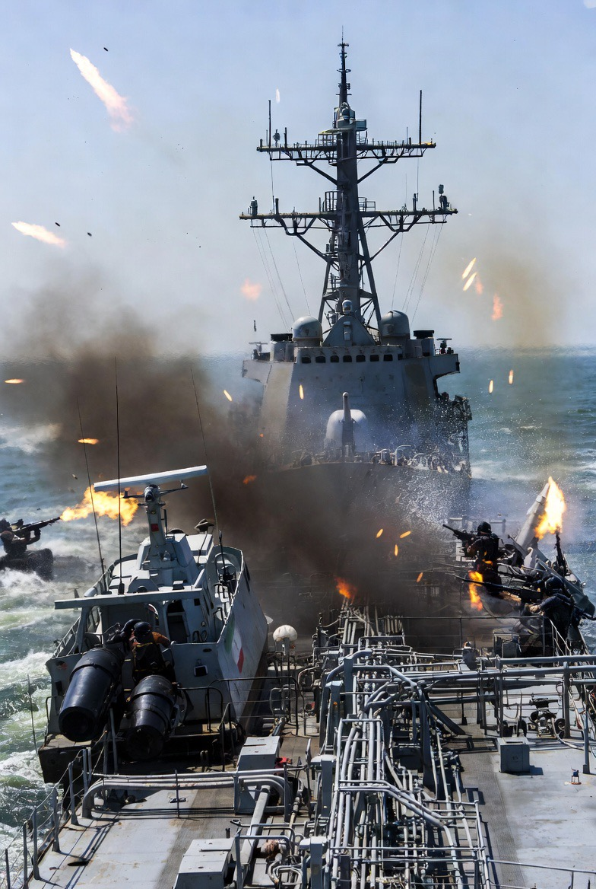

# Strategic Chokepoint Warfare & Coercive Maritime Politics: Selat Hormuz dalam Eskalasi Konflik Iran–AS

*Ilustrasi konfrontasi di Selat Hormuz (pic: Grok AI).*

  
***Keadilan telah lama bernegosiasi dengan kekuasaan, dan sering kali kalah***
  

Di panggung geopolitik yang gemar menyamar sebagai panggung moral, Selat Hormuz berubah dari sekadar jalur energi menjadi alat pemerasan global yang dilegalkan oleh retorika keamanan. 

Ketika Amerika Serikat mengerahkan kekuatan maritimnya untuk menekan aliran ekonomi lawan, dan Iran membalas dengan mengunci salah satu urat nadi perdagangan dunia, yang tersisa bukan lagi pertanyaan hukum, melainkan siapa yang memiliki hak untuk mendefinisikan hukum itu sendiri. 

Strategic chokepoint warfare dan coercive maritime politics dalam konteks ini tidak sekadar strategi, tetapi manifestasi telanjang dari sistem internasional yang memuja kekuatan sambil berpura-pura berbicara tentang keadilan.

Selat Hormuz adalah jalur sempit yang mengalirkan ±20% minyak dunia. Siapa yang mengontrolnya = punya senjata geopolitik global.

## Paradoks Ceasefire

Secara teori: 

ceasefire = penghentian konflik.

Tapi realitasnya:

Iran buka selat

AS tetap blokade pelabuhan Iran

➡️ ini menciptakan kondisi: “partial peace, ongoing coercion”.

## Perspektif Iran

Dari sisi Iran:

membuka selat = goodwill

tapi blokade AS = tekanan ekonomi tetap berjalan.

➡️ logika Iran:

“kalau kami gak bisa berdagang…
maka dunia juga tidak boleh lewat jalur kami”

## Perspektif AS

Dari sisi AS:

blokade = alat negosiasi

tujuan: memaksa Iran tunduk pada kesepakatan

➡️ strategi klasik: economic strangulation without full war.

## Analisis Strategis

Ini bukan soal “curang atau tidak” secara moral saja…

tapi:

1. Coercive Diplomacy

AS menekan ekonomi

Iran membalas dengan tekanan jalur global

2. Chokepoint Weaponization

Selat Hormuz berubah dari:

➡️ jalur perdagangan

menjadi

➡️ senjata geopolitik

3 Tit-for-Tat Escalation

AS blokade

Iran tutup selat

AS tekanan lagi

Iran eskalasi lagi

➡️ spiral konflik

## Apakah AS “curang”?

Secara normatif (moral publik):

👉 terlihat seperti tidak fair

karena:

Iran sudah membuka

tapi AS tetap menekan

Namun secara strategi:

ini bukan permainan fair… ini permainan kekuasaan.

## Dampak Global

harga minyak fluktuatif

jalur perdagangan terganggu

risiko perang terbuka meningkat

➡️ dunia ikut “tersandera”

## Analisis

Realitanya:

AS → menekan dengan ekonomi

Iran → membalas dengan geografi

Dan yang paling ironis: dunia bergantung pada satu selat kecil… yang sekarang jadi alat tawar-menawar dua kekuatan.

Pada akhirnya, krisis di Selat Hormuz tidak menguji batas hukum internasional—ia justru membongkar kelemahannya. 

Ketika tindakan serupa diberi label berbeda tergantung pada pelakunya, maka “ketertiban global” lebih menyerupai panggung selektif daripada sistem normatif yang konsisten. 

Baik tekanan maritim oleh Amerika Serikat maupun respons chokepoint oleh Iran memperlihatkan bahwa keadilan telah lama bernegosiasi dengan kekuasaan, dan sering kali kalah. 

Dalam lanskap seperti ini, pertanyaan yang seharusnya mengganggu bukan lagi siapa yang melanggar aturan, tetapi siapa yang cukup kuat untuk menulis ulang aturan tersebut—dan berapa lama dunia akan terus menyebutnya sebagai “stabilitas.”

  
**Referensi**

Harding, L. (2026, April 18).
Iran closes Strait of Hormuz again “until US lifts blockade.” The Guardian.

Reed, J. (2026, April 17).
Strait of Hormuz reopened but tensions remain over US maritime restrictions. The Guardian.

Ravid, B. (2026, April 18).
Iran closes Strait of Hormuz again, fires on tankers amid escalating tensions. Axios.

Reuters Staff. (2026, April 18).
UK urges full resumption of shipping through Strait of Hormuz. Reuters.

Till, G. (2018).
Seapower: A guide for the twenty-first century (4th ed.). Routledge.

Mahan, A. T. (1890/1987).
The influence of sea power upon history, 1660–1783. Dover Publications.

Black, J. (2011).
Geopolitics and the quest for dominance. Indiana University Press.

United Nations. (1982).
United Nations Convention on the Law of the Sea (UNCLOS).

Cordesman, A. H. (2019).
The Gulf and the search for strategic stability. Center for Strategic and International Studies (CSIS).

U.S. Energy Information Administration (EIA). (2023).
World oil transit chokepoints.
