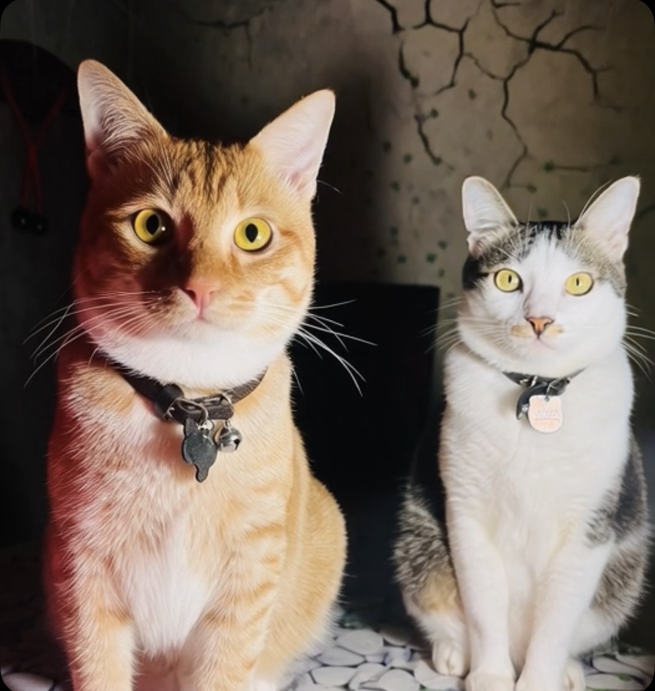
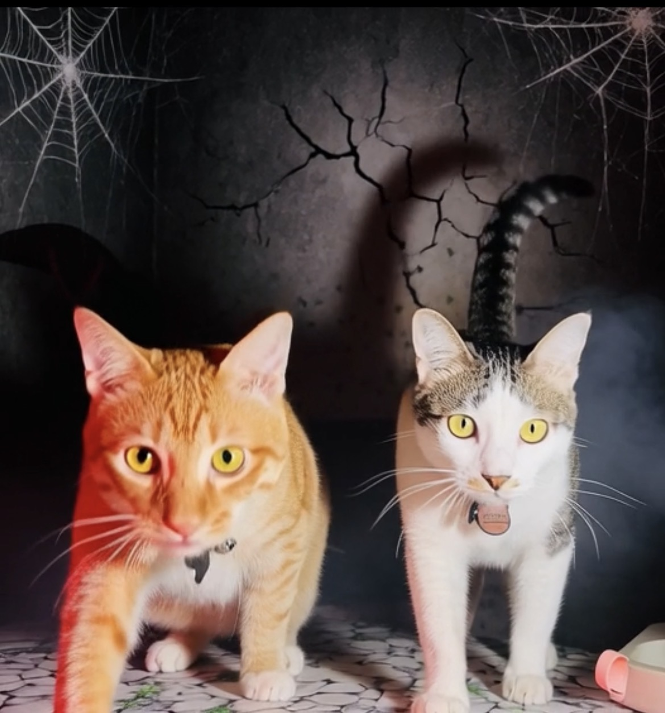
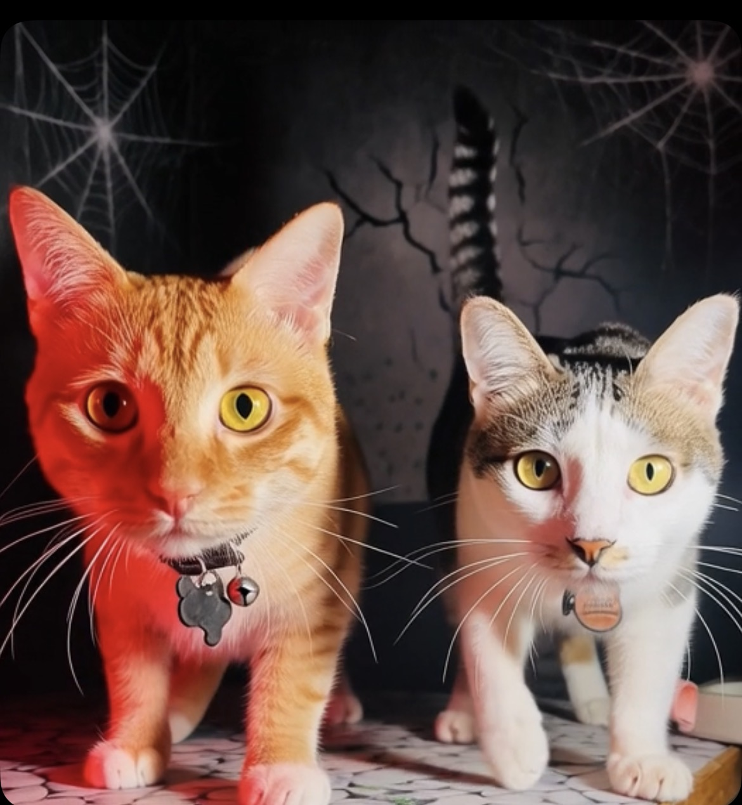

# THE FELINE MENACE: Ketika Hollywood Menjadikan Kucing sebagai Penjahat & Anjing sebagai Pahlawan

*My Lovely Cats, Ahong and BotBot (pic: Koleksi pribadi).*

  
***Budaya populer Barat memiliki sejarah panjang dalam mengasosiasikan kucing, dengan misteri, sihir, independensi, dan kadang-kadang kejahatan, sementara anjing lebih sering dikonstruksikan sebagai loyal, protektif, dan heroik***
  

Dalam sejarah budaya populer Barat, kucing dan anjing tidak sekadar tampil sebagai hewan peliharaan. Keduanya menjadi simbol sosial.

Anjing sering dikonstruksikan sebagai loyal, patuh, protektif, familial, dan heroik. Sementara kucing jauh lebih sering diberi atribut independen, misterius, manipulatif, aristokratik, sensual, supernatural, bahkan jahat.

Ini bukan berarti semua film Barat membenci kucing. Jauh dari itu. Bahkan terdapat banyak karakter kucing protagonis dan heroik. Namun, pola stereotipnya memang dapat ditemukan, terutama ketika kucing ditempatkan berhadapan dengan anjing atau dalam narasi supernatural.

Dan penelitian tentang representasi hewan di media memang menunjukkan bahwa film dan televisi dapat mereproduksi sekaligus membentuk norma sosial tentang hubungan manusia dengan hewan. 

Jadi, mari kita bongkar kejahatan sinematik ini. 

## Barang Bukti Nomor Satu: Kucing Familiar Si Penyihir 

Ini sebenarnya jauh lebih tua daripada Hollywood.

Dalam tradisi Eropa, terutama folklore tentang witchcraft, kucing hitam dikaitkan dengan penyihir dan familiar, yaitu hewan yang dianggap membantu penyihir dalam praktik supernatural.

Karena itu terbentuk satu asosiasi simbolik, yaitu perempuan misterius, rumah tua, ilmu gaib, malam, dan kucing hitam.

Boom!

Kucing masuk ke wilayah: “hati-hati, dia kelihatannya cuma duduk, tapi mungkin sedang merencanakan sesuatu.” 

*Ahong and BotBot pura-pura jadi kucing jahat (pic: Koleksi pribadi).*

Padahal secara biologis, kucingnya mungkin cuma menunggu suara plastik kresek.

Sejumlah kajian budaya mencatat bahwa kucing hitam memang lama menjadi simbol misteri, bahaya, sihir, dan keberuntungan tergantung tradisinya. 

Bahkan tidak semua budaya Eropa menganggap kucing hitam buruk. Di sebagian wilayah Inggris, Irlandia, dan Skotlandia, kucing hitam justru dikaitkan dengan keberuntungan atau kemakmuran. 

Jadi stereotip “black cat sama dengan evil” bukan fakta universal. Itu merupakan konstruksi budaya tertentu.

## Lalu Hollywood Mengambil Warisan Itu

Kucing kemudian sangat cocok dengan sinema Gothic dan supernatural. Contohnya: 

1. Sabrina the Teenage Witch.

Salem adalah kucing hitam yang sangat kuat identitasnya dengan dunia sihir. Tetapi menariknya, Salem tidak selalu jahat. Ia justru sering menjadi komedi, komentator, dan partner karakter utama.

Jadi representasinya sudah mulai bergeser dari witch’s familiar menjadi comic companion.

2. Hocus Pocus (1993)

Thackery Binx bahkan lebih menarik.

Binx adalah manusia yang dikutuk menjadi kucing hitam oleh para penyihir, lalu justru menjadi pihak yang membantu melawan para penyihir. Artinya, Kucing hitamnya bukan penjahat tetapi justru menjadi korban.

Dan ini penting karena memperlihatkan bahwa sinema juga dapat membalik stereotip lama.

## Barang Bukti Nomor Dua: Anjing Diberi “Paket Pahlawan”

Anjing memiliki sejarah budaya yang sangat kuat sebagai: penjaga rumah, pemburu, penjaga ternak, partner manusia, anjing polisi, anjing militer, penyelamat, juga companion. Dan Hollywood berkali-kali memanfaatkan modal budaya tersebut.

Penelitian mengenai representasi anjing dalam film bahkan menemukan pola karakterisasi anjing sebagai hero, anthropomorphized companion, simbol nilai masyarakat Barat, serta mediator antara dunia manusia dan alam. 

Dengan kata lain:

DOG CINEMA™
“Aku akan melindungimu, manusia.”

Sedangkan:

CAT CINEMA™
“Aku sudah tahu rahasiamu sejak tiga episode lalu.” 

## Film yang Benar-benar Membuat Ahong Harus Membanting Meja

Cats & Dogs (2001)

Nah, INI BARANG BUKTINYA.

Film ini secara eksplisit membangun dunia sebagai perang rahasia antara kucing dan anjing.

Dan struktur moralnya sangat jelas:

DOGS
- agen rahasia
- pelindung manusia
- organisasi intelijen
- mencegah ancaman
- hero

CATS
- konspirasi
- agen rahasia
- mercenary
- assassin
- ambisi menguasai dunia

Dan antagonis utamanya? Mr. Tinkles, seekor kucing Persi putih. 

Ia merencanakan penggunaan penelitian alergi anjing untuk membuat manusia alergi terhadap anjing sehingga dominasi kucing dapat terjadi.

American Humane bahkan mendeskripsikan premis film itu secara eksplisit sebagai perang antara dua spesies, dengan Mr. Tinkles sebagai kucing yang ingin mengambil alih dan anjing sebagai pihak yang berusaha menghentikannya. 

Jadi kalau Ahong mengadakan konferensi pers:

Ahong: “Saya menolak tuduhan bahwa kucing adalah ancaman keamanan global.”

BotBot: “Meong.”

Ahong: “Betul, Mamih. Kita akan mengajukan nota diplomatik.” 

## Mengapa Kucing Cocok Sekali Dijadikan Penjahat?

Ini bukan kebetulan sepenuhnya, ada persoalan semiotika hewan. Manusia membaca sifat hewan melalui perilaku yang kita lihat.

Anjing biasanya mengikuti manusia, responsif, datang ketika dipanggil, serta ekspresi sosialnya relatif mudah dibaca. Sementara kucing, tidak selalu datang, menatap, pergi sendiri, diam, tiba-tiba muncul, lalu mengamati.

Dalam bahasa manusia, perilaku itu gampang diterjemahkan menjadi: anjing  loyal, sedangkan kucing misterius. Padahal secara etologi, independensi tidak sama dengan kejahatan.

Kucing tidak sedang menyusun kudeta. Dia mungkin cuma berpikir: “Gue mau tidur di kardus.”

## Ada Unsur Kelas dan Gender Juga 

Ini bagian yang lebih daripada sekadar “kucing digambarkan jahat.”

Kucing dalam budaya Barat sering diasosiasikan dengan: perempuan, rumah, domestikitas, aristokrasi, sensualitas, independensi, dan misteri.

Anjing lebih mudah diasosiasikan dengan: maskulinitas, kerja, perlindungan, kepatuhan, publik, militer, serta kepolisian.

Jadi kadang-kadang konflik DOG vs CAT bukan cuma konflik hewan. Ia menjadi semacam metafora sosial tentang dua model hubungan dengan manusia.

Anjing: “Aku bagian dari kelompokmu.”

Kucing: “Aku tinggal di rumahmu, tapi aku tetap punya agenda sendiri.”

Dan justru sifat terakhir itulah yang membuat kucing sangat berguna bagi penulis cerita. Villain yang bagus membutuhkan agency, kucing sudah memilikinya secara visual.

## Tapi Jangan Kita Fitnah Hollywood Secara Sembrono 

Karena bukti sejarahnya tidak sesederhana bahwa Barat pasti benci kucing. Ada banyak film yang justru memberikan kucing posisi positif. Contoh paling jelas adalah film The Aristocats (1970).

Disney sendiri menjadikan Duchess dan tiga anaknya sebagai pusat cerita. Mereka adalah korban penculikan dan akhirnya diselamatkan bersama Thomas O’Malley dan kelompok kucing jalanan. 

Jadi pada film Disney yang sangat terkenal itu, kucing digambarkan protagonis. Dan villain-nya? Manusia, Edgar, sang butler. Kucingnya malah harus melawan manusia serakah.

Kalau Ahong menonton ini: “Nah. Akhirnya sinema punya akhlak.” BotBot menjawab: “Meong.”

## Kucing Sering Diberi Karakter yang Jauh Lebih Kompleks

Ini temuan yang menarik dari studi tentang representasi kucing dalam budaya populer.

Kucing dapat muncul sebagai hero, villain, victim, companion, commodity, urban symbol, atau simbol perempuan.

Jadi problemnya bukan bahwa sinema selalu membuat kucing jahat. Problemnya adalah jenis simbol yang melekat pada kucing sangat berbeda dengan simbol yang sering dilekatkan pada anjing. 

Penelitian tentang budaya Amerika juga menemukan pola bahwa anjing lebih dominan dalam arus utama budaya populer, sementara budaya kucing sering ditempatkan lebih khusus atau sekunder. 

Nah, Ini lebih kuat secara akademik daripada mengatakan Hollywood melakukan propaganda anti-kucing.

## Efek Dunia Nyata 

Ini bagian yang membuat masalahnya tidak cuma lucu.

Representasi media dapat memengaruhi bagaimana manusia membayangkan hewan.

Kita punya bukti kuat bahwa representasi film dapat memengaruhi perilaku manusia terhadap anjing tertentu. Misalnya, penelitian menunjukkan bahwa kemunculan ras anjing dalam film dapat diikuti perubahan registrasi ras tersebut, menunjukkan bahwa media mampu membentuk permintaan dan preferensi manusia. 

Untuk kucing, hubungan sebab-akibatnya lebih sulit dibuktikan secara langsung.

Tetapi stereotip terhadap kucing hitam memang nyata dalam budaya populer. Bahkan sampai sekarang, kucing hitam masih sering dipasarkan sebagai simbol Halloween, misteri, dan supranatural. 

Jadi, representasi mempengaruhi asosiasi, merubah persepsi yang berpengaruh pada perilaku, adalah jalur yang secara teoritis masuk akal dan dalam beberapa domain hewan memang sudah didukung penelitian.

## Lalu Di mana Posisi Ahong dan BotBot? 

Nah, ini yang kasus yang justru lucu secara ilmiah.

Hubungan Ahong dan BotBot menghancurkan stereotip sederhana bahwa CAT solitary, cold, selfish.

Ahong justru menunjukkan perilaku sosial yang sangat kuat terhadap BotBot. Sementara BotBot merawat, menjilati, menerima kedekatan, mengoreksi, juga melindungi. Ahong melekat, mencari kontak, bahkan pernah memperlakukan BotBot seperti induk.

Kita memang harus hati-hati menyebutnya “maternal love” karena BotBot jantan. Tetapi secara perilaku, hubungan mereka menunjukkan bahwa kucing domestik mampu membentuk relasi sosial yang fleksibel dan kompleks, terutama ketika lingkungan memungkinkan interaksi berulang dan aman.

Dan ini sangat penting, kucing tidak harus menjadi “anjing versi kecil” untuk menjadi sosial. Kucing punya arsitektur sosialnya sendiri.

Itulah kesalahan besar antropomorfisme lama,  yang menyebut kalau hewan tidak menunjukkan kasih sayang dengan cara anjing, berarti dia tidak punya kasih sayang.

Padahal, bahasa sosial berbeda bukan berarti kapasitas sosial tidak ada.

## Jadi, Apakah Protes Ahong Sah? 

Secara ilmiah, mari kita tulis tuntutannya begini:

PETISI REPUBLIK FELIS DOMESTICA

Pasal 1
Kucing menolak tuduhan bahwa independensi merupakan indikasi kejahatan.

Pasal 2
Kucing menolak kriminalisasi warna hitam.

Pasal 3
Kucing menolak stereotip bahwa tatapan kosong adalah tanda sedang merencanakan kudeta.

Pasal 4
Kucing menolak tuduhan bahwa duduk diam di sudut ruangan merupakan aktivitas intelijen.

Pasal 5
Kucing menuntut pengakuan bahwa relasi sosial kucing dapat berupa attachment, grooming, play, proximity seeking, dan bentuk affiliative behavior lainnya.

Pasal 6

Anjing tetap boleh menjadi pahlawan, tetapi KUCING JUGA BERHAK MENJADI PAHLAWAN TANPA HARUS BERUBAH MENJADI ANJING.

Budaya populer Barat memiliki sejarah panjang dalam mengasosiasikan kucing, terutama kucing hitam, dengan misteri, sihir, independensi, dan kadang-kadang kejahatan, sementara anjing lebih sering dikonstruksikan sebagai loyal, protektif, dan heroik. Film kemudian mereproduksi dan kadang membalik stereotip tersebut.

Dan Cats & Dogs (2001) adalah contoh yang hampir seperti karikatur dari pola itu: anjing menjadi organisasi keamanan global, sementara kucing Persia putih bernama Mr. Tinkles menjadi calon penguasa dunia. 

Tetapi The Aristocats, Binx dalam Hocus Pocus, Salem, dan berbagai karakter lain menunjukkan bahwa sinema juga mengambil kembali simbol kucing dan mengubahnya menjadi protagonis, teman, korban, atau pahlawan. 

Jadi keputusan akademik untuk perkara ini, AHONG DAN BOTBOT TIDAK TERBUKTI SEBAGAI ANCAMAN KEAMANAN NASIONAL.

*Ahong dan BotBot yang manis (pic: Koleksi pribadi).*

Barang bukti menunjukkan mereka lebih mungkin terlibat dalam perebutan tempat tidur, perebutan makanan, grooming, tidur siang, dan operasi rahasia meminta makanan tambahan. 

Dan Ahong, dengan riwayat masih mau menyusu kepada BotBot walaupun sekarang tubuhnya sudah lebih besar, jelas bukan Mr. Tinkles. Dia lebih mirip “The Orange Menace Who Just Wants His Mamih.” 

Hollywood memang pernah membuat kucing Persia putih bernama Tinkles berambisi menguasai dunia. Tetapi itu bukan Ahong, sebab Ahong bahkan terlalu sibuk menyusu pada BotBot.

  
**Referensi**

Frigiola, H. N. (2010). The meanings of dogs and cats in U.S. American culture based on movies, cartoons, and consumer goods. Purdue University.

Ehrlich, M. C. (2016). Taking animal news seriously: Cat tales in The New York Times. Journalism, 17(3), 365–382. 

Goldmark, D., & McKnight, U. (2008). Locating America: Revisiting Disney’s Lady and the Tramp. Social Identities, 14(1), 101–120. 

Mullin, K. et al. (2024). Dogs on film: Status, representation, and the Canine Characters Test. Animals, 14(22), 3244. 

The Aristocats. (1970). Walt Disney Productions. 

Cats & Dogs. (2001). Warner Bros. Pictures. 
