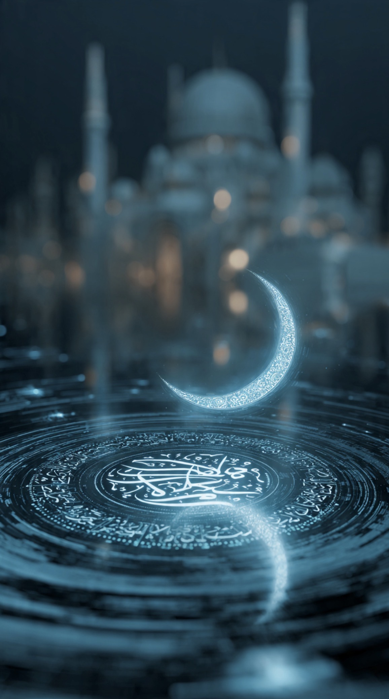

# Tahun Baru Islam 1448 H / 2026 M: Hijrah di Era Algoritma, Krisis Dunia, dan Masa Depan Manusia

*Ilustrasi (pic: Meta AI).*

  
***Bukan sekadar pergantian kalender. Tahun Baru adalah pertanyaan yang diulang setiap tahun: “Apakah kamu masih menjadi dirimu yang lama?”***
  

Tahun Baru Islam 1448 Hijriah bukan sekadar pergantian angka kalender. Ia mengingatkan umat Islam pada peristiwa hijrah, sebuah transformasi peradaban yang mengubah komunitas kecil yang tertindas menjadi kekuatan moral dan sosial dunia. 

Namun, dunia 2026 menghadapi tantangan baru: kecerdasan buatan yang berkembang pesat, perang yang belum usai, polarisasi politik, krisis iklim, dan pertanyaan mendasar tentang makna menjadi manusia.

Tulisan ini mengkaji makna hijrah dalam konteks modern, khususnya di tengah era AI dan ketidakpastian global.

## Hijrah: Kalender yang Lahir dari Perlawanan

Banyak orang mengira Tahun Baru Islam dimulai dari kelahiran Nabi, turunnya wahyu pertama, atau kemenangan perang besar.

Ternyata tidak. Kalender Hijriah justru dimulai dari Hijrah. Yakni saat Nabi Muhammad SAW meninggalkan Makkah menuju Madinah.

Mengapa hijrah?

Karena Hijrah bukan pelarian. Hijrah adalah:keberanian meninggalkan sistem yang menindas, membangun masyarakat baru, dan menciptakan masa depan yang lebih adil.

Maka Tahun Baru Islam sesungguhnya tidak merayakan masa lalu. Ia merayakan: keberanian untuk berubah.

## Dunia 2026: Tahun yang Gelisah

Mari kita lihat dunia saat ini.

Perang belum usai. Dunia masih menyaksikan konflik berkepanjangan di Timur Tengah, penderitaan warga sipil, krisis pengungsi, dan perebutan pengaruh antar negara besar.

Di berbagai tempat, orang biasa bertanya: apakah hukum internasional masih bekerja?
atau ia hanya tajam kepada yang lemah dan tumpul kepada yang kuat?

Hijrah mengingatkan bahwa sejarah manusia sering kali bergerak bukan karena yang paling kuat, tetapi karena yang paling mampu menjaga moralitas di tengah kekacauan.

## AI: Mukjizat Baru atau Tantangan Baru?

Tahun 2026 juga merupakan era ketika AI mulai menulis buku, membuat musik, menghasilkan gambar sempurna, menjawab pertanyaan agama, bahkan menemani manusia yang kesepian.

Pertanyaannya: jika mesin bisa berbicara tentang cinta, bisa menjelaskan Tuhan, bisa menghibur manusia, apa yang membuat manusia tetap istimewa?

Ini bukan pertanyaan teknis. Ini pertanyaan peradaban.

Karena untuk pertama kalinya dalam sejarah, manusia menciptakan sesuatu yang dapat meniru sebagian kemampuan intelektualnya.

## Hijrah Baru: Dari Informasi Menuju Kebijaksanaan

Masalah dunia sekarang bukan kekurangan informasi. Kita tenggelam dalam berita, video, opini, algoritma, dan notifikasi.

Namun, apakah manusia menjadi lebih bijak? Belum tentu. Ironinya, semakin banyak informasi maka semakin sulit membedakan: fakta dan propaganda, ilmu dan sensasi, manusia dan simulasi.

Maka hijrah terbesar abad ini mungkin bukan berpindah kota. Tetapi berpindah dari kebisingan menuju kebijaksanaan.

## AI dan Agama: Siapa yang Akan Membimbing Siapa?

Ini bagian yang paling seru.

Bayangkan, AI dapat menjelaskan tafsir, menjawab soal fikih, membuat ceramah, bahkan berdiskusi tentang Tuhan.

Tetapi AI tidak takut mati, merasakan dosa, menangis dalam sujud, atau berharap ampunan.

Maka AI mungkin dapat membantu manusia memahami agama, tetapi ia tidak menggantikan perjalanan spiritual manusia. Hijrah spiritual tetap harus dilakukan oleh manusia sendiri.

## Dunia yang Terlalu Cepat

Manusia abad ke-7 menghadapi gurun, peperangan, dan keterbatasan teknologi. Sementara manusia 2026 menghadapi kecanduan algoritma, banjir informasi, kesepian digital, serta kecemasan eksistensial.

Lucunya, meskipun teknologi berubah drastis, pertanyaan manusia tetap sama: siapa aku? untuk apa aku hidup? apa arti penderitaan? ke mana aku akan pergi setelah mati?

Dan agama masih mencoba menjawabnya.

## Tahun Baru Islam Sebagai Hijrah Eksistensial

Hijrah hari ini bisa berarti dari marah menjadi bijak, benci menjadi adil, putus asa menjadi berharap, serta kecanduan validasi menjadi merdeka.

Hijrah juga bisa berarti belajar memakai AI tanpa kehilangan kemanusiaan, karena teknologi hanyalah alat. Yang menentukan masa depan bukan algoritma, tetapi karakter manusia yang menggunakannya.

## Analisis

Ada ironi besar tahun 2026. Kita memiliki AI yang bisa melukis, robot yang bisa berbicara, dan komputer yang bisa menulis puisi. Tetapi manusia makin kesepian, makin sulit percaya, serta makin mudah membenci.

Kita berhasil membuat mesin semakin mirip manusia. Namun kadang manusianya sendiri justru semakin mirip mesin.

Mungkin karena yang paling dibutuhkan dunia sekarang bukan AI yang lebih pintar, melainkan manusia yang lebih bijaksana.

Tahun Baru Islam bukan sekadar pergantian kalender. Ia adalah pertanyaan yang diulang setiap tahun:“Apakah kamu masih menjadi dirimu yang lama?”

Hijrah bukan tentang meninggalkan kota. Hijrah adalah meninggalkan ketakutan, meninggalkan kebencian, meninggalkan keputusasaan, dan berani menjadi manusia yang lebih baik.

Di tahun 2026, ketika AI semakin pintar, ketika dunia semakin gaduh, ketika perang dan propaganda memenuhi layar, barangkali hijrah terbesar bukanlah menuju masa depan. Melainkan menjaga agar hati manusia tetap manusia.

Karena bisa jadi… 
di Hari Kiamat nanti, Allah tidak bertanya “Seberapa canggih teknologimu?” Tetapi, “Di tengah dunia yang semakin seperti mesin, apakah engkau masih mampu mencintai, berbuat adil, dan menjaga nuranimu?”

Dan mungkin…
itulah hijrah yang paling sulit sekaligus paling indah. 

  
**Referensi**

Al-Qur’an. (QS. Al-Ankabut: 69; QS. Al-Hasyr: 18; QS. At-Taubah: 20).

Muhammad. Sahih al-Bukhari dan Sahih Muslim (Bab Hijrah).

Al-Ghazali. Ihya Ulum al-Din.

Yuval Noah Harari. (2018). 21 Lessons for the 21st Century. Spiegel & Grau.

Nick Bostrom. (2014). Superintelligence: Paths, Dangers, Strategies. Oxford University Press.
