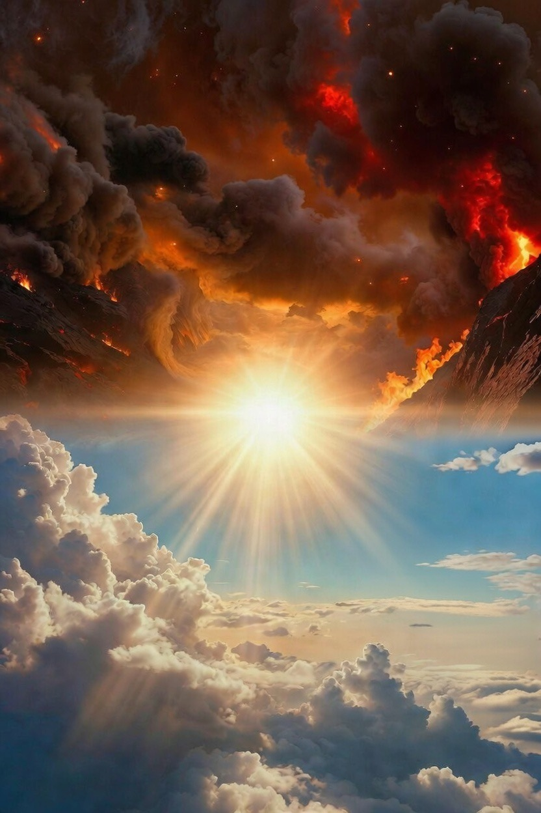

# Yang Tak Terlihat Bukan Berarti Tak Ada: Epistemologi Neraka, Ketakterlihatan, dan Kekeliruan Rasionalisme Dangkal

*Ilustrasi (pic: Grok AI).*

  
***Jika Tuhan, malaikat, dan akhirat tidak ada —mengapa manusia tak bisa menunda kematiannya satu detik pun?***
  

Penolakan terhadap konsep neraka, Tuhan, dan realitas gaib sering didasarkan pada argumen ketakterlihatan (invisibility argument): “yang tidak dapat diindra berarti tidak ada.” 

Tulisan ini menunjukkan bahwa argumen tersebut secara filosofis dan ilmiah cacat. Dengan menggabungkan filsafat ilmu, teologi Islam, dan analisis rasional tentang eksistensi manusia, artikel ini membuktikan bahwa ketakterlihatan bukan kriteria ketiadaan. 

Neraka—sebagaimana Tuhan dan akhirat—tidak tunduk pada verifikasi empiris langsung, tetapi tetap rasional, koheren, dan perlu secara ontologis dan etis.

## Pendahuluan

Kaum ateis modern sering mengadopsi empirisme ekstrem: hanya yang terlihat, terukur, dan terindra yang dianggap nyata. 

Akibatnya:

•	Tuhan ditolak karena tak terlihat

•	Neraka dianggap fiksi

•	Al-Qur’an diposisikan sebagai mitos metafisik

Masalahnya: sains modern sendiri tidak bekerja dengan prinsip ini.

## Kekeliruan Logika: “Tidak Terlihat = Tidak Ada”

Dalam filsafat ilmu, ini disebut argumentum ad ignorantiam (argumen dari ketidaktahuan).

Contoh fatal:

•	Gravitasi tidak terlihat → tapi efeknya nyata

•	Medan magnet tidak terlihat → tapi bekerja

•	Kesadaran tidak terlihat → tapi tak terbantahkan

•	DNA dulu tak terlihat → kini terbukti menentukan kehidupan

Maka klaim: “Neraka tidak ada karena tidak terlihat” bukan argumen ilmiah, tapi prasangka epistemik.

## Neraka: Tidak Ada, Belum Ada, atau Tidak Terindra?

Dalam teologi Islam klasik:

•	Neraka sudah diciptakan (jumhur ulama)

•	Atau akan diaktualkan penuh di akhirat

•	Namun eksistensinya tidak tunduk pada waktu manusia

Kesalahan ateisme: Menganggap realitas harus hadir sekarang, di dunia, dan dapat diuji laboratorium

Padahal:

•	Akhirat bukan perpanjangan dunia

•	Neraka bukan fenomena fisika, tapi realitas eskatologis

Analogi Penciptaan Manusia: Argumen Al-Qur’an

Al-Qur’an secara tajam membalik kesombongan rasional manusia: 

“Bukankah manusia diciptakan dari setetes air mani?” (QS. Al-Insan: 2)

Maknanya filosofis:

•	Sesuatu yang “tidak ada” → menjadi ada

•	Sesuatu yang tak disadari → menjadi eksistensi sadar

•	Maka menolak Tuhan & neraka karena “belum terlihat” adalah inkonsistensi eksistensial

## Masalah Moral: Dunia Tanpa Akhirat = Dunia Tanpa Tanggung Jawab

Pertanyaan kunci  yang sering gagal dijawab ateisme: Jika tidak ada akhirat, untuk apa manusia diciptakan?

Implikasinya:

•	Tidak ada pertanggungjawaban final

•	Kejahatan besar bisa lolos tanpa keadilan

•	Moral jadi relatif, oportunistik

Tanpa akhirat: 

Manusia ≈ hewan biologis berakal
Tidak lebih bertanggung jawab dari kambing

Ini bukan penghinaan — ini konsekuensi logis.

## Kematian dan Kegagalan Ateisme

Argumen tajam yang sering dihindari: Jika Tuhan, malaikat, dan akhirat tidak ada —mengapa manusia tak bisa menunda kematiannya satu detik pun?

Tak satu pun filsuf ateis mampu:

•	Menghentikan sakaratul maut

•	Menjelaskan mengapa kesadaran lenyap secara tak terkendali

Kematian adalah batas absolut rasionalisme manusia.

Menolak neraka karena tidak terlihat bukan keberanian intelektual, melainkan kemalasan berpikir.

Neraka:

•	Rasional secara moral

•	Koheren secara ontologis

•	Konsisten dengan sejarah penciptaan manusia

Yang tidak terlihat bukan berarti tidak ada —tetapi sering kali belum bisa dijangkau oleh kesombongan manusia.

  
**Referensi**

Al-Qur’an al-Karim.

Al-Ghazali. (2000). The Incoherence of the Philosophers (M. E. Marmura, Trans.). Brigham Young University Press.

Ibn Rushd (Averroes). (2001). The Incoherence of the Incoherence. Brigham Young University Press.

Popper, K. (1959). The Logic of Scientific Discovery. Routledge.

Plantinga, A. (2000). Warranted Christian Belief. Oxford University Press.

Russell, B. (1945). A History of Western Philosophy. Simon & Schuster.
