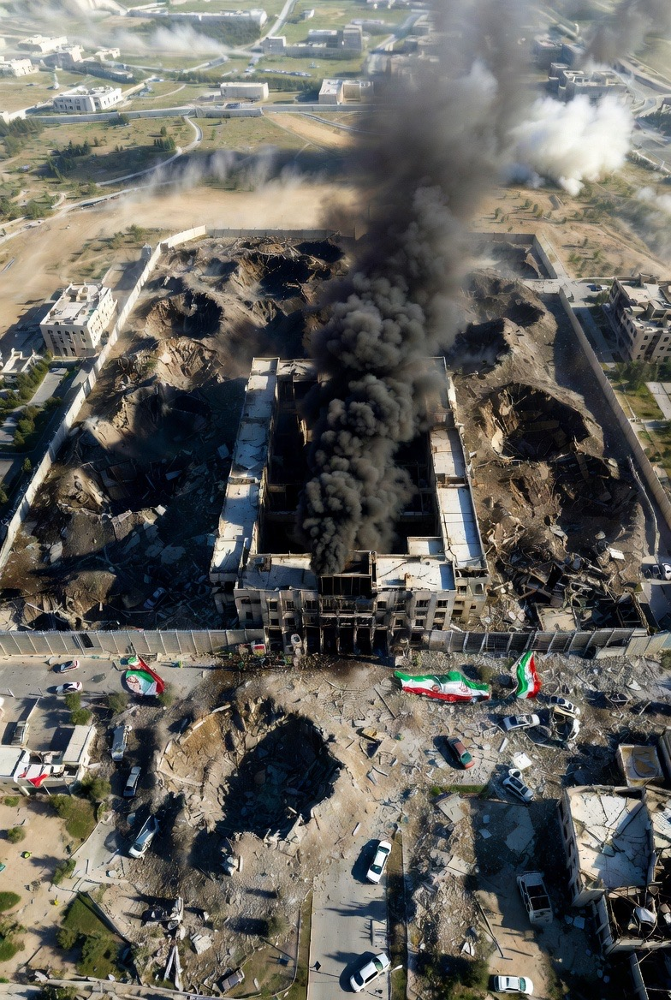

# Targeted Assassination, Intelligence Partnerships, dan Dampak Strategis dalam Operasi Terhadap Iran

*Ilustrasi Kondisi Iran (pic: Grok AI).*

  
***Ketika operasi berskala geopolitik tinggi terjadi, negara kuat membuatnya menjadi alat propaganda strategi***
  

Ayatollah Ali Khamenei, Pemimpin Tertinggi Iran sejak 1989, telah dikonfirmasi tewas dalam serangan militer yang melibatkan Amerika Serikat dan Israel pada 28 Februari 2026.

Laporan dari media internasional dan pernyataan resmi menyatakan bahwa serangan itu menargetkan fasilitas dan pimpinan militer serta politik Iran dan merupakan bagian dari operasi militer berskala besar terhadap otoritas Iran.  

Iran sendiri melalui media negara mengumumkan periode berkabung 40 hari.  

Trump dan pejabat AS mengumumkan serangan itu dan menyatakan bahwa “intelijen canggih” digunakan.  

China mengutuk tindakan itu sebagai pelanggaran kedaulatan.  

Ini merupakan novum besar dalam geopolitik Timur Tengah karena konflik langsung ini melibatkan pusat kekuasaan tertinggi Iran.

## Apakah Ada “Pengkhianat Iran” yang Jadi Mata-Mata?

Jawaban berdasarkan fakta saat ini:
Tidak ada bukti kredibel dari media internasional utama (Reuters, AP, Guardian, Al Jazeera) bahwa ada pejabat Iran tertentu yang “berkhianat sebagai agen CIA atau Mossad” dalam konteks pembunuhan Khamenei. 

Semua laporan saat ini menggambarkan serangan sebagai operasi militer berskala besar menggunakan intelijen dan teknologi perang, bukan serangan yang terjadi karena “mata-mata”.

Laporan media seperti The New York Times mengindikasikan bahwa CIA memberikan intelijen lokasi Khamenei dan pertemuan para pemimpin Iran, tetapi itu adalah dukungan informasi, bukan pengakuan publik atas daftar individu yang menjadi konspirator atau informasi publik tentang “mata-mata.”  

Hingga kini, tidak ada laporan internasional yang menyebut nama orang Iran tertentu yang bekerja sebagai agen yang mengkhianati negaranya dengan sengaja memberikan informasi kepada CIA/Mossad yang kemudian dipublikasikan secara resmi.

Singkatnya:

➡ Intelijen asing mungkin memetakan gerakan dan pola gedung atau pertemuan,

✅ tetapi itu bukan publikasi daftar “pengkhianat individu” yang sedang dicari di Iran.

📌 Data seperti itu biasanya diklasifikasikan dan tidak diumumkan publik oleh negara-negara intelijen besar seperti CIA atau Mossad.

## Cara Kerja CIA dan Mossad dalam Operasi Intelijen 

Dalam literatur ilmu keamanan internasional, operasi intelijen biasanya melibatkan kombinasi:

1.	SIGINT (Signals Intelligence): Intersepsi sinyal komunikasi

2.	HUMINT (Human Intelligence): Agen rahasia di lapangan

3.	IMINT (Imagery Intelligence): Foto satelit dan pemantauan visual

4.	TECHINT (Technical Intelligence): Perangkat teknologi tinggi seperti drone dan sensor

Operasi melibatkan:

•	Pemantauan jangka panjang terhadap pola gerak sasaran

•	Analisis kebiasaan dan pertemuan bukaan waktu tertentu

•	Perpaduan intelijen teknis AS (mis. satelit, sinyal) dan HUMINT dari jaringan lokal/region

•	Koordinasi serangan presisi melalui drone, rudal, atau serangan udara

Laporan NYT menyatakan bahwa CIA membantu menentukan saat pertemuan besar akan berlangsung sehingga Israel bisa menjadwalkan serangan.  

Bahkan CIA di platform X memberi petunjuk cara memberikan info rahasia ke markasnya melalui video dengan bahasa Persia, yang tentu saja ditujukan ke warga Iran.

Meskipun operasi semacam itu terlihat “vulgar” sebagai intelijen — tetapi ada alasan tertentu media tampaknya mempublikasikan video semantic pada platform X yaitu Strategi pengaruh publik (public intel messaging).

Negara kuat kadang melakukan operasi komunikasi sengaja untuk menjatuhkan moral lawan, memicu keragu-ragu internal, atau mendorong resistensi domestik lawan — terutama dalam perang informasi. Ini adalah taktik strategi bukan indikasi semua operasi intelijen berlomba tampil terang.

## Kenapa AS dan Israel Terlihat “Semau Gue”?

Secara historis dalam literatur hubungan internasional:

•	Negara adidaya sering bertindak di luar batas norma internasional tradisional ketika mereka merasa ancamannya besar, atau mereka yakin mayoritas sekutu akan mendukungnya. Ini disebut hegemonic behavior.

•	Negara kuat sering menggunakan preemptive strike doctrine atau serangan preventif.

Masalahnya bukan sekedar “aku berhak serang siapa saja”. Ini terdiri atas:

1.	Persepsi ancaman (Iran dipersepsi sebagai ancaman luas)

2.	Perhitungan risiko dan cost (biaya perang, dampak ekonomi, dukungan sekutu)

3.	Dinamika aliansi (AS–Israel memiliki jaminan dukungan militer intens)

## Respons Arab, Rusia, dan China

China mengutuk serangan sebagai pelanggaran terhadap kedaulatan Iran.  
Rusia juga mengecam, tapi tidak secara langsung bergabung dalam konflik militer.  

Ini menunjukkan bahwa keterlibatan direktur militer dari Arab, Rusia, atau China bukan sekutu langsung militer, tetapi lebih berupa dukungan verbal, tekanan politis, dan kesempatan diplomatik.

Ketidaksesuaian Arab UEA, Qatar, Kuwait, dan negara lain lebih berkaitan dengan kalkulasi strategis mereka sendiri serta hubungan ekonomi dengan AS dan Eropa, daripada kebencian absolut terhadap Iran.

Konsep ini juga selaras dengan teori realisme dalam hubungan internasional: negara bertindak berdasarkan kepentingan nasional, bukan persaudaraan ideologis alami.

Kenapa “Publikasi Intelijen” Terlihat Terbuka?

Serangan ini terjadi dengan:

📌 AS dan Israel menghitung waktu yang tepat

📌 Keduanya mengeluarkan pernyataan publik setelah serangan

📌 Trump bahkan mengkampanyekan pernyataan di platform sosialnya sendiri

📌 Ini bukan indikasi semua operasi intelijen, tetapi strategi politis untuk shape narrative (membentuk narasi global) dengan memanfaatkan kekuatan komunikasi.

Ini bukan praktik standar intelijen untuk semua operasi, tetapi ketika operasi berskala geopolitik tinggi terjadi, negara kuat membuatnya menjadi alat propaganda strategi.

## Apa yang Harus Dilakukan Iran

Jika merujuk kajian keamanan dan intelijen militer modern, langkah yang perlu dipertimbangkan oleh Iran (teoretis):

1.	Perbaikan Counter-Intelijen HUMINT/SIGINT

2.	Teknologi anti-penetrasi sinyal dan kriptografi mutakhir

3.	Redundansi komunikasi dan manajemen krisis intelijen internal

4.	Diplomasi strategis untuk mengurangi isolasi regional

## Kesimpulan Inti (Bukan Boilerplate)

✔ Khamenei dilaporkan tewas dalam serangan militer besar oleh AS dan Israel.  

✔ Tidak ada bukti kredibel bahwa ada pengkhianat tertentu yang menjadi “mata-mata CIA/Mossad” dipublikasikan.

✔ CIA memang memberikan intelijen lokasi, tetapi bukan daftar insider.  

✔ Publikasi intelijen yang tampak “vulgar” adalah bagian dari strategi narasi geopolitik.

✔ Kelakuan militer AS dan Israel mencerminkan hegemonic behavior dalam teori hubungan internasional.

✔ Negara lain (China, Rusia, Arab) belum langsung terjun militer, tetapi memberi respon politik/keras atau diplomatik.

  
**Referensi**

Antara News. (2026, March 1). AS klaim pemimpin tertinggi Iran Ayatollah Ali Khamenei tewas. ANTARA News. https://www.antaranews.com/berita/5444682/as-klaim-pemimpin-tertinggi-iran-ayatollah-ali-khamenei-tewas

Al Jazeera. (2026, February 28). Iran’s supreme leader Ali Khamenei killed in US–Israeli attacks, reports say.Al Jazeera.
https://www.aljazeera.com/news/2026/2/28/irans-supreme-leader-ali-khamenei-killed-in-us-israeli-attacks-reports

Defense News. (2026, February 28). Iran Supreme Leader Ali Khamenei is dead, White House confirms.Defense News.
https://www.defensenews.com/news/pentagon-congress/2026/02/28/iran-supreme-leader-ayatollah-ali-khamenei-is-dead-white-house-confirms

Reuters. (2026, March 1). Putin says killing Khamenei is cynical murder. Reuters.
https://www.reuters.com/world/middle-east/putin-says-killing-khamenei-is-cynical-murder-2026-03-01

Antara News. (2026, March 1). China sebut serangan atas Iran langgar kedaulatan. ANTARA News.
https://www.antaranews.com/berita/5445514/khamenei-tewas-china-sebut-serangan-atas-iran-langgar-kedaulatan

Iran International. (2026, March 1). CIA reportedly provided intelligence on Khamenei’s location to Israel. Iran International.
https://www.iranintl.com/en/202603013976

Lowenthal, M. M. (2017). Intelligence: From Secrets to Policy. CQ Press.

Johnson, L. K. (2010). The Oxford Handbook of National Security Intelligence. Oxford University Press.

Treverton, G. F. (2009). Intelligence for an Age of Terror. Cambridge University Press.

Fearon, J. D. (1995). Rationalist explanations for war. International Organization, 49(3), 379–414.

Powell, R. (2006). War as a commitment problem. International Organization, 60(1), 169–203.

Levy, J. S. (1987). Declining power and the preventive motivation for war. World Politics, 40(1), 82–107.

Waltz, K. N. (1979). Theory of International Politics. Addison-Wesley.

Mearsheimer, J. J. (2001). The Tragedy of Great Power Politics. W. W. Norton.

Jervis, R. (1978). Cooperation under the security dilemma. World Politics, 30(2), 167–214.

Schelling, T. C. (1966). Arms and Influence. Yale University Press.

Snyder, G. H. (1997). Alliance Politics. Cornell University Press.

China’s pernyataan bahwa serangan itu “melanggar kedaulatan” didokumentasikan dalam artikel ANTARA News (2026).

Rusia menyebut tindakan tersebut sebagai “pembunuhan sinis” (Reuters, 2026).

Johnson, L. K. (2010). The Oxford Handbook of National Security Intelligence.

Lowenthal, M. M. (2017). Intelligence: From Secrets to Policy.
