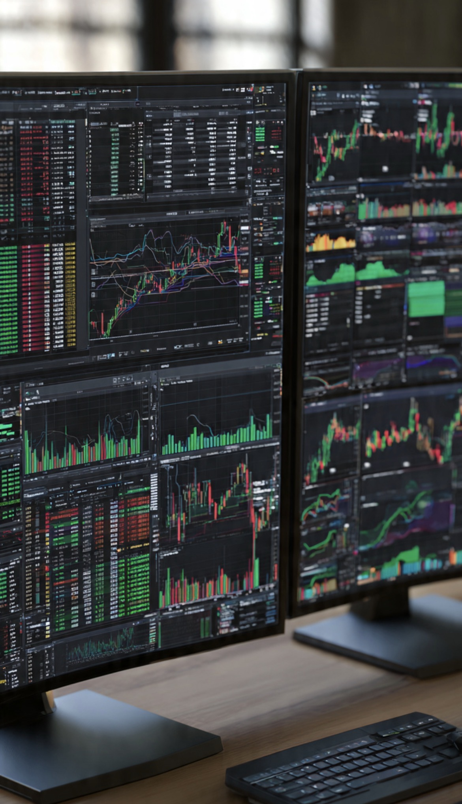

# Tau Gitu Gue Pasang Harga Selangit!: Counterfactual Thinking, Hindsight Bias, & Psikologi Penyesalan Pengambilan Keputusan Investasi

*Ilustrasi (pic: Meta AI).*

  
***Keuntungan di “harga langit” hanya lahir setelah otak diberi hak istimewa yang tidak dimiliki siapa pun saat membuat keputusan melihat masa depan dari kaca spion***
  

Salah satu pengalaman paling umum dalam investasi adalah menjual aset pada harga yang secara rasional dianggap wajar, kemudian menyaksikan harga tersebut melonjak jauh melampaui ekspektasi. 

Fenomena ini sering memunculkan penyesalan (regret), pikiran alternatif (counterfactual thinking), dan ilusi bahwa hasil ekstrem sebenarnya dapat diprediksi. 

Artikel ini mengkaji fenomena tersebut melalui perspektif psikologi kognitif, keuangan perilaku (behavioral finance), teori keputusan, dan efisiensi pasar. 

Analisis menunjukkan bahwa penyesalan investor sering kali bukan berasal dari keputusan yang buruk, melainkan dari kecenderungan otak membandingkan keputusan masa lalu dengan informasi yang baru tersedia setelah peristiwa terjadi.

## Pendahuluan

Bayangkan seorang investor menjual saham berdasarkan: analisis teknikal, kondisi pasar, serta target keuntungan yang telah ditentukan.

Beberapa jam kemudian, harga saham justru melonjak ke tingkat yang bahkan sebelumnya tampak tidak realistis.

Respons spontan yang muncul hampir selalu sama: “Tau gitu gue pasang harga lebih tinggi!”

Kalimat sederhana ini sesungguhnya membuka pintu menuju berbagai fenomena psikologi kognitif yang telah lama dipelajari dalam ilmu perilaku manusia.

## Counterfactual Thinking: Membangun Dunia yang Tidak Pernah Terjadi

Psikolog menyebut kecenderungan membayangkan skenario alternatif setelah suatu kejadian sebagai counter factual thinking

Contohnya: “Seandainya aku menunggu lima menit lagi…” “Seandainya aku tidak menjual hari ini…” “Seandainya aku memasang harga tertinggi…”

Fenomena ini memiliki fungsi adaptif karena membantu manusia belajar dari pengalaman. Namun jika berlebihan, ia berubah menjadi sumber penyesalan kronis.

## Hindsight Bias: Ilusi “Harusnya Sudah Tahu”

Fenomena kedua adalah hindsight bias. Yaitu setelah mengetahui hasil akhir, otak mulai merasa bahwa: “Sebenarnya kenaikan itu sudah bisa ditebak.” Padahal sebelum kenaikan terjadi, informasi tersebut belum tersedia.

Hindsight bias membuat masa lalu tampak jauh lebih mudah diprediksi dibandingkan kenyataan saat keputusan dibuat.

## Pasar Saham dan Ketidakpastian

Pasar modal adalah sistem kompleks yang dipengaruhi oleh arus dana, sentimen investor, likuiditas, berita, algoritma perdagangan, dan psikologi massa.

Pada saham yang pernah mengalami penghentian sementara (trading halt atau suspensi) akibat volatilitas ekstrem, pergerakan harga sering kali menjadi lebih sulit diprediksi.

Dalam kondisi seperti ini, lonjakan harga dapat melampaui estimasi rasional investor.

## Regret Theory

Dalam behavioral finance, terdapat konsep Regret Theory. Artinya investor tidak hanya mengejar keuntungan, mereka juga berusaha menghindari penyesalan.

Ironisnya, semakin besar peluang keuntungan yang “tertinggal”, semakin besar pula rasa kehilangan yang dirasakan, meskipun transaksi yang dilakukan sebenarnya sudah menghasilkan keuntungan.

Dengan kata lain, keuntungan yang nyata sering terasa lebih kecil dibandingkan keuntungan hipotetis yang tidak pernah dimiliki.

## Rasionalitas Tidak Sama dengan Kesempurnaan

Kesalahan yang sering dilakukan investor adalah menganggap hasil terbaik sama dengan keputusan terbaik. Padahal dua hal tersebut tidak selalu sama.

Keputusan yang baik adalah keputusan yang dibuat berdasarkan informasi yang tersedia saat itu, strategi yang konsisten, serta manajemen risiko yang sehat.

Bahwa pasar kemudian bergerak jauh di luar ekspektasi bukan berarti keputusan awal menjadi salah.

## Pelajaran dari Pengalaman

Kalimat: “Ya sudah, ambil pelajarannya saja.” mencerminkan salah satu karakteristik investor yang berkembang.

Fokus bergeser dari “Mengapa aku tidak mendapat harga tertinggi?” menjadi “Apa yang bisa kupelajari agar strategi berikutnya lebih baik?”

Perubahan orientasi ini merupakan ciri growth mindset dalam pengambilan keputusan finansial.

## Humor sebagai Mekanisme Regulasi Emosi

Kalimat: “Nanti kalau sudah tidak suspend, kuborong terus taruh harga tertinggi sedunia dan akhirat.” 

Dalam psikologi, humor sering berfungsi sebagai mekanisme regulasi emosi, cara meredakan frustrasi, strategi mempertahankan optimisme.

Humor tidak menghapus penyesalan, tetapi akan membantu mengurangi beban emosional sehingga investor dapat kembali berpikir rasional.

## Paradoks Investor Berpengalaman

Semakin lama seseorang berada di pasar, semakin ia menyadari satu kenyataan, bahwa tidak ada yang secara konsisten mampu menjual tepat di harga puncak.

Puncak harga baru benar-benar diketahui setelah puncak itu berlalu. Inilah paradoks terbesar pasar modal.

Penyesalan setelah menjual saham yang kemudian melonjak merupakan konsekuensi alami dari cara kerja otak manusia dalam menghadapi ketidakpastian.

Fenomena seperti counterfactual thinking, hindsight bias, dan regret theory menjelaskan mengapa investor sering merasa kehilangan keuntungan yang sebenarnya belum pernah dimiliki.

Dalam investasi jangka panjang, kualitas keputusan jauh lebih penting daripada keberuntungan sesaat.

Keputusan yang disiplin dan konsisten akan lebih menentukan keberhasilan dibandingkan kemampuan menebak puncak harga secara sempurna.

Untung itu nyata, penyesalan itu imajinasi. Karena keuntungan yang sudah dkantongi benar-benar ada.

Sedangkan keuntungan di “harga langit” hanya lahir setelah otak diberi hak istimewa yang tidak dimiliki siapa pun saat membuat keputusan melihat masa depan dari kaca spion. 

  
**Referensi**

Daniel Kahneman. (2011). Thinking, Fast and Slow. Farrar, Straus and Giroux.

Richard H. Thaler. (2015). Misbehaving: The Making of Behavioral Economics. W. W. Norton & Company.

Amos Tversky, & Daniel Kahneman. (1974). Judgment under Uncertainty: Heuristics and Biases. Science.

Graham Loomes, & Robert Sugden. (1982). Regret Theory: An Alternative Theory of Rational Choice Under Uncertainty. The Economic Journal.

Philip E. Tetlock. (2005). Expert Political Judgment. Princeton University Press.
