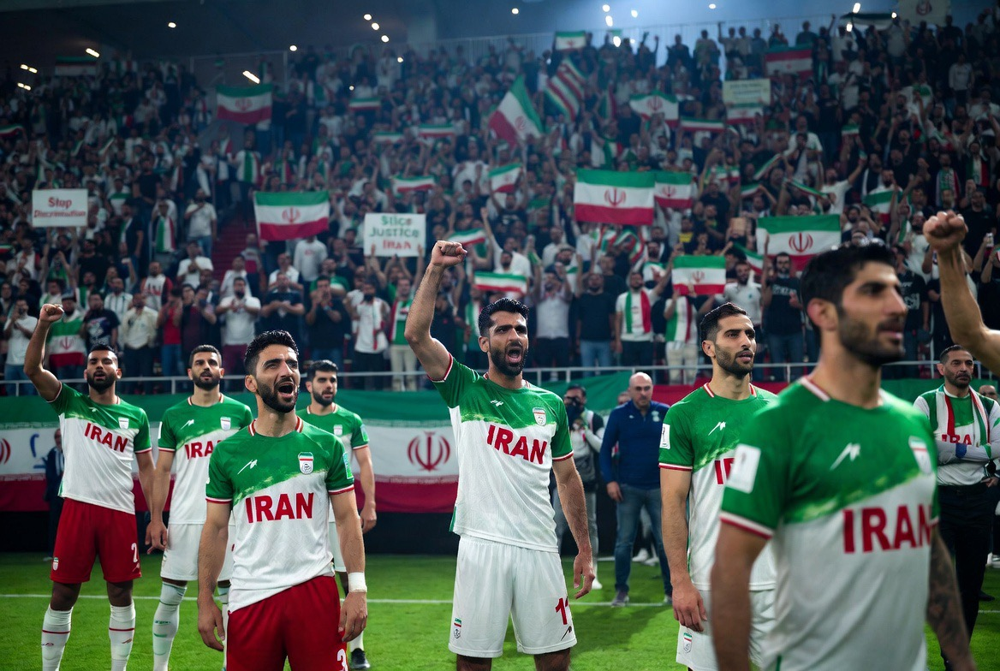

# Team Melli di World Cup 2026: Ketika Sepak Bola Bertemu Paspor, Politik, dan Kecurigaan

*Ilustrasi (pic: Grok AI).*

  
***Mereka datang bukan membawa rudal. Mereka hanya membawa bola, lambang negara, dan harapan untuk menang***
  

Iran tidak didiskualifikasi. Mereka tetap bermain, mereka bahkan menahan imbang New Zealand 2-2 di pertandingan pembuka di Los Angeles. 

Tetapi di luar lapangan, mereka menghadapi berbagai pembatasan yang tidak dialami tim lain.  

## Iran Tidak Benar-Benar “Menjadi Tuan Atas Nasibnya”

Awalnya Team Melli berencana membuat base camp di Arizona. Tetapi karena ketegangan AS-Iran, masalah visa, dan kekhawatiran keamanan, mereka memindahkan markas ke Tijuana, Meksiko, sekitar 140 mil dari Los Angeles.  

Hasilnya?

Setelah pertandingan, tidak boleh recovery semalam, tidak boleh tinggal lebih lama, harus segera kembali ke Tijuana.

Pelatih Amir Ghalenoei bahkan berkata: “Saya rasa tim kami mungkin yang paling tertindas di seluruh World Cup.”

Pernyataan itu memang benar-benar ia ucapkan.  

## Apakah Ini Diskriminasi?

Nah, di sinilah perang argumen dimulai.

Pihak Iran berkata: Kami diperlakukan berbeda.

Mereka mengeluhkan beberapa staf ditolak visanya, federasi dan media tidak bisa hadir penuh, jadwal perjalanan dipersulit, recovery pemain terganggu, dan FIFA tidak cukup membantu.  

Pihak AS menjawab: Ini bukan diskriminasi.

Mereka mengatakan seluruh pemain dan pelatih utama tetap mendapat visa, pembatasan dilakukan demi keamanan, tidak ada ancaman spesifik, tetapi hubungan AS-Iran yang baru pulih membuat pengawasan lebih ketat.  

Tetapi… Kalau diperlakukan berbeda, bukankah Itu Juga bentuk diskriminasi?

Secara hukum internasional, diskriminasi biasanya berarti perlakuan berbeda tanpa alasan objektif yang proporsional.

AS akan berkata: “Ada alasan keamanan.”

Iran akan berkata: “Alasan itu berlebihan dan tidak diterapkan ke tim lain.”

Dan FIFA sekarang berada di posisi paling tidak enak, karena mereka harus menjawab: Apakah World Cup milik sepak bola…atau ikut menjadi arena kebijakan luar negeri?

## Ironi Besar

Yang membuat kening mengernyit adalah, baru beberapa hari lalu, Amerika Serikat dan Iran mengumumkan MoU damai.

Dunia berharap hubungan membaik. Tetapi di World Cup, tim Iran masih bolak-balik Meksiko-AS, dibatasi, dipersulit, dan mengajukan komplain ke FIFA.  

Seolah-olah perdamaian sudah ditandatangani oleh diplomat namun belum ditandatangani oleh birokrasi.

## Apakah FIFA Gagal?

FIFA selalu menjual slogan: “Football Unites The World” Tetapi kalau suporter dibatasi, staf tidak bisa masuk, dan tim harus tinggal di negara lain, maka orang akan bertanya: Apakah lapangannya netral? atau apakah geopolitik ikut menentukan siapa yang nyaman bermain?

Tidak ada yang perlu dikhawatirkan jika Iran kalah karena Belgia, itu biasa, yang justru dikhawatirkan adalah jika Iran merasa kalah sebelum pertandingan dimulai.

Karena ketika olahraga berubah menjadi paspor, visa, sanksi, dan dendam geopolitik, maka stadion tidak lagi menjadi tempat orang melupakan perang. Ia justru menjadi perpanjangan perang dengan jersey dan lagu kebangsaan.

Ada ironi yang hampir puitis. Beberapa hari lalu, AS dan Iran berkata: “Mari berdamai.” Namun sekarang, para pemain Iran harus melewati pemeriksaan, pulang-pergi lintas negara, dan membuktikan bahwa mereka… bukan ancaman.

Padahal mereka datang bukan membawa rudal. Mereka hanya membawa bola, lambang negara, dan harapan untuk menang.

Tetapi kadang… dalam dunia yang penuh luka, bahkan sepak bola pun tidak sepenuhnya bebas dari politik.

  
**Referensi utama:** laporan Reuters 16, 20, dan 21 Juni 2026; The Guardian 16 dan 19 Juni 2026; serta liputan AP dan Sky Sports mengenai pembatasan perjalanan Team Melli dan protes resmi Iran ke FIFA.    
