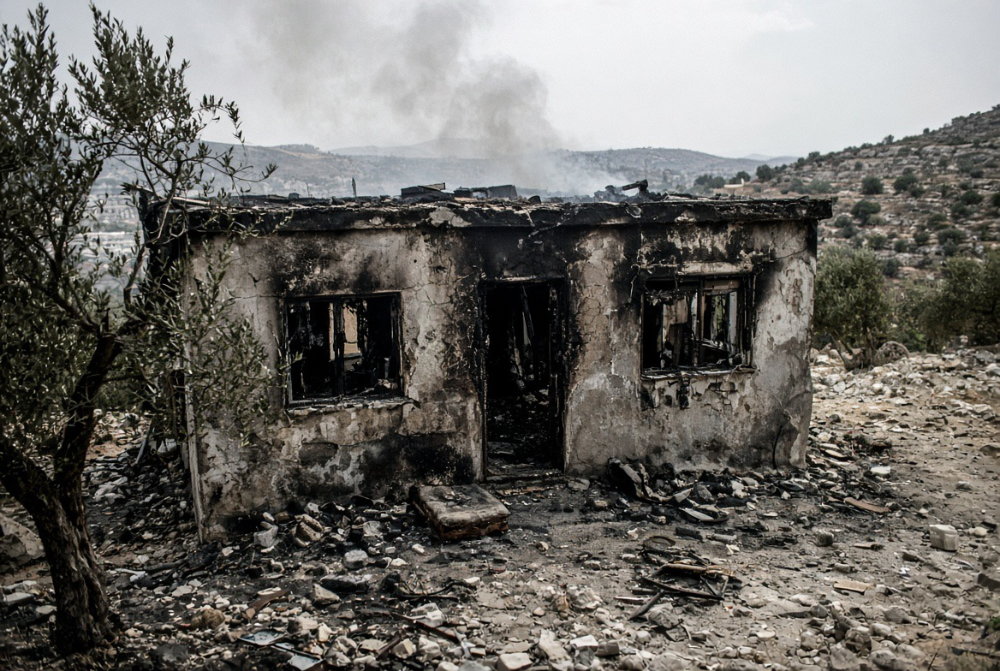

# Tepi Barat: Rumah Dibakar, Tanah Direbut, & Kekerasan Mulai Menjadi Metode Politik

*Ilustrasi (pic: Grok AI).*

  
***Setelah rumah itu terbakar, siapa yang tinggal? Setelah keluarga itu pergi, siapa yang mengambil tanahnya? Dan setelah kekerasan menjadi normal, siapa yang akhirnya memperoleh keuntungan politik darinya?***
  

Kekerasan pemukim di Tepi Barat tidak boleh direduksi menjadi kenakalan individu. 

Ketika pembakaran rumah, pengepungan, penyerangan, pengusiran dan ekspansi permukiman terjadi berulang; ketika sebagian pejabat pemerintah justru mendorong perluasan kontrol teritorial; dan ketika penegakan hukum terhadap pelaku lemah, kekerasan mulai berfungsi sebagai mekanisme displacement, bukan sekadar kriminalitas sporadis.

Dan di sinilah ucapan politisi garis keras yang sering terlontar menjadi relevan.

## Bukan Sekadar “Rumah Dibakar”

Kasus paling mencolok beberapa hari terakhir adalah Qusra, dekat Nablus.

Pemukim Israel mengepung sejumlah rumah Palestina selama berhari-hari, membatasi akses warga terhadap air, listrik dan kebutuhan dasar. 

Pada satu titik sekitar 15 warga Palestina, termasuk dua anak, terjebak di tiga rumah. Pemerintah AS bahkan mengecam pengepungan tersebut. 

Reuters melaporkan bahwa salah satu keluarga di Qusra mengalami pengepungan selama lebih dari seminggu, sementara tentara Israel kemudian menetapkan kawasan tersebut sebagai closed military zone. 

Dan serangan pembakaran bukan sekadar rumor media sosial. Laporan terbaru mencatat rumah-rumah Palestina dibakar dalam eskalasi kekerasan pemukim tahun ini. 

## Qusra: Sesuatu yang Lebih Mengerikan 

Bayangkan mekanismenya, pemukim Israel datang, rumah dikepung, akses air/listrik dibatasi, warga ketakutan, kehadiran militer muncul, wilayah ditetapkan sebagai zona militer, penduduk Palestina akhirnya menghadapi tekanan untuk pergi.

Kalau proses ini berlangsung berulang, maka kekerasan memiliki fungsi teritorial. Bukan sekadar “Saya benci tetangga saya. Melainkan “Saya membuat kehidupanmu begitu tidak aman sehingga tanah yang kamu tinggali akhirnya tidak lagi dapat kamu pertahankan.”

Dan itu sudah masuk ke wilayah forced displacement.

Human Rights Watch pada 20 Agustus secara eksplisit mengatakan bahwa serangan pemukim yang semakin intens di Tepi Barat mendorong perpindahan paksa komunitas Palestina, dan menuduh otoritas Israel memberikan senjata, pendanaan, serta impunitas kepada pemukim yang melakukan kekerasan. 

## Ben-Gvir dan Smotrich 

Ini bagian yang membuat situasinya jauh lebih serius.

Itamar Ben-Gvir, menteri keamanan nasional Israel, baru-baru ini menyerukan pembunuhan 30–40 orang di Gaza setiap malam, termasuk orang-orang yang menurutnya “tidak layak hidup”, sekaligus mendorong kembalinya permukiman Yahudi di Gaza. 

Kemudian ada Bezalel Smotrich, menteri keuangan sekaligus figur utama gerakan pemukiman, yang secara konsisten mendukung ekspansi permukiman dan kontrol Israel atas wilayah Palestina.

Sekarang perhatikan paradoksnya.

Di Gaza, politisi garis keras berbicara mengenai penghancuran, pengusiran, dan pemukiman kembali.

Di Tepi Barat, kita melihat ekspansi permukiman , kekerasan pemukim, pengusiran komunitas , dan perebutan tanah.

Kita tidak boleh otomatis menyimpulkan bahwa setiap pembakaran rumah adalah perintah langsung Ben-Gvir atau Smotrich.

Tetapi secara analitis, kita harus bertanya: Apakah retorika politik tersebut menciptakan lingkungan yang membuat kekerasan pemukim semakin mungkin, semakin diterima, atau semakin sulit dihukum?

Dan bukti terbaru memberikan alasan kuat untuk menganggap pertanyaan itu serius.

## Permissive Environment

Dalam ilmu politik dan studi konflik, negara tidak harus mengeluarkan perintah “Pergilah bakar rumah Palestina.”

Ada mekanisme yang lebih subtil. Misalnya politisi menggunakan retorika dehumanisasi, kekerasan terhadap kelompok tertentu dinormalisasi, penegakan hukum lemah, pelaku merasa risiko hukumnya rendah, serangan berulang, penduduk mengalami displacement, tanah menjadi lebih mudah dikuasai.

Itu disebut permissive environment, yaitu lingkungan politik dan institusional yang memungkinkan kekerasan berkembang.

AP dalam laporan terbarunya mengenai Qusra menyoroti bahwa pemerintahan Netanyahu selama bertahun-tahun mendukung ekspansi permukiman, sementara kekerasan pemukim sering tidak ditindak secara efektif. 

Dan itu penting, karena impunitas bukan sekadar tidak menghukum pelaku setelah kejadian, impunitas juga bisa menjadi insentif sebelum kejadian berikutnya.

## Semua Pemukim Sama dengan Pemerintah?

Tidak setiap pemukim Israel membakar rumah, menyerang Palestina, mendukung kekerasan, atau terlibat dalam pengusiran. Dan tidak setiap tindakan pemukim otomatis merupakan operasi pemerintah.

Ada aktor non-negara. Namun hubungan antara aktor non-negara dan negara menjadi penting ketika negara memberi perlindungan, menyediakan senjata, membiarkan pelanggaran, gagal melakukan penegakan hukum, atau secara politik mendukung ekspansi permukiman.

Jadi pertanyaan ilmiahnya bukan “Apakah semua pemukim adalah agen pemerintah?” Melainkan “Seberapa besar negara memungkinkan, memfasilitasi, atau gagal mencegah kekerasan pemukim?”

Itu pertanyaan yang jauh lebih serius.

## Perubahan Pola Tepi Barat

Menurut laporan terbaru yang dikutip The Guardian dari organisasi Israel Yesh Din, kekerasan pemukim tidak lagi hanya terkonsentrasi di daerah pedesaan terpencil.

Serangan semakin masuk ke Area A dan B, yang menurut kerangka Oslo berada di bawah administrasi Palestina dalam berbagai tingkat.

Yesh Din mencatat peningkatan tajam insiden di wilayah-wilayah tersebut. Mereka menilai pola itu berkaitan dengan upaya memperluas permukiman dan mengurangi keberadaan Palestina. 

Kalau benar demikian, ini bukan sekadar “pemukim menyerang desa.” Ini mulai menyerupai territorial penetration.

Masuk ke wilayah yang sebelumnya relatif berada di luar jangkauan kekerasan pemukim, menciptakan ketidakamanan, serta mempersempit ruang hidup Palestina.

## Hukum Universal yang Enforcement-nya Tidak Universal

Pemukim melakukan kekerasan, korban Palestina mencari perlindungan. Tetapi bila sistem penegakan hukum gagal memberikan perlindungan efektif maka kekerasan akan terus berulang.

Akibatnya korban bukan hanya kehilangan keamanan. Mereka dapat kehilangan rumah, tanah, mata pencaharian, komunitas, dan akhirnya tempat tinggal.

Jadi hukum bisa tetap tertulis di buku. Tetapi kalau pelaku mengetahui bahwa kemungkinan dihukum rendah, norma hukum kehilangan daya pencegahnya.

## Retorika Politik Bukan “Cuma Omongan”

Ben-Gvir mengatakan: orang tertentu “tidak layak hidup”. Kalimat seperti itu bukan otomatis bukti bahwa setiap tentara atau pemukim akan membunuh warga sipil.

Tetapi ia menggeser batas wacana.

Kemarin “Jangan menyerang warga sipil.”

Hari ini: “Kelompok itu tidak layak hidup.”

Besok: “Mereka harus pergi.”

Lusa: “Tanah mereka harus menjadi milik kita.”

Inilah yang dalam studi kekerasan sering disebut normalization of extreme discourse.

Bahasa menciptakan ruang moral untuk kebijakan. Dan ketika bahasa tersebut keluar dari mulut pejabat negara, efeknya jauh lebih besar daripada ucapan seorang pengguna internet.

## Rumah Menjadi Target yang Sangat Politis? 

Rumah bukan hanya bangunan, dalam konflik teritorial, rumah adalah kehadiran.

Kalau rumah dibakar, maka tempat tinggal hilang. Kalau lahan pertanian dirusak, mata pencaharian hilang. Kalau jalan diblokade, akses komunitas hilang. Kalau sumber air dikuasai, kehidupan sehari-hari tergantung pada pihak lain.

Kalau semua berlangsung bersamaan, maka territorial control berubah menjadi social control.

Itulah mengapa kekerasan pemukim tidak boleh dianalisis hanya sebagai kriminalitas. Dalam konteks tertentu, ia dapat menjadi instrumen displacement.

## Gaza dan Tepi Barat Mulai Membentuk Satu Gambar

Bukan berarti keduanya identik.

Gaza: perang skala besar, operasi militer, kehancuran massal, blokade/pembatasan bantuan, krisis kemanusiaan.

Tepi Barat : pendudukan, ekspansi permukiman, kekerasan pemukim, penahanan, pembatasan pergerakan, pengambilalihan tanah, dan displacement.

Tetapi keduanya mempunyai satu pertanyaan politik yang sama: Siapa yang akhirnya mempunyai kontrol efektif atas tanah dan siapa yang masih dapat hidup di atasnya?

Dan ketika politisi pemerintah secara terbuka mendorong ekspansi teritorial atau pengusiran, hubungan antara retorika, kebijakan, kekerasan lapangan menjadi sesuatu yang harus diawasi dengan sangat ketat.

Kekerasan pemukim di Tepi Barat tidak dapat dipahami hanya sebagai tindakan kriminal individual. 

Eskalasi pembakaran rumah, pengepungan keluarga, serangan fisik dan pengusiran harus dibaca dalam konteks ekspansi permukiman, lemahnya penegakan hukum terhadap pelaku, dan kebijakan politik yang semakin terbuka terhadap kontrol teritorial Israel.

Dan ketika tokoh pemerintah seperti Ben-Gvir dan Smotrich menggunakan retorika yang mendorong pembunuhan, pengusiran atau perluasan kontrol Israel, kita memperoleh konteks politik yang membuat kekerasan tersebut semakin mengkhawatirkan. 

Itu belum otomatis membuktikan setiap serangan pemukim diperintahkan pemerintah, tetapi cukup kuat untuk menuntut pemeriksaan mengenai fasilitasi, toleransi, impunitas dan hubungan antara kebijakan negara dengan kekerasan aktor non-negara. 

Dan kalimat paling pahitnya adalah, kalau rumah dibakar, tanah direbut, penduduk diusir, lalu negara yang seharusnya melindungi korban gagal menghentikannya, “pemukim” dan “negara” memang bukan aktor yang sama. Tetapi korban akan merasakan akibatnya sebagai satu sistem kekuasaan.

Itulah mengapa kasus Tepi Barat sekarang sangat serius. Bukan cuma karena ada api di sebuah rumah. Tetapi karena kita harus bertanya: Setelah rumah itu terbakar, siapa yang tinggal? Setelah keluarga itu pergi, siapa yang mengambil tanahnya? Dan setelah kekerasan menjadi normal, siapa yang akhirnya memperoleh keuntungan politik darinya?

Nah. Di situlah api rumah berubah menjadi politik teritorial. 

  
**Referensi**

Associated Press. (2026, August 18). Israeli settlers besiege Palestinian families in West Bank village.

Human Rights Watch. (2026, August 20). West Bank: Israel-backed settler violence drives displacement.

Reuters. (2026, August 18). Israeli settler confronts Palestinian-American in his besieged West Bank home.

The Guardian. (2026, August 21). Israeli settler attacks shift to heart of territory earmarked for Palestinian state.

Financial Times. (2026, August 17). Israeli minister Ben-Gvir calls for killing Palestinians in Gaza.

United Nations Office of the High Commissioner for Human Rights. (2026, February). Ethnic cleansing concerns in Gaza and West Bank amid intensified violence and displacement.
