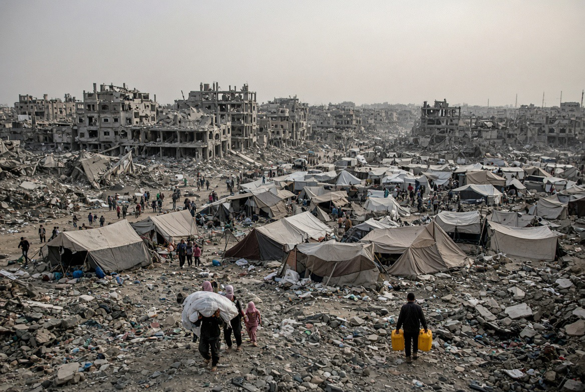

# Tiga Wajah Krisis Palestina: Terorisme, Keamanan, & Kritik Diplomatik Dibalas Pengusiran

*Ilustrasi (pic: Grok AI).*

  
***Palestina berada di bagian paling bawah lingkaran itu, sementara negara-negara kuat duduk di atasnya sambil berdebat siapa yang memegang spidol untuk menggambar peta berikutnya***
  

Ada satu benang merah yang menghubungkan ketiga berita ini: siapa yang memiliki kekuasaan untuk menentukan mana “keamanan”, mana “terorisme”, dan siapa yang boleh hadir di ruang pascaperang?

Dan di sinilah politik menjadi jauh lebih menarik daripada sekadar “Israel vs Palestina”.

## Palestine Action: Ketika Counter-Terrorism Bertemu Kebebasan Sipil

Pada 26 Agustus, AS menetapkan Palestine Action sebagai organisasi teroris transnasional. 

Kantor HAM PBB kemudian mengecam langkah tersebut sebagai pembatasan yang tidak proporsional terhadap kebebasan berekspresi dan ruang sipil. 

Reuters melaporkan PBB juga mengkritik penggunaan label “terorisme” secara luas dalam kasus ini. 

Nah, ini perlu dibedah dengan kepala dingin.

Palestine Action memang bukan organisasi yang hanya melakukan demonstrasi damai. Kelompok itu melakukan aksi langsung terhadap fasilitas yang mereka kaitkan dengan industri persenjataan Israel, termasuk pembobolan dan perusakan properti. AS mendasarkan penetapannya pada tindakan-tindakan tersebut. 

Kapan tindakan direct action berubah dari kriminalitas/protes menjadi terorisme? Ini penting karena hukum terorisme memiliki konsekuensi yang jauh lebih berat daripada hukum pidana biasa.

Kalau seseorang merusak fasilitas militer, disebut sebagai criminal damage, berbeda secara konseptual dengan terrorism designation.

Begitu label teroris ditempel, negara memperoleh instrumen yang jauh lebih luas untuk membekukan aset, membatasi pendanaan, dan mengisolasi jaringan organisasi. Dan PBB sekarang justru memperingatkan bahwa penggunaan label tersebut dapat menciutkan ruang sipil. 

Kalau negara menggunakan kekuatan terhadap penduduk sipil dengan alasan security, sementara kelompok yang menentang kebijakan tersebut diberi label terrorism, maka kita harus bertanya: Apakah definisi “keamanan” sedang menjadi alat netral, atau sudah menjadi instrumen politik?

## 42 Senator Demokrat: Washington Mulai Melihat Hubungan Sebab-Akibatnya?

Ini malah lebih menarik.

Pada 26 Agustus, 42 dari 47 senator Demokrat menandatangani surat kepada Netanyahu yang meminta Israel mengendalikan lonjakan kekerasan pemukim di Tepi Barat, menghentikan penangkapan massal terhadap Palestina, menyelidiki kematian warga AS, dan mengambil tindakan terhadap kekerasan pemukim. 

Reuters mencatat mereka secara khusus menyoroti peningkatan kekerasan fatal oleh pemukim, serangan terhadap masjid, penangkapan massal Palestina, serta kematian sembilan warga negara AS akibat pemukim atau pasukan keamanan Israel sejak 2022. 

Dan ini penting sekali, karena selama bertahun-tahun narasi keamanan sering berbentuk Palestinian violence dengan alasan Israeli security response.

Tetapi surat 42 senator itu memaksa Washington melihat arah sebaliknya, yakni Israeli settler violence, Palestinian displacement/resistance, menjadi Israeli security response.

Itu bukan berarti setiap tindakan perlawanan Palestina otomatis dibenarkan. Tetapi secara causal analysis, kekerasan pemukim dan ekspansi teritorial dapat menjadi bagian dari lingkungan yang menghasilkan radikalisasi dan perlawanan.

Kalau seseorang kehilangan rumah, tanah, sumber air, akses jalan, kebun, dan keamanan keluarga, kemudian negara mengatakan “Jangan melawan, nanti kamu dianggap ancaman keamanan.” maka kita sedang mengabaikan causal chain yang menghasilkan konflik.

## Ada Sesuatu yang Lebih Brutal

Bayangkan dua tindakan:
Aktor A
Pemukim mengambil tanah Palestina.
Aktor B
Palestina menyerang sebagai bentuk perlawanan.

Kemudian negara merespons: “Kami harus meningkatkan keamanan karena Palestina berbahaya.”  Lalu keamanan digunakan untuk lebih banyak pos pemeriksaan, penangkapan, pembatasan, dan  pemukiman.

Kemudian pembatasan itu menghasilkan lebih banyak frustrasi serta perlawanan. Lalu siklusnya berputar: Violence, securitization, repression, resistance, securitization.

Dalam ilmu politik, ini dekat dengan konsep security dilemma dan conflict spiral.

Yang berbahaya adalah ketika satu pihak hanya mengukur kekerasan yang dilakukan lawannya, tetapi tidak menghitung kekerasan yang mendahuluinya.

## Tepi Barat Bukan Sekadar “Masalah Beberapa Pemukim Nakal”

Ini perkembangan yang sangat penting.
Laporan terbaru menunjukkan pemukiman dan outpost Israel bahkan berkembang ke wilayah Area A dan B, sementara ekspansi tersebut dilaporkan bertujuan memperbesar kontrol teritorial dan memfragmentasi ruang Palestina. 

Sementara itu, kekerasan pemukim meningkat tajam. AP melaporkan bahwa pada 2026 setidaknya 87 warga Palestina tewas dalam hampir 1.500 serangan di Tepi Barat, sementara tiga warga Israel tewas. 

Nah, kalau kita hanya berkata: “Ada teroris Palestina.” kita kehilangan separuh persamaan. Karena kita harus bertanya: Apa kondisi sosial-politik yang membuat kekerasan terus direproduksi?

Dan jawabannya bukan hanya ideologi. Ada territorial expansion, settlement, displacement, impunity, serta security repression.

## Israel Mengusir Pejabat Inggris dari Pusat Koordinasi Gaza?

Israel memang sedang mempertimbangkan mengeluarkan pejabat Inggris, dan kemungkinan pejabat Eropa lainnya, dari International Gaza Support Center, pusat koordinasi yang dipimpin AS untuk mendukung implementasi gencatan senjata dan rekonstruksi Gaza. 

Dan alasannya?

Menurut laporan Financial Times, langkah tersebut berkaitan dengan kritik Eropa terhadap kebijakan Israel di wilayah Palestina, terutama persoalan pemukiman. 

Bahkan Belanda sudah diberi tahu untuk meninggalkan pusat tersebut setelah pemerintah Belanda mengambil langkah perdagangan terkait produk dari permukiman di Tepi Barat dan wilayah pendudukan lainnya. 

Ini bukan sekadar masalah protokol, ini adalah diplomatic retaliation.

Israel sedang mengatakan sesuatu kepada Eropa. Pesannya kira-kira: “Kalau kalian mengkritik kebijakan kami, akses kalian terhadap proses Gaza dapat kami kurangi.”

Dan itu sangat menarik karena pusat tersebut justru dimaksudkan untuk koordinasi pascaperang.

Artinya ada paradoks, Israel membutuhkan negara-negara Eropa untuk bantuan, legitimasi, rekonstruksi, koordinasi, dan stabilisasi. Tetapi ketika negara-negara tersebut mulai mengkritik kebijakan Israel di Tepi Barat, akses mereka dipertanyakan.

Ini menunjukkan satu masalah besar dalam diplomasi pascaperang, yakni siapa yang sebenarnya memiliki otoritas atas “rekonstruksi” Gaza?

Kalau ruang pascaperang tetap sangat bergantung pada persetujuan Israel, maka “post-war governance” berpotensi berubah menjadi governance under Israeli veto.

Dan itu persoalan politik yang sangat besar.

## Paradoks yang Luar Biasa

Israel mengatakan: “Kami membutuhkan keamanan.” Tetapi ketika negara lain mengatakan: “Kami khawatir kekerasan pemukim dan ekspansi settlement justru menghancurkan kemungkinan perdamaian.” responsnya bisa menjadi: “Kalau begitu kalian keluar dari ruang koordinasi.”

Nah, ini bukan berarti semua kritik Eropa otomatis benar. Tetapi secara teori hubungan internasional, tindakan semacam ini adalah bentuk coercive diplomacy. Tidak perlu ancaman militer, cukup: akses, keanggotaan, informasi, koordinasi, serta leverage diplomatik.

Ini Sebenarnya Perang atas Bahasa

Dalam konflik asimetris, bahasa adalah kekuasaan. Bandingkan:

| Tindakan | Label |
|------|-------|
| Serangan terhadap Israel | terrorism |
| Operasi militer Israel | security operation |
| Pemukiman | settlement |
| Pengambilalihan tanah | security zone / land administration |
| Perlawanan Palestina | extremism |
| Kritik terhadap Israel | antisemitism atau political pressure, tergantung konteks |
| Serangan pemukim | settler violence |

Perhatikan sesuatu: label tidak netral. Sebab label menentukan siapa yang menjadi pelaku, siapa yang menjadi korban, siapa yang membutuhkan perlindungan, siapa yang harus ditangkap, dan siapa yang mendapat legitimasi.

Karena itu dalam studi konflik kita berbicara mengenai framing power, yakni siapa yang berhasil menentukan frame, sering kali sudah memenangkan separuh pertempuran sebelum peluru pertama ditembakkan.

## Kita Harus Adil Pada Satu Hal

Hukum humaniter tetap membedakan combatant dan civilian, dan tindakan yang sengaja menargetkan warga sipil tidak menjadi sah hanya karena dilakukan oleh pihak yang terjajah.

Tetapi prinsip yang sama harus diterapkan simetris, warga Palestina juga bukan target yang sah hanya karena berada di wilayah yang dianggap security threat. Dan warga Israel juga bukan target yang sah hanya karena pemerintahnya menjalankan kebijakan yang dianggap kolonial.

Kalau prinsip ini hanya diberlakukan kepada satu pihak, kita tidak sedang menerapkan hukum, tetap menerapkan moral hierarchy.

Jadi, apakah Washington “baru sadar” bahwa kekerasan pemukim dapat menjadi salah satu sumber konflik?

Sebagian Washington tampaknya memang semakin sadar, tetapi jangan buru-buru menyebutnya revolusi kebijakan.

Surat 42 senator adalah sinyal politik penting, bukan perubahan total kebijakan AS terhadap Israel. Reuters sendiri menempatkannya sebagai tanda meningkatnya friksi antara Demokrat dan pemerintah Netanyahu, bukan sebagai perubahan menyeluruh posisi Washington. 

Dan isu ketiga bahkan lebih menarik. Kalau Israel benar-benar mengeluarkan pejabat Inggris dan Eropa karena kritik mereka terhadap settlement policy, maka kita melihat bukan cuma konflik Israel–Palestina.

Kita sedang melihat konflik kedua, yakni Israel vs negara-negara yang mulai menuntut ruang politik lebih besar untuk menilai perilaku Israel. Dan konflik ketiga, tentang AS vs definisi tentang siapa yang berhak disebut teroris.

Jadi, siapa yang berhak mendefinisikan “terorisme”, “keamanan”, dan “perdamaian” ketika pihak yang paling kuat juga mempunyai kekuasaan terbesar untuk mendefinisikan bahasa tersebut?

Dan ini, jauh lebih berbahaya daripada sekadar debat tentang siapa yang “baik” dan siapa yang “jahat”.

Karena kalau bahasa keamanan digunakan untuk membenarkan kekuasaan, lalu kekuasaan digunakan untuk mengendalikan bahasa keamanan, maka lingkarannya sudah lengkap. 

Dan Palestina berada di bagian paling bawah lingkaran itu, sementara negara-negara kuat duduk di atasnya sambil berdebat siapa yang memegang spidol untuk menggambar peta berikutnya.

<be> 
**Referensi**

Reuters. (2026, August 26). U.S. Senate Democrats urge Israel to rein in West Bank violence. Reuters⁠

Reuters. (2026, August 27). UN rights office condemns U.S. designation of Palestine Action as terrorist group. Reuters⁠

Financial Times. (2026, August 27). Israel considers expelling UK from postwar Gaza headquarters. Financial Times⁠

Associated Press. (2026, August 21). Settlers kill a Palestinian teen in a West Bank clash. AP News⁠

The New Arab. (2026, August 27). Israeli settlements in West Bank’s Areas A, B aims for control. The New Arab⁠
