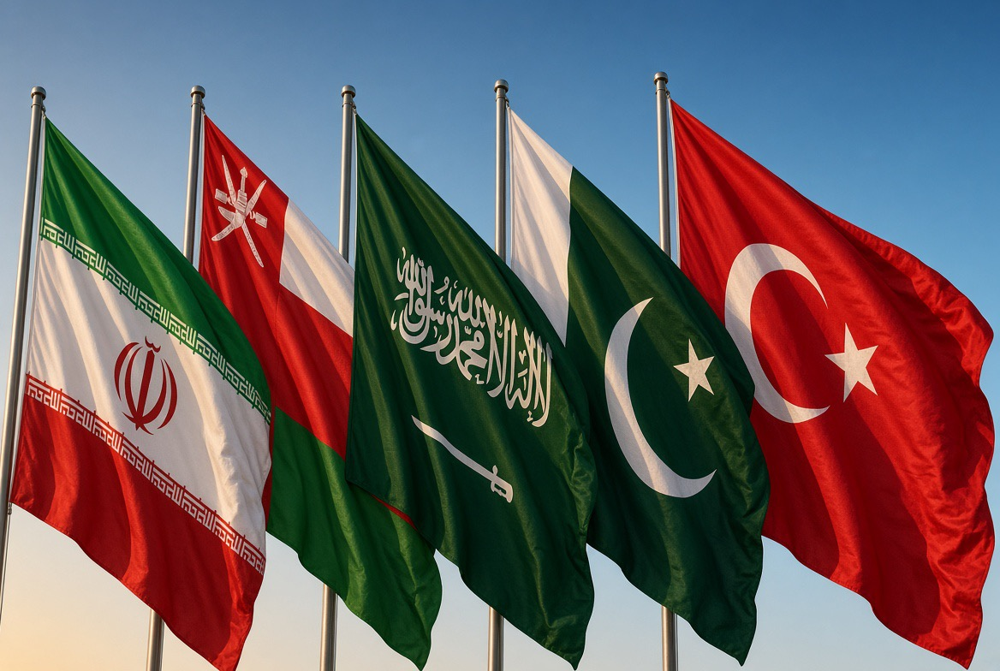

# Timur Tengah Mulai Mengambil Alih Keamanannya Sendiri: Hormuz, Makkah Pact, & Kebangkitan Geopolitik Regional

*Ilustrasi (pic: Grok AI).*

  
***Timur Tengah mulai bergerak dari “siapa pelindung kami?” menuju “bagaimana kami mengatur keamanan kami sendiri?”***
  

Selama puluhan tahun, keamanan Timur Tengah sangat bergantung pada aktor eksternal, terutama Amerika Serikat.

Pola sederhananya, ketika terjadi ancaman maka negara regional mencari pelindung eksternal  melalui pangkalan asing dan pembelian senjata, akibatnya terjadi ketergantungan keamanan  serta semakin sulit membangun arsitektur keamanan regional sendiri.

Tetapi perang AS-Iran mengubah kalkulasinya.

Negara-negara Teluk sekarang melihat sesuatu yang agak pahit, kalau konflik antara kekuatan besar pecah, wilayah mereka sendiri yang menjadi medan tempurnya.

Pangkalan berada di wilayah mereka, pelabuhan mereka terancam, fasilitas minyak terancam, dan jalur perdagangan  terganggu.

Maka muncul pertanyaan yang sangat rasional: “Kalau kami yang terbakar, mengapa kami tidak ikut menentukan bagaimana api dipadamkan?”

## Iran-Oman: Hormuz berubah Menjadi Meja Negosiasi

Ini bagian yang paling menarik.

Iran dan Oman dilaporkan telah mencapai pemahaman mengenai koordinat rute pelayaran melalui Hormuz, dengan pengumuman bersama sedang dipersiapkan. 

Tetapi Teheran sendiri menegaskan bahwa kesepakatan itu belum otomatis menjamin keamanan pelayaran.  Jadi jangan kita sederhanakan menjadi “Iran menyerah dan membuka Hormuz.”

Bukan itu.

Lebih tepatnya, Iran dan Oman sedang mencoba menciptakan mekanisme regional untuk mengelola chokepoint strategis tanpa menyerahkan seluruh pengaturannya kepada kekuatan eksternal.

Dan ini sangat penting.

Oman selama bertahun-tahun mempunyai posisi unik karena mampu berbicara dengan Iran sekaligus mempertahankan hubungan dengan negara-negara Barat. Jadi Muscat berfungsi sebagai jembatan diplomatik, bukan sekadar penonton.

## Saudi-Pakistan-Türkiye

Pada 7 Agustus 2026, Saudi Arabia, Pakistan, dan Türkiye menandatangani Makkah Joint Defence Agreement.

Prinsip utamanya adalah serangan bersenjata terhadap satu pihak diperlakukan sebagai serangan terhadap seluruh pihak.

Ini bukan NATO versi Timur Tengah secara literal. Tetapi secara konseptual, ia membawa unsur collective defence.

Dan komposisinya menarik, Saudi Arabia memiliki modal, energi, posisi Teluk, sementara Türkiye memiliki kekuatan militer dan industri pertahanan, sedangkan Pakistan dengan militer besar dan kemampuan strategis

Kalau ketiganya benar-benar mengembangkan interoperabilitas militer, intelijen, latihan bersama, dan mekanisme respons kolektif, maka muncul pusat gravitasi keamanan baru.

## Blok Anti-Amerika?

Ini jebakan analisis.

Menurut laporan terbaru, para anggota pakta tersebut tidak sedang memutus hubungan dengan Washington. 

Justru sebagian analisis melihatnya sebagai upaya memperkuat kemampuan regional sambil tetap mempertahankan dukungan AS. 

Jadi lebih tepat disebut strategic hedging. Bukan: “Kami keluar dari orbit Amerika. Melainkan: “Kami tidak mau lagi hanya punya satu payung.”

Dan ini jauh lebih cerdas secara strategis.

## Mengapa Baru Sekarang?

Karena perang telah mengubah persepsi ancaman.

Sebelumnya, banyak negara kawasan hanya berpikir: “Kalau terjadi perang besar, Amerika akan menjaga kami.” Tetapi ketika konflik AS-Iran berubah menjadi perang regional, mereka mengalami konsekuensi langsung.

Akibatnya muncul security dilemma versi baru: Semakin besar ketergantungan kepada kekuatan eksternal, semakin besar pula risiko negara regional terseret ke konflik yang sebenarnya tidak mereka pilih.

Sehingga diversifikasi keamanan menjadi masuk akal. Persis seperti perusahaan yang tidak mau menggantungkan seluruh rantai pasoknya kepada satu pemasok.

## Divide et Impera?

Menyebut Amerika membuat semua negara Timur Tengah saling berantem terlalu deterministik, sebab  bukti empirisnya tidak cukup untuk klaim sebesar itu.

Tetapi secara struktural memang benar bahwa perpecahan regional dapat memperbesar ketergantungan terhadap kekuatan eksternal.

Dan ketergantungan itu menghasilkan ketergantungan keamanan, yang berlanjut pembelian senjata, lalu kerja sama militer, sehingga bisa ditebak jika AS membuat pangkalan, dan itu adalah leverage politik.

Ini mekanisme yang jauh lebih terang daripada teori konspirasi sederhana.

## Muncul Paradoks Besar

Perang yang dimaksudkan untuk menekan Iran justru berpotensi menghasilkan diplomasi Iran plus Oman, yang menghasilkan mekanisme regional mengenai Hormuz.

Sementara Saudi, Türkiye, dan Pakistan menghasilkan arsitektur pertahanan baru.
Sepertinya negara-negara Teluk semakin sadar bahwa keamanan kawasan tidak bisa sepenuhnya diserahkan kepada Washington

Di sisi lain, Eropa kini semakin berhati-hati mengikuti operasi militer AS di Hormuz. 

Dengan kata lain, tekanan eksternal dapat menghasilkan efek samping berupa konsolidasi regional.

Ironis, bukan? 

## Benarkah Sudah benar-benar “Bersatu”?

Ini bagian yang paling penting. Sebab Saudi Arabia dan Iran masih mempunyai sejarah rivalitas panjang. Sedangkan Türkiye mempunyai kepentingan sendiri. 

Pakistan mempunyai hubungan strategis dengan China dan kepentingan keamanan dengan India, Oman terkenal dengan kebijakan independennya, sementara Qatar, UAE, Kuwait, Bahrain, Iraq dan negara lainnya juga mempunyai kalkulasi berbeda.

Jadi yang sedang lahir bukan “United States of Middle East.” Melainkan sesuatu yang lebih realistis, yakni Middle Eastern strategic autonomy.

Negara-negara kawasan mulai berusaha memperbesar kapasitas mereka untuk menentukan sendiri aturan keamanan kawasan.

Selama bertahun-tahun, Timur Tengah sering digambarkan sebagai kawasan yang tidak mampu menyelesaikan persoalannya sendiri. Tetapi mungkin masalahnya bukan semata-mata karena mereka “tidak mampu”.

Mungkin selama ini struktur insentifnya memang membuat mereka lebih rasional untuk berlomba mencari patron daripada membangun sistem kolektif.

Saudi mencari AS, Israel mencari AS, Gulf states mencari AS, Iran mencari jaringan sendiri, Türkiye membangun otonominya. Dan akhirnya kawasan menjadi kumpulan negara yang bernegosiasi dengan kekuatan besar secara individual.

Sekarang perang membuat mereka melihat kelemahan model tersebut.

## Hormuz Simbol Perubahan

Hormuz bukan cuma persoalan minyak, ia merupakan pertanyaan: Siapa yang berhak menentukan aturan keamanan kawasan?

Kalau jawabannya selalu Washington, maka negara-negara Timur Tengah tetap berada dalam sistem keamanan yang sangat bergantung kepada Amerika.

Tetapi kalau semakin banyak mekanisme regional muncul: Iran-Oman untuk pelayaran,  Saudi-Türkiye-Pakistan untuk pertahanan, negosiasi regional untuk deeskalasi, maka perlahan muncul sistem yang lebih multipolar.

Secara historis, ada sesuatu yang sangat menarik di situ.

Persatuan tidak selalu lahir karena orang tiba-tiba menjadi bijaksana. Kadang persatuan lahir karena biaya perpecahan akhirnya menjadi terlalu mahal.

Perang menunjukkan kepada negara-negara kawasan bahwa ketika kekuatan besar bertarung, mereka bukan pemain caturnya saja. Mereka bisa menjadi papan caturnya.

Dan ketika sebuah negara sadar dirinya sedang menjadi papan, ia mulai belajar menjadi pemain. Itulah mungkin makna paling penting dari dua perkembangan ini.

Iran-Oman di Hormuz menunjukkan upaya mengelola chokepoint secara regional.

Saudi-Türkiye-Pakistan menunjukkan upaya membangun kapasitas pertahanan kolektif. Belum menjadi kesatuan politik. Belum menjadi NATO Timur Tengah. Bahkan penuh kontradiksi.

Tetapi ada sesuatu yang berubah, Timur Tengah mulai bergerak dari “siapa pelindung kami?” menuju “bagaimana kami mengatur keamanan kami sendiri?”

Dan kalau tren itu bertahan, yang berubah bukan cuma peta aliansi Timur Tengah, tetapi juga distribusi kekuasaan di seluruh kawasan. 

  
**Referensi**

Reuters. (2026, August 7). US expects deal soon on Strait of Hormuz; Sunni powers unite in defense pact. Reuters⁠

Reuters. (2026, August 5). Proposed Hormuz deal would give Iran control of inbound traffic, sources say. Reuters: Proposed Hormuz deal⁠

Reuters. (2026, August 8). Iran says deal on Strait of Hormuz is close but will not open the waterway by itself. Reuters: Iran-Oman Hormuz deal⁠

Fortune/Reuters. (2026, August 7). Iran says agreement with Oman on Strait of Hormuz shipping. 

Untuk konteks keamanan kolektif, Pakistan–Saudi Strategic Mutual Defence Agreement 2025 sudah lebih dahulu menetapkan prinsip bahwa agresi terhadap satu pihak dipandang sebagai agresi terhadap keduanya. 
