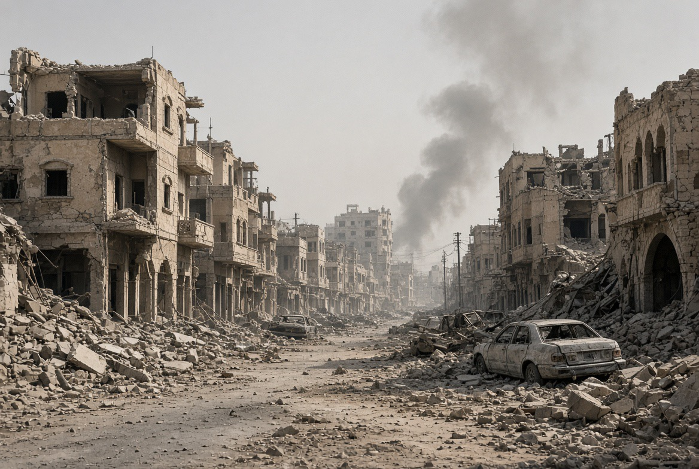

# Timur Tengah: Menang Sendiri, Kalah Bersama

*Ilustrasi (pic: Grok AI).*

  
***Mereka terus berperang untuk mendapatkan keamanan, sementara cara mereka mengejar keamanan justru membuat seluruh kawasan semakin tidak aman***
  

Yaman memang mengalami perang saudara, tetapi perang itu sejak awal sudah menjadi arena kompetisi regional.

Houthi merebut Sana’a pada 2014. Saudi kemudian melakukan intervensi militer pada 2015 untuk mendukung pemerintah Yaman yang diakui internasional. Iran mendukung Houthi. Jadi konflik lokal berubah menjadi regionalized civil war. 

Dan sekarang lingkarannya hidup kembali.

Houthi: Iran → Houthi → Saudi

Saudi: Saudi → pemerintah Yaman/proxy → Houthi

AS: AS → Saudi + perang melawan Iran

Iran: Iran → tekanan melalui jaringan sekutu/proxy

Hasil akhirnya? Yaman yang hancur.

Lebih dari 150.000 orang diperkirakan tewas sejak perang dimulai, sekitar 4,5 juta mengungsi, dan lebih dari 18 juta membutuhkan bantuan kemanusiaan. 

Jadi ini bukan sekadar “orang Arab berantem”. Ini adalah security dilemma yang dipersenjatai.

## Klaim Houthi Melawan demi Palestina

Ini bagian yang harus kita bedah tanpa romantisasi.

Houthi sejak perang Gaza 2023 memang mengaitkan serangan terhadap kapal di Laut Merah dengan solidaritas terhadap Palestina. Serangan itu mengganggu Bab el-Mandeb dan pelayaran internasional. 

Tetapi sekarang Houthi juga menyerang infrastruktur energi Saudi.

Pada 8 September, serangan terhadap fasilitas energi di Abha, Najran dan Jizan menyebabkan kebakaran dan menurut otoritas Saudi 73 orang terluka, termasuk perempuan dan anak-anak. 

Jadi secara strategis, Palestina menjadi bagian dari legitimasi politik, tetapi perang yang menggunakan nama Palestina dapat menghasilkan korban Arab lain.

Itu problem besar. Solidaritas yang berubah menjadi regional escalation belum tentu menghasilkan perlindungan bagi Palestina.

## Saudi juga Tidak Bisa Duduk di Kursi Moral Sambil Menunjuk Houthi

Nah ini penting, Saudi bukan penonton netral.

Saudi memimpin intervensi militer di Yaman sejak 2015. Perang tersebut sendiri menghasilkan kehancuran kemanusiaan luar biasa.

Sekarang ketika Houthi menyerang Saudi, Riyadh membalas dengan serangan udara.

Jadi, Houthi punya agensi, Saudi punya agensi, Iran punya agensi, AS punya agensi. Dan rakyat Yaman? Sering menjadi variabel yang paling murah dalam kalkulasi mereka.

Itulah salah satu ciri klasik proxy warfare, negara kuat mempertarungkan kepentingannya melalui ruang geografis yang dihuni masyarakat yang jauh lebih lemah.

## Apakah Negara-Negara Arab Tidak Belajar dari Irak, Libya, Suriah?

Sebagian belajar, tetapi pelajarannya tidak menghasilkan persatuan. Ini paradoks yang sangat penting.

Kita sering membayangkan: “Kalau mereka sama-sama pernah dihancurkan intervensi asing, mestinya mereka bersatu.”

Tidak sesederhana itu.

Karena negara-negara Timur Tengah tidak memiliki kepentingan keamanan yang identik.

Saudi takut Iran, Houthi, dan ekspansi jaringan bersenjata. Iran takut AS, Israel, pengepungan regional, serta kehilangan pengaruh. UAE takut Islamisme politik, ketidakstabilan, dan ancaman maritim.

Qatar lebih mengandalkan mediasi, diplomasi, hubungan dengan banyak pihak. Oman mengutamakan netralitas dan mediasi. Mesir mementingkan stabilitas rezim, Sinai, Suez, serta ekonomi.

Sementara Yordania fokus pada survival negara, pengungsi, dan keamanan perbatasan. Sedangkan Turki tertuju pada pengaruh regional, keamanan perbatasan, serta posisi strategisnya sendiri.

Jadi ada identitas Arab, tetapi juga ada: negara, rezim, kepentingan ekonomi, sektarianisme, rivalitas regional, ancaman keamanan, hubungan dengan AS, hubungan dengan Iran. Dan semuanya saling bertabrakan.

## Penyakit Struktural Arab Security Dilemma

Bayangkan Saudi berpikir: “Kalau saya melemahkan militer, Iran dan proxy-nya makin kuat.”

Iran berpikir: “Kalau saya melemahkan jaringan sekutu, AS dan Israel akan mengepung saya.”

UAE berpikir: “Kalau saya tidak memperkuat keamanan sendiri, saya rentan.”

Houthi berpikir: “Kalau kami berhenti bersenjata, kami kehilangan leverage.”

Israel berpikir: “Kalau kami melemahkan diri, ancaman akan meningkat.”

AS berpikir: “Kalau kami keluar, Iran akan mengisi kekosongan.”

Dan akhirnya, semua orang meningkatkan keamanan sendiri. Tetapi ketika semua meningkatkan keamanan sendiri, keamanan kolektif justru turun. Itulah security dilemma.

Dan ini bukan kebodohan IQ, ini kegagalan institusional mengubah kompetisi keamanan menjadi sistem keamanan bersama.

## Palestina Korban Dari Sistem

Ada paradoks, semua pihak mengatakan Palestina penting. Tetapi Palestina tidak memiliki cukup leverage militer, ekonomi, dan institusional untuk menentukan agenda regional.

Maka Palestina bisa menjadi simbol, slogan, legitimasi, alat mobilisasi, kartu diplomatik, tetapi tidak otomatis menjadi prioritas strategis nomor satu.

Dan ini terjadi bahkan ketika negara-negara Arab memang mengecam Israel.

Contohnya, pada 6 September 2026 Saudi, UAE, Qatar, Mesir, Yordania dan beberapa negara lain bersama-sama mengecam proposal pemindahan paksa warga Palestina dari Gaza. Mereka menegaskan Gaza merupakan bagian dari wilayah Palestina yang diduduki dan menolak upaya displacement. 

Pada Agustus mereka juga secara kolektif mengecam serangan terhadap infrastruktur sipil Gaza dan korban perempuan serta anak-anak. 

Jadi tidak benar bahwa negara-negara Arab sama sekali tidak peduli.

Masalahnya, kecaman diplomatik tidak berarti kemampuan memaksa perubahan. Dan lebih pahit lagi, kepentingan nasional sering membatasi seberapa jauh mereka bersedia mengambil risiko demi Palestina.

## Persatuan Arab Sering Berhenti di Konferensi

Ada sesuatu yang secara teori disebut collective-action problem, semua negara bisa memperoleh keuntungan kalau ada tindakan kolektif. Tetapi setiap negara juga ingin negara lain yang membayar biayanya.

Misalnya, Saudi ingin Palestina aman, tetapi jika tekanan terlalu keras terhadap Israel maka hubungan dengan Washington bisa terganggu. Jika hubungan dengan Washington terganggu, pastilah keamanan, senjata, investasi dan deterrence ikut terpengaruh.

Qatar bisa menjadi mediator, tetapi Qatar tidak ingin menjadi pihak yang perang langsung. Mesir bisa membuka Rafah atau menjadi mediator.m, tetapi Mesir harus memikirkan Sinai dan stabilitas domestik. UAE punya leverage ekonomi, tetapi juga mempunyai kepentingan hubungan internasional sendiri.

Maka lahirlah fenomena “collective concern, fragmented action.” Semua prihatin tapi tidak semua mau membayar harga strategisnya.

## China Menarik Pelajaran Berbeda

China membaca Timur Tengah bukan dengan “Siapa Sunni? Siapa Syiah?” tetapi lebih sering: “Siapa yang menguasai energi, pelabuhan, perdagangan, teknologi, dan jalur logistik?”

China bahkan pernah memediasi rekonsiliasi Iran-Saudi pada 2023.

Sekarang, ketika Hormuz terganggu dan Bab el-Mandeb kembali terancam, negara-negara Gulf malah membutuhkan diplomasi regional.

Hari ini para menteri luar negeri GCC dijadwalkan bertemu menteri luar negeri Iran di Oman untuk mendorong kesepakatan sementara mengenai lalu lintas maritim Hormuz. 

Nah, ini sebenarnya bentuk pembelajaran. Bukan perang yang menyelesaikan semuanya, interdependensi memaksa mereka berbicara.

Kalau mereka benar-benar bodoh, mereka tidak akan melakukan hal-hal seperti: Saudi memperluas diversifikasi ekonomi melalui Vision 2030, UAE membangun posisi sebagai pusat perdagangan dan logistik, Qatar menjadi mediator berbagai konflik, Oman mempertahankan kanal diplomasi dengan Iran dan AS, Negara-negara Gulf berusaha menjaga hubungan sekaligus dengan Washington, Beijing dan Tehran, Negara Arab mengembangkan teknologi, energi terbarukan dan infrastruktur.

Mereka sangat rasional dalam beberapa dimensi. Masalahnya, rasionalitas negara bukan berarti rasionalitas regional.

Saudi bisa melakukan sesuatu yang rasional untuk Saudi tetapi buruk untuk Yaman.

Iran bisa melakukan sesuatu yang rasional untuk survival rezim Iran tetapi memperbesar ketidakstabilan regional.

AS bisa melakukan sesuatu yang rasional untuk kepentingan strategis Washington tetapi menghasilkan kehancuran regional.

Israel bisa melakukan sesuatu yang dianggap rasional untuk keamanan nasionalnya tetapi menghasilkan konsekuensi kemanusiaan dan politik yang sangat besar bagi Palestina, dan seterusnya.

Jadi yang kita lihat adalah rational actors producing irrational collective outcomes. Nah. Ini baru penyakitnya.

## Sejarah Irak, Libya, Suriah, Afghanistan Memberikan Pelajaran Pahit

Ada intervensi eksternal dari Barat yang sangat besar,  tetapi kehancuran masing-masing punya mekanisme berbeda.

Irak

Invasi AS 2003 menghancurkan struktur negara dan memicu kekacauan politik sektarian yang kemudian menjadi lahan subur bagi insurgency dan ISIS.

Libya

Intervensi NATO 2011 membantu menjatuhkan Gaddafi, tetapi tidak menghasilkan institusi negara pascaperang yang stabil. Libya kemudian terfragmentasi.

Suriah

Ini bahkan lebih kompleks.

Rezim Assad melakukan represi brutal terhadap pemberontakan. Kemudian muncul perang saudara, ISIS, intervensi AS, Rusia, Iran, Turki, Israel dan berbagai aktor regional.

Jadi eksternal intervention, authoritarianism, institutional weakness, factionalism, dan proxy warfaresering menjadi kombinasi beracun.

Dan itulah mengapa hanya mengatakan Barat jahat belum cukup sebagai analisis. Yang jauh lebih tajam adalah, kekuatan eksternal sering mengeksploitasi fragmentasi internal yang sudah ada, sementara elite lokal juga menggunakan intervensi eksternal untuk mempertahankan kepentingannya sendiri.

Dua-duanya bisa benar sekaligus.

## Iran Contoh Paling Pahit dari Paradoks Ini

Iran sendiri menentang dominasi AS dan Israel selama puluhan tahun. Tetapi Iran juga membangun:Hezbollah, Houthi, milisi Irak, dan jaringan regional, sebagai strategic depth.

Secara keamanan, ini masuk akal. Tetapi konsekuensinya, iketika perang besar terjadi, jaringan tersebut menjadi jalur ekspansi konflik.

Sekarang efeknya terlihat jelas, perang AS-Iran tidak berhenti di Iran. Ia menjalar dari Iran ke Hormuz, Iran ke Houthi berujung Bab el-Mandeb, Saudi ke Yemen, AS ke Gulf, shipping ke harga minyak, dan dunia mengalami inflasi.

Itulah regional security complex. Satu negara tidak lagi bisa mengatakan: “Perang ini urusan saya.”

## Palestina Bukan “Dilupakan”

Lebih tepatnya, Palestina tersandera oleh fragmentasi sistem keamanan Timur Tengah. Dan ini jauh lebih menyedihkan.

Karena ketika Iran melawan AS, Saudi melawan Houthi, Saudi melawan Iran, Israel melawan Iran, Turki melawan Kurdish groups, lalu faksi-faksi Suriah dan faksi-faksi Libya bertabrakan, maka Palestina harus bersaing mendapatkan perhatian dalam sistem yang kapasitas diplomatiknya sudah terbakar oleh konflik lain.

Jadi kalau kalau ada pertanyaan: “Mereka egois dan gak smart?”

Jawabannya: sebagian memang egois, sebab negara memang mengejar kepentingan nasional. Elite politik juga punya kepentingan mempertahankan rezim.

Tidak smart? Bukan begitu. Justru tragedinya adalah mereka sering cukup pintar untuk memenangkan ronde, tetapi tidak cukup mampu membangun permainan yang membuat semua pihak aman.

Saudi bisa menang satu serangan, Houthi bisa merebut satu pelabuhan, Iran bisa mengancam satu jalur laut, AS bisa menghancurkan satu kemampuan militer, Israel bisa menghancurkan satu fasilitas.

Tetapi setelah semuanya selesai, Yaman tetap miskin, Iran tetap terisolasi, Saudi tetap rentan terhadap rudal dan drone, Palestina tetap tidak berdaulat, Israel tetap menghadapi konflik keamanan, AS tetap terperangkap dalam Timur Tengah, minyak naik, shipping terganggu, dan anak-anak tetap mati.

Itulah kegagalan strategis terbesar Timur Tengah: terlalu banyak kemenangan taktis, terlalu sedikit kemenangan politik.

Dan mungkin kalimat paling telanjang untuk menggambarkan semuanya adalah, mereka terus berperang untuk mendapatkan keamanan, sementara cara mereka mengejar keamanan justru membuat seluruh kawasan semakin tidak aman.

Sementara Palestina? Palestina membayar tagihan dari perang yang tidak sepenuhnya mereka ciptakan. 

  
**Referensi**

Association Press. (2026, September 11). Saudi airstrikes hit Yemen’s rebel-held Mokha airport as Houthis take an island near a key strait. 

Reuters. (2026, September 11). As Saudi tensions with Iran-backed Houthis escalate, mediator Pakistan faces pressure to choose a side. 

Reuters. (2026, September 8). Houthi attacks disrupt Saudi energy facilities, wound 73, authorities say. 

United Arab Emirates Ministry of Foreign Affairs. (2026, September 6). Joint statement by the ministers of foreign affairs of the UAE, KSA, Qatar, Jordan, Indonesia, Pakistan, Türkiye, and Egypt. 

Financial Times. (2026, September 11). Iran and Gulf states to meet in push for Hormuz deal. 
