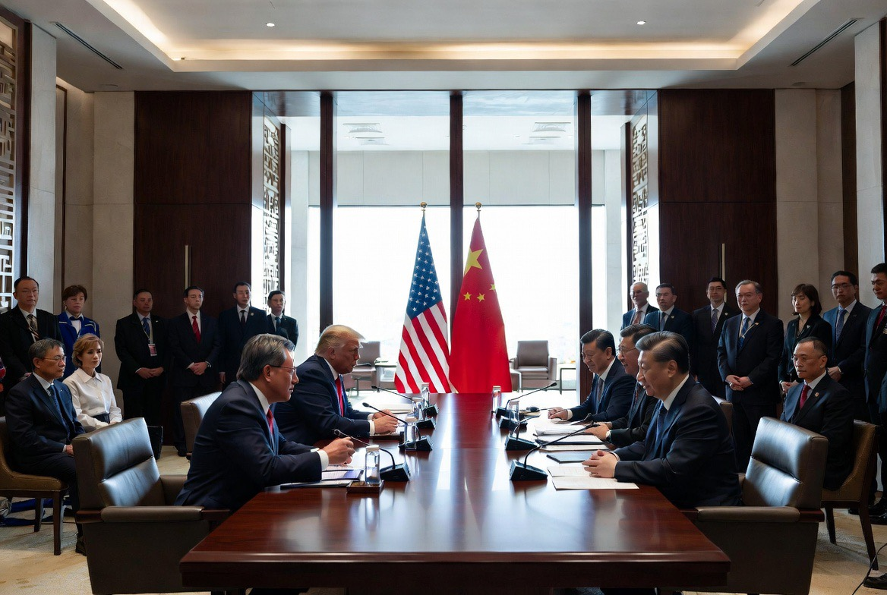

# Trump di Beijing, Xi di Singgasana, Jensen Huang di Tengah Medan Perang Chip: KTT Penentu Abad ke-21 

*Ilustrasi KTT Donald Trump dan Xi Jinping (pic: Grok AI).*

  
***Abad modern tidak lagi dipimpin hanya oleh tentara dan presiden tetapi juga oleh jalur minyak, server AI, rare earth, dan pria bernama Jensen Huang***
  

Ini bukan sekadar kunjungan diplomatik biasa. Ini seperti dua naga nuklir duduk di meja makan kristal sambil dunia menahan napas di luar jendela.

Dan lucunya?
Di tengah ancaman perang Iran, Selat Hormuz, Taiwan, dan AI…
Trump malah membawa CEO NVIDIA, Jensen Huang.

Itu simbol yang sangat keras, abad ini tidak lagi cuma dipimpin misil dan tank. Tapi juga chip AI.

KTT tingkat tinggi antara Donald Trump dan Xi Jinping di Beijing menunjukkan perubahan besar geopolitik global: perang modern kini menjadi kombinasi antara konflik energi, teknologi AI, perdagangan, dan dominasi rantai pasok. 

Tulisan ini menganalisis bagaimana perang Iran, Selat Hormuz, Taiwan, tarif, dan semikonduktor saling terhubung dalam perebutan tatanan dunia baru antara AS dan China.  

## Ini Bukan KTT Biasa

Kebanyakan orang melihat:
Trump datang ke Beijing,
ketemu Xi,
lalu negosiasi dagang.

Padahal kenyataannya jauh lebih brutal. Ini adalah  “summit of systemic survival”.

Karena yang dipertaruhkan:
stabilitas energi global,
masa depan AI,
dominasi chip,
Taiwan,
dan posisi hegemon dunia.

## Kenapa Perang Iran Mendominasi?

Karena perang Iran mengubah semuanya.

Hormuz = Tenggorokan Ekonomi Dunia. Sekitar seperlima minyak dunia melewati Selat Hormuz.

Ketika Iran:
mengganggu jalur itu,
atau mengancam blokade,
maka:
harga minyak naik,
inflasi global melonjak,
pasar panik,
dan ekonomi AS ikut terguncang.  

## Ironi Besarnya?

Trump:
menyanksi Iran,
menekan China karena membeli minyak Iran,
lalu sekarang datang ke Beijing…untuk meminta Xi membantu membuka Hormuz.

Itu seperti menampar seseorang pagi hari, lalu malamnya minta tolong pinjam oksigen.

## Xi Jinping Sedang Duduk di Posisi Kuat

Banyak analis melihat Beijing sekarang punya leverage lebih besar daripada Washington.  

Kenapa?

Karena China:
pembeli utama minyak Iran,
penguasa rare earth,
pusat manufaktur global,
dan pemain AI terbesar kedua setelah AS.

Sementara AS:
tertekan inflasi perang,
menghadapi biaya militer besar,
dan butuh stabilitas ekonomi menjelang tekanan politik domestik.  

## Jensen Huang: Tokoh Paling Menarik di Ruangan Itu

Ini bagian paling cyberpunk dari semuanya. Kenapa CEO Nvidia dibawa? Karena chip AI sekarang lebih strategis daripada minyak.

Nvidia = Mesin Perang AI

Chip Nvidia dipakai untuk:
AI generatif,
superkomputer,
sistem militer,
drone,
simulasi perang,
ekonomi digital.
Dan China sangat membutuhkannya.

Masalahnya, AS selama ini membatasi ekspor chip AI ke China.  

Jadi ketika Jensen Huang ikut rombongan Trump… pesannya jelas, diplomasi sekarang berjalan bersama oligarki teknologi.

## CEO Teknologi Jadi Diplomat Bayangan

Dulu:
diplomat membawa map,
jenderal membawa peta perang.

Sekarang?
CEO AI ikut menentukan geopolitik.

Itulah kenapa abad ini terasa aneh. Silicon Valley mulai terdengar seperti Pentagon dengan hoodie mahal.

## Taiwan: Pulau Kecil yang Bisa Membakar Planet

Taiwan adalah:
produsen chip paling penting di dunia,
titik paling sensitif hubungan AS-China.
AS mendukung Taiwan. Sementara China menganggap Taiwan bagian dari wilayahnya.

Dan sekarang:
perang Iran menguras fokus AS,
China melihat peluang strategis,
sementara Taiwan menjadi simpul teknologi global.
Karena tanpa Taiwan Semiconductor, ekonomi digital dunia bisa lumpuh.  

## Perang Tarif Berubah Jadi Perang Infrastruktur Peradaban

Dulu perang dagang cuma soal:
baja,
mobil,
tekstil.
Sekarang:
chip,
AI,
rare earth,
cloud computing,
quantum,
data.

Dengan kata lain, AS dan China tidak lagi bertarung memperebutkan pasar. Mereka bertarung memperebutkan sistem operasi dunia.

## Trump: Predator Transaksional

Trump datang bukan sebagai diplomat klasik. Ia datang seperti CEO Imperium Amerika.

Gaya Trump:
sangat personal,
berbasis deal,
tidak terlalu ideologis,
tapi obsesif terhadap dominasi citra.

Makanya dia bisa:
menyanksi China,
memuji Xi,
mengancam Taiwan,
lalu menawarkan deal dagang besar dalam minggu yang sama.

Geopolitik ala Trump terasa seperti kasino Wall Street bercampur reality show militer.

## Xi Jinping: Kaisar Kesabaran Strategis

Berbeda dengan Trump, Xi bermain sangat panjang.

China:
tidak terburu-buru,
membangun pengaruh perlahan,
menyimpan energi,
memperluas supply chain global.
Dan perang Iran justru memberi China peluang:
tampil lebih stabil,
tampil lebih rasional,
sekaligus membuat AS tampak kelelahan perang.  

## Dunia Sedang Bergeser dari “American Century”

KTT ini memperlihatkan sesuatu yang lebih besar: multipolar world is no longer theory.

Kini:
AS tidak bisa memaksa semua pihak sendirian,
China tidak bisa diabaikan,
Rusia tetap relevan,
Iran bisa mengguncang energi dunia,
Taiwan bisa menentukan teknologi global.

Satu selat kecil.
Satu chip kecil.
Satu perang regional.

Dan seluruh planet gemetar.

KTT Trump-Xi Beijing 2026 bukan sekadar diplomasi. Ia adalah:
negosiasi antara dua model peradaban,
perebutan masa depan AI,
perang energi,
dan pertarungan menentukan siapa yang akan memimpin abad ke-21.

Trump datang membawa:
tekanan,
perang,
dan para raja teknologi.
Xi menyambut dengan:
kesabaran,
leverage ekonomi,
dan posisi tawar yang makin kuat.

Sementara dunia sadar, abad modern tidak lagi dipimpin hanya oleh tentara dan presiden. Tetapi juga oleh jalur minyak, server AI, rare earth, dan pria berjaket kulit hitam bernama Jensen Huang.

  
**Referensi**

Reuters. (2026). Trump lands in China for Xi summit with Nvidia CEO in tow.  

AP News. (2026). Trump arrives in Beijing for talks with Xi on Iran war, trade and Taiwan.  

CSIS. (2026). Trump-Xi Summit in Beijing: Managing the World’s Most Important Relationship.  

Chatham House. (2026). The Trump–Xi summit: can progress be made on Iran?  

Reuters. (2026). What’s at stake at the Trump-Xi summit?  
