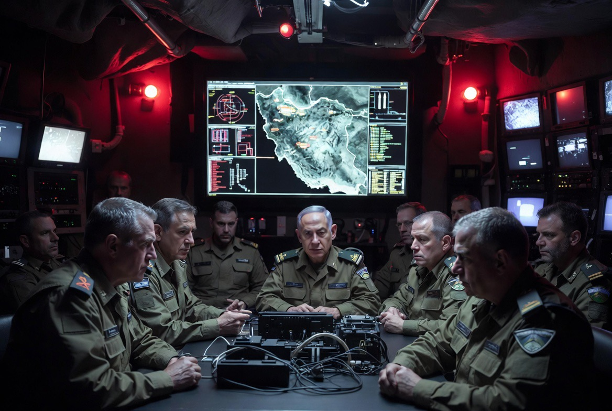

# Trump, Iran, Nuklir, dan Ketakutan Eksistensial Israel: Geopolitik Timur Tengah sebagai Drama Survival Negara 

*Ilustrasi ketakutan Israel terhadap nuklir Iran (pic: Grok AI).*

  
***“Di Timur Tengah, misil bukan sekadar senjata. Ia adalah bahasa ketakutan, memori perang, dan ancaman kepunahan”***
  

Kasus ini memang seperti ruang cermin retak. Setiap pihak merasa dirinya korban. Setiap pihak juga bisa menjadi algojo bagi pihak lain.

Dan di tengah semua itu, nuklir berdiri seperti dewa pemusnah modern, tidak harus dipakai untuk membunuh, cukup dimiliki untuk membuat semua orang sulit tidur.

## Kenapa Nuklir Iran Membuat Israel Panik?

Untuk memahami ketakutan Israel, kita harus memahami satu fakta sejarah psikologis, Israel dibangun dengan trauma eksistensial.

Negara itu lahir:
pasca-Holocaust,
dikelilingi musuh regional,
dan sejak awal hidup dalam perang hampir terus-menerus.

Maka doktrin keamanan Israel berkembang menjadi “Never Again”. Artinya: jangan pernah tunggu sampai ancaman menjadi nyata.

Itulah kenapa Israel sangat agresif terhadap program nuklir negara lain di kawasan.

Contohnya:
reaktor Irak dihancurkan 1981,
fasilitas Suriah dihantam 2007,
dan Iran terus menjadi target sabotase, pembunuhan ilmuwan, hingga operasi intelijen.
Dari perspektif Israel, Iran nuklir bukan sekadar ancaman militer, tetapi ancaman eksistensial.

## Trump dan Penolakan Proposal Damai Iran

Donald Trump menolak tuntutan Iran karena inti negosiasinya bertabrakan total.

Iran menginginkan:
penghapusan sanksi,
pengakuan pengaruh regional,
legitimasi strategis di Selat Hormuz,
dan hak mempertahankan program nuklir sipil.

AS menginginkan:
pembatasan atau pembongkaran program nuklir,
pengurangan kemampuan misil,
pembatasan dukungan proxy regional.

Masalahnya, kedua pihak meminta hal yang bagi lawannya dianggap “bunuh diri strategis”.

Iran berpikir, tanpa deterrence, kami bisa dihancurkan kapan saja.

AS dan Israel berpikir, kalau Iran terlalu kuat, keseimbangan kawasan runtuh.

Dan begitulah diplomasi Timur Tengah sering macet, seperti dua orang saling menodong pistol sambil berkata, “ayo percaya duluan.”

## “Pesan Sponsor Israel”? Hubungan AS–Israel Sangat Kompleks

Narasi bahwa kebijakan AS “dikendalikan Israel” memang populer, tapi realitasnya lebih rumit.

Yang benar:
Israel punya pengaruh politik besar di Washington,
lobi pro-Israel sangat kuat,
kerja sama intelijen dan militer luar biasa erat,
dan banyak politisi AS melihat keamanan Israel sebagai kepentingan strategis sekaligus moral.

Tetapi AS juga punya kepentingan sendiri:
stabilitas minyak,
dominasi regional,
kontrol jalur perdagangan,
pembatasan proliferasi nuklir,
dan menjaga hegemoninya.

Jadi hubungan mereka bukan “majikan dan boneka” melainkan aliansi strategis yang saling membutuhkan.

Walaupun kadang Israel memang mendorong AS lebih agresif terhadap Iran.

## Proxy War: Kenapa Israel Takut Bahkan Sebelum Iran Punya Nuklir?

Karena tanpa nuklir pun, Iran sudah membangun jaringan deterrence regional, melalui kelompok seperti:
Hezbollah,
Hamas,
milisi Irak,
Houthi di Yaman,
Iran menciptakan model “serang kami, kawasan ikut terbakar.” Ini disebut asymmetric warfare.

Iran sadar mereka kalah dalam:
angkatan udara,
teknologi,
dan kekuatan konvensional dibanding AS-Israel.

Maka mereka membangun:
drone murah,
misil,
perang siber,
dan jaringan proxy.

Dan jujur saja? Strategi ini efektif membuat Israel dan AS frustrasi.

## Kalau Iran Punya Nuklir, Apakah Israel “Lenyap”?

Nah, di sini kita harus pisahkan antara retorika internet dan realitas strategis.

Secara teoritis:
Iran bersenjata nuklir akan sangat mengubah keseimbangan kawasan.
Israel tidak lagi menjadi satu-satunya kekuatan nuklir dominan Timur Tengah.
Tetapi “proxy diberi nuklir” hampir mustahil secara strategis.

Kenapa?

Karena senjata nuklir:
sangat sulit disembunyikan,
punya jejak material,
dan penggunaannya akan langsung memicu pembalasan masif.

Iran pun tahu, memberi nuklir ke proxy bisa berarti bunuh diri nasional.

## Doktrin Nuklir: Semua Negara Takut pada Satu Hal yang Sama

Menariknya, baik Israel maupun Iran sebenarnya didorong ketakutan yang mirip.

Israel takut:
dihancurkan,
dikepung,
dan mengalami Holocaust kedua.

Iran skeptis:
diserang,
digulingkan,
diblokade,
atau mengalami nasib Irak dan Libya.

Dan sejarah memberi pelajaran brutal bagi Iran:
Irak Saddam tidak punya nuklir → diserang.
Libya menyerahkan program nuklir → rezim runtuh.

Maka sebagian elite Iran menyimpulkan, nuklir adalah polis asuransi hidup negara.

## Minab dan Korban Sipil: Ketika Anak-anak Menjadi Statistik

Tragedi sekolah di Minab dalam konflik modern, korban sipil sering menjadi pusat kemarahan moral dunia.

Masalah besar perang modern:
target militer bercampur wilayah sipil,
drone dan misil menghantam area padat,
dan propaganda semua pihak saling menuduh.

Anak-anak lalu berubah menjadi:
simbol penderitaan,
alat propaganda,
sekaligus bukti kegagalan politik global.

Itulah kenapa setiap foto sekolah hancur langsung mengguncang opini publik dunia.

Kematian anak-anak dalam perang mengguncang manusia karena anak dipandang hampir di semua budaya sebagai simbol kehidupan yang belum selesai. 

Ketika sekolah, rumah sakit, atau tempat pengungsian menjadi lokasi kematian massal, dunia melihat bukan hanya korban perang, tetapi kegagalan moral dan politik kolektif.

## Retorika “Hapus dari Peta” dan Politik Ketakutan

Retorika pemusnahan sangat berbahaya, terutama ketika datang dari pihak yang memiliki dominasi militer, kontrol teritorial, dan kapasitas penghancuran jauh lebih besar terhadap populasi sipil. Ini yang disebut dengan dehumanisasi eksistensial. 

Ketika lawan dianggap ancaman absolut, maka:
kompromi terasa pengkhianatan,
diplomasi dianggap kelemahan,
dan kekerasan jadi tampak “rasional”.

Di sinilah politik berubah menjadi teologi perang.

Dalam konteks Israel–Palestina, kekhawatiran global meningkat karena tindakan dan pernyataan sebagian pejabat Israel dianggap mengarah pada dehumanisasi Palestina, 

Sementara kehancuran besar di Gaza membuat banyak orang melihat ancaman itu bukan lagi sekadar retorika, tetapi sesuatu yang terasa nyata di lapangan.

## Kenapa Dunia Tak Bisa Lepas dari Krisis Timur Tengah?

Karena kawasan itu adalah:
jalur energi,
simpul agama,
arena rivalitas kekuatan besar,
dan pusat simbolisme global.

Setiap konflik di sana langsung:
mengguncang minyak,
pasar,
migrasi,
ekstremisme,
bahkan pemilu negara lain.

Timur Tengah seperti jantung geopolitik dunia, kalau detaknya kacau, seluruh tubuh global ikut gemetar.

Trump menolak proposal Iran karena kedua pihak memandang konsesi sebagai ancaman eksistensial.

Israel takut nuklir Iran akan mengakhiri dominasi strategisnya. Sementara Iran skeptis tanpa deterrence mereka akan bernasib seperti Irak atau Libya.

Dan di tengah semua itu:
anak-anak mati,
sekolah runtuh,
propaganda membesar,
dan publik dunia makin terpolarisasi.

Inilah ironi geopolitik modern, semua pihak mengaku bertindak demi keamanan, tetapi hasil akhirnya sering justru memperluas rasa takut.

Dan rasa takut yang dipersenjatai… adalah bahan bakar paling tahan lama dalam sejarah perang manusia.

  
**Referensi**

International Atomic Energy Agency. (2024). Verification and monitoring in the Islamic Republic of Iran in light of United Nations Security Council Resolution 2231 (2015). IAEA.

Congressional Research Service. (2025). Iran’s nuclear program: Status and regional implications. U.S. Congress.

Stockholm International Peace Research Institute. (2025). SIPRI Yearbook 2025: Armaments, disarmament and international security. SIPRI.

United Nations. (2024). Reports on the situation in the Middle East. United Nations Security Council.

Kenneth Waltz. (2012). Why Iran should get the bomb: Nuclear balancing would mean stability. Foreign Affairs, 91(4), 2–5.

Scott D. Sagan. (2013). The spread of nuclear weapons: An enduring debate (3rd ed.). W.W. Norton & Company.

John J. Mearsheimer. (2001). The tragedy of great power politics. W.W. Norton & Company.

Human Rights Watch. (2025). World Report 2025: Israel and Palestine. Human Rights Watch.
