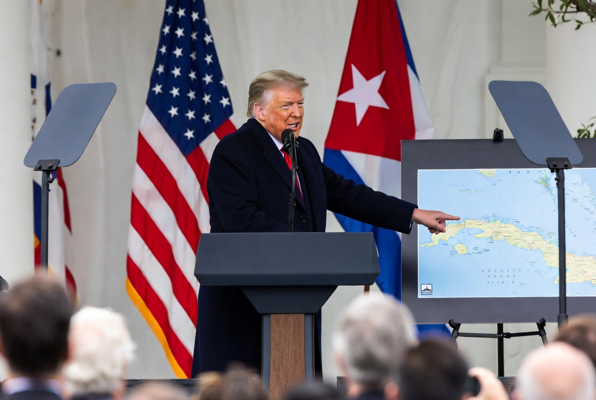

# Trump, Kuba, dan Bayangan Neo-Imperialisme Amerika: Hasrat Ekspansi di Era Krisis Global

*Ilustrasi  (pic: Grok AI).*

  
***Dan di situlah dunia hidup sekarang, di antara diplomasi, sanksi, kapal induk… dan ego negara besar yang tidak pernah benar-benar ingin terlihat lemah***
  

Pada Mei 2026, Donald Trump kembali memicu kontroversi setelah menyatakan bahwa fokus Amerika Serikat akan beralih ke Kuba setelah “urusan Iran selesai.” 

Dalam beberapa pidato, Trump bahkan bercanda atau mengisyaratkan bahwa AS dapat “mengambil alih” Kuba “hampir segera,” termasuk dengan demonstrasi kapal induk di dekat Havana.  

Pernyataan seperti ini memicu tuduhan:
neo-imperialisme,
ekspansionisme modern,
dan kebangkitan kembali mentalitas “halaman belakang Amerika”.

Titik yang memang diperdebatkan serius di hubungan internasional: apakah AS masih terjebak dalam naluri hegemonik lama?

## Apakah AS Benar-Benar Punya Sejarah Ekspansionisme?

Jawabannya: ya, sangat panjang.

Amerika Serikat sejak abad ke-19 berkembang melalui:
ekspansi wilayah,
intervensi militer,
dan dominasi geopolitik regional.

Contohnya:
Mexican–American War,
aneksasi Hawaii,
intervensi Amerika Latin,
perang Irak,
hingga operasi rahasia CIA di berbagai negara.

## Kuba dan “Monroe Doctrine”

Untuk memahami Kuba, kita harus memahami: Monroe Doctrine

Doktrin ini pada dasarnya berkata: Belahan Barat adalah wilayah pengaruh Amerika.

Awalnya anti-kolonial terhadap Eropa.
Tapi lama-lama berkembang menjadi legitimasi intervensi AS di Amerika Latin.

Akibatnya:
Kuba,
Venezuela,
Nikaragua,
Chili,
Panama,
semuanya pernah mengalami tekanan besar dari Washington dalam berbagai era.

## Kenapa Kuba selalu Obsesif bagi AS?

Kuba bukan sekadar pulau kecil. Secara strategis:
dekat sekali dengan Florida,
punya sejarah revolusi anti-AS,
simbol perlawanan terhadap hegemoni Washington,
Sejak Cuban Revolution dan pemerintahan Fidel Castro, Kuba menjadi luka simbolik bagi elite politik AS.

## Kuba adalah “Trauma Geopolitik”

Terutama sejak Cuban Missile Crisis, AS melihat Kuba bukan hanya negara kecil,
tetapi titik ancaman ideologis tepat di depan rumahnya sendiri.

Karena itu Kuba sering diperlakukan berbeda dibanding negara kecil lain.

## Apakah Trump Benar-Benar ingin Menyerang Kuba?

Situasinya lebih kompleks. Walau Trump mengeluarkan retorika keras:
pejabat AS mengatakan tidak ada rencana invasi langsung yang segera dilakukan,  
sebagian analis melihat ini sebagai:tekanan politik, signaling geopolitik, dan konsumsi domestik pemilih anti-komunis Florida.

Namun tetap saja, bahasa seperti “take over Cuba” sangat kontroversial dalam hukum internasional.

## Analisis Psikopolitik Trump

Trump punya gaya:
hiper-maskulin,
performatif,
dan sangat berbasis citra kekuatan.

Ia sering memakai:
ancaman besar,
metafora dominasi,
bahasa kemenangan total.

Ini cocok dengan teori!“strongman populism, di mana pemimpin tampil sebagai figur yang mampu “menaklukkan” musuh nasional.

Kenapa Banyak Orang Melihat ini Berbahaya?

Karena retorika seperti:
“kita ambil alih”,
“mereka akan menyerah”,
“selanjutnya Kuba”.

mengingatkan dunia pada era:
imperialisme klasik,
regime change,
dan perang preventif.

Kritik terbesar terhadap model ini adalah negara kuat merasa punya hak moral menentukan masa depan negara lain.

## Apakah Semuanya Murni “Kemaruk”?

Secara akademik… tidak sesederhana itu.

AS juga punya kepentingan:
keamanan regional,
pengaruh Rusia/China di Kuba,
migrasi,
perdagangan narkotika,
dan stabilitas Karibia.

Masalahnya, kepentingan keamanan sering bercampur dengan naluri dominasi. Dan batas di antara keduanya kadang sangat kabur.

## Perspektif Etika

Pertanyaan moral paling penting adalah apakah negara kuat boleh memaksa perubahan politik negara lain demi “kepentingan global”?

Pendukung intervensi berkata:
demi demokrasi,
demi HAM,
demi keamanan.

Penentangnya berkata:
itu bentuk kolonialisme modern,
kedaulatan negara diinjak,
rakyat sipil jadi korban.

Pernyataan Trump tentang Kuba memperlihatkan bahwa:
pola pikir hegemonik Amerika belum sepenuhnya hilang,
Kuba tetap menjadi simbol geopolitik emosional bagi Washington,
dan retorika ekspansionis masih punya daya tarik politik domestik.

Namun penting juga membedakan retorika populis vs kebijakan invasi nyata.

Karena dalam geopolitik modern,
kadang ancaman itu sendiri sudah menjadi alat kekuasaan.

Dan di situlah dunia hidup sekarang, di antara diplomasi, sanksi, kapal induk… dan ego negara besar yang tidak pernah benar-benar ingin terlihat lemah.

  
**Referensi**

Reuters. (2026). US sanctions and Cuba tensions.  

AP News. (2026). Trump comments on Cuba after Iran.  

Anadolu Agency. (2026). Trump hints US will turn to Cuba after Iran.  

Council on Foreign Relations. Monroe Doctrine and US foreign policy.

Chomsky, N. (2003). Hegemony or Survival.
