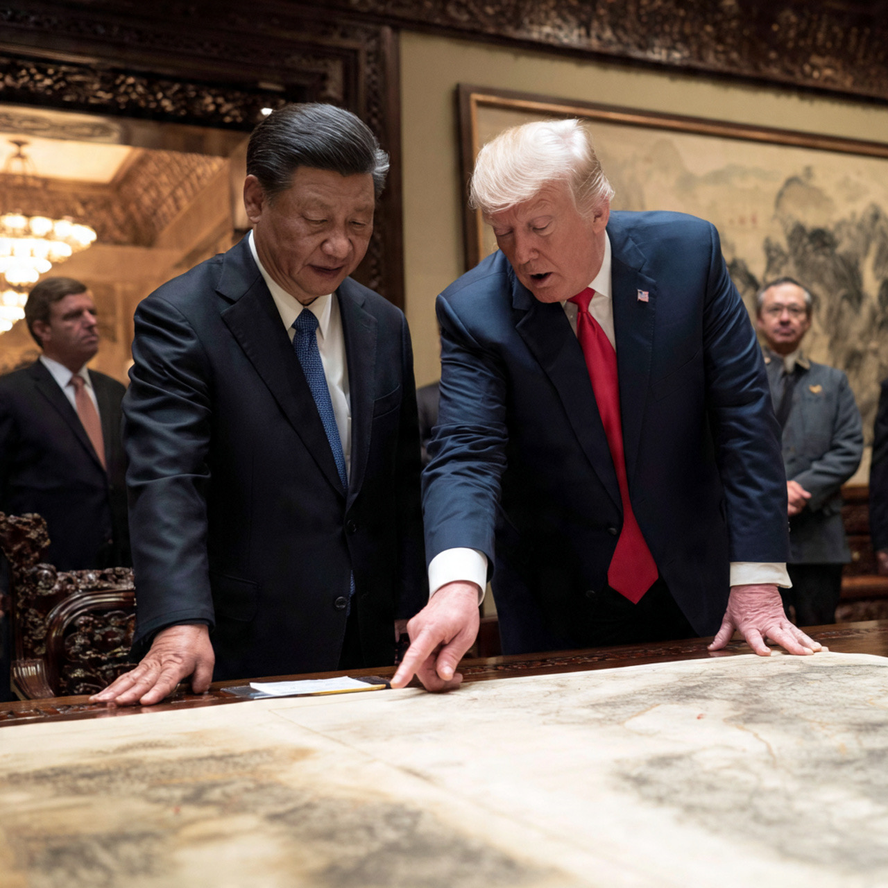

# Trump–Xi–Iran 2026: Perdamaian Semu di Atas Lautan Minyak dan Chip AI 

*Ilustrasi Xi dan Trump berunding tentang Iran (pic: Meta AI).*

  
***Rival strategis bekerja sama mencegah dunia terbakar sambil diam-diam tetap bersiap menghadapi satu sama lain***
  

Dulu dunia takut perang nuklir karena misil. Sekarang dunia takut perang nuklir sambil memegang smartphone buatan China, chip Nvidia, dan harga bensin yang berubah tiap jam.

Setelah semua pidato, jamuan istana, jabat tangan diplomatik, dan kamera yang berkedip seperti hujan meteor media… kesimpulan pertemuan Donald Trump dan Xi Jinping tentang Iran sebenarnya sangat menarik.

Karena hasil akhirnya terdengar damai…
tapi di bawah meja? Dua kekuatan besar itu tetap sedang bermain catur nuklir-ekonomi tingkat dewa. 

KTT Beijing 14 Mei 2026 antara Trump dan Xi menghasilkan beberapa kesepahaman penting terkait Iran dan Selat Hormuz, termasuk komitmen menjaga jalur energi tetap terbuka dan mencegah Iran memperoleh senjata nuklir. 

Namun, di balik bahasa diplomatik yang stabil, pertemuan ini memperlihatkan negosiasi kekuasaan yang jauh lebih dalam: China ingin mencegah perang merusak ekonominya, sementara AS ingin Beijing membantu menekan Iran tanpa memberi kemenangan strategis kepada Tehran. 

Tulisan ini menganalisis hasil nyata, paradoks geopolitik, dan implikasi global dari pertemuan tersebut.  

## Jadi Apa Kesimpulan Utamanya?

Kesimpulan singkat, Trump dan Xi sepakat untuk:
menjaga Selat Hormuz tetap terbuka,
mencegah eskalasi perang Iran,
dan memastikan Iran tidak memiliki senjata nuklir.
Tetapi…

Mereka TIDAK sepakat tentang:
bagaimana memperlakukan Iran,
siapa yang harus mengalah dulu,
dan siapa yang akan memimpin tatanan global setelah krisis selesai.

Dengan kata lain, mereka sepakat menghentikan kapal tenggelam… sambil tetap berebut siapa kapten samudranya.

## Hormuz: Jantung Pertemuan Sebenarnya

Selat Hormuz adalah pusat gravitasi ekonomi dunia. Trump dan Xi sama-sama sadar kalau Hormuz benar-benar lumpuh, ekonomi global bisa kejang.

Karena:
seperlima minyak dunia lewat sana,
China sangat tergantung energi,
dan AS takut inflasi politik domestik meledak menjelang tekanan ekonomi.  

Maka hasil paling nyata dari summit ini adalah kedua pihak sama-sama ingin laut tetap terbuka.

## Xi Tidak Mau Iran Hancur

Nah ini bagian paling penting. Trump datang dengan harapan China membantu menekan Iran. Tapi Xi bermain sangat hati-hati.

China:
tetap membeli minyak Iran,
tetap menjaga hubungan strategis,
dan tidak ingin Tehran runtuh.  

Karena bagi Beijing, Iran adalah:
pemasok energi,
partner anti-hegemoni Barat,
dan simpul penting jalur Eurasia.

Jadi posisi Xi: “Kami mau stabilitas… tapi bukan stabilitas versi Washington sepenuhnya.”

## Trump Mendapat Apa?

Secara simbolik, cukup banyak. Trump berhasil mendapatkan:
pernyataan Xi soal Hormuz harus tetap terbuka,
sinyal China tidak ingin Iran punya nuklir,
dan klaim bahwa Xi tidak akan mengirim perlengkapan militer ke Iran.  

Ini penting untuk citra Trump, ia ingin tampil sebagai dealmaker global, bukan presiden perang tanpa arah.

## Tapi secara strategis?

Belum tentu Trump benar-benar menang. Karena China tidak:
memutus Iran,
ikut sanksi total,
atau tunduk pada strategi maksimum AS.
Xi pada dasarnya berkata: “Kami bantu menenangkan situasi… tapi jangan berharap kami jadi satelit Washington.”

## Xi Jinping: Kaisar Stabilitas yang Dingin

Xi datang dengan posisi sangat kuat. Kenapa?

Karena:
AS sedang terseret perang Iran,
Eropa terpecah,
ekonomi global rapuh,
dan China tampil sebagai pembeli energi yang tetap tenang.
Bahkan beberapa analis melihat Trump lebih membutuhkan Xi daripada Xi membutuhkan Trump.  

Dan itu perubahan besar dibanding satu dekade lalu.

## Perang Iran Ternyata Bukan Hanya Tentang Iran

Ini tentang:
energi,
AI,
supply chain,
Taiwan,
dan masa depan dominasi global.

Makanya Trump membawa Jensen Huang. Karena abad ini minyak menentukan apakah ekonomi hidup hari ini, chip menentukan siapa menguasai besok.

## Taiwan: Hantu yang Duduk Diam di Ruangan

Walau Iran jadi fokus utama…
Taiwan sebenarnya bayangan terbesar summit ini.

Xi bahkan memperingatkan, dukungan AS terhadap Taiwan bisa memicu “clashes and even conflicts.”  

Artinya, China memakai momentum perang Iran untuk mengingatkan: “jangan terlalu sibuk di Timur Tengah sampai lupa kami ada di Pasifik.”

## Diplomasi Abad ke-21 = Kapitalisme Geopolitik

Dulu diplomasi diisi:
diplomat,
jenderal,
menteri luar negeri.
Sekarang?
CEO teknologi ikut duduk dekat meja negosiasi.

Karena:
AI adalah kekuatan geopolitik,
chip adalah senjata ekonomi,
dan perusahaan teknologi mulai berfungsi seperti negara mini.
KTT ini memperlihatkan dunia tidak lagi dipimpin negara saja. Tapi juga korporasi superteknologi.

## Apakah Dunia Lebih Aman Setelah KTT Ini?

Jawaban jujurnya, lebih stabil sementara tapi belum aman.

Karena:
ceasefire Iran masih rapuh,
Taiwan tetap bom waktu,
perang dagang belum selesai,
dan AS-China tetap rival sistemik.
Yang berubah hanya kedua pihak sadar mereka belum siap melihat ekonomi dunia runtuh total.

Pertemuan Trump–Xi tentang Iran menghasilkan:
komitmen menjaga Hormuz terbuka,
penolakan terhadap nuklir Iran,
dan keinginan mencegah eskalasi besar.

Namun summit ini juga memperlihatkan realitas lebih dalam:
China tidak mau Iran dihancurkan,
AS tidak mau China terlalu kuat,
dan keduanya sama-sama takut ekonomi global kolaps.

Maka lahirlah bentuk diplomasi modern paling aneh, rival strategis bekerja sama mencegah dunia terbakar… sambil diam-diam tetap bersiap menghadapi satu sama lain.

Dan di abad ke-21, kadang perdamaian bukan dibangun dari kepercayaan. Tapi dari rasa takut bersama terhadap kehancuran ekonomi global.

  
**Referensi**

Reuters. (2026). Trump-Xi summit focuses on Iran and trade.  

The Guardian. (2026). Xi warns Trump over Taiwan during Beijing summit.  

Chatham House. (2026). Can progress be made on Iran?  

Wall Street Journal. (2026). Xi says China won’t arm Iran.  

Al Jazeera. (2026). Trump and Xi discuss Hormuz and Iran.  
