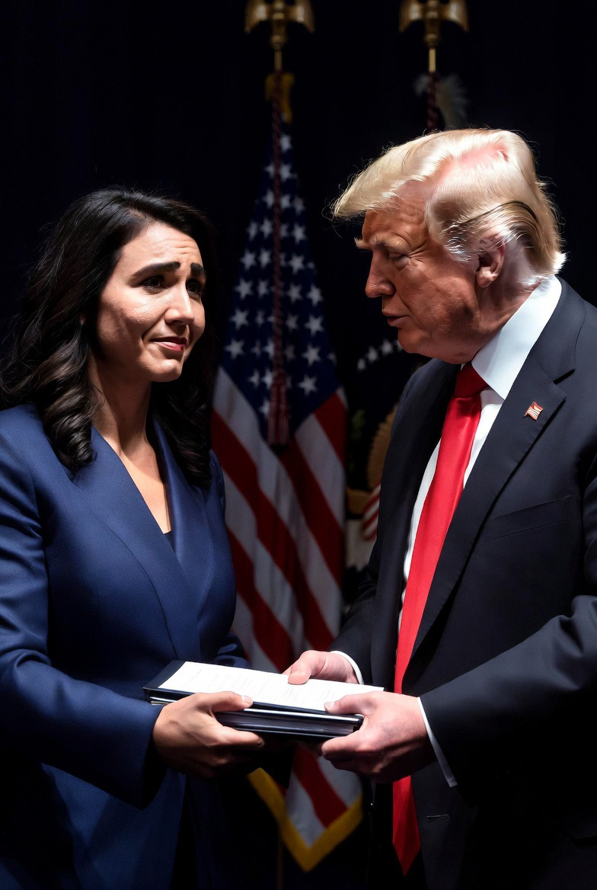

# Tulsi Gabbard Mundur, Trumpisme, dan Krisis Citra Demokrasi Liberal Amerika

*Ilustrasi  pengunduran diri Tulsi Gabbard (pic: Grok AI).*

  
***Negara-negara besar sekarang sedang bertarung bukan cuma soal ekonomi atau militer… tetapi soal model peradaban mana yang dianggap paling layak ditiru dunia***
  

Pengunduran diri Tulsi Gabbard dari posisi DNI pada 28 Mei 2026 secara resmi dikaitkan dengan alasan keluarga dan kondisi kesehatan suaminya. 

Namun di tengah meningkatnya konsolidasi kekuasaan Donald Trump, tampaknya pengunduran ini sebagai bagian dari pola lebih luas: tersingkirnya figur-figur yang dianggap tidak sepenuhnya sejalan dengan orbit politik Trump. 

Tulisan ini membahas bagaimana dinamika internal AS mempengaruhi citra global demokrasi liberal, sekaligus membuka ruang propaganda bagi rival geopolitik seperti China dan Korea Utara.

## Apakah Alasan “Suami Sakit” Mustahil?

Tidak mustahil.

Dalam politik:
kelelahan,
tekanan keluarga,
kesehatan pasangan,
memang sering jadi alasan nyata pengunduran diri.

Tapi skeptisisme publik muncul karena konteks politiknya terlalu panas. Ketika sebelumnya sudah ada:
pejabat mundur,
reshuffle,
konflik loyalitas internal,
…maka publik otomatis membaca “ini alasan personal… atau alasan politik yang dibungkus personal?”

Dan itu normal dalam politik kekuasaan tinggi.

## Pola yang Mulai Terlihat

Trumpisme cenderung menuntut loyalitas personal tinggi, bukan sekadar kesamaan kebijakan. Tetapi juga kesediaan berada dalam orbit politik Trump secara penuh.

Akibatnya, figur yang:
terlalu independen,
terlalu moderat,
atau sulit diprediksi,
…sering dianggap problematis.

## Krisis Demokrasi Liberal?

Nah ini bagian yang rumit.
AS selama puluhan tahun menjual citra:
checks and balances,
institusi kuat,
kebebasan sipil,
demokrasi liberal.

Namun ketika dunia melihat:
polarisasi ekstrem,
loyalisme personal,
tekanan terhadap pejabat,
chaos politik internal.

Maka musuh geopolitik AS langsung punya bahan propaganda.

## Mengapa China & Korut Diuntungkan Secara Naratif?

Karena mereka bisa berkata: “Lihat? Demokrasi liberal kalian sendiri kacau.” Dan ini sangat efektif secara propaganda global.

China khususnya sangat pintar memainkan narasi:
stabilitas,
efisiensi negara,
pembangunan ekonomi tanpa demokrasi liberal penuh.

Mereka menyebut model Barat: terlalu gaduh, lamban, dan penuh konflik internal.

## Tapi… Apakah itu Berarti Sistem Otoriter Lebih Baik?

Meski liberalisme Barat berantakan tapi masih ada:
ruang kritik,
kebebasan agama relatif,
media independen,
oposisi politik,
HAM yang bisa diperdebatkan di ruang publik.

Sedangkan di banyak rezim otoriter, kritik terhadap negara bisa:
disensor,
dipenjara,
dihapus dari sejarah.

## Kasus Uighur & Korut

Banyak organisasi HAM internasional mengkritik keras kebijakan China di Xinjiang terhadap suku Uighur. Tidak beda jauh dengan Korea Utara yang dikenal sangat represif terhadap elite maupun rakyat.

Contoh:
penghapusan figur dari arsip publik,
kultus kepemimpinan ekstrem,
kontrol informasi total.

Ini menunjukkan, meski demokrasi liberal penuh cacat… alternatif otoriter juga membawa harga kemanusiaan yang sangat besar.

## Masalah Besar Abad 21

Dunia sekarang seperti terjebak antara dua krisis:

| Demokrasi Liberal | Otoritarianisme |
|------|-------|
| gaduh & terpolarisasi | stabil tapi represif |
| kebebasan tinggi | kontrol tinggi |
| konflik elite terbuka | kritik dibungkam |
| media liar | media dikontrol |

Dan publik global mulai frustrasi pada keduanya.

## Kenapa Citra AS Penting?

Karena kekuatan Amerika bukan cuma:
militer,
dolar,
teknologi.

Tetapi juga soft power, yakni citra:
kebebasan,
demokrasi,
HAM.

Kalau citra itu retak maka rival geopolitik otomatis diuntungkan. China bisa berkata: “kami mungkin keras… tapi setidaknya stabil.”

## Tragedi Besarnya

Ironinya, banyak orang masih percaya demokrasi liberal lebih manusiawi…tetapi mereka juga kecewa karena:
elite politik makin tribal,
institusi tampak partisan,
dan figur populis mendominasi narasi.

Akibatnya, kepercayaan publik global terhadap model Barat mulai menurun.

Pengunduran diri Tulsi Gabbard mungkin memang memiliki dimensi personal. Namun dalam konteks politik Trump-era, publik sulit memisahkannya dari:
konflik loyalitas,
polarisasi internal,
dan konsolidasi kekuasaan.

Sementara itu, rival AS memanfaatkan setiap retakan demokrasi Amerika untuk memperkuat narasi bahwa liberalisme bukan lagi model paling stabil bagi dunia.

Namun pertanyaan akhirnya tetap mengganggu, apakah dunia ingin sistem yang gaduh tapi bebas… atau stabil tapi penuh ketakutan?

Negara-negara besar sekarang sedang bertarung bukan cuma soal ekonomi atau militer… tetapi soal model peradaban mana yang dianggap paling layak ditiru dunia. 

  
**Referensi**

Reuters. (2026, May 28). Tulsi Gabbard resigns as DNI amid growing tensions in Trump administration.

The New York Times. (2026, May 28). Questions emerge over Gabbard’s resignation and White House dynamics.

Human Rights Watch. (2025). Reports on Xinjiang and Uyghur rights concerns.

Levitsky, S., & Ziblatt, D. (2018). How Democracies Die.
