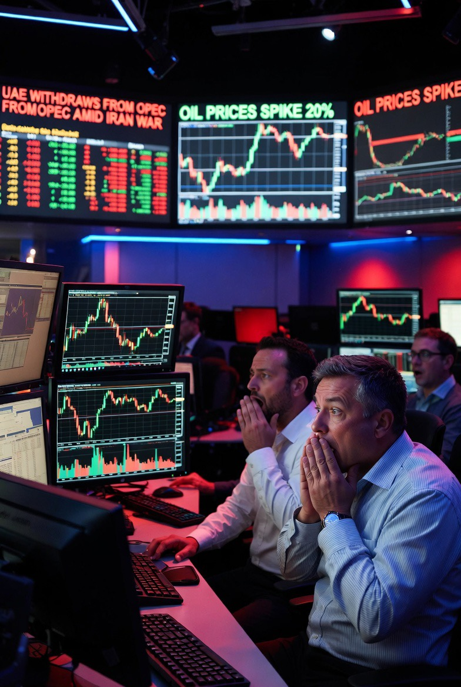

# UAE Keluar dari OPEC: Retaknya Kartel Minyak Teluk atau Strategi Baru Menghadapi Perang Iran?

*Ilustrasi pasar energi (pic: Grok AI).*

  
***Perang, energi, dan ego negara kaya minyak mulai saling bertabrakan di ruang sempit bernama Timur Tengah***
  

Keputusan United Arab Emirates keluar dari OPEC pada April 2026 mengejutkan pasar energi global dan memicu spekulasi tentang retaknya solidaritas negara-negara Teluk di tengah perang Iran. 

Tulisan ini menganalisis dampak ekonomi, motif geopolitik, serta implikasi strategis keputusan tersebut terhadap hubungan UAE–Saudi Arabia dan stabilitas GCC. 

Temuan menunjukkan bahwa langkah UAE bukan sekadar isu minyak, tetapi sinyal transformasi kekuasaan regional dan perebutan otonomi strategis di Timur Tengah.  

## Pendahuluan

Selama puluhan tahun, OPEC bekerja seperti:

“orkestra minyak dunia”

dengan:

Saudi Arabia sebagai konduktor utama

negara Teluk lain mengikuti ritme produksi bersama.

Namun ketika UAE keluar dari OPEC di tengah perang Iran:

itu bukan sekadar keluar organisasi.

Itu seperti:

salah satu mesin utama kapal memutuskan berlayar sendiri.

## Dampak ke Harga Minyak Global

Jangka Pendek:

Pasar langsung:

tegang

volatil

harga minyak naik tajam akibat ketidakpastian.  

Karena:

perang Iran sudah mengganggu Hormuz

lalu kini kohesi OPEC ikut retak.

Jangka Menengah:

Paradoks muncul.

Kalau UAE nanti:

produksi bebas tanpa kuota OPEC

👉 suplai global bisa meningkat

👉 harga minyak justru bisa turun.

Jadi pasar sekarang berada di dua ketakutan sekaligus:

| Ketakutan | Dampak |
|------|-------|
| perang Iran | harga naik |
| UAE bebas produksi | harga turun |

Akibatnya:
pasar minyak menjadi sangat tidak stabil.  

## Alasan Politik di Balik Keputusan UAE

Ini bagian paling menarik.

1️⃣ UAE Muak dengan Kuota Saudi

Selama ini UAE merasa:

mereka punya kapasitas produksi besar

tapi terlalu dibatasi OPEC.

Saudi ingin:

menahan produksi

menjaga harga tetap tinggi.

Sedangkan UAE ingin:

memonetisasi investasinya sekarang juga.  

2️⃣ UAE Ingin Lebih Mandiri Secara Geopolitik

Dulu:

UAE dan Saudi hampir selalu sejalan.

Sekarang?

👉 mulai kompetisi diam-diam.

Mereka bersaing soal:

pengaruh regional

investasi

logistik

pelabuhan

hubungan dengan AS

hubungan dengan Israel.

3️⃣ Faktor Perang Iran

Perang Iran mengubah kalkulasi semuanya.

UAE merasa:

mereka terlalu rentan terhadap konflik regional
tapi strategi kolektif GCC tidak cukup melindungi kepentingannya.

Beberapa analis melihat UAE:

ingin lebih fleksibel menghadapi dunia pasca-perang Iran.  

## Reaksi Saudi Arabia

Secara publik:

Saudi relatif hati-hati.

Tapi secara strategis?

👉 ini pukulan besar.

Karena UAE adalah:

salah satu produsen paling penting

punya spare capacity besar

salah satu “shock absorber” OPEC.  

Akibatnya:

Saudi harus memikul beban stabilisasi harga sendirian.

Dan itu mahal.

## Apakah Ini Tanda Perpecahan GCC?

Jawaban pendeknya:

👉 iya… tapi bukan berarti GCC langsung runtuh.

Yang retak bukan:

identitas Teluknya

melainkan:

kepentingan strategisnya.

UAE vs Saudi sekarang berbeda visi:

| UAE | Saudi |
|------|-------|
| lebih fleksibel | lebih konservatif |
| agresif ekonomi global | fokus dominasi regional |
| dekat ke Israel & AS | lebih hati-hati |
| ingin produksi lebih besar | ingin kontrol harga |

Perang Iran memperbesar retakan itu.  

## Apakah OPEC Layak Disebut “Kartel”?

Secara ekonomi:

👉 Ya, OPEC sering disebut kartel minyak.

Karena:

negara anggota mengoordinasikan produksi
untuk memengaruhi harga global.

Definisi kartel:

kelompok produsen yang bekerja sama mengontrol suplai dan harga.

Dan itu memang fungsi utama OPEC sejak 1960-an.

Namun OPEC sendiri tentu tidak suka istilah itu 😏
karena “kartel” terdengar:

manipulatif

anti-persaingan.

Mereka lebih suka menyebut diri:

organisasi stabilisasi pasar energi.

Tapi secara akademik?

Banyak ekonom memang menyebut OPEC sebagai:

state-based commodity cartel.

Inti Terdalamnya yang terjadi sekarang bukan sekadar:

minyak

kuota

atau perang Iran.

Ini adalah:

⚔️ perebutan masa depan Timur Tengah.

Dulu:

Saudi = pusat gravitasi Teluk.

Sekarang:

UAE mulai berkata:

“kami tidak mau lagi sekadar ikut orbit.”

Dan perang Iran mempercepat semuanya:

aliansi berubah

energi dipersenjatai

solidaritas GCC melemah

negara Teluk makin pragmatis.

Keputusan UAE keluar dari OPEC adalah salah satu sinyal geopolitik terbesar 2026.

Ini menunjukkan bahwa:

perang Iran tidak hanya mengubah keamanan
tetapi juga merombak struktur kekuasaan energi global.

kadang retakan besar dalam geopolitik…
muncul bukan lewat ledakan bom, tetapi lewat satu negara yang berkata: “mulai sekarang, kami main sendiri.”

  
**Referensi**

Reuters. (2026). UAE leaves OPEC in blow to global oil producers’ group.  

Al Jazeera. (2026). UAE leaves OPEC in blow to oil cartel during war on Iran.  

Bloomberg. (2026). UAE to exit OPEC as Iran war reshapes global oil supply.  

Mueller, J. (1970). Presidential popularity from Truman to Johnson. American Political Science Review.
