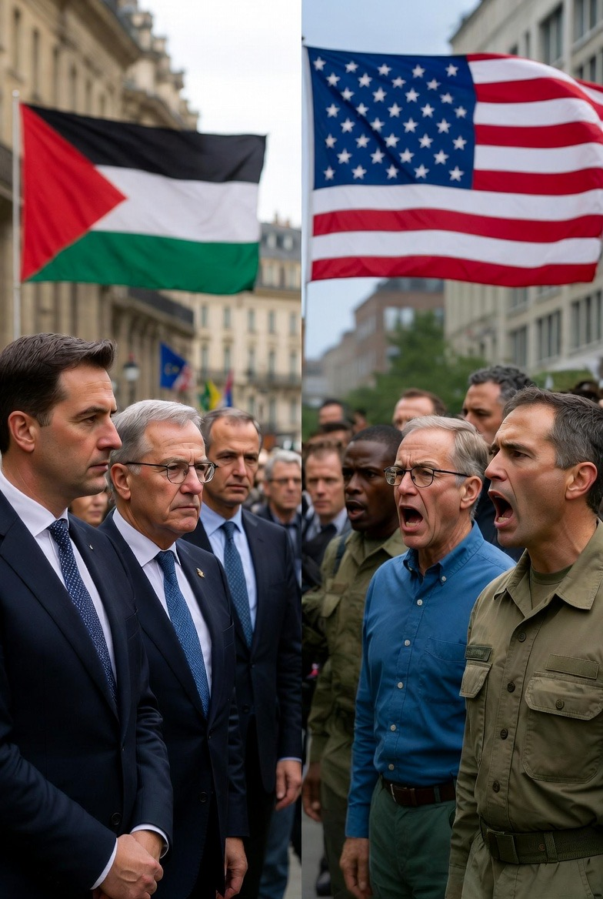

# Konflik Kepentingan dalam Diplomasi Perdamaian: Kritik Uni Eropa terhadap BoP Gaza dan Politik Kekuasaan Trans-Atlantik

*Ilustrasi kritik terhadap BoP (pic: Grok AI).*

  
***Dan Gaza, tragisnya, tetap menjadi panggung tempat teori hubungan internasional berubah menjadi kenyataan berdarah***
  

Ketegangan antara Amerika Serikat dan Uni Eropa terkait pembentukan Dewan Perdamaian Gaza (Board of Peace/BoP) mencerminkan konflik kepentingan dalam tata kelola keamanan global. 

Kritik dari pejabat Uni Eropa, termasuk Koja Kalllas, menunjukkan kekhawatiran terhadap politisasi institusi perdamaian dan potensi konflik kepentingan dalam kebijakan luar negeri pemerintahan Donald Trump. 

Artikel ini menganalisis dinamika tersebut melalui perspektif teori realisme, liberalisme institusional, dan ekonomi politik internasional.

## Pendahuluan

Perbedaan pandangan antara Amerika Serikat dan Uni Eropa mengenai mekanisme perdamaian Gaza memperlihatkan bahwa bahkan sekutu trans-Atlantik dapat berselisih ketika kepentingan strategis dan ekonomi bersinggungan.

Dalam politik global, “perdamaian” sering menjadi arena negosiasi kekuasaan, bukan sekadar tujuan moral.

## Latar Belakang Politik

Kritik Uni Eropa terhadap Dewan Perdamaian Gaza berfokus pada tiga isu utama:

1.	Legitimasi institusional

2.	transparansi pendanaan

3.	potensi konflik kepentingan politik

Pernyataan Kallas bahwa dana dapat mengalir ke jaringan politik tertentu menunjukkan kekhawatiran bahwa mekanisme perdamaian bisa berubah menjadi instrumen patronase politik.

Dalam perspektif ekonomi politik internasional, tuduhan semacam ini bukan hal baru. Program rekonstruksi konflik sering menjadi arena perebutan kontrak, pengaruh diplomatik, dan legitimasi global.

## Analisis Teoretik

1. Realisme: Perdamaian sebagai Instrumen Kekuasaan

Dalam teori realisme, negara besar menggunakan institusi internasional untuk mempertahankan pengaruh geopolitik.

Dari sudut pandang ini:

•	AS berusaha mempertahankan dominasi politik Timur Tengah

•	Uni Eropa berusaha menjaga legitimasi multilateralisme

•	Gaza menjadi arena kompetisi pengaruh

Perdamaian berubah menjadi alat strategi, bukan tujuan akhir.

2. Liberalisme Institusional: Krisis Kepercayaan Sekutu

Liberalisme institusional menekankan pentingnya kepercayaan dalam kerja sama internasional.

Ketika Uni Eropa meragukan transparansi BoP, yang terguncang bukan hanya proyek Gaza, tetapi juga:

•	koordinasi NATO

•	hubungan ekonomi trans-Atlantik

•	legitimasi kepemimpinan AS

Aliansi tetap ada, tetapi rasa percaya mulai retak seperti kaca mobil kena kerikil kecil.

3. Ekonomi Politik Perdamaian

Studi tentang rekonstruksi pascakonflik menunjukkan bahwa proyek perdamaian sering terkait dengan:

•	kontrak infrastruktur

•	industri keamanan

•	investasi energi

•	bantuan kemanusiaan

Dengan kata lain, perdamaian juga merupakan ekosistem ekonomi.

Dan uang, seperti biasa, jarang netral.

## Implikasi Global

Perpecahan AS–Eropa mengenai BoP Gaza berpotensi menghasilkan:

•	fragmentasi kepemimpinan Barat

•	melemahnya legitimasi misi perdamaian

•	meningkatnya skeptisisme negara Global South

•	politisasi bantuan kemanusiaan

Ini memperlihatkan paradoks klasik politik internasional: perdamaian sering membutuhkan kekuasaan, tetapi kekuasaan justru merusak kepercayaan terhadap perdamaian.

Kontroversi Dewan Perdamaian Gaza menunjukkan bahwa konflik Israel–Palestina bukan hanya krisis regional, melainkan juga arena kompetisi politik global.

Kritik Uni Eropa terhadap AS menegaskan bahwa bahkan di dalam blok Barat sendiri, definisi “perdamaian” tidak selalu sama.

Dunia diplomasi itu lucu sekaligus tragis. Semua orang bicara soal perdamaian, tapi tetap membawa kalkulator di saku jas. 

Sejarah menunjukkan satu hal yang konsisten: ketika perdamaian mulai terdengar seperti proposal proyek, seseorang sedang menghitung keuntungan.

Dalam politik internasional, perdamaian bisa menjadi:

•	proyek moral,

•	strategi geopolitik,

•	atau peluang ekonomi.

Kadang semuanya sekaligus.

Dan Gaza, tragisnya, tetap menjadi panggung tempat teori hubungan internasional berubah menjadi kenyataan berdarah.

  
**Referensi**

Bellamy, A. J., & Williams, P. D. (2015). Understanding Peacekeeping. Polity Press.

Drezner, D. W. (2021). The Toddler in Chief: What Donald Trump Teaches Us About the Modern Presidency. University of Chicago Press.

Heywood, A. (2014). Global Politics (2nd ed.). Palgrave Macmillan.

Keohane, R. O. (1984). After Hegemony. Princeton University Press.
