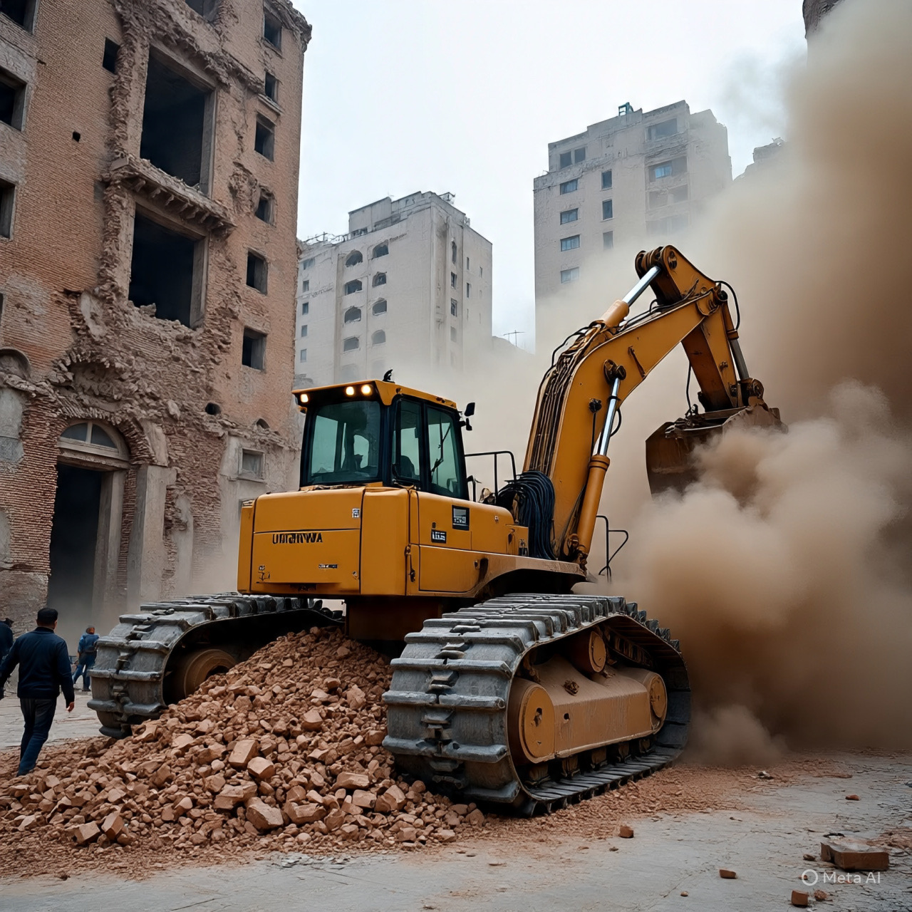

# Kemanusiaan di Bawah Buldoser Kekuasaan: Demolisi UNRWA, Dewan Perdamaian Paralel, dan Erosi Otoritas PBB dalam Krisis Palestina (2023–2026)

*Ilustrasi penghancuran bangunan oleh buldoser (pic: Trinity AI/Meta AI).*

  
***Ketika norma hak asasi dan proteksi kemanusiaan diuji oleh realpolitik yang kuat, lembaga internasional bisa kehilangan kapasitas operasionalnya***
  

Sejak akhir 2023, dinamika konflik Israel–Palestina telah memasuki fase baru di mana institusi kemanusiaan global, khususnya United Nations Relief and Works Agency for Palestine Refugees in the Near East (UNRWA), menjadi target politik dan militer. 

Dengan munculnya Gaza Peace Council yang diprakarsai Amerika Serikat di bawah kepemimpinan Donald Trump, tekanan terhadap PBB dan UNRWA meningkat, berkontribusi pada eskalasi terhadap struktur bantuan kemanusiaan tradisional. 

Kasus penggusuran dan penghancuran fasilitas UNRWA di Yerusalem Timur pada Januari 2026 menunjukkan konflik antara kekuasaan normatif internasional dan realpolitik, konflik yang bukan sekadar militer tetapi juga mengenai siapa yang mewakili legitimasi penyelesaian dan perlindungan warga sipil Palestina.

## Dewan Perdamaian Alternatif dan Peran Diplomat AS

Pada Januari 2026, pemerintah Amerika Serikat mengumumkan pembentukan Gaza Peace Council, forum diklaim sebagai mekanisme baru untuk pengelolaan pasca-konflik, demiliterisasi Hamas, dan rekonstruksi wilayah Gaza. 

Rancangan ini dipandang oleh banyak pihak sebagai upaya membentuk struktur perdamaian paralel di luar arsitektur PBB, menandai relasi baru antara kekuatan besar dan lembaga internasional yang selama ini menjadi rujukan global untuk konflik bersenjata.  

## UNRWA: Institusi Kemanusiaan dalam Bayang-Bayang Politik

UNRWA, sebagai badan PBB yang sejak 1949 bertanggung jawab atas perlindungan dan bantuan bagi jutaan pengungsi Palestina, menghadapi tekanan politik dan hukum. 

Israel telah melarang operasi badan ini di wilayah yang dikendalikan sejak 2025, mengklaim keterlibatan beberapa staf dalam aktivitas militan — tuduhan yang dibantah oleh UNRWA dan tidak dibuktikan secara independen.  

Pada 20 Januari 2026, pasukan Israel menghancurkan markas UNRWA di Yerusalem Timur menggunakan buldoser dan alat berat, langkah ini dilakukan setelah kompleks tersebut telah ditinggalkan sejak larangan operasional berlaku. 

PBB dan negara-negara seperti Indonesia serta Yordania menyatakan tindakan tersebut sebagai pelanggaran serius terhadap hukum internasional, kekebalan dan imunitas PBB, serta ancaman terhadap keberadaan bantuan kemanusiaan.  

## Kekuasaan, Legitimasi, dan Konflik Normatif

Penghancuran fasilitas UNRWA bukan hanya tindakan fisik terhadap bangunan, tetapi simbol konfrontasi antara norma internasional dan klaim kedaulatan unilateral. 

Sekretaris Jenderal PBB mengecam keras perbuatan Israel sebagai bertentangan dengan Piagam PBB dan konvensi yang menjamin kekebalan fasilitas PBB. 

Menurut juru bicara PBB, struktur yang dilindungi statusnya tidak bisa diganggu gugat tanpa melanggar hukum internasional.  

## Dampak terhadap Kemanusiaan di Tepi Barat dan Gaza

Langkah ini terjadi di tengah operasi militer Israel yang masih berlangsung di Gaza dan Tepi Barat, di mana kamp pengungsi dan anak-anak terus menjadi korban. 

UNRWA sendiri melaporkan puluhan ribu anak tetap berada dalam kondisi pengungsian akibat kampanye militer yang sedang berlangsung.  

## Kekerasan Terintegrasi dan Politik Regional

Penghancuran markas UNRWA menempatkan institusi bantuan sipil dalam dinamika konflik yang jauh dari sekadar bantuan kemanusiaan; ini menjadi bagian dari skenario politik yang mencakup pembatasan akses bantuan, definisi ulang legitimasi institusi global, dan upaya kekuatan besar untuk mengatur “narasi perdamaian” melalui forum tandingan.

Kasus UNRWA di Yerusalem Timur mengilustrasikan bahwa konflik Israel–Palestina saat ini bukan hanya soal pertempuran militer, tetapi juga pertarungan legitimasi politik-institusional. 

Upaya pembentukan dewan perdamaian paralel oleh AS, penghancuran fasilitas PBB, dan reaksi global mencerminkan dilema besar dalam hukum internasional kontemporer: ketika norma hak asasi dan proteksi kemanusiaan diuji oleh realpolitik yang kuat, lembaga internasional bisa kehilangan kapasitas operasionalnya — dan legitimasi mereka dipertanyakan oleh aktor berkuasa.

  
**Referensi**

•	Al Jazeera. (2026, January 21). Live: Israel launches strikes as Netanyahu joins Gaza ‘board of peace’.  

•	Tempo.co. (2026, January). Trump announces Gaza peace council formation.  

•	ANTARA News. (2026, January 21). Indonesia kutuk penghancuran fasilitas UNRWA di Yerusalem oleh Israel.  

•	Anadolu Agency. (2026, January 21). Sekjen PBB kecam pembongkaran fasilitas UNRWA oleh Israel di Yerusalem Timur.  

•	Sada News Agency. (2026, January 20). Jordan warns of consequences of illegal Israeli actions against UNRWA.  

•	Reuters. (2026, January 20). Israel demolishes buildings in UN Palestinian agency’s East Jerusalem compound.  
