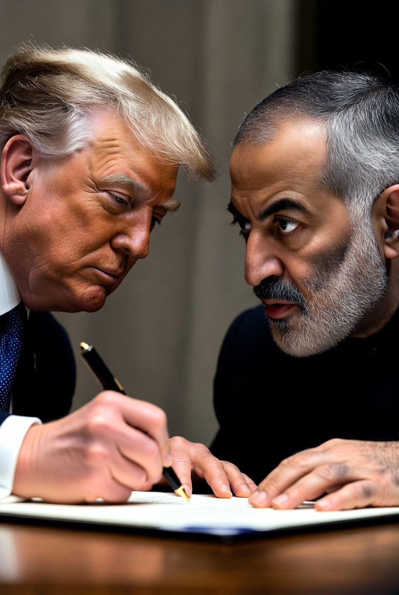

# Ultimatum, Bom, dan Moralitas Kekuatan: Ketika “Pesan Terakhir” Menjadi Bahasa Perang

*Ilustrasi (pic: Grok AI).*

  
***Bagi Washington, waktunya mungkin didasarkan pada kalkulasi militer. Namun bagi Tehran, waktunya menjadi bukti bahwa lawan tidak menghormati momen berkabung nasional***
  

Setelah ultimatum AS berakhir tanpa kesepakatan baru, Washington melancarkan gelombang serangan terhadap puluhan target militer Iran dan infrastruktur yang diklaim memiliki nilai strategis militer, termasuk beberapa jembatan rel kereta. 

Pemerintah AS menyatakan serangan itu merupakan respons serangan Iran terhadap kapal-kapal komersial di sekitar Selat Hormuz. 

Trump juga kembali mengeluarkan peringatan keras bahwa ancaman pembunuhan terhadap dirinya akan dibalas dengan konsekuensi yang sangat berat.  

Dalam politik internasional, negara besar sering mengklaim bertindak demi keamanan. Persoalannya, keamanan bagi siapa?

## Paradoks Deterrence

Trump pada satu sisi mengatakan: “Ancaman terhadap saya tidak bisa ditoleransi.” Namun di sisi lain, Amerika menganggap penggunaan kekuatan militer sebagai instrumen yang sah untuk mencegah ancaman yang dinilai lebih besar.

Di sinilah muncul konsep yang dikenal sebagai deterrence atau penangkalan.

Logikanya: “Jika kami menunjukkan kekuatan sekarang, lawan akan berpikir dua kali untuk menyerang di masa depan.”

Masalahnya, lawan sering membaca pesan yang berbeda: “Kami sedang diserang, sehingga kami harus membalas.”

Akibatnya, kedua pihak sama-sama menganggap dirinya sedang bertahan.

## Mengapa Infrastruktur Transportasi Ikut Diserang?

Dalam doktrin militer modern, rel kereta, jembatan, dan jaringan logistik dapat dianggap sebagai dual-use infrastructure.

Artinya, dipakai untuk sipil, tetapi juga dapat dipakai memindahkan rudal, amunisi, kendaraan tempur, logistik militer.

Karena itu, banyak negara menganggapnya target militer yang sah jika benar digunakan untuk kepentingan militer.

Namun hukum humaniter internasional juga mengharuskan penyerang mempertimbangkan proporsionalitas dan meminimalkan dampak terhadap warga sipil. 

Bila serangan menimbulkan kerugian sipil yang berlebihan dibanding keuntungan militer yang diharapkan, tindakan tersebut dapat dipersoalkan menurut hukum perang.

## Mengapa Masa Berkabung Menjadi Sangat Sensitif?

Serangan ketika Iran masih berkabung memperbesar dampak psikologis.

Bagi Washington, waktunya mungkin didasarkan pada kalkulasi militer. Namun bagi Tehran, waktunya menjadi bukti bahwa lawan tidak menghormati momen berkabung nasional.

Dalam perang, simbol dapat sama kuatnya dengan rudal.

## Demi Kepentingan Siapa?

Keamanan Israel merupakan salah satu kepentingan utama kebijakan luar negeri AS di Timur Tengah, sehingga program nuklir Iran selama puluhan tahun menjadi perhatian utama pemerintahnya. Itulah mengapa Israel berkali-kali menyatakan Iran tidak boleh memiliki kemampuan senjata nuklir.

Selain itu, Amerika Serikat juga memiliki kepentingannya sendiri, seperti menjaga kebebasan navigasi di Selat Hormuz, melindungi pangkalan militernya, menjaga stabilitas pasar energi, mempertahankan kredibilitas penangkalannya, dan melindungi personel serta sekutunya di kawasan.

Dalam praktiknya, kepentingan-kepentingan itu sering saling bertumpang tindih.

Yang paling menarik justru bukan rudalnya, melainkan narasi moral. Setiap pihak berusaha menempatkan dirinya sebagai pihak yang “terpaksa”.

AS mengatakan: kami membalas agresi dan melindungi keamanan internasional. Sementara Iran mengatakan: kami membalas agresi terhadap negara dan pemimpin kami. Sedangkan Israel mengatakan kami menghadapi ancaman eksistensial. Banyak negara lain mengatakan eskalasi harus dihentikan karena warga sipil yang paling menderita.

Semua berbicara atas nama keamanan, tetapi hasil akhirnya sering sama, bahwa korban sipil bertambah, luka kolektif makin dalam, dan peluang kompromi semakin mengecil.

Dalam teori hubungan internasional ada ironi klasik, bahwa semakin setiap pihak yakin bahwa tindakannya adalah “pertahanan diri”, semakin besar kemungkinan kedua pihak akan terus berperang.

Itulah yang disebut sebagian pakar sebagai security dilemma. Satu pihak memperkuat keamanan untuk mencegah ancaman, tetapi pihak lain justru melihat langkah itu sebagai ancaman baru, lalu memperkuat dirinya juga. 

Spiral ini dapat berputar tanpa akhir jika tidak ada mekanisme politik yang mampu memutusnya.

  
**Referensi**

The Tragedy of Great Power Politics. (2014). W. W. Norton.

The Evolution of Cooperation. (1984). Basic Books.

International Committee of the Red Cross. International Humanitarian Law and the Conduct of Hostilities.

Reuters. (2026, July 9). Iran says it hits U.S. military targets in Gulf, buries slain leader Khamenei.  

The Guardian. (2026, July 8-9). Middle East live coverage on renewed US-Iran strikes.  
