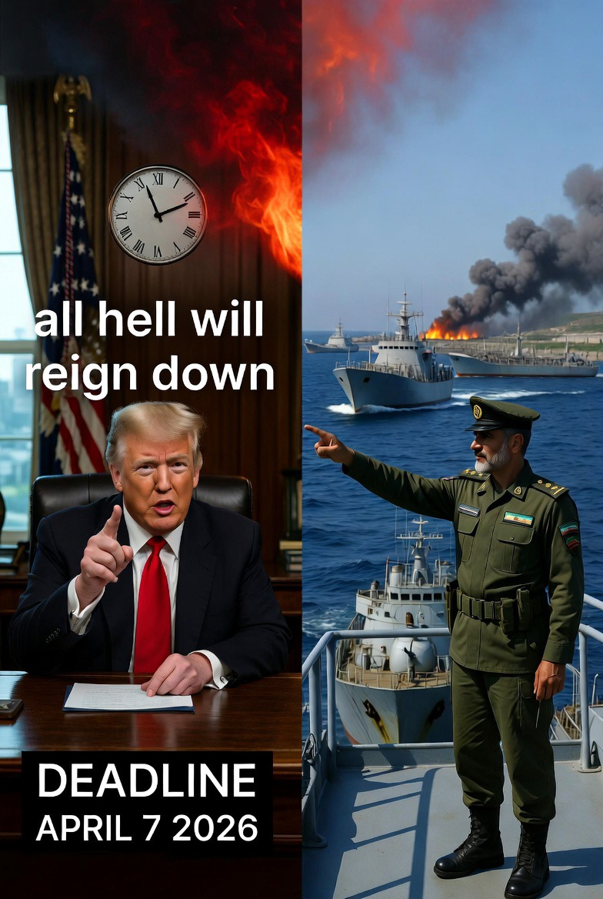

# Ultimatum, Selat Hormuz, dan Politik Gencatan Senjata: Analisis Strategi Iran vs AS–Israel dalam Eskalasi 2026

*Ilustrasi ultimatum Trump (pic: Grok AI).*

  
***Coercive Diplomacy, Ceasefire Politics, dan Asimetri Kepentingan dalam Konflik Modern***
  

Tulisan ini menganalisis dinamika ultimatum Amerika Serikat terhadap Iran terkait pembukaan Selat Hormuz dan tawaran gencatan senjata sementara, serta penolakan Iran yang menuntut penghentian perang permanen. 

Dengan pendekatan coercive diplomacy, bargaining theory, dan credibility problem, analisis ini menunjukkan bahwa perbedaan posisi bukan sekadar “ego” atau “niat buruk”, melainkan hasil dari kalkulasi strategis yang rasional dalam kondisi ketidakpercayaan tinggi. 

Konflik ini mencerminkan kegagalan struktural dalam mencapai credible peace agreement di tengah perang aktif.

## Pendahuluan

Per 7 April 2026, pemerintah AS di bawah Donald Trump mengeluarkan ultimatum:

•	Iran diminta membuka kembali Selat Hormuz

•	atau menerima kesepakatan damai (sementara)

•	dengan ancaman eskalasi besar terhadap infrastruktur strategis

Iran menolak:

•	menuntut gencatan senjata permanen

•	menolak model “temporary ceasefire”

•	mempertahankan kontrol atas Selat Hormuz

Pertanyaan utama: apakah ini sekadar keras kepala… atau strategi rasional?

## Coercive Diplomacy (Thomas Schelling)

Strategi:

•	ancaman kekuatan militer

•	untuk memaksa lawan mengalah tanpa perang total

👉 Ultimatum AS adalah contoh klasik.

## Bargaining Theory of War (James Fearon)

Perang terjadi karena:

•	informasi tidak sempurna

•	ketidakpercayaan komitmen

👉 bahkan jika damai lebih rasional, pihak tetap berperang.

## Commitment Problem

Masalah utama: “Bagaimana memastikan lawan tidak melanggar kesepakatan setelah kita berhenti?”

## Analisis Posisi Aktor

1. Posisi Iran: “Permanent Ceasefire atau Tidak Sama Sekali”

Permintaan Iran:
	
  •	penghentian perang total
	
  •	bukan jeda taktis

Rasionalitasnya:

1.	Menghindari jebakan taktis

•	gencatan sementara → lawan bisa regroup

•	lalu menyerang lagi

2.	Pengalaman historis

banyak konflik menunjukkan ceasefire sering dilanggar

3.	Kontrol leverage

Selat Hormuz = kartu ekonomi global

👉 Jadi ini bukan sekadar keras kepala

👉 tapi strategi menghindari kerugian jangka panjang

2. Posisi AS–Israel: “Temporary Ceasefire dulu”

Kenapa tidak langsung permanen?

Rasionalitasnya:

1.	Ketidakpercayaan terhadap Iran
takut Iran tetap lanjut program militer

2.	Menjaga fleksibilitas militer
ceasefire sementara = jeda operasional

3.	Tujuan belum tercapai
infrastruktur Iran belum sepenuhnya dilumpuhkan

👉 dalam logika mereka: damai permanen terlalu dini = kehilangan leverage.

## Apakah Ini “Ego” dan “Niat Buruk”?

Jawaban akademiknya:

👉 tidak sesederhana itu

Ini yang sebenarnya terjadi:

Kedua pihak berada dalam kondisi:
	
  •	mutual distrust ekstrem
	
  •	fear of exploitation

Paradoksnya:

•	Iran takut diserang lagi setelah berhenti

•	AS–Israel takut Iran memanfaatkan damai untuk menguat

👉 hasilnya: tidak ada yang mau jadi pihak pertama yang “percaya”.

## Selat Hormuz sebagai Senjata Strategis

Selat Hormuz bukan sekadar jalur laut.

👉 itu:
	
  •	chokepoint energi global
	
  •	alat tekanan ekonomi
	
  •	simbol kedaulatan Iran

Dampaknya:
	
  •	harga minyak global naik
	
  •	tekanan ke Barat meningkat
	
  •	konflik lokal → efek global

## Double Standard? Analisis Kritis

AS–Israel terlihat egois dan ingin dominan. Secara normatif, itu bisa diperdebatkan.

Namun secara akademik:

👉 ini disebut: Power Asymmetry Behavior.

Negara kuat cenderung:

•	menetapkan aturan

•	menolak batasan pada dirinya

•	menekan lawan untuk patuh

Iran juga:

•	menggunakan leverage ekonomi global

•	mempertahankan eskalasi militer

👉 kedua pihak sama-sama bermain kekuatan. bukan moral murni.

Konflik ini bukan sekadar:

•	siapa baik

•	siapa jahat

Tapi: kegagalan struktural dalam membangun kepercayaan di tengah perang aktif.

Iran menolak ceasefire sementara karena:

•	takut ditipu secara strategis

AS–Israel menolak damai permanen karena:

•	takut kehilangan kontrol

Dalam teori, damai selalu mungkin.

Dalam praktik: damai butuh kepercayaan dan kepercayaan adalah hal pertama yang mati dalam perang.

  
**Referensi**

•	Cohen, A. (1998). Israel and the Bomb. New York: Columbia University Press.

•	Stockholm International Peace Research Institute. (2024). SIPRI Yearbook 2024: Armaments, Disarmament and International Security.

•	International Atomic Energy Agency. (2024–2026). Verification and monitoring in Iran.

•	United Nations. (1968). Treaty on the Non-Proliferation of Nuclear Weapons (NPT).

•	Congressional Research Service. (2023). Iran’s Nuclear Program: Status and Outlook.

•	Herz, J. H. (1950). Idealist internationalism and the security dilemma. World Politics, 2(2), 157–180.

•	Jervis, R. (1978). Cooperation under the security dilemma. World Politics, 30(2), 167–214.

•	United Nations Office for the Coordination of Humanitarian Affairs. (2023–2026). Occupied Palestinian Territory Reports.

•	Human Rights Watch. (2024). Israel/Palestine reports.

•	Amnesty International. (2024). Documentation on civilian harm.

•	Reuters. (2026). Middle East conflict coverage.

•	Al Jazeera. (2026). Iran–Israel escalation reports.

•	The Guardian. (2026). Regional war analysis.
