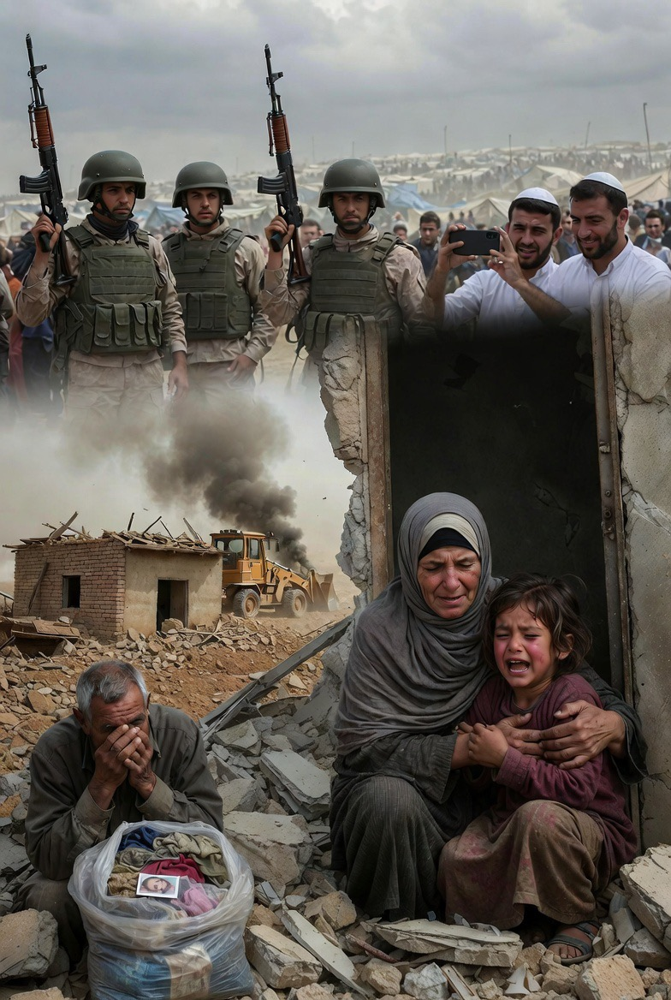

# Pengusiran Paksa di Tepi Barat: Hukum Humaniter Internasional, Keamanan, dan Tuduhan Pembersihan Etnis

*Ilustrasi pengusiran paksa (pic: Grok AI).*

  
***Dalam hukum humaniter, perlindungan sipil adalah prinsip inti, bukan variabel opsional***
  

Khirbet Tana, dekat Nablus, serta desa Beit Dajan dan Beit Furik, berada di Area C Tepi Barat. Yang menurut Oslo Accords berada di bawah kontrol administratif dan militer Israel.

Laporan dari:

•	United Nations Office for the Coordination of Humanitarian Affairs (UN OCHA)

•	B’Tselem

•	Amnesty International

•	Human Rights Watch

secara konsisten mendokumentasikan:

•	pembongkaran struktur Palestina

•	pengusiran dengan alasan latihan militer atau bangunan ilegal

•	pembatasan akses lahan

Jika angka 1.200 struktur sejak Januari benar menurut OCHA, itu masuk kategori eskalasi signifikan.

## Kerangka Hukum Internasional

Status Tepi Barat

Mayoritas komunitas internasional menganggap Tepi Barat sebagai wilayah pendudukan.

Rujukan hukum utama:

•	Konvensi Jenewa IV (1949)

•	Hukum Humaniter Internasional

Pasal 49 Konvensi Jenewa IV: Melarang pemindahan paksa penduduk sipil dari wilayah yang diduduki.

Namun ada pengecualian jika evakuasi bersifat sementara demi keamanan militer yang mutlak.

Israel sering menggunakan argumen: “zona latihan militer” atau “area tembak”.

Masalahnya: jika praktik ini sistematis dan berdampak permanen, maka pengecualian itu menjadi sangat diperdebatkan.

## Pola Sistematis atau Insiden Terpisah?

Dalam penelitian konflik, ada indikator “forcible transfer pattern”:

•	frekuensi pembongkaran tinggi

•	target komunitas yang sama

•	pembatasan izin bangunan yang ekstrem

•	ekspansi permukiman paralel

Jika pola ini konsisten, maka argumen “keamanan murni” melemah.

Beberapa organisasi HAM menyebutnya sebagai: de facto annexation through displacement.

Istilah “pembersihan etnis” lebih berat secara hukum dan politik. Ia mensyaratkan:

•	niat untuk mengubah komposisi demografis

•	pemindahan sistematis berdasarkan identitas

Apakah niat itu terbukti secara hukum? Itu masih perdebatan di level internasional.

## Argumen Israel

Israel biasanya menyatakan:

1.	Struktur dibangun tanpa izin di Area C

2.	Zona latihan militer diperlukan untuk keamanan

3.	Tindakan sesuai hukum domestik Israel

Perlu dicatat: Hukum domestik tidak otomatis sah menurut hukum internasional.

Konflik muncul karena: Israel mengklaim yurisdiksi administratif, sementara komunitas internasional menganggap wilayah itu pendudukan.

## Dimensi Politik dan Demografi

Data menunjukkan:

•	Ekspansi permukiman Israel meningkat

•	Pembatasan izin bangunan Palestina sangat tinggi

Jika satu populasi diperluas aksesnya dan populasi lain dibatasi, maka analisis demografis menjadi penting.

Beberapa akademisi menyebut ini: incremental territorial consolidation

Ini bukan ekspulsi massal ala abad ke-20, tetapi perubahan gradual melalui kebijakan administratif.

Lebih lambat.

Lebih birokratis.

Lebih sulit diprotes secara hukum.

## Apakah Ini Pembersihan Etnis?

Secara akademik, ada tiga posisi:

1.Posisi Israel: kebijakan keamanan dan tata ruang.

2.Posisi HAM internasional: pemindahan paksa sistematis.

3.Posisi akademik moderat: kebijakan keamanan + agenda demografis saling bertaut.

Label “genosida” dan “pembersihan etnis” memerlukan pembuktian niat spesifik.

Yang jelas:
pemindahan paksa tanpa kebutuhan militer mutlak berpotensi melanggar hukum humaniter internasional.

## Kenapa Dunia Terlihat “Diam”?

Struktur global:

•	AS melindungi Israel di Dewan Keamanan PBB

•	Uni Eropa terpecah

•	Negara Arab terfragmentasi pasca normalisasi

Akibatnya: mekanisme penegakan hukum internasional menjadi lemah.

Hukum internasional kuat secara normatif.
Lemah secara eksekusi.

## Kesimpulan

Jika laporan pelanggaran Israel akurat dan pola sistematis dapat dibuktikan, maka:

•	Ada potensi pelanggaran Pasal 49 Konvensi Jenewa IV.

•	Argumen keamanan harus diuji dengan standar “military necessity” yang ketat.

•	Tuduhan pembersihan etnis bergantung pada pembuktian niat demografis.

Dalam konflik ini, yang paling rentan tetap populasi sipil.

Dan dalam hukum humaniter, perlindungan sipil adalah prinsip inti, bukan variabel opsional.

  
**Referensi**

International Committee of the Red Cross. (1949). Geneva Convention relative to the Protection of Civilian Persons in Time of War (Fourth Geneva Convention). ICRC.
https://ihl-databases.icrc.org

United Nations. (1998). Rome Statute of the International Criminal Court. UN Treaty Series.
https://www.icc-cpi.int

United Nations Security Council. (2016). Resolution 2334 (2016).
https://undocs.org/S/RES/2334(2016)

United Nations Office for the Coordination of Humanitarian Affairs. (2026). West Bank demolitions and displacement data reports. OCHA Occupied Palestinian Territory.
https://www.ochaopt.org

Amnesty International. (2022). Israel’s apartheid against Palestinians: Cruel system of domination and crime against humanity. Amnesty International Ltd.

Human Rights Watch. (2021). A threshold crossed: Israeli authorities and the crimes of apartheid and persecution. HRW.

B’Tselem. (2021). A regime of Jewish supremacy from the Jordan River to the Mediterranean Sea: This is apartheid. B’Tselem.

Gordon, N. (2008). Israel’s occupation. University of California Press.

Halper, J. (2015). War against the people: Israel, the Palestinians and global pacification. Pluto Press.

Kretzmer, D. (2012). The law of belligerent occupation in the Supreme Court of Israel. International Review of the Red Cross, 94(885), 207–236.

Lynk, M. (2022). Prolonged occupation and international law. European Journal of International Law, 33(2), 429–452.

Shany, Y. (2019). The status of territories under prolonged occupation. American Journal of International Law, 113(1), 123–134.

Azarova, V. (2017). Israel’s unlawfully prolonged occupation. European Journal of International Law, 28(1), 49–88.

Weill, S. (2014). The judicial arm of the occupation. International Review of the Red Cross, 96(895–896), 803–825.
