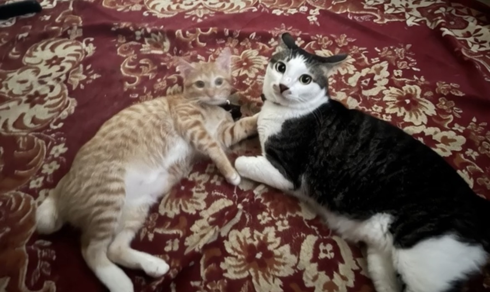

# Variasi Pola Tabby pada Kucing Domestik: Studi Kasus Motif “Cheetah-like” pada Ahong dan “Tiger-like” pada BotBot

*Ahong dan BotBot (pic: koleksi pribadi).*

  
***Setiap garis dan bintik pada tubuh bukan sekadar dekorasi, tetapi arsip biologis dari sejarah evolusi kucing***
  

Pola bulu tabby pada kucing domestik merupakan hasil interaksi kompleks antara gen pigmentasi dan gen pembentuk pola kulit. 

Studi ini menggunakan observasi morfologi pada dua kucing domestik: Ahong (tabby oranye bermotif bintik menyerupai cheetah) dan BotBot (tabby abu-putih bermotif garis memanjang menyerupai harimau). 

Analisis menunjukkan bahwa variasi ini terutama dipengaruhi oleh ekspresi gen Agouti, Tabby locus (Taqpep), serta gen pigmen MC1R yang menentukan produksi eumelanin dan pheomelanin.

## Pendahuluan

Kucing domestik adalah salah satu spesies dengan variasi pola bulu paling kompleks di antara mamalia kecil.

Fenomena pola “lorek” atau tabby pattern sebenarnya merupakan pola leluhur yang diwarisi dari nenek moyang kucing liar.

Pola ini muncul karena distribusi pigmen berbeda pada folikel rambut selama perkembangan embrionik.

Variasi yang tampak pada Ahong dan BotBot merupakan contoh nyata dari diversifikasi morfologi tabbypada populasi kucing domestik.

## Metodologi

Pendekatan yang digunakan:

1.	Observasi morfologi pola bulu

2.	Klasifikasi tipe tabby

3.	Analisis genetika pigmen

4.	Perbandingan dengan pola pada kucing liar

## Kajian Genetika Pola Tabby

1. Gen utama pembentuk pola: Taqpep

Gen Taqpep mengontrol pola garis atau bintik pada kucing.

Mutasi pada gen ini menentukan apakah kucing memiliki:

•	garis tipis

•	garis lebar

•	pola marmer

•	pola bintik

Gen ini bekerja dengan memodulasi pola aktivasi pigmen di kulit.

2. Gen pigmen warna

Warna bulu ditentukan oleh dua pigmen utama:

| Pigmen | Warna |
|------|-------|
| Eumelanin | hitam / abu / cokelat |
| Pheomelanin | merah / oranye |

Ahong menghasilkan pheomelanin dominan, sehingga warna bulunya oranye.

BotBot menghasilkan eumelanin, sehingga warna dasar menjadi abu atau hitam.

## Analisis Kasus

1.Ahong: Tabby Oranye Bermotif Cheetah

Ciri utama:

•	warna dasar oranye	

•	bintik-bintik menyerupai cheetah

Secara biologis ini disebut: Spotted Tabby.

Pola ini muncul ketika garis tabby terfragmentasi menjadi bintik.

Fenomena serupa juga ditemukan pada:

•	kucing Bengal

•	kucing Egyptian Mau

Secara evolusioner, pola ini memberikan kamuflase optimal di vegetasi berbintik cahaya.

2.BotBot: Tabby Garis Panjang Seperti Harimau

Ciri utama:

•	garis memanjang di tubuh

•	garis kuat di kepala

•	warna abu dengan area putih

Jenis ini disebut: Mackerel Tabby.

Karakteristik:

•	garis vertikal panjang

•	menyerupai tulang ikan (mackerel)

Ini adalah pola tabby paling umum pada kucing domestik dan dianggap bentuk paling dekat dengan pola leluhur.

## Peran Gen White Spotting pada BotBot

BotBot memiliki area putih di:

•	kaki

•	pipi

•	bagian tubuh tertentu

Ini disebabkan gen white spotting (KIT gene).

Gen ini menghentikan produksi pigmen di area tertentu sehingga muncul bulu putih.

## Perspektif Evolusi

Menariknya, pola tabby domestik memiliki kemiripan dengan pola kucing liar besar:

| Kucing liar | Pola |
|------|-------|
| Cheetah | spotted |
| Tiger | striped |

Fenomena ini menunjukkan bahwa pola bulu mamalia predator sering berkembang menuju pola yang membantu kamuflase.

Dengan kata lain:
Ahong dan BotBot membawa arsitektur visual predator purba dalam skala kecil.

## Diskusi

Studi kasus ini menunjukkan bahwa variasi pola bulu pada kucing domestik bukan sekadar estetika, melainkan hasil interaksi kompleks antara:

•	genetika pigmentasi

•	regulasi perkembangan kulit

•	adaptasi evolusioner

Perbedaan antara Ahong dan BotBot dapat dijelaskan melalui kombinasi:

•	ekspresi gen tabby

•	tipe pigmen dominan

•	keberadaan gen white spotting

Ahong dan BotBot merepresentasikan dua bentuk klasik pola tabby:
Ahong → spotted tabby (cheetah-like)
BotBot → mackerel tabby (tiger-like)

Walaupun hidup sebagai kucing domestik, pola bulu mereka mencerminkan jejak genetika dari nenek moyang kucing liar yang berevolusi untuk berburu dan berkamuflase di alam.

Dengan demikian, setiap garis dan bintik pada tubuh mereka bukan sekadar dekorasi, tetapi arsip biologis dari sejarah evolusi kucing.

  
**Referensi**

Bradshaw, J. (2013). Cat sense: How the new feline science can make you a better friend to your pet. Basic Books.

Kaelin, C. B., & Barsh, G. S. (2013). Genetics of pigmentation in dogs and cats. Annual Review of Animal Biosciences, 1, 125–156.

Lyons, L. A. (2015). Genetic testing in domestic cats. Molecular and Cellular Probes, 29(6), 405–412.

Miller, W. H., Griffin, C. E., & Campbell, K. (2013). Muller & Kirk’s small animal dermatology. Elsevier.
